# HTML

## 一、HTML简介

### 1、网页

#### 1.1 什么是网页

- 网站是指在因特网上根据一定的规则，使用 HTML 等制作的用于展示特定内容相关的网页集合。
- 网页是网站中的一“页”，通常是 HTML 格式的文件，它要通过浏览器来阅读。
- 网页是构成网站的基本元素，它通常由图片、链接、文字、声音、视频等元素组成。通常我们看到的网页，常见以 .htm 或 .html 后缀结尾的文件，因此将其俗称为 HTML 文件。

#### 1.2 什么是HTML

- HTML 指的是超文本标记语言 (Hyper Text Markup Language) ，它是用来描述网页的一种语言。
- HTML 不是一种编程语言，而是一种标记语言 (markup language)。
- 标记语言是一套标记标签 (markup tag)。
- 所谓超文本，有 2 层含义：
  1. 它可以加入图片、声音、动画、多媒体等内容（超越了文本限制 ）。
  2. 它还可以从一个文件跳转到另一个文件，与世界各地主机的文件连接（超级链接文本 ）。

#### 1.3 网页的形成

- 网页是由网页元素组成的，这些元素是利用 html 标签描述出来，然后通过浏览器解析来显示给用户的。
- 前端人员开发代码 ----> 浏览器显示代码（解析、渲染） -----> 生成最后的 Web 页面

#### 1.4总结

- 网页是图片、链接、文字、声音、视频等元素组成, 其实就是一个html文件(后缀名为html)
- 网页生成制作: 有前端人员书写 HTML 文件, 然后浏览器打开,就能看到了网页.
- HTML: 超文本标记语言, 用来制作网页的一门语言. 有标签组成的. 比如 图片标签 链接标签 视频标签等…

### 2、web标准

- Web 标准是由 W3C 组织和其他标准化组织制定的一系列标准的集合。
- W3C（万维网联盟）是国际最著名的标准化组织。

#### 2.1 为什么需要web标准

- 浏览器不同，它们显示页面或者排版就有些许差异。
- 遵循 Web 标准除了可以让不同的开发人员写出的页面更标准、更统一外，还有以下优点：
  1. 让 Web 的发展前景更广阔。
  2. 内容能被更广泛的设备访问。
  3. 更容易被搜寻引擎搜索。
  4. 降低网站流量费用。
  5. 使网站更易于维护。
  6. 提高页面浏览速度。

#### 2.2 Web 标准的构成

- 主要包括结构（Structure） 、表现（Presentation）和行为（Behavior）三个方面。

  

- Web 标准提出的最佳体验方案：结构、样式、行为相分离。
  简单理解： 结构写到 HTML 文件中， 表现写到 CSS 文件中， 行为写到 JavaScript 文件中。

## 二、HTML 标签

### 1、HTML 语法规范

#### 1.1基本语法概述

- HTML 标签是由尖括号包围的关键词，例如 <html>。
- HTML 标签通常是成对出现的，例如 <html> 和 </html> ，我们称为双标签。标签对中的第一个标签是开始标签，第二个标签是结束标签。
- 有些特殊的标签必须是单个标签（极少情况），我们称为单标签。例如 <br/>

#### 1.2 标签关系

- 双标签关系可以分为两类：包含关系和并列关系。

- 包含关系

  ```html
  <head>
  	<title> </title>
  </head>
  ```

- 并列关系

  ```html
  <head> </head>
  <body> </body>
  ```

### 2、 HTML 基本结构标签

#### 2.1 第一个 HTML 网页

- 每个网页都会有一个基本的结构标签（也称为骨架标签），页面内容也是在这些基本标签上书写。
  HTML页面也称为 HTML 文档.

```html
<html>
	<head>
		<title>我的第一个页面</title>
	</head>
	<body>
		我的第一个页面
	</body>
</html>
```

- 每个网页都会有一个基本的结构标签（也称为骨架标签），页面内容也是在这些基本标签上书写。

  

- HTML 文档的的后缀名必须是 .html 或 .htm ，浏览器的作用是读取 HTML 文档，并以网页的形式显示出它们。
  此时，用浏览器打开这个网页，我们就可以预览我们写的第一个 HTML 文件了。

#### 2.2 基本结构标签总结


#### 2.3 文档类型声明标签

- \<!DOCTYPE>:文档类型声明，作用就是告诉浏览器使用哪种HTML版本来显示网页。

```html
<!DOCTYPE html>
```

- 这句代码的意思是: 当前页面采取的是 HTML5 版本来显示网页.

- 注意:

  \<!DOCTYPE> 声明位于文档中的最前面的位置，处于 <html> 标签之前。

  \<!DOCTYPE>不是一个 HTML 标签，它就是文档类型声明标签。

#### 2.4 lang 语言种类

- 用来定义当前文档显示的语言。
  1. en定义语言为英语
  2. zh-CN定义语言为中文
- 简单来说,定义为en 就是英文网页, 定义为 zh-CN 就是中文网页
- 其实对于文档显示来说，定义成en的文档也可以显示中文，定义成zh-CN的文档也可以显示英文
  这个属性对浏览器和搜索引擎(百度.谷歌等)还是有作用的

#### 2.5 字符集

- 字符集 (Character set)是多个字符的集合。以便计算机能够识别和存储各种文字。
- 在<head>标签内，可以通过<meta> 标签的 charset 属性来规定 HTML 文档应该使用哪种字符编码。

```html
<meta charset=" UTF-8" />
```

- charset 常用的值有：GB2312 、BIG5 、GBK 和 UTF-8，其中 UTF-8 也被称为万国码，基本包含了全世界所有国家需要用到的字符.
- 注意：上面语法是必须要写的代码，否则可能引起乱码的情况。一般情况下，统一使用“UTF-8”编码，尽量统一写成标准的 "UTF-8"，不要写成 "utf8" 或 "UTF8"。

### 3、HTML常用标签

#### 3.1 标签语义

- 学习标签是有技巧的，重点是记住每个标签的语义。简单理解就是指标签的含义，即这个标签是用来干嘛的。

- 根据标签的语义，在合适的地方给一个最为合理的标签，可以让页面结构更清晰。

- 没有添加语义标签

  

- 添加语义标签

  

#### 3.2标题标签 \<h1> - \<h6>

- 为了使网页更具有语义化，我们经常会在页面中用到标题标签。HTML 提供了 6 个等级的网页标题，即<h1> - <h6> 。

  ```html
  <h1> 我是一级标题 </h1>
  ```

- 单词 head 的缩写，意为头部、标题。
  标签语义：作为标题使用，并且依据重要性递减。

- 特点：

  1. 加了标题的文字会变的加粗，字号也会依次变大。
  2. 一个标题独占一行。

  ```html
  <h1>标题一共六级选,</h1>
  <h2>文字加粗一行显。</h2>
  <h3>由大到小依次减，</h3>
  <h4>从重到轻随之变。</h4>
  <h5>语法规范书写后，</h5>
  <h6>具体效果刷新见。</h6>
  ```

- 补充：h元素有助于网站的SEO优化

- SEO：搜索引擎有优化

- 建议网页中只有一个h1元素，太多会被认为作弊

#### 3.3 段落和换行标签

- 在网页中，要把文字有条理地显示出来，就需要将这些文字分段显示。在 HTML 标签中，<p>标签用于定义段落，它可以将整个网页分为若干个段落。

  ```html
  <p> 我是一个段落标签 </p>
  ```

  - 单词 paragraph 的缩写，意为段落。
    标签语义：可以把 HTML 文档分割为若干段落。
  - 特点：

  1. 文本在一个段落中会根据浏览器窗口的大小自动换行。
  2. 段落和段落之间保有空隙。

- 在 HTML 中，一个段落中的文字会从左到右依次排列，直到浏览器窗口的右端，然后才自动换行。如果希望某段文本强制换行显示，就需要使用换行标签 \<br/>。

  ```html
  <br/>
  ```

  - 单词 break 的缩写，意为打断、换行。
    标签语义：强制换行。
  - 特点：
    1. \<br/> 是个单标签。
    2. \<br/> 标签只是简单地开始新的一行，跟段落不一样，段落之间会插入一些垂直的间距。

#### 3.4文本格式化标签

- 在网页中，有时需要为文字设置粗体、斜体 或下划线等效果，这时就需要用到 HTML 中的文本格式化标签，使文字以特殊的方式显示。

- 标签语义: 突出重要性, 比普通文字更重要.

  

- 重点记住 加粗 和 倾斜。

#### 3.5\<div> 和\<span>标签

- \<div> 和\<span> 是没有语义的，它们就是一个盒子，用来装内容的。

```html
<div> 这是头部 </div>
<span> 今日价格 </span>
```

- div 是 division 的缩写，表示分割、分区。span 意为跨度、跨距。
- 特点：
  1. \<div> 标签用来布局，但是现在一行只能放一个\<div>。 大盒子
  2. \<span> 标签用来布局，一行上可以多个 \<span>。小盒子

#### 3.6 图像标签和路径

1. 图像标签

   - 在 HTML 标签中， 标签用于定义 HTML 页面中的图像。

     ```html
     
     ```

   - 单词 image 的缩写，意为图像。

   - src 是\标签的必须属性，它用于指定图像文件的路径和文件名。
     所谓属性：简单理解就是属于这个图像标签的特性。

   - 图像标签的其他属性：

     

   - 图像标签属性注意点：

     ① 图像标签可以拥有多个属性，必须写在标签名的后面。
     ② 属性之间不分先后顺序，标签名与属性、属性与属性之间均以空格分开。
     ③ 属性采取键值对的格式，即 key=“value" 的格式，属性 =“属性值”。

2. 路径

   - 目录文件夹和根目录:

     - 目录文件夹：就是普通文件夹，里面只不过存放了我们做页面所需要的相关素材，比如 html 文件、图片等。
     - 根目录：打开目录文件夹的第一层就是根目录

   - 路径之相对路径

     - 相对路径：以引用文件所在位置为参考基础，而建立出的目录路径。
       这里简单来说，图片相对于 HTML 页面的位置

       

     - 相对路径是从代码所在的这个文件出发，去寻找目标文件的，而我们这里所说的上一级 、下一级和同一级就是 图片相对于 HTML 页面的位置。

   - 路径之绝对路径

     - 绝对路径：是指目录下的绝对位置，直接到达目标位置，通常是从盘符开始的路径。
       例如，“D:\web\img\logo.gif”或完整的网络地址“http://www.baidu.com/images/logo.gif”。

#### 3.7 超链接标签

- 在 HTML 标签中，<a> 标签用于定义超链接，作用是从一个页面链接到另一个页面。

1. 链接的语法格式

   ```html
   <a href="跳转目标" target="目标窗口的弹出方式"> 文本或图像 </a>
   ```

   - 单词 anchor的缩写，意为：锚。

   - 两个属性的作用如下：

     

   - 补充：target属性值：\_parent(在其父页中打开)，\_top(在最顶层页打开)，主要用于iframe标签中

2. 链接分类

   - 外部链接: 例如 < a href="http:// www.baidu.com "> 百度\</a >。

   - 内部链接:网站内部页面之间的相互链接. 直接链接内部页面名称即可，例如 < a href="index.html"> 首页\</a>。

   - 空链接: 如果当时没有确定链接目标时，< a href="#"> 首页 \</a> 。

   - 下载链接: 如果 href 里面地址是一个文件或者压缩包，会下载这个文件。

   - 网页元素链接: 在网页中的各种网页元素，如文本、图像、表格、音频、视频等都可以添加超链接.

   - 锚点链接: 点我们点击链接,可以快速定位到页面中的某个位置.
     	在链接文本的 href 属性中，设置属性值为 #名字 的形式，如\<a href="#two"> 第2集 \</a>
     	找到目标位置标签，里面添加一个 id 属性 = 刚才的名字 ，如：\<h3 id="two">第2集介绍\</h3>

### 4、HTML 中的注释和特殊字符

#### 4.1 注释

- 如果需要在 HTML 文档中添加一些便于阅读和理解但又不需要显示在页面中的注释文字，就需要使用注释标签。
  HTML中的注释以“<!--”开头，以“ -->”结束。

  ```html
  <!-- 注释语句 -->
  ```

- 一句话: 注释标签里面的内容是给程序猿看的, 这个代码是不执行不显示到页面中的.

- 添加注释是为了更好地解释代码的功能，便于相关开发人员理解和阅读代码，程序是不会执行注释内容的

#### 4.2 特殊字符

- 在 HTML 页面中，一些特殊的符号很难或者不方便直接使用，此时我们就可以使用下面的字符来替代。

  

- 重点记住：空格 、大于号、 小于号 这三个， 其余的使用很少，如果需要回头查阅即可。

### 5、表格标签

#### 5.1 表格的主要作用

- 表格主要用于显示、展示数据，因为它可以让数据显示的非常的规整，可读性非常好。特别是后台展示数据的时候，能够熟练运用表格就显得很重要。一个清爽简约的表格能够把繁杂的数据表现得很有条理。
- 表格不是用来布局页面的,而是用来展示数据的.

#### 5.2 表格的基本语法、

```html
<table>
	<tr>
		<td>单元格内的文字</td>
		...
	</tr>
	...
</table>
```

- \<table>\</table> 是用于定义表格的标签。
- \<tr> \</tr> 标签用于定义表格中的行，必须嵌套在 \<table> \</table>标签中。
- \<td> \</td> 用于定义表格中的单元格，必须嵌套在\<tr>\</tr>标签中。
- 字母 td 指表格数据（table data），即数据单元格的内容。

#### 5.3 表头单元格标签

- 一般表头单元格位于表格的第一行或第一列，表头单元格里面的文本内容加粗居中显示.

- <th> 标签表示 HTML 表格的表头部分(table head 的缩写)

  ```html
  <table>
  	<tr>
  		<th>姓名</th>
  		...
  	</tr>
  	...
  </table>
  ```

  

- 表头单元格也是单元格, 常用于表格第一行, 突出重要性, 表头单元格里面的文字会加粗居中显示.

#### 5.4 表格属性

- 表格标签这部分属性我们实际开发我们不常用，后面通过 CSS 来设置.
- 目的有2个:
  1. 记住这些英语单词,后面 CSS 会使用.
  2. 直观感受表格的外观形态.


#### 5.5 表格结构标签

- 使用场景:因为表格可能很长,为了更好的表示表格的语义，可以将表格分割成 表格头部和表格主体两大部分.

- 在表格标签中，分别用：<thead>标签 表格的头部区域、<tbody>标签 表格的主体区域. 这样可以更好的分清表格结构。

  

- <thead></thead>：用于定义表格的头部。<thead> 内部必须拥有 <tr> 标签。 一般是位于第一行。

- <tbody></tbody>：用于定义表格的主体，主要用于放数据本体 。

- 以上标签都是放在 <table></table> 标签中。

#### 5.6 合并单元格

- 合并单元格方式：
  - 跨行合并：rowspan="合并单元格的个数"
  - 跨列合并：colspan="合并单元格的个数"
- 目标单元格：(写合并代码)
  - 跨行：最上侧单元格为目标单元格, 写合并代码
  - 跨列：最左侧单元格为目标单元格, 写合并代码
- 合并单元格三步曲：
  - 先确定是跨行还是跨列合并。
  - 找到目标单元格. 写上合并方式 = 合并的单元格数量。比如：<td colspan="2"></td>。
  - 删除多余的单元格。

### 6、列表标签

- 表格是用来显示数据的，那么列表就是用来布局的。
- 列表最大的特点就是整齐、整洁、有序，它作为布局会更加自由和方便。
- 根据使用情景不同，列表可以分为三大类：无序列表、有序列表和自定义列表。

#### 6.1 无序列表

- \<ul> 标签表示 HTML 页面中项目的无序列表，一般会以项目符号呈现列表项，而列表项使用\<li> 标签定义。

  ```html
  <ul>
  	<li>列表项1</li>
  	<li>列表项2</li>
  	<li>列表项3</li>
  	...
  </ul>
  ```

- 无序列表的各个列表项之间没有顺序级别之分，是并列的。

- \<ul>\</ul> 中只能嵌套 \<li>\</li>，直接在 \<ul>\</ul> 标签中输入其他标签或者文字的做法是不被允许的。

- \<li> 与 \</li> 之间相当于一个容器，可以容纳所有元素。

- 无序列表会带有自己的样式属性，但在实际使用时，我们会使用 CSS 来设置。

#### 6.2有序列表

- 有序列表即为有排列顺序的列表，其各个列表项会按照一定的顺序排列定义。

- 在 HTML 标签中，\<ol> 标签用于定义有序列表，列表排序以数字来显示，并且使用 \<li> 标签来定义列表项。

  ```html
  <ol>
  	<li>列表项1</li>
  	<li>列表项2</li>
  	<li>列表项3</li>
  	...
  </ol>
  ```

- \<ol>\</ol>中只能嵌套\<li>\</li>，直接在\<ol>\</ol>标签中输入其他标签或者文字的做法是不被允许的。

- \<li> 与 \</li>之间相当于一个容器，可以容纳所有元素。

- 有序列表会带有自己样式属性，但在实际使用时，我们会使用 CSS 来设置。

#### 6.3 自定义列表

- 自定义列表的使用场景:
  自定义列表常用于对术语或名词进行解释和描述，定义列表的列表项前没有任何项目符号。

- 

- 在 HTML 标签中，\<dl> 标签用于定义描述列表（或定义列表），该标签会与 \<dt>（定义项目/名字）和 \<dd>（描述每一个项目/名字）一起使用。

  ```html
  <dl>
  	<dt>名词1</dt>
  	<dd>名词1解释1</dd>
  	<dd>名词1解释2</dd>
  </dl>
  ```

- \<dl>\</dl> 里面只能包含\<dt> 和 \<dd>。

- \<dt> 和 \<dd>个数没有限制，经常是一个\<dt> 对应多个\<dd>。

#### 6.4 总结


### 7、表单标签

#### 7.1 表单的组成

- 在 HTML 中，一个完整的表单通常由表单域、表单控件（也称为表单元素）和 提示信息3个部分构成。

#### 7.2 表单域

- 表单域是一个包含表单元素的区域。

- 在 HTML 标签中， \<form> 标签用于定义表单域，以实现用户信息的收集和传递。

- \<form> 会把它范围内的表单元素信息提交给服务器.

  ```html
  <form action="url地址" method="提交方式" name="表单域名称">
  	各种表单元素控件
  </form>
  ```

  

#### 7.3 表单控件(表单元素)

- 在表单域中可以定义各种表单元素，这些表单元素就是允许用户在表单中输入或者选择的内容控件。

##### 7.3.1 \<input> 表单元素

- 在英文单词中，input 是输入的意思，而在表单元素中 \<input> 标签用于收集用户信息。

- 在 \<input> 标签中，包含一个 type 属性，根据不同的 type 属性值，输入字段拥有很多种形式（可以是文本字段、复选框、掩码后的文本控件、单选按钮、按钮等）。

  ```html
  <input type="属性值" />
  ```

- \<input /> 标签为单标签

- type 属性设置不同的属性值用来指定不同的控件类型

  

- 除 type 属性外，\<input>标签还有其他很多属性，其常用属性如下：

  

- name 和value 是每个表单元素都有的属性值,主要给后台人员使用.

- name 表单元素的名字, 要求 单选按钮和复选框要有相同的name值.

- checked属性主要针对于单选按钮和复选框, 主要作用一打开页面,就要可以默认选中某个表单元素.

- maxlength 是用户可以在表单元素输入的最大字符数, 一般较少使用.

1. 有些表单元素想刚打开页面就默认显示几个文字怎么做?
   答: 可以给这些表单元素设置 value 属性=“值”

  ```html
用户名: <input type="text" value="请输入用户名" />
  ```

2. 页面中的表单元素很多，如何区别不同的表单元素?

   答: name 属性：当前 input 表单的名字，后台可以通过这个 name 属性找到这个表单。页面中的表单很多，name 的主要作用就是用于区别不同的表单。

   ```html
   用户名: <input type="text" value="请输入用户名" name="username" />
   ```

   - name 属性后面的值，是自定义的

   - radio (或者checkbox）如果是一组，我们必须给他们命名相同的名字

     ```html
     <input type="radio" name="sex" />男
     <input type="radio" name="sex" />女
     ```

3. 如果页面一打开就让某个单选按钮或者复选框是选中状态?
   答: checked 属性：表示默认选中状态。用于单选按钮和复选按钮。

   ```html
   性 别:
   <input type="radio" name="sex" value="男" checked="checked" />男
   <input type="radio" name="sex" value="女" />女
   ```

4. 如何让input表单元素展示不同的形态? 比如单选按钮或者文本框
   答: type属性：type属性可以让input表单元素设置不同的形态.

   ```html
   <input type="radio" name="sex" value="男" checked="checked" />男
   <input type="text" value=“请输入用户名”>
   ```

##### 7.3.2 \<label> 标签

- \<label> 标签为 input 元素定义标注（标签）。

- \<label> 标签用于绑定一个表单元素, 当点击\<label> 标签内的文本时，浏览器就会自动将焦点(光标)转到或者选择对应的表单元素上,用来增加用户体验.

  ```html
  <label for="sex">男</label>
  <input type="radio" name="sex" id="sex" />
  ```

- 核心： \<label> 标签的 for 属性应当与相关元素的 id 属性相同。

##### 7.3.3 \<select> 表单元素

- 使用场景: 在页面中，如果有多个选项让用户选择，并且想要节约页面空间时，我们可以使用<select>标签控件定义下拉列表。

  

- 在页面中，如果有多个选项让用户选择，并且想要节约页面空间时，我们可以使用<select>标签控件定义下拉列表.

  ```html
  <select>
  	<option>选项1</option>
  	<option>选项2</option>
  	<option>选项3</option>
  	...
  </select>
  ```

- \<select> 中至少包含一对\<option> 。

- 在\<option> 中定义 selected =“ selected " 时，当前项即为默认选中项。

##### 7.3.4 \<textarea> 表单元素

- 使用场景: 当用户输入内容较多的情况下，我们就不能使用文本框表单了，此时我们可以使用 \<textarea> 标签。

- 在表单元素中，\<textarea> 标签是用于定义多行文本输入的控件。

- 使用多行文本输入控件，可以输入更多的文字，该控件常见于留言板，评论。

  ```html
  <textarea rows="3" cols="20">
  	文本内容
  </textarea>
  ```

- 通过 \<textarea> 标签可以轻松地创建多行文本输入框。

- cols=“每行中的字符数” ，rows=“显示的行数”，我们在实际开发中不会使用，都是用 CSS 来改变大小。

##### 7.3.5 表单元素几个总结点

- 表单元素我们学习了三大组 input 输入表单元素 select 下拉表单元素 textarea 文本域表单元素.

- 这三组表单元素都应该包含在form表单域里面,并且有 name 属性.

  ```html
  <form>
  	<input type="text" name="username">
  	<select name="jiguan">
  		<option>北京</option>
  	</select>
  	<textarea name= "message"></textarea>
  </form>
  ```

- 有三个名字非常相似的标签:
  (1) 表单域 form 使用场景: 提交区域内表单元素给后台服务器
  (2) 文件域 file 是input type 属性值 使用场景: 上传文件
  (3) 文本域 textarea 使用场景: 可以输入多行文字, 比如留言板 网站介绍等…

### 三、HTML5 的新特性

#### 1、HTML5 新增的语义化标签

- 以前布局，我们基本用 div 来做。div 对于搜索引擎来说，是没有语义的。

  ```html
  <div class=“header”> </div>
  <div class=“nav”> </div>
  <div class=“content”> </div>
  <div class=“footer”> </div>
  ```

- \<header>：头部标签

  \<nav>：导航标签
  \<article>：内容标签
  \<section>：定义文档某个区域
  \<aside>：侧边栏标签
  \<footer>：尾部标签

  

- 注意：

  - 这种语义化标准主要是针对搜索引擎的

  - 这些新标签页面中可以使用多次

  - 在 IE9 中，需要把这些元素转换为块级元素

  - 移动端更喜欢使用这些标签

    

#### 2、 HTML5 新增的多媒体标签

1. 新增的多媒体标签主要包含两个：

- 音频：<audio>视频：<video>

- 使用它们可以很方便的在页面中嵌入音频和视频，而不再去使用 flash 和其他浏览器插件。

- HTML5 在不使用插件的情况下，也可以原生的支持视频格式文件的播放，当然，支持的格式是有限的。

2. 视频<video> 当前 <video> 元素支持三种视频格式： 尽量使用 mp4格式


```html
<video src="文件地址" controls="controls"></video>
```

```html
<video controls="controls" width="300">
    <source src="move.ogg" type="video/ogg" > 
    <source src="move.mp4" type="video/mp4" > 
    您的浏览器暂不支持 <video> 标签播放视频 
</video >
```


3. 音频<audio> 当前 <audio> 元素支持三种音频格式：


```html
<audio src="文件地址" controls="controls"></audio>
```

```html
<audio controls="controls" >
	<source src="happy.mp3" type="audio/mpeg" >
	<source src="happy.ogg" type="audio/ogg" >
	您的浏览器暂不支持 <audio> 标签。
</ audio>
```

​	

4. 多媒体标签总结
   - 音频标签和视频标签使用方式基本一致
   - 浏览器支持情况不同
   - 谷歌浏览器把音频和视频自动播放禁止了
   - 我们可以给视频标签添加 muted 属性来静音播放视频，音频不可以（可以通过JavaScript解决）
   - 视频标签是重点，我们经常设置自动播放，不使用 controls 控件，循环和设置大小属性

#### 3 、HTML5 新增的 input 类型


- 重点记住： number tel search 这三个

#### 4 、HTML5 新增的表单属性


```css
/*可以通过以下设置方式修改placeholder里面的字体颜色：*/
input::placeholder {
	color: pink;
}
```


------


# CSS

## 一、CSS 简介

### 1、HTML 的局限性

- 说起 HTML，这其实是个非常单纯的家伙，他只关注内容的语义。
- 比如 \<h1> 表明这是一个大标题，\<p> 表明这是一个段落，\ 表明这儿有一个图片，\<a> 表示此处有链接。
- 很早的时候，世界上的网站虽然很多，但是他们都有一个共同的特点：丑。
- 虽然 HTML 可以做简单的样式，但是带来的是无尽的臃肿和繁琐……

### 2、CSS-网页的美容师

- CSS 是层叠样式表 ( Cascading Style Sheets ) 的简称.
- 有时我们也会称之为 CSS 样式表或级联样式表。
- CSS 是也是一种标记语言
- CSS 主要用于设置 HTML 页面中的文本内容（字体、大小、对齐方式等）、图片的外形（宽高、边框样式、边距等）以及版面的布局和外观显示样式。
- CSS 让我们的网页更加丰富多彩，布局更加灵活自如。简单理解：CSS 可以美化 HTML , 让 HTML 更漂亮， 让页面布局更简单。

- 总结:
  1. HTML 主要做结构,显示元素内容.
  2. CSS 美化 HTML ,布局网页.
  3. CSS 最大价值: 由 HTML 专注去做结构呈现，样式交给 CSS，即 结构 ( HTML ) 与样式( CSS ) 相分离。

### 3、CSS 语法规范

- 使用 HTML 时，需要遵从一定的规范，CSS 也是如此。要想熟练地使用 CSS 对网页进行修饰，首先需要了解CSS 样式规则。

- CSS 规则由两个主要的部分构成：选择器以及一条或多条声明。

  

- 选择器是用于指定 CSS 样式的 HTML 标签，花括号内是对该对象设置的具体样式

- 属性和属性值以“键值对”的形式出现

- 属性是对指定的对象设置的样式属性，例如字体大小、文本颜色等

- 属性和属性值之间用英文“:”分开

- 多个“键值对”之间用英文“;”进行区分

- 所有的样式，都包含在 <style> 标签内，表示是样式表。<style> 一般写到 </head> 上方。

  ```html
  <head>
  	<style>
  	h4 {
  		color: blue;
  		font-size: 100px;
  	}
  	</style>
  </head>
  ```

### 4、CSS 代码风格

#### 4.1 样式格式书写

- ①紧凑格式

  ```css
  h3 { color: deeppink;font-size: 20px;}
  ```

- ②展开格式

  ```css
  h3 {
  	color: pink;
  	font-size: 20px;
  }
  ```

- 强烈推荐第二种格式， 因为更直观。

#### 4.2 样式大小写

```css
h3 {
	color: pink;
}
```

```css
H3 {
	COLOR: PINK;
}
```

- 强烈推荐样式选择器，属性名，属性值关键字全部使用小写字母，特殊情况除外

#### 4.3 空格规范

```css
h3 {
	color: pink;
}
```

- ①属性值前面，冒号后面，保留一个空格
- ②选择器（标签）和大括号中间保留空格

## 二、CSS 基础选择器

### 1、 CSS 选择器的作用

- 选择器(选择符)就是根据不同需求把不同的标签选出来这就是选择器的作用。 简单来说，就是选择标签用的。

### 2、选择器分类

- 选择器分为基础选择器和复合选择器两个大类，我们这里先讲解一下基础选择器。
  - 基础选择器是由单个选择器组成的
  - 基础选择器又包括：标签选择器、类选择器、id 选择器和通配符选择器

### 3、标签选择器

- 标签选择器（元素选择器）是指用 HTML 标签名称作为选择器，按标签名称分类，为页面中某一类标签指定统一的 CSS 样式。

  ```css
  标签名{
  	属性1: 属性值1;
  	属性2: 属性值2;
  	属性3: 属性值3;
  	...
  }
  ```

- 作用:
  标签选择器可以把某一类标签全部选择出来，比如所有的 \<div> 标签和所有的 \<span> 标签。

- 优点:
  能快速为页面中同类型的标签统一设置样式。

- 缺点:
  不能设计差异化样式，只能选择全部的当前标签。

### 4、类选择器

- 如果想要差异化选择不同的标签，单独选一个或者某几个标签，可以使用类选择器.

  ```css
  .类名 {
  	属性1: 属性值1;
  	...
  }
  ```

- 例如，将所有拥有 red 类的 HTML 元素均为红色。

  结构需要用class属性来调用 class 类的意思

  ```html
  <div class=‘red’> 变红色 </div>
  ```

  ```css
  .red {
  	color: red;
  }
  ```

- 类选择器在 HTML 中以 class 属性表示，在 CSS 中，类选择器以一个点“.”号显示。

- 注意：

  - 类选择器使用“.”（英文点号）进行标识，后面紧跟类名（自定义，我们自己命名的）。
  - 可以理解为给这个标签起了一个名字，来表示。
  - 长名称或词组可以使用中横线来为选择器命名。
  - 不要使用纯数字、中文等命名，尽量使用英文字母来表示。
  - 命名要有意义，尽量使别人一眼就知道这个类名的目的。
  - 记忆口诀：样式点定义，结构类调用。一个或多个，开发最常用。

### 5、类选择器-多类名

- 我们可以给一个标签指定多个类名，从而达到更多的选择目的。 这些类名都可以选出这个标签.
  简单理解就是一个标签有多个名字.

1. 多类名使用方式

   ```html
   <div class="red font20">亚瑟</div>
   ```

   - 在标签class 属性中写 多个类名
   - 多个类名中间必须用空格分开
   - 这个标签就可以分别具有这些类名的样式

2. 多类名开发中使用场景

   - 可以把一些标签元素相同的样式(共同的部分)放到一个类里面.

   - 这些标签都可以调用这个公共的类,然后再调用自己独有的类.

   - 从而节省CSS代码,统一修改也非常方便.

     ```html
     <div class="pink fontWeight font20">亚瑟</div>
     <div class="font20">刘备</div>
     <div class="font14 pink">安其拉</div>
     <div class="font14">貂蝉</div>
     ```

   - 各个类名中间用空格隔开

   - 简单理解：就是给某个标签添加了多个类，或者这个标签有多个名字

   - 这个标签就可以分别具有这些类名的样式

   - 从而节省CSS代码,统一修改也非常方便.

   - 多类名选择器在后期布局比较复杂的情况下，还是较多使用的


### 6、id选择器

- id 选择器可以为标有特定 id 的 HTML 元素指定特定的样式。

- HTML 元素以 id 属性来设置 id 选择器，CSS 中 id 选择器以“#" 来定义。

  ```css
  #id名 {
  	属性1: 属性值1;
  	...
  }
  ```

- 例如，将 id 为 nav 元素中的内容设置为红色。

  ```css
  #nav { 
      color:red; 
  }
  ```

- 注意：id 属性只能在每个 HTML 文档中出现一次。口诀: 样式#定义,结构id调用, 只能调用一次, 别人切勿使用.

- id 选择器和类选择器的区别
  ① 类选择器（class）好比人的名字，一个人可以有多个名字，同时一个名字也可以被多个人使用。
  ② id 选择器好比人的身份证号码，全中国是唯一的，不得重复。
  ③ id 选择器和类选择器最大的不同在于使用次数上。
  ④ 类选择器在修改样式中用的最多，id 选择器一般用于页面唯一性的元素上，经常和 JavaScript 搭配使用。

### 7、 通配符选择器

- 在 CSS 中，通配符选择器使用“*”定义，它表示选取页面中所有元素（标签）。

  ```css
  * {
  	属性1: 属性值1;
  	...
  }
  ```

- 通配符选择器不需要调用， 自动就给所有的元素使用样式

- 特殊情况才使用，后面讲解使用场景(以下是清除所有的元素标签的内外边距)

  ```css
  * {
  	margin: 0;
  	padding: 0;
  }
  ```

### 8、基础选择器总结


## 三、CSS 字体属性

- CSS Fonts (字体)属性用于定义字体系列、大小、粗细、和文字样式（如斜体）。

### 1、字体系列

- CSS 使用 font-family 属性定义文本的字体系列。

  ```css
  p { font-family:"微软雅黑";}
  div {font-family: Arial,"Microsoft Yahei", "微软雅黑";}
  ```

- 各种字体之间必须使用英文状态下的逗号隔开

- 一般情况下,如果有空格隔开的多个单词组成的字体,加引号.

- 尽量使用系统默认自带字体，保证在任何用户的浏览器中都能正确显示

- 最常见的几个字体：body {font-family: 'Microsoft YaHei',tahoma,arial,'Hiragino Sans GB'; }

### 2 、字体大小

- CSS 使用 font-size 属性定义字体大小。

  ```css
  p {
  	font-size: 20px;
  }
  ```

- px（像素）大小是我们网页的最常用的单位

- 谷歌浏览器默认的文字大小为16px

- 不同浏览器可能默认显示的字号大小不一致，我们尽量给一个明确值大小，不要默认大小

- 可以给 body 指定整个页面文字的大小

### 3、字体粗细

- CSS 使用 font-weight 属性设置文本字体的粗细。

  ```css
  p {
  	font-weight: bold;
  }
  ```

  

- 学会让加粗标签（比如 h 和 strong 等) 不加粗，或者其他标签加粗

- 实际开发时，我们更喜欢用数字表示粗细

### 4、文字样式

- CSS 使用 font-style 属性设置文本的风格。

  ```css
  p {
  	font-style: normal;
  }
  ```

  

- 注意： 平时我们很少给文字加斜体，反而要给斜体标签（em，i）改为不倾斜字体。

### 5、字体复合属性

- 字体属性可以把以上文字样式综合来写, 这样可以更节约代码:

  ```css
  body {
  	font: font-style font-weight font-size/line-height font-family;
  }
  ```

- 使用 font 属性时，必须按上面语法格式中的顺序书写，不能更换顺序，并且各个属性间以空格隔开

- 不需要设置的属性可以省略（取默认值），但必须保留 font-size 和 font-family 属性，否则 font 属性将不起作用

### 6、字体属性总结


## 四、CSS 文本属性

- CSS Text（文本）属性可定义文本的外观，比如文本的颜色、对齐文本、装饰文本、文本缩进、行间距等。

 ### 1、 文本颜色

- color 属性用于定义文本的颜色。

  ```css
  div {
  	color: red;
  }
  ```

  

- 开发中最常用的是十六进制.

### 2、对齐文本

- text-align 属性用于设置元素内文本内容的水平对齐方式。

  ```css
  div {
  	text-align: center;
  }
  ```

  

### 3、装饰文本

- text-decoration 属性规定添加到文本的修饰。可以给文本添加下划线、删除线、上划线等。

  ```css
  div {
  	text-decoration：underline；
  }
  ```

  

### 4、文本缩进

- text-indent 属性用来指定文本的第一行的缩进，通常是将段落的首行缩进。

  ```css
  div {
  	text-indent: 10px;
  }
  ```

- 通过设置该属性，所有元素的第一行都可以缩进一个给定的长度，甚至该长度可以是负值。

  ```css
  p {
  	text-indent: 2em;
  }	
  ```

- em 是一个相对单位，就是当前元素（font-size) 1 个文字的大小, 如果当前元素没有设置大小，则会按照父元素的 1 个文字大小。

### 5、行间距

- line-height 属性用于设置行间的距离（行高）。可以控制文字行与行之间的距离.、

  ```css
  p {
  	line-height: 26px;
  }
  ```

  

### 6、文本属性总结


## 五、CSS 引入方式

### 1、内部样式表

- 内部样式表（内嵌样式表）是写到html页面内部. 是将所有的 CSS 代码抽取出来，单独放到一个 <style> 标签中。

  ```html
  <style>
  	div {
  		color: red;
  		font-size: 12px;
  	}
  </style>
  ```

- \<style> 标签理论上可以放在 HTML 文档的任何地方，但一般会放在文档的\<head>标签中

- 通过此种方式，可以方便控制当前整个页面中的元素样式设置

- 代码结构清晰，但是并没有实现结构与样式完全分离

- 使用内部样式表设定 CSS，通常也被称为嵌入式引入，这种方式是我们练习时常用的方式

### 2、行内样式表

- 行内样式表（内联样式表）是在元素标签内部的 style 属性中设定 CSS 样式。适合于修改简单样式.

  ```html
  <div style="color: red; font-size: 12px;">青春不常在，抓紧谈恋爱</div>
  ```

- style 其实就是标签的属性

- 在双引号中间，写法要符合 CSS 规范

- 可以控制当前的标签设置样式

- 由于书写繁琐，并且没有体现出结构与样式相分离的思想，所以不推荐大量使用，只有对当前元素添加简单样式的时候，可以考虑使用

- 使用行内样式表设定 CSS，通常也被称为行内式引入

### 3、外部样式表

- 实际开发都是外部样式表. 适合于样式比较多的情况. 

- 核心是:样式单独写到CSS 文件中，之后把CSS文件引入到 HTML 页面中使用.

- 引入外部样式表分为两步：

  1. 新建一个后缀名为 .css 的样式文件，把所有 CSS 代码都放入此文件中。
  2. 在 HTML 页面中，使用<link> 标签引入这个文件。

  ```html
  <link rel="stylesheet" href="css文件路径">
  ```

  

- 使用外部样式表设定 CSS，通常也被称为外链式或链接式引入，这种方式是开发中常用的方式

### 4、CSS 引入方式总结


## 六、CSS 的复合选择器

### 1、什么是复合选择器

- 在 CSS 中，可以根据选择器的类型把选择器分为基础选择器和复合选择器，复合选择器是建立在基础选择器之上，对基本选择器进行组合形成的。
- 复合选择器可以更准确、更高效的选择目标元素（标签）
- 复合选择器是由两个或多个基础选择器，通过不同的方式组合而成的
- 常用的复合选择器包括：后代选择器、子选择器、并集选择器、伪类选择器等等

### 2、后代选择器

- 后代选择器又称为包含选择器，可以选择父元素里面子元素。其写法就是把外层标签写在前面，内层标签写在后面，中间用空格分隔。当标签发生嵌套时，内层标签就成为外层标签的后代。

  ```css
  元素1 元素2 { 样式声明 }
  ```

- 上述语法表示选择元素 1 里面的所有元素 2 (后代元素)。

  ```css
  ul li { 样式声明 } /* 选择 ul 里面所有的 li标签元素 */
  ```

- 元素1 和 元素2 中间用空格隔开

- 元素1 是父级，元素2 是子级，最终选择的是元素2

- 元素2 可以是儿子，也可以是孙子等，只要是元素1 的后代即可

- 元素1 和 元素2 可以是任意基础选择器

### 3、子选择器

- 子元素选择器（子选择器）只能选择作为某元素的最近一级子元素。简单理解就是选亲儿子元素.

  ```css
  元素1 > 元素2 { 样式声明 }
  ```

- 上述语法表示选择元素1 里面的所有直接后代(子元素) 元素2。

  ```css
  div > p { 样式声明 } /* 选择 div 里面所有最近一级 p 标签元素 */
  ```

- 元素1 和 元素2 中间用 大于号 隔开

- 元素1 是父级，元素2 是子级，最终选择的是元素2

- 元素2 必须是亲儿子，其孙子、重孙之类都不归他管. 你也可以叫他 亲儿子选择器

### 4、并集选择器

- 并集选择器可以选择多组标签, 同时为他们定义相同的样式。通常用于集体声明.

- 并集选择器是各选择器通过英文逗号（,）连接而成，任何形式的选择器都可以作为并集选择器的一部分。

  ```css
  元素1,元素2 { 样式声明 }
  ```

- 上述语法表示选择元素1 和 元素2。

  ```css
  ul,div { 样式声明 } /* 选择 ul 和 div标签元素 */
  ```

- 元素1 和 元素2 中间用逗号隔开

- 逗号可以理解为和的意思

- 并集选择器通常用于集体声明

### 5、伪类选择器

- 伪类选择器用于向某些选择器添加特殊的效果，比如给链接添加特殊效果，或选择第1个，第n个元素。
- 伪类选择器书写最大的特点是用冒号（:）表示，比如 :hover 、 :first-child 。
- 因为伪类选择器很多，比如有链接伪类、结构伪类等，所以这里先给大家讲解常用的链接伪类选择器。

#### 5.1 链接伪类选择器注意事项

- 为了确保生效，请按照 LVHA 的循顺序声明 :link－:visited－:hover－:active。

- 记忆法：love hate 或者 lv 包包 hao 。

- 因为 a 链接在浏览器中具有默认样式，所以我们实际工作中都需要给链接单独指定样式。

#### 5.2 链接伪类选择器实际工作开发中的写法：

```css
/* a 是标签选择器 所有的链接 */
a {
	color: gray;
}
/* :hover 是链接伪类选择器 鼠标经过 */
a:hover {
	color: red; /* 鼠标经过的时候，由原来的 灰色 变成了红色 */
}
```

#### 5.3 :focus 伪类选择器

- :focus 伪类选择器用于选取获得焦点的表单元素。

- 焦点就是光标，一般情况 \<input> 类表单元素才能获取，因此这个选择器也主要针对于表单元素来说。

  ```css
  input:focus {
  	background-color:yellow;
  }
  ```

### 6、复合选择器总结


## 七、CSS 的元素显示模式

### 1、什么是元素显示模式

- 元素显示模式就是元素（标签）以什么方式进行显示，比如\<div>自己占一行，比如一行可以放多个\<span>。

- 作用：网页的标签非常多，在不同地方会用到不同类型的标签，了解他们的特点可以更好的布局我们的网页。
- HTML 元素一般分为块元素和行内元素两种类型。

### 2、块元素

- 常见的块元素有<h1>~<h6>、<p>、<div>、<ul>、<ol>、<li>等，其中 <div> 标签是最典型的块元素。

- 块级元素的特点：
  - ①比较霸道，自己独占一行。
  - ②高度，宽度、外边距以及内边距都可以控制。
  - ③宽度默认是容器（父级宽度）的100%。
  - ④是一个容器及盒子，里面可以放行内或者块级元素。
- 注意：
  - 文字类的元素内不能使用块级元素
  - \<p> 标签主要用于存放文字，因此 \<p> 里面不能放块级元素，特别是不能放\<div>
  - 同理， <h1>~<h6>等都是文字类块级标签，里面也不能放其他块级元素

### 3、行内元素

- 常见的行内元素有 <a>、<strong>、<b>、<em>、<i>、<del>、<s>、<ins>、<u>、<span>等，其中<span> 标签是最典型的行内元素。有的地方也将行内元素称为内联元素。
- 行内元素的特点：
  - ①相邻行内元素在一行上，一行可以显示多个。
  - ②高、宽直接设置是无效的。
  - ③默认宽度就是它本身内容的宽度。
  - ④行内元素只能容纳文本或其他行内元素。
- 注意：
  - 链接里面不能再放链接
  - 特殊情况链接 <a> 里面可以放块级元素，但是给 <a> 转换一下块级模式最安全

### 4、行内块元素

- 在行内元素中有几个特殊的标签 —— 、<input/>、<td>，它们同时具有块元素和行内元素的特点。有些资料称它们为行内块元素。
- 行内块元素的特点：
  - ①和相邻行内元素（行内块）在一行上，但是他们之间会有空白缝隙。一行可以显示多个（行内元素特点）。
  - ②默认宽度就是它本身内容的宽度（行内元素特点）。
  - ③高度，行高、外边距以及内边距都可以控制（块级元素特点）。

### 5、元素显示模式总结


### 6、元素显示模式转换

- 特殊情况下，我们需要元素模式的转换，简单理解: 一个模式的元素需要另外一种模式的特性
  比如想要增加链接 <a> 的触发范围
- 转换为块元素：display:block;
- 转换为行内元素：display:inline;
- 转换为行内块：display: inline-block;

### 7、小技巧

- 单行文字垂直居中的代码
  - CSS 没有给我们提供文字垂直居中的代码. 这里我们可以使用一个小技巧来实现.
  - 解决方案: 让文字的行高等于盒子的高度 就可以让文字在当前盒子内垂直居中
- 单行文字垂直居中的原理
  - 行高的上空隙和下空隙把文字挤到中间了. 是如果行高小于盒子高度,文字会偏上,如果行高大于盒子高度,则文字偏下

## 八、CSS 的背景

- 通过 CSS 背景属性，可以给页面元素添加背景样式。
- 背景属性可以设置背景颜色、背景图片、背景平铺、背景图片位置、背景图像固定等。

### 1、背景颜色

- background-color 属性定义了元素的背景颜色。

  ```css
  background-color:颜色值;
  ```

- 一般情况下元素背景颜色默认值是 transparent（透明），我们也可以手动指定背景颜色为透明色。

  ```css
  background-color:transparent;
  ```

### 2、背景图片

- background-image 属性描述了元素的背景图像。实际开发常见于 logo 或者一些装饰性的小图片或者是超大的背景图片, 优点是非常便于控制位置. (精灵图也是一种运用场景)

  ```css
  background-image : none | url (url)
  ```

  

- 注意：背景图片后面的地址，千万不要忘记加 URL， 同时里面的路径不要加引号。

### 3、背景平铺

- 如果需要在 HTML 页面上对背景图像进行平铺，可以使用 background-repeat 属性。

  ```css
  background-repeat: repeat | no-repeat | repeat-x | repeat-y
  ```

  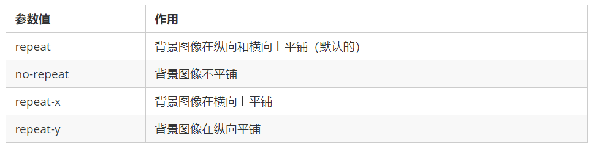

### 4、背景图片位置

- 利用 background-position 属性可以改变图片在背景中的位置。

  ```css
  background-position: x y;
  ```

- 参数代表的意思是：x 坐标和 y 坐标。 可以使用 方位名词 或者 精确单位

  

- 参数是方位名词

  - 如果指定的两个值都是方位名词，则两个值前后顺序无关，比如 left top 和 top left 效果一致
  - 如果只指定了一个方位名词，另一个值省略，则第二个值默认居中对齐

- 参数是精确单位

  - 如果参数值是精确坐标，那么第一个肯定是 x 坐标，第二个一定是 y 坐标
  - 如果只指定一个数值，那该数值一定是 x 坐标，另一个默认垂直居中

- 参数是混合单位

  -  如果指定的两个值是精确单位和方位名词混合使用，则第一个值是 x 坐标，第二个值是 y 坐标

### 5、背景图像固定（背景附着）

- background-attachment 属性设置背景图像是否固定或者随着页面的其余部分滚动。

- background-attachment 后期可以制作视差滚动的效果。

  ```css
  background-attachment : scroll | fixed
  ```

  

### 6、背景复合写法

- 为了简化背景属性的代码，我们可以将这些属性合并简写在同一个属性 background 中。从而节约代码量.

- 当使用简写属性时，没有特定的书写顺序,一般习惯约定顺序为：
  background: 背景颜色 背景图片地址 背景平铺 背景图像滚动 背景图片位置;

  ```css
  background: transparent url(image.jpg) repeat-y fixed top ;
  ```

### 7、背景色半透明

- CSS3 为我们提供了背景颜色半透明的效果。

  ```css
  background: rgba(0, 0, 0, 0.3);
  ```

- 最后一个参数是 alpha 透明度，取值范围在 0~1之间

- 我们习惯把 0.3 的 0 省略掉，写为 background: rgba(0, 0, 0, .3);

- 注意：背景半透明是指盒子背景半透明，盒子里面的内容不受影响

- CSS3 新增属性，是 IE9+ 版本浏览器才支持的

- 但是现在实际开发,我们不太关注兼容性写法了,可以放心使用

### 8、背景总结


## 九、CSS的三大特性

- CSS有三个非常重要的三个特性︰层叠性、继承性、优先级。

### 1、层叠性

- 相同选择器给设置相同的样式，此时一个样式就会覆盖（层叠）另一个冲突的样式。层叠性主要解决样式冲突的问题

- 层叠性原则∶

  - 样式冲突，遵循的原则是就近原则，哪个样式离结构近，就执行哪个样式

  - 样式不冲突，不会层叠

### 2、继承性

- CSS中的继承:子标签会继承父标签的某些样式，如文本颜色和字号。简单的理解就是∶子承父业。

- 子元素可以继承父元素的样式( text-, font-, line-这些元素开头的可以继承，以及color属性)

- 行高的继承性

  ```css
  body {
  	font : 12px/1.5 Microsoft YaHei;
  }
  ```

- 行高可以跟单位也可以不跟单位

- 如果子元素没有设置行高，则会继承父元素的行高为1.5

- 此时子元素的行高是:当前子元素的文字大小*1.5

### 3、优先级

- 当同一个元素指定多个选择器，就会有优先级的产生。

- 选择器相同，则执行层叠性

- 选择器不同，则根据选择器权重执行

  

- 优先级注意点:

  1. 权重是有4组数字组成,但是不会有进位。
  2. 可以理解为类选择器永远大于元素选择器, id选择器永远大于类选择器,以此类推.
  3. 等级判断从左向右，如果某一位数值相同，则判断下一位数值。
  4. 可以简单记忆法:通配符和继承权重为0,标签选择器为1,类(伪类)选择器为10, id选择器100,行内样式表为1000, !important无穷大.

- 权重叠加∶如果是复合选择器，则会有权重叠加，需要计算权重。

- div ul li ------>0,0,0,3
  .nav ul li ----->0,0,1,2
  a:hover -----—> 0,0,1,1
  .nav a------> 0,0,1,1

## 十、盒子模型

- 页面布局要学习三大核心, 盒子模型, 浮动 和 定位. 学习好盒子模型能非常好的帮助我们布局页面.

### 1、看透网页布局的本质

- 网页布局过程：
  - 先准备好相关的网页元素，网页元素基本都是盒子 Box 。
  - 利用 CSS 设置好盒子样式，然后摆放到相应位置。
  - 往盒子里面装内容.
- 网页布局的核心本质： 就是利用 CSS 摆盒子。

### 2、盒子模型（Box Model）组成

- 所谓 盒子模型：就是把 HTML 页面中的布局元素看作是一个矩形的盒子，也就是一个盛装内容的容器。
- CSS 盒子模型本质上是一个盒子，封装周围的 HTML 元素，它包括：边框、外边距、内边距、和 实际内容


### 3、边框（border）

- border可以设置元素的边框。边框有三部分组成:边框宽度(粗细) 边框样式 边框颜色

  ```css
  border : border-width || border-style || border-color
  ```

  

- CSS 边框属性允许你指定一个元素边框的样式和颜色。

- 边框样式 border-style 可以设置如下值：

  - none：没有边框即忽略所有边框的宽度（默认值）
  - solid：边框为单实线(最为常用的)
  - dashed：边框为虚线
  - dotted：边框为点线

- 边框简写：

  ```css
  border: 1px solid red; /*没有顺序*/
  ```

- 边框分开写法：

  ```css
  border-top: 1px solid red; /* 只设定上边框， 其余同理 */
  ```

- 表格的细线边框

  border-collapse 属性控制浏览器绘制表格边框的方式。它控制相邻单元格的边框。

  ```css
  border-collapse:collapse;
  ```

  - collapse 单词是合并的意思
  - border-collapse: collapse; 表示相邻边框合并在一起

- 边框会影响盒子实际大小

  - 边框会额外增加盒子的实际大小。因此我们有两种方案解决:
    1.测量盒子大小的时候,不量边框.
    2.如果测量的时候包含了边框,则需要 width/height 减去边框宽度

### 4、内边距（padding）

- padding 属性用于设置内边距，即边框与内容之间的距离。

  

- padding 属性（简写属性）可以有一到四个值。

  

- 当我们给盒子指定 padding 值之后，发生了 2 件事情：

  - 内容和边框有了距离，添加了内边距。

  2. padding影响了盒子实际大小。
     也就是说，如果盒子已经有了宽度和高度，此时再指定内边框，会撑大盒子。

  - 解决方案：
    如果保证盒子跟效果图大小保持一致，则让 width/height 减去多出来的内边距大小即可。

- 如果盒子本身没有指定width/height属性, 则此时padding不会撑开盒子大小.

### 5、外边距（margin）

- margin 属性用于设置外边距，即控制盒子和盒子之间的距离。

  

- margin 简写方式代表的意义跟 padding 完全一致。

- 外边距可以让块级盒子水平居中，但是必须满足两个条件：
  ① 盒子必须指定了宽度（width）。
  ② 盒子左右的外边距都设置为 auto 。

  ```css
  .header{ width:960px; margin:0 auto;}
  ```

  - 常见的写法，以下三种都可以：
    margin-left: auto; margin-right: auto;
    margin: auto;
    margin: 0 auto;
  - 注意：以上方法是让块级元素水平居中，行内元素或者行内块元素水平居中给其父元素添加 text-align:center 即可。

- 外边距合并

  - 使用 margin 定义块元素的垂直外边距时，可能会出现外边距的合并。

  - 相邻块元素垂直外边距的合并

    当上下相邻的两个块元素（兄弟关系）相遇时，如果上面的元素有下外边距 margin-bottom，下面的元素有上外边距 margin-top ，则他们之间的垂直间距不是 margin-bottom 与 margin-top 之和。取两个值中的较大者这种现象被称为相邻块元素垂直外边距的合并。

    

    ​	解决方案：
    ​		尽量只给一个盒子添加 margin 值。

  - 嵌套块元素垂直外边距的塌陷

    对于两个嵌套关系（父子关系）的块元素，父元素有上外边距同时子元素也有上外边距，此时父元素会塌陷较大的外边距值。

    

    解决方案：
    	①可以为父元素定义上边框。
    	②可以为父元素定义上内边距。
    	③可以为父元素添加 overflow:hidden。
    	还有其他方法，比如浮动、固定，绝对定位的盒子不会有塌陷问题

  - 清除内外边距

    网页元素很多都带有默认的内外边距，而且不同浏览器默认的也不一致。因此我们在布局前，首先要清除下网页元素的内外边距。

    ```css
    * {
    	padding:0; /* 清除内边距 */
    	margin:0; /* 清除外边距 */
    }
    ```

    注意：行内元素为了照顾兼容性，尽量只设置左右内外边距，不要设置上下内外边距。但是转换为块级和行内块元素就可以了

### 6、新知识点

- 去掉 li 前面的 项目符号(小圆点)

```css
list-style: none;
```

### 7、圆角边框

- 在 CSS3 中，新增了圆角边框样式，这样我们的盒子就可以变圆角了。

- border-radius 属性用于设置元素的外边框圆角。

  ```css
  border-radius:length;
  ```

- 参数值可以为数值或百分比的形式

- 如果是正方形，想要设置为一个圆，把数值修改为高度或者宽度的一半即可，或者直接写为 50%

- 该属性是一个简写属性，可以跟四个值，分别代表左上角、右上角、右下角、左下角

- 分开写：border-top-left-radius、border-top-right-radius、border-bottom-right-radius 和 border-bottom-left-radius

- 兼容性 ie9+ 浏览器支持, 但是不会影响页面布局,可以放心使用.

### 8、盒子阴影

- CSS3 中新增了盒子阴影，我们可以使用 box-shadow 属性为盒子添加阴影。

  ```css
  box-shadow: h-shadow v-shadow blur spread color inset;
  ```

  ​		

- 默认的是外阴影(outset), 但是不可以写这个单词,否则造成阴影无效

- 盒子阴影不占用空间，不会影响其他盒子排列。

### 9、文字阴影

- 在 CSS3 中，我们可以使用 text-shadow 属性将阴影应用于文本。

  ```css
  text-shadow: h-shadow v-shadow blur color;
  ```

  

## 十一、浮动（float)

### 1、传统网页布局的三种方式

- 网页布局的本质——用 CSS 来摆放盒子。 把盒子摆放到相应位置.
- CSS 提供了三种传统布局方式(简单说,就是盒子如何进行排列顺序)：普通流（标准流）、浮动、 定位
- 这三种布局方式都是用来摆放盒子的，盒子摆放到合适位置，布局自然就完成了。
- 注意：实际开发中，一个页面基本都包含了这三种布局方式（后面移动端学习新的布局方式） 。

### 2、标准流（普通流/文档流）

- 所谓的标准流: 就是标签按照规定好默认方式排列.
- 块级元素会独占一行，从上向下顺序排列。
  - 常用元素：div、hr、p、h1~h6、ul、ol、dl、form、table
- 行内元素会按照顺序，从左到右顺序排列，碰到父元素边缘则自动换行。
  - 常用元素：span、a、i、em 等
- 以上都是标准流布局，我们前面学习的就是标准流，标准流是最基本的布局方式。

### 3、为什么需要浮动

- 如何让多个块级盒子(div)水平排列成一行？

  

  比较难，虽然转换为行内块元素可以实现一行显示，但是他们之间会有大的空白缝隙，很难控制。

- 如何实现两个盒子的左右对齐？

  

- 总结： 有很多的布局效果，标准流没有办法完成，此时就可以利用浮动完成布局。 因为浮动可以改变元素标签默认的排列方式.

- 浮动最典型的应用：可以让多个块级元素一行内排列显示。

- 网页布局第一准则：多个块级元素纵向排列找标准流，多个块级元素横向排列找浮动。

### 4、什么是浮动

- float 属性用于创建浮动框，将其移动到一边，直到左边缘或右边缘触及包含块或另一个浮动框的边缘。

  ```css
  选择器 { float: 属性值; }
  ```

  

### 5、浮动特性

- 设置了浮动（float）的元素最重要特性：

  1.脱离标准普通流的控制（浮） 移动到指定位置（动）, （俗称脱标）
  2.浮动的盒子不再保留原先的位置

  

- 如果多个盒子都设置了浮动，则它们会按照属性值一行内显示并且顶端对齐排列。

  


- 注意： 浮动的元素是互相贴靠在一起的（不会有缝隙），如果父级宽度装不下这些浮动的盒子， 多出的盒子会另起一行对齐。
- 浮动元素会具有行内块元素特性。
  - 任何元素都可以浮动。不管原先是什么模式的元素，添加浮动之后具有行内块元素相似的特性。
  - 如果块级盒子没有设置宽度，默认宽度和父级一样宽，但是添加浮动后，它的大小根据内容来决定
  - 浮动的盒子中间是没有缝隙的，是紧挨着一起的
  - 行内元素同理

### 6、浮动元素经常和标准流父级搭配使用

- 为了约束浮动元素位置, 我们网页布局一般采取的策略是:
  先用标准流的父元素排列上下位置, 之后内部子元素采取浮动排列左右位置. 符合网页布局第一准侧.

  

- 网页布局第二准则.
  先设置盒子的大小, 之后设置盒子的位置.

## 十二、 常见网页布局

	### 1、常见网页布局


### 2、浮动布局注意点

- 浮动和标准流的父盒子搭配。
  先用标准流的父元素排列上下位置, 之后内部子元素采取浮动排列左右位置
- 一个元素浮动了，理论上其余的兄弟元素也要浮动。
  一个盒子里面有多个子盒子，如果其中一个盒子浮动了，那么其他兄弟也应该浮动，以防止引起问题。
  浮动的盒子只会影响浮动盒子后面的标准流,不会影响前面的标准流.

## 十三、清除浮动

### 1、为什么需要清除浮动

- 由于父级盒子很多情况下，不方便给高度，但是子盒子浮动又不占有位置，最后父级盒子高度为 0 时，就会影响下面的标准流盒子。

  

- 由于浮动元素不再占用原文档流的位置，所以它会对后面的元素排版产生影响

### 2、清除浮动本质

- 清除浮动的本质是清除浮动元素造成的影响
- 如果父盒子本身有高度，则不需要清除浮动
- 清除浮动之后，父级就会根据浮动的子盒子自动检测高度。父级有了高度，就不会影响下面的标准流了

### 3、清除浮动

```css
选择器{clear:属性值;}
```


- 我们实际工作中， 几乎只用 clear: both;
  清除浮动的策略是: 闭合浮动.

### 4、清除浮动方法

- 额外标签法

  - 额外标签法也称为隔墙法，是 W3C 推荐的做法。
  - 额外标签法会在浮动元素末尾添加一个空的标签。例如 \<div style="clear:both">\</div>，或者其他标签（如\<br/>等）。
    - 优点： 通俗易懂，书写方便
    - 缺点： 添加许多无意义的标签，结构化较差
  - 注意： 要求这个新的空标签必须是块级元素。

- 父级添加 overflow

  - 可以给父级添加 overflow 属性，将其属性值设置为 hidden、 auto 或 scroll 。
  - 注意是给父元素添加代码
    - 优点：代码简洁
    - 缺点：无法显示溢出的部分

- :after 伪元素法

  - :after 方式是额外标签法的升级版。也是给父元素添加

    ```css
    .clearfix:after {
    	content: "";
    	display: block;
    	height: 0;
    	clear: both;
    	visibility: hidden;
    }
    .clearfix { /* IE6、7 专有 */
    	*zoom: 1;
    }
    ```

  - 优点：没有增加标签，结构更简单

  - 缺点：照顾低版本浏览器

- 双伪元素清除浮动

  - 也是给给父元素添加

    ```css
    .clearfix:before,.clearfix:after {
    	content:"";
    	display:table;
    }
    .clearfix:after {
    	clear:both;
    }
    .clearfix {
    	*zoom:1;
    } 
    ```

  - 优点：代码更简洁

  - 缺点：照顾低版本浏览器

### 5、清除浮动总结

- 为什么需要清除浮动？

  ①父级没高度。
  ②子盒子浮动了。
  ③影响下面布局了，我们就应该清除浮动了。

  


## 十四、开发技巧

### 1、CSS 属性书写顺序

- 建议遵循以下顺序：
  - 布局定位属性：display / position / float / clear / visibility / overflow（建议 display 第一个写，毕竟关系到模式）
  - 自身属性：width / height / margin / padding / border / background
  - 文本属性：color / font / text-decoration / text-align / vertical-align / white- space / break-word
  - 其他属性（CSS3）：content / cursor / border-radius / box-shadow / text-shadow / background:linear-gradient …

### 2、页面布局分析

- 为了提高网页制作的效率，布局时通常有以下的布局流程：
  - 必须确定页面的版心（可视区），我们测量可得知。
  - 分析页面中的行模块，以及每个行模块中的列模块。其实页面布局，就是一行行罗列而成的。
  - 制作 HTML 结构。我们还是遵循，先有结构，后有样式的原则。结构永远最重要。
  - 开始运用盒子模型的原理，通过 DIV+CSS 布局来控制网页的各个模块。


## 十五、定位

### 1、为什么需要定位

- 以下情况使用标准流或者浮动能实现吗？
  某个元素可以自由的在一个盒子内移动位置，并且压住其他盒子.

  

  当我们滚动窗口的时候，盒子是固定屏幕某个位置的。

  

- 以上效果，标准流或浮动都无法快速实现，此时需要定位来实现。

- 浮动可以让多个块级盒子一行没有缝隙排列显示， 经常用于横向排列盒子。

- 定位则是可以让盒子自由的在某个盒子内移动位置或者固定屏幕中某个位置，并且可以压住其他盒子。

### 2、定位组成

- 定位：将盒子定在某一个位置，所以定位也是在摆放盒子， 按照定位的方式移动盒子。

- 定位 = 定位模式 + 边偏移 。

- 定位模式用于指定一个元素在文档中的定位方式。边偏移则决定了该元素的最终位置。

- 定位模式

  - 定位模式决定元素的定位方式 ，它通过 CSS 的 position 属性来设置，其值可以分为四个：

    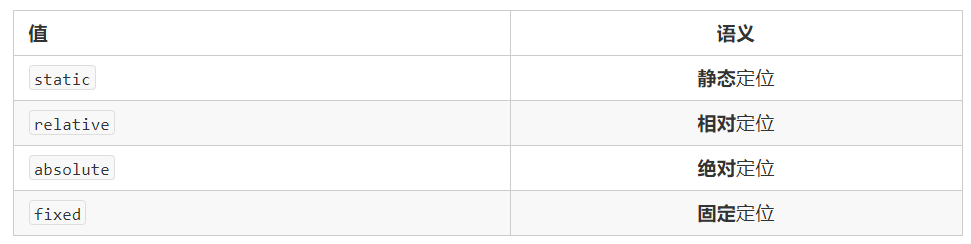

- 边位移

  - 边偏移就是定位的盒子移动到最终位置。有 top、bottom、left 和 right 4 个属性。

    

### 3、静态定位 static

- 静态定位是元素的默认定位方式，无定位的意思。

  ```css
  选择器 { position: static; }
  ```

- 静态定位按照标准流特性摆放位置，它没有边偏移

- 静态定位在布局时很少用到

### 4、相对定位 relative

- 相对定位是元素在移动位置的时候，是相对于它原来的位置来说的（自恋型）。

  ```css
  选择器 { position: relative; }
  ```

- 相对定位的特点：

  - 它是相对于自己原来的位置来移动的（移动位置的时候参照点是自己原来的位置）。
  - 原来在标准流的位置继续占有，后面的盒子仍然以标准流的方式对待它。
  - 因此，相对定位并没有脱标。它最典型的应用是给绝对定位当爹的。。。

### 5、绝对定位 absolute

- 绝对定位是元素在移动位置的时候，是相对于它祖先元素来说的（拼爹型）。

  ```css
  选择器 { position: absolute; }
  ```

- 绝对定位的特点：

  - 如果没有祖先元素或者祖先元素没有定位，则以浏览器为准定位（Document 文档）。
  - 如果祖先元素有定位（相对、绝对、固定定位），则以最近一级的有定位祖先元素为参考点移动位置。
  - 绝对定位不再占有原先的位置。（脱标）
  - 所以绝对定位是脱离标准流的。

### 6、子绝父相的由来

- 弄清楚这个口诀，就明白了绝对定位和相对定位的使用场景。
- 这个“子绝父相”太重要了，是我们学习定位的口诀，是定位中最常用的一种方式
- 这句话的意思是：子级是绝对定位的话，父级要用相对定位。

- ①子级绝对定位，不会占有位置，可以放到父盒子里面的任何一个地方，不会影响其他的兄弟盒子。
- ②父盒子需要加定位限制子盒子在父盒子内显示。
- ③父盒子布局时，需要占有位置，因此父亲只能是相对定位。

- 这就是子绝父相的由来，所以相对定位经常用来作为绝对定位的父级。
- 总结： 因为父级需要占有位置，因此是相对定位， 子盒子不需要占有位置，则是绝对定位
  当然，子绝父相不是永远不变的，如果父元素不需要占有位置，子绝父绝也会遇到。

### 7、固定定位 fixed

- 固定定位是元素固定于浏览器可视区的位置。主要使用场景： 可以在浏览器页面滚动时元素的位置不会改变。

  ```css
  选择器 { position: fixed; }
  ```

- 固定定位的特点：

  - 以浏览器的可视窗口为参照点移动元素。
  - 跟父元素没有任何关系
  - 不随滚动条滚动。
  - 固定定位不在占有原先的位置。
  - 固定定位也是脱标的，其实固定定位也可以看做是一种特殊的绝对定位。

- 固定定位小技巧： 固定在版心右侧位置。

- 小算法：

  - 让固定定位的盒子 left: 50%. 走到浏览器可视区（也可以看做版心） 的一半位置。
  - 让固定定位的盒子 margin-left: 版心宽度的一半距离。 多走 版心宽度的一半位置
    就可以让固定定位的盒子贴着版心右侧对齐了。

### 8、粘性定位 sticky

- 粘性定位可以被认为是相对定位和固定定位的混合。

  ```
  选择器 { position: sticky; top: 10px; }
  ```

- 粘性定位的特点：

  - 以浏览器的可视窗口为参照点移动元素（固定定位特点）
  - 粘性定位占有原先的位置（相对定位特点）
  - 必须添加 top 、left、right、bottom 其中一个才有效
  - 跟页面滚动搭配使用。 兼容性较差，IE 不支持。

### 9、定位的总结


- 一定记住 相对定位、固定定位、绝对定位 两个大的特点： 1. 是否占有位置（脱标否） 2. 以谁为基准点移动位置。

- 学习定位重点学会子绝父相。

### 10、定位叠放次序 z-index

- 在使用定位布局时，可能会出现盒子重叠的情况。此时，可以使用 z-index 来控制盒子的前后次序 (z轴)

  ```css
  选择器 { z-index: 1; }
  ```

- 数值可以是正整数、负整数或 0, 默认是 auto，数值越大，盒子越靠上

- 如果属性值相同，则按照书写顺序，后来居上

- 数字后面不能加单位

- 只有定位的盒子才有 z-index 属性

### 11、定位的拓展

- 绝对定位的盒子居中

  加了绝对定位的盒子不能通过 margin:0 auto 水平居中，但是可以通过以下计算方法实现水平和垂直居中。

  - ①left: 50%;：让盒子的左侧移动到父级元素的水平中心位置。
  - ②margin-left: -100px;：让盒子向左移动自身宽度的一半。

- 定位特殊特性

  - 绝对定位和固定定位也和浮动类似。
  - 行内元素添加绝对或者固定定位，可以直接设置高度和宽度。
  - 块级元素添加绝对或者固定定位，如果不给宽度或者高度，默认大小是内容的大小。

- 脱标的盒子不会触发外边距塌陷

  - 浮动元素、绝对定位(固定定位）元素的都不会触发外边距合并的问题。

- 绝对定位（固定定位）会完全压住盒子

  - 浮动元素不同，只会压住它下面标准流的盒子，但是不会压住下面标准流盒子里面的文字（图片）
  - 但是绝对定位（固定定位） 会压住下面标准流所有的内容。
  - 浮动之所以不会压住文字，因为浮动产生的目的最初是为了做文字环绕效果的。 文字会围绕浮动元素

## 十六、网页布局总结

- 通过盒子模型，清楚知道大部分html标签是一个盒子

- 通过CSS浮动、定位 可以让每个盒子排列成为网页
- 一个完整的网页，是标准流、浮动、定位一起完成布局的，每个都有自己的专门用法。

1.  标准流
    可以让盒子上下排列或者左右排列，垂直的块级盒子显示就用标准流布局。
2.  浮动
    可以让多个块级元素一行显示或者左右对齐盒子，多个块级盒子水平显示就用浮动布局。
3.  定位
    定位最大的特点是有层叠的概念，就是可以让多个盒子前后叠压来显示。如果元素自由在某个盒子内移动就用定位布局。
    一个完整的网页，是标准流、浮动、定位一起完成布局的，每个都有自己的专门用法。
    通过CSS浮动、定位 可以让每个盒子排列成为网页。

## 十七、元素的显示与隐藏

- 本质：让一个元素在页面中隐藏或者显示出来。

### 1、display 属性

- display 属性用于设置一个元素应如何显示。
- display: none ；隐藏对象
- display：block ；除了转换为块级元素之外，同时还有显示元素的意思
- display 隐藏元素后，不再占有原来的位置。

### 2、visibility 可见性

- visibility 属性用于指定一个元素应可见还是隐藏。
- visibility：visible ; 元素可视
- visibility：hidden; 元素隐藏
- visibility 隐藏元素后，继续占有原来的位置。
- 如果隐藏元素想要原来位置， 就用 visibility：hidden
- 如果隐藏元素不想要原来位置， 就用 display：none (用处更多 重点）

### 3、overflow 溢出

- overflow 属性指定了如果内容溢出一个元素的框（超过其指定高度及宽度） 时，会发生什么

  

- 一般情况下，我们都不想让溢出的内容显示出来，因为溢出的部分会影响布局。

- 但是如果有定位的盒子， 请慎用overflow:hidden 因为它会隐藏多余的部分。

## 十八、CSS高级技巧

### 1、精灵图

#### 1.1  为什么需要精灵图

- 一个网页中往往会应用很多小的背景图像作为修饰，当网页中的图像过多时，服务器就会频繁地接收和发送请求图片，造成服务器请求压力过大，这将大大降低页面的加载速度。
- 因此，为了有效地减少服务器接收和发送请求的次数，提高页面的加载速度，出现了 CSS 精灵技术（也称 CSS Sprites、CSS 雪碧）。
- 核心原理：将网页中的一些小背景图像整合到一张大图中 ，这样服务器只需要一次请求就可以了。

#### 1.2 精灵图（sprites）的使用

- 使用精灵图核心：
  1. 精灵技术主要针对于背景图片使用。就是把多个小背景图片整合到一张大图片中。
  2. 这个大图片也称为 sprites 精灵图 或者 雪碧图
  3. 移动背景图片位置， 此时可以使用 background-position 。
  4. 移动的距离就是这个目标图片的 x 和 y 坐标。注意网页中的坐标有所不同
  5. 因为一般情况下都是往上往左移动，所以数值是负值。
  6. 使用精灵图的时候需要精确测量，每个小背景图片的大小和位置。
- 使用精灵图核心总结：
  1. 精灵图主要针对于小的背景图片使用。
  2. 主要借助于背景位置来实现---background-position 。
  3. 一般情况下精灵图都是负值。（千万注意网页中的坐标： x轴右边走是正值，左边走是负值， y轴同理。）

### 2、字体图标

#### 2.1 字体图标的产生

- 字体图标使用场景： 主要用于显示网页中通用、常用的一些小图标。
- 精灵图是有诸多优点的，但是缺点很明显。
  1.图片文件还是比较大的。
  2.图片本身放大和缩小会失真。
  3.一旦图片制作完毕想要更换非常复杂。
- 此时，有一种技术的出现很好的解决了以上问题，就是字体图标 iconfont。
  字体图标可以为前端工程师提供一种方便高效的图标使用方式，展示的是图标，本质属于字体。

#### 2.2 字体图标的优点

- 轻量级：一个图标字体要比一系列的图像要小。一旦字体加载了，图标就会马上渲染出来，减少了服务器请求
- 灵活性：本质其实是文字，可以很随意的改变颜色、产生阴影、透明效果、旋转等
- 兼容性：几乎支持所有的浏览器，请放心使用
- 注意： 字体图标不能替代精灵技术，只是对工作中图标部分技术的提升和优化。
- 总结：
  1.如果遇到一些结构和样式比较简单的小图标，就用字体图标。
  2.如果遇到一些结构和样式复杂一点的小图片，就用精灵图。

#### 2.3 字体图标的下载

- 推荐下载网站：
  -  icomoon 字库  http://icomoon.io 推荐指数 ★★★★★
     IcoMoon 成立于 2011 年，推出了第一个自定义图标字体生成器，它允许用户选择所需要的图标，使它们成一字型。该字库内容种类繁多，非常全面，唯一的遗憾是国外服务器，打开网速较慢。
  -  阿里 iconfont 字库  http://www.iconfont.cn/ 推荐指数 ★★★★★
     这个是阿里妈妈 M2UX 的一个 iconfont 字体图标字库，包含了淘宝图标库和阿里妈妈图标库。可以使用 AI制作图标上传生成。 重点是，免费！

#### 2.4 字体图标的引入

1. 把下载包里面的 fonts 文件夹放入页面根目录下

   


   2. 字体文件格式

      不同浏览器所支持的字体格式是不一样的，字体图标之所以兼容，就是因为包含了主流浏览器支持的字体文件。

      - TureType(.ttf)格式.ttf字体是Windows和Mac的最常见的字体，支持这种字体的浏览器有IE9+、Firefox3.5+、Chrome4+、Safari3+、Opera10+、iOS Mobile、Safari4.2+；

      - Web Open Font Format(.woff)格式woff字体，支持这种字体的浏览器有IE9+、Firefox3.5+、Chrome6+、Safari3.6+、Opera11.1+；

      - Embedded Open Type(.eot)格式.eot字体是IE专用字体，支持这种字体的浏览器有IE4+；

      - SVG(.svg)格式.svg字体是基于SVG字体渲染的一种格式，支持这种字体的浏览器有Chrome4+、Safari3.1+、Opera10.0+、iOS Mobile Safari3.2+；

        	3.  字体图标的引入

       在 CSS 样式中全局声明字体： 简单理解把这些字体文件通过css引入到我们页面中。一定注意字体文件路径的问题。

       ```css
      @font-face {
      	font-family: 'icomoon';
      	src: url('fonts/icomoon.eot?7kkyc2');
      	src: url('fonts/icomoon.eot?7kkyc2#iefix') format('embedded-opentype'),
      	url('fonts/icomoon.ttf?7kkyc2') format('truetype'),
      	url('fonts/icomoon.woff?7kkyc2') format('woff'),
      	url('fonts/icomoon.svg?7kkyc2#icomoon') format('svg');
      	font-weight: normal;
      	font-style: normal;
      }
       ```

      		4.  html 标签内添加小图标。

       

       ```css
      <span> </span>
       ```

      		5.  给标签定义字体。

       ```css
      span {
      	font-family: "icomoon";
      }
       ```

       务必保证 这个字体和上面@font-face里面的字体保持一致

       

### 3、CSS 三角

- 网页中常见一些三角形，使用 CSS 直接画出来就可以，不必做成图片或者字体图标。

- 一张图， 你就知道 CSS 三角是怎么来的了, 做法如下：

  

```css
div {
	width: 0;
	height: 0;
	line-height: 0;
	font-size: 0;
	border: 50px solid transparent;
	border-left-color: pink;
}
```

### 4、CSS 用户界面样式

- 什么是界面样式
  - 所谓的界面样式，就是更改一些用户操作样式，以便提高更好的用户体验。

#### 4.1 鼠标样式 cursor

```css
li {cursor: pointer; }
```

- 设置或检索在对象上移动的鼠标指针采用何种系统预定义的光标形状


#### 4.2 轮廓线 outline

- 给表单添加 outline: 0; 或者 outline: none; 样式之后，就可以去掉默认的蓝色边框。

```css
input {outline: none; }
```

#### 4.3 防止拖拽文本域 resize

- 实际开发中，我们文本域右下角是不可以拖拽的。

```css
textarea{ resize: none;}
```

### 5、vertical-align 属性应用

- CSS 的 vertical-align 属性使用场景： 经常用于设置图片或者表单(行内块元素）和文字垂直对齐。
- 官方解释： 用于设置一个元素的垂直对齐方式，但是它只针对于行内元素或者行内块元素有效。

```css
vertical-align : baseline | top | middle | bottom
```


#### 5.1 图片、表单和文字对齐

- 图片、表单都属于行内块元素，默认的 vertical-align 是基线对齐。


- 此时可以给图片、表单这些行内块元素的 vertical-align 属性设置为 middle 就可以让文字和图片垂直居中对齐了。

#### 5.2 解决图片底部默认空白缝隙问题

- bug：图片底侧会有一个空白缝隙，原因是行内块元素会和文字的基线对齐
- 主要解决方法有两种：
  1.给图片添加 vertical-align:middle | top| bottom 等。 （提倡使用的）
  2.把图片转换为块级元素 display: block;


### 6、溢出的文字省略号显示

1. 单行文本溢出显示省略号--必须满足三个条件

```css
/*1. 先强制一行内显示文本*/ 
white-space: nowrap; /*（ 默认 normal 自动换行） */
/*2. 超出的部分隐藏*/
overflow: hidden; 
/*3. 文字用省略号替代超出的部分*/ 
text-overflow: ellipsis;
```

   2. 多行文本溢出显示省略号

      多行文本溢出显示省略号，有较大兼容性问题， 适合于webKit浏览器或移动端（移动端大部分是webkit内核）

```css
overflow: hidden;
text-overflow: ellipsis;
/* 弹性伸缩盒子模型显示 */
display: -webkit-box;
/* 限制在一个块元素显示的文本的行数 */
-webkit-line-clamp: 2;
/* 设置或检索伸缩盒对象的子元素的排列方式 */
-webkit-box-orient: vertical;
```

### 7. 常见布局技巧

1. margin负值运用


- 让每个盒子margin 往左侧移动 -1px 正好压住相邻盒子边框
- 鼠标经过某个盒子的时候，提高当前盒子的层级即可（如果没有有定位，则加相对定位（保留位置），如果有定位，则加z-index）

2. 文字围绕浮动元素

   巧妙运用浮动元素不会压住文字的特性

3. 行内块巧妙运用


- 页码在页面中间显示:
  1.把这些链接盒子转换为行内块， 之后给父级指定 text-align:center;
  2.利用行内块元素中间有缝隙，并且给父级添加 text-align:center; 行内块元素会水平会居中

4. CSS 三角强化


```css
width: 0;
height: 0;
border-color: transparent red transparent transparent;
border-style: solid;
border-width: 22px 8px 0 0;
```

### 8、CSS 初始化

- 不同浏览器对有些标签的默认值是不同的，为了消除不同浏览器对HTML文本呈现的差异，照顾浏览器的兼容，我们需要对CSS 初始化
- 简单理解： CSS初始化是指重设浏览器的样式。 (也称为CSS reset）
  每个网页都必须首先进行 CSS初始化。
  这里我们以 京东CSS初始化代码为例。
- Unicode编码字体：
  把中文字体的名称用相应的Unicode编码来代替，这样就可以有效的避免浏览器解释CSS代码时候出现乱码的问题。比如：黑体 \9ED1\4F53 、宋体 \5B8B\4F53 、微软雅黑 \5FAE\8F6F\96C5\9ED1

## 十九、CSS3新特性

### 1 、CSS3 的现状

- 新增的CSS3特性有兼容性问题，ie9+才支持
- 移动端支持优于 PC 端
- 不断改进中
- 应用相对广泛
- 现阶段主要学习：新增选择器和盒子模型以及其他特性

### 2、CSS3 新增选择器

#### 2.1 属性选择器

- 属性选择器可以根据元素特定属性的来选择元素。 这样就可以不用借助于类或者id选择器。


- 注意：类选择器、属性选择器、伪类选择器，权重为 10。

#### 2.2 结构伪类选择器

- 结构伪类选择器主要根据文档结构来选择器元素， 常用于根据父级选择器里面的子元素


- nth-child（n） 选择某个父元素的一个或多个特定的子元素（重点）

  - n 可以是数字，关键字和公式
  - n 如果是数字，就是选择第 n 个子元素， 里面数字从1开始…
  - n 可以是关键字：even 偶数，odd 奇数
  - n 可以是公式：常见的公式如下 ( 如果n是公式，则从0开始计算，但是第 0 个元素或者超出了元素的个数会被忽略 )

  

  - 区别：
    1.nth-child 对父元素里面所有孩子排序选择（序号是固定的） 先找到第n个孩子，然后看看是否和E匹配
    2.nth-of-type 对父元素里面指定子元素进行排序选择。 先去匹配E ，然后再根据E 找第n个孩子

- 小结

  - 结构伪类选择器一般用于选择父级里面的第几个孩子
  - nth-child 对父元素里面所有孩子排序选择（序号是固定的） 先找到第n个孩子，然后看看是否和E匹配
  - nth-of-type 对父元素里面指定子元素进行排序选择。 先去匹配E ，然后再根据E 找第n个孩子
  - 关于 nth-child（n） 我们要知道 n 是从 0 开始计算的，要记住常用的公式
  - 如果是无序列表，我们肯定用 nth-child 更多
  - 类选择器、属性选择器、伪类选择器，权重为 10。

#### 2.3 伪元素选择器

- 伪元素选择器可以帮助我们利用CSS创建新标签元素，而不需要HTML标签，从而简化HTML结构。


- 注意：
  - before 和 after 创建一个元素，但是属于行内元素
  - 新创建的这个元素在文档树中是找不到的，所以我们称为伪元素
  - 语法： element::before {}
  - before 和 after 必须有 content 属性
  - before 在父元素内容的前面创建元素，after 在父元素内容的后面插入元素
  - 伪元素选择器和标签选择器一样，权重为 1

### 3、 CSS3 盒子模型

- CSS3 中可以通过 box-sizing 来指定盒模型，有2个值：即可指定为 content-box、border-box，这样我们计算盒子大小的方式就发生了改变。
- 可以分成两种情况：
  1.box-sizing: content-box 盒子大小为 width + padding + border （以前默认的）
  2.box-sizing: border-box 盒子大小为 width
- 如果盒子模型我们改为了box-sizing: border-box ， 那padding和border就不会撑大盒子了（前提padding和border不会超过width宽度）

### 4、 CSS3 其他特性

- CSS3滤镜filter:filter CSS属性将模糊或颜色偏移等图形效果应用于元素。

  ```css
  filter: 函数(); 例如： filter: blur(5px); blur模糊处理 数值越大越模糊
  ```


- CSS3 calc 函数:calc() 此CSS函数让你在声明CSS属性值时执行一些计算。

  ```css
  width: calc(100% - 80px);/*括号里面可以使用 + - * / 来进行计算。*/
  ```

### 5、 CSS3 过渡

- 过渡（transition)是CSS3中具有颠覆性的特征之一，我们可以在不使用 Flash 动画或 JavaScript 的情况下，当元素从一种样式变换为另一种样式时为元素添加效果。
- 过渡动画： 是从一个状态 渐渐的过渡到另外一个状态
- 可以让我们页面更好看，更动感十足，虽然 低版本浏览器不支持（ie9以下版本） 但是不会影响页面布局。
- 我们现在经常和 :hover 一起 搭配使用。

```css
transition: 要过渡的属性 花费时间 运动曲线 何时开始;
```

- 属性 ： 想要变化的 css 属性， 宽度高度 背景颜色 内外边距都可以 。如果想要所有的属性都变化过渡， 写一个all 就可以。
- 花费时间： 单位是 秒（必须写单位） 比如 0.5s
- 运动曲线： 默认是 ease （可以省略）
- 何时开始 ：单位是 秒（必须写单位）可以设置延迟触发时间 默认是 0s （可以省略）
- 
- 记住过渡的使用口诀： 谁做过渡给谁加

### 6、**2D** 转换

- 转换（transform）是CSS3中具有颠覆性的特征之一，可以实现元素的位移、旋转、缩放等效果

#### 6.1 二维坐标系

- 2D转换是改变标签在二维平面上的位置和形状的一种技术，先来学习二维坐标系

  

#### 6.2 2D **转换之移动** translate

- 2D移动是2D转换里面的一种功能，可以改变元素在页面中的位置，类似定位


```css
transform: translate(x,y); 或者分开写
transform: translateX(n);
transform: translateY(n);
```

- 重点：

  - 定义 2D 转换中的移动，沿着 X 和 Y 轴移动元素

  - translate最大的优点：不会影响到其他元素的位置

  - translate中的百分比单位是相对于自身元素的 translate:(50%,50%);

  - 对行内标签没有效果

#### 6.3 2D转换之旋转 rotate

- 2D旋转指的是让元素在2维平面内顺时针旋转或者逆时针旋转。


```css
transform:rotate(度数)
```

- 重点：

  - rotate里面跟度数， 单位是 deg 比如 rotate(45deg)

  - 角度为正时，顺时针，负时，为逆时针

  - 默认旋转的中心点是元素的中心点

#### 6.4 2D转换中心点 transform-origin

- 我们可以设置元素转换的中心点

```css
transform-origin: x y;
```

- 重点:
  - 注意后面的参数 x 和 y 用空格隔开
  - x y 默认转换的中心点是元素的中心点 (50% 50%)
  - 还可以给x y 设置 像素 或者 方位名词 （top bottom left right center）

#### 6.5 2D转换之缩放scale

- 缩放，顾名思义，可以放大和缩小。 只要给元素添加上了这个属性就能控制它放大还是缩小。


```css
transform:scale(x,y);
```

- 重点:
  - 注意其中的x和y用逗号分隔
  - transform:scale(1,1) ：宽和高都放大一倍，相对于没有放大
  - transform:scale(2,2) ：宽和高都放大了2倍
  - transform:scale(2) ：只写一个参数，第二个参数则和第一个参数一样，相当于 scale(2,2)
  - transform:scale(0.5,0.5)：缩小
  - sacle缩放最大的优势：可以设置转换中心点缩放，默认以中心点缩放的，而且不影响其他盒子

#### 6.6 2D转换综合写法

1. 同时使用多个转换，其格式为：transform: translate() rotate() scale() ...等，
2. 其顺序会影转换的效果。（先旋转会改变坐标轴方向）
3. 当我们同时有位移和其他属性的时候，记得要将位移放到最前

### 7、动画

- 动画（animation）是CSS3中具有颠覆性的特征之一，可通过设置多个节点来精确控制一个或一组动画，常用来实现复杂的动画效果。
- 相比较过渡，动画可以实现更多变化，更多控制，连续自动播放等效果。

#### 7.1动画的基本使用

- 制作动画分为两步：

  ​	1.先定义动画

  ​	2.再使用（调用）动画

- 1.用keyframes定义动画（类似定义类选择器）

```css
@keyframes 动画名称 {
   0%{
        width:100px;
   }  
   100%{
        width:200px;
   }
}
```

- 动画序列

  - 0% 是动画的开始，100% 是动画的完成。这样的规则就是动画序列。

  - 在 @keyframes 中规定某项 CSS 样式，就能创建由当前样式逐渐改为新样式的动画效果。

  - 动画是使元素从一种样式逐渐变化为另一种样式的效果。您可以改变任意多的样式任意多的次数。

  - 请用百分比来规定变化发生的时间，或用关键词 "from" 和 "to"，等同于 0% 和 100%。

- 2.元素使用动画

```css
div {
       width: 200px;
       height: 200px;
       background-color: aqua;
       margin: 100px auto;
       /* 调用动画 */
       animation-name: 动画名称;
       /* 持续时间 */
       animation-duration: 持续时间;
    }
```

#### 7.2动画常用属性

| **属性**                  | **描述**                                                     |
| ------------------------- | ------------------------------------------------------------ |
| @keyframes                | 规定动画。                                                   |
| animation                 | 所有动画属性的简写属性，除了animation-play-state属性。       |
| animation-name            | 规定@keyframes动画的名称。（必须的）                         |
| animation-duration        | 规定动画完成一个周期所花费的秒或毫秒，默认是0。（必须的）    |
| animation-timing-function | 规定动画的速度曲线，默认是“ease”。                           |
| animation-delay           | 规定动画何时开始，默认是0。                                  |
| animation-iteration-count | 规定动画被播放的次数，默认是1，还有infinite                  |
| animation-direction       | 规定动画是否在下一周期逆向播放，默认是“normal“,alternate逆播放 |
| animation-play-state      | 规定动画是否正在运行或暂停。默认是"running",还有"paused"。   |
| animation-fill-mode       | 规定动画结束后状态，保持forwards回到起始backwards            |

#### 7.3动画简写属性

- animation：动画名称 持续时间 运动曲线 何时开始 播放次数 是否反方向  动画起始或者结束的状态;

  ```css
  animation: myfirst 5s linear 2s infinite alternate;
  ```

- 简写属性里面不包含 animation-play-state 

- 暂停动画：animation-play-state:  puased;  经常和鼠标经过等其他配合使用

- 想要动画走回来 ，而不是直接跳回来：animation-direction  ： alternate

- 盒子动画结束后，停在结束位置： animation-fill-mode ：  forwards 

#### 7.4速度曲线细节

- animation-timing-function：规定动画的速度曲线，默认是“ease”

  | **值**      | **描述**                                       |
  | ----------- | ---------------------------------------------- |
  | linear      | 动画从头到尾的速度是相同的。匀速               |
  | ease        | 默认。动画以低速开始，然后加快，在结束前变慢。 |
  | ease-in     | 动画以低速开始。                               |
  | ease-out    | 动画以低速结束。                               |
  | ease-in-out | 动画以低速开始和结束。                         |
  | steps()     | 指定了时间函数中的间隔数量（步长）             |


### 8、3D转换

- 我们生活的环境是3D的，照片就是3D物体在2D平面呈现的例子
- 近大远小。
- 物体后面遮挡不可见

#### 8.1 三维坐标系

- 三维坐标系其实就是指立体空间，立体空间是由3个轴共同组成的。 

- x轴：水平向右   注意： x 右边是正值，左边是负值 

- y轴：垂直向下   注意： y 下面是正值，上面是负值

- z轴：垂直屏幕   注意： 往外面是正值，往里面是负值 

  

#### 8.2 3D移动 translate3d

- 3D移动在2D移动的基础上多加了一个可以移动的方向，就是z轴方向。 
- translform:translateX(100px)：仅仅是在x轴上移动
- translform:translateY(100px)：仅仅是在Y轴上移动
- translform:translateZ(100px)：仅仅是在Z轴上移动（注意：translateZ一般用px单）
- transform:translate3d(x,y,z)：其中 x、y、z 分别指要移动的轴的方向的距离 

- 因为z轴是垂直屏幕，由里指向外面，所以默认是看不到元素在z轴的方向上移动

#### 8.3 **透视** perspective

- 在2D平面产生近大远小视觉立体，但是只是效果二维的  
- 如果想要在网页产生3D效果需要透视（理解成3D物体投影在2D平面内）。
- 模拟人类的视觉位置，可认为安排一只眼睛去看 
- 透视我们也称为视距：视距就是人的眼睛到屏幕的距离
- 距离视觉点越近的在电脑平面成像越大，越远成像越小 
- 透视的单位是像素

透视写在被观察元素的父盒子上面的

**d**：就是视距，视距就是一个距离人的眼睛到屏幕的距离。

**z**：就是 z轴，物体距离屏幕的距离，z轴越大（正值） 我们看到的物体就越大。


#### 8.4 translateZ

- translform:translateZ(100px)：仅仅是在Z轴上移动。

- 有了透视，就能看到translateZ 引起的变化了  
- translateZ：近大远小
- translateZ：往外是正值
- translateZ：往里是负值 

#### 8.5 3D旋转 rotate3d

- 3D旋转指可以让元素在三维平面内沿着 x轴，y轴，z轴或者自定义轴进行旋转。
- transform:rotateX(45deg)：沿着x轴正方向旋转 45度
- transform:rotateY(45deg) ：沿着y轴正方向旋转 45deg
- transform:rotateZ(45deg) ：沿着Z轴正方向旋转 45deg
- transform:rotate3d(x,y,z,deg)： 沿着自定义轴旋转 deg为角度（了解即可）
  - xyz是表示旋转轴的矢量，是标示你是否希望沿着该轴旋转，最后一个标示旋转的角度。
  - transform:rotate3d(1,0,0,45deg) 就是沿着x轴旋转 45deg
  - transform:rotate3d(1,1,0,45deg) 就是沿着对角线旋转 45deg

#### 8.6 3D呈现transfrom-style

- 控制子元素是否开启三维立体环境。。
- transform-style: flat 子元素不开启3d立体空间 默认的
- transform-style: preserve-3d; 子元素开启立体空间
- 代码写给父级，但是影响的是子盒子
- 这个属性很重要，后面必用


### 9. 浏览器私有前缀

- 浏览器私有前缀是为了兼容老版本的写法，比较新版本的浏览器无须添加。

- 1.私有前缀

  - -moz-：代表 firefox 浏览器私有属性
  - -ms-：代表 ie 浏览器私有属性
  - -webkit-：代表 safari、chrome 私有属性
  - -o-：代表 Opera 私有属性

- 2.提倡的写法

  ```css
  -moz-border-radius: 10px; 
  -webkit-border-radius: 10px; 
  -o-border-radius: 10px; 
  border-radius: 10px;
  ```

  

------


# 移动端布局

## 移动WEB开发之流式布局

### 1、 移动端基础

#### 1.1 浏览器现状

- PC端常见浏览器
  - 360浏览器、谷歌浏览器、火狐浏览器、QQ浏览
    器、百度浏览器、搜狗浏览器、IE浏览器。
- 移动端常见浏览器
  - UC浏览器，QQ浏览器，欧朋浏览器，
    百度手机浏览器，360安全浏览器，谷歌
    浏览器，搜狗手机浏览器，猎豹浏览器
    ，以及其他杂牌浏览器。
- 国内的UC和QQ，百度等手机浏览器都是根据Webkit修改过来的内核，国内尚无自主研发的内核，就像国内的手
  机操作系统都是基于Android修改开发的一样。
- 总结：兼容移动端主流浏览器，处理Webkit内核浏览器即可。

#### 1.2 手机屏幕现状

- 移动端设备屏幕尺寸非常多，碎片化严重。
- Android设备有多种分辨率：480x800, 480x854, 540x960, 720x1280，1080x1920等，还有传说中的2K，4k屏。
- 近年来iPhone的碎片化也加剧了，其设备的主要分辨率有：640x960, 640x1136, 750x1334, 1242x2208等。
- 作为开发者无需关注这些分辨率，因为我们常用的尺寸单位是 px 。

#### 1.3 常见移动端屏幕尺寸


#### 1.4 移动端调试方法

- Chrome DevTools（谷歌浏览器）的模拟手机调试
- 搭建本地web服务器，手机和服务器一个局域网内，通过手机访问服务器
- 使用外网服务器，直接IP或域名访问

#### 1.5 总结

- 移动端浏览器我们主要对webkit内核进行兼容
- 我们现在开发的移动端主要针对手机端开发
- 现在移动端碎片化比较严重，分辨率和屏幕尺寸大小不一
- 学会用谷歌浏览器模拟手机界面以及调试

### 2、视口

- 视口（viewport）就是浏览器显示页面内容的屏幕区域。 视口可以分为布局视口、视觉视口和理想视口

#### 2.1 布局视口 layout viewport

- 一般移动设备的浏览器都默认设置了一个布局视口，用于解决早期的PC端页面在手机上显示的问题。
- iOS, Android基本都将这个视口分辨率设置为 980px，所以PC上的网页大多都能在手机上呈现，只不过元
  素看上去很小，一般默认可以通过手动缩放网页。


#### 2.2 视觉视口 visual viewport

- 字面意思，它是用户正在看到的网站的区域。注意：是网站的区域。
- 我们可以通过缩放去操作视觉视口，但不会影响布局视口，布局视口仍保持原来的宽度。


#### 2.3 理想视口 ideal viewport

- 为了使网站在移动端有最理想的浏览和阅读宽度而设定
- 理想视口，对设备来讲，是最理想的视口尺寸
- 需要手动添写meta视口标签通知浏览器操作
- meta视口标签的主要目的：布局视口的宽度应该与理想视口的宽度一致，简单理解就是设备有多宽，我们布
  局的视口就多宽

#### 2.4 总结

- 视口就是浏览器显示页面内容的屏幕区域
- 视口分为布局视口、视觉视口和理想视口
- 我们移动端布局想要的是理想视口就是手机屏幕有多宽，我们的布局视口就有多宽
- 想要理想视口，我们需要给我们的移动端页面添加 meta视口标签

#### 2.5 meta视口标签

```html
<meta name="viewport" content="width=device-width, user-scalable=no,
initial-scale=1.0, maximum-scale=1.0, minimum-scale=1.0">
```


#### 2.6 标准的viewport设置

- 视口宽度和设备保持一致
- 视口的默认缩放比例1.0
- 不允许用户自行缩放
- 最大允许的缩放比例1.0
- 最小允许的缩放比例1.0

### 3、二倍图

#### 3.1 物理像素&物理像素比

- 物理像素点指的是屏幕显示的最小颗粒，是物理真实存在的。这是厂商在出厂时就设置好了,比如苹果6\7\8 是 750* 1334
- 我们开发时候的1px 不是一定等于1个物理像素的
- PC端页面，1个px 等于1个物理像素的，但是移动端就不尽相同
- 一个px的能显示的物理像素点的个数，称为物理像素比或屏幕像素比

- PC端 和 早前的手机屏幕 / 普通手机屏幕: 1CSS像素 = 1 物理像素的
- Retina（视网膜屏幕）是一种显示技术，可以将把更多的物理像素点压缩至一块屏幕里，从
  而达到更高的分辨率，并提高屏幕显示的细腻程度。


#### 3.2 多倍图

- 对于一张 50px * 50px 的图片,在手机 Retina 屏中打开，按照刚才的物理像素比会放大倍数，这样会造成图片模糊
- 在标准的viewport设置中，使用倍图来提高图片质量，解决在高清设备中的模糊问题
- 通常使用二倍图， 因为iPhone 6\7\8 的影响,但是现在还存在3倍图4倍图的情况，这个看实际开发公司需求
- 背景图片 注意缩放问题

```css
/* 在 iphone8 下面 */
img{
	/*原始图片100*100px*/
	width: 50px;
	height: 50px;
}
.box{
	/*原始图片100*100px*/
	background-size: 50px 50px;
}
```

#### 3.3 背景缩放 background-size

- background-size 属性规定背景图像的尺寸

  ```css
  background-size: 背景图片宽度 背景图片高度;
  ```

- 单位： 长度|百分比|cover|contain;

- cover把背景图像扩展至足够大，以使背景图像完全覆盖背景区域。

- contain把图像图像扩展至最大尺寸，以使其宽度和高度完全适应内容区域

### 4、移动端开发选择

#### 4.1 移动端主流方案

1. 单独制作移动端页面（主流）

- 京东商城手机版
  淘宝触屏版
  苏宁易购手机版
  ....

2. 响应式页面兼容移动端（其次）

- 三星手机官网

#### 4.2 单独移动端页面（主流）

- 通常情况下，网址域名前面加 m(mobile) 可以打开移动端。通过判断设备，如果是移动设备打开，则跳到移动端页面


#### 4.3 响应式兼容PC移动端

- 三星电子官网： www.samsung.com/cn/ ，通过判断屏幕宽度来改变样式，以适应不同终端。
- 缺点：制作麻烦， 需要花很大精力去调兼容性问题


### 5、移动端技术解决方案

#### 5.1 移动端浏览器

- 移动端浏览器基本以 webkit 内核为主，因此我们就考虑webkit兼容性问题。
- 我们可以放心使用 H5 标签和 CSS3 样式。
- 同时我们浏览器的私有前缀我们只需要考虑添加 webkit 即可


#### 5.2 CSS初始化 normalize.css

- 移动端 CSS 初始化推荐使用 normalize.css/
  - Normalize.css：保护了有价值的默认值
  - Normalize.css：修复了浏览器的bug
  - Normalize.css：是模块化的
  - Normalize.css：拥有详细的文档
- 官网地址： http://necolas.github.io/normalize.css/

#### 5.3 CSS3 盒子模型 box-sizing

- 传统模式宽度计算：盒子的宽度 = CSS中设置的width + border + padding
- CSS3盒子模型： 盒子的宽度 = CSS中设置的宽度width 里面包含了 border 和 padding
- 也就是说，我们的CSS3中的盒子模型， padding 和 border 不会撑大盒子了

```css
/*CSS3盒子模型*/
box-sizing: border-box;
/*传统盒子模型*/
box-sizing: content-box;
```

- 传统or CSS3盒子模型？
- 移动端可以全部CSS3 盒子模型
- PC端如果完全需要兼容，我们就用传统模式，如果不考虑兼容性，我们就选择 CSS3 盒子模型

#### 5.4 特殊样式

```css
/*CSS3盒子模型*/
box-sizing: border-box;
-webkit-box-sizing: border-box;
/*点击高亮我们需要清除清除 设置为transparent 完成透明*/
-webkit-tap-highlight-color: transparent;
/*在移动端浏览器默认的外观在iOS上加上这个属性才能给按钮和输入框自定义样式*/
-webkit-appearance: none;
/*禁用长按页面时的弹出菜单*/
img,a { -webkit-touch-callout: none; }
```

### 6、移动端常见布局

1. 单独制作移动端页面（主流）

- 流式布局（百分比布局）
- flex 弹性布局（强烈推荐）
- less+rem+媒体查询布局
- 混合布局

2. 响应式页面兼容移动端（其次）

- 媒体查询
- bootstarp

#### 6.1 流式布局（百分比布局）

- 流式布局，就是百分比布局，也称非固定像素布局。
- 通过盒子的宽度设置成百分比来根据屏幕的宽度来进行伸缩，不受固定像素的限制，内容向两侧填充。
- 流式布局方式是移动web开发使用的比较常见的布局方式。


- max-width 最大宽度 （max-height 最大高度）
- min-width 最小宽度 （min-height 最小高度）

## 移动WEB开发之flex布局

### 1、flex布局体验

#### 1.1 传统布局与flex布局

- 传统布局
  - 兼容性好
  - 布局繁琐
  - 局限性，不能再移动端很好的布局

- flex 弹性布局
  - 操作方便，布局极为简单，移动端应用很广泛
  - PC 端浏览器支持情况较差
  - IE 11或更低版本，不支持或仅部分支持

- 建议：

1. 如果是PC端页面布局，我们还是传统布局。
2. 如果是移动端或者不考虑兼容性问题的PC端页面布局，我们还是使用flex弹性布局

#### 1.2 初体验


1. 搭建HTML结构

```html
<div>
	<span>1</span>
	<span>2</span>
	<span>3</span>
</div>
```

- 里面的3个span是行内元素

2. CSS样式

- ① span 直接给宽度和高度，背景颜色，还有蓝色边框
- ② 给 div 只需要添加 “display：flex” 即可

### 2、flex布局原理

#### 2.1 布局原理

- flex 是 flexible Box 的缩写，意为"弹性布局"，用来为盒状模型提供最大的灵活性，任何一个容器都可以
  指定为 flex 布局

- 当我们为父盒子设为 flex 布局以后，子元素的 float、clear 和 vertical-align 属性将失效。
- 伸缩布局 = 弹性布局 = 伸缩盒布局 = 弹性盒布局 =flex布局

- 采用 Flex 布局的元素，称为 Flex 容器（flex container），简称"容器"。它的所有子元素自动成为容器成
  员，称为 Flex 项目（flex item），简称"项目"。
  - 体验中 div 就是 flex父容器。
  - 体验中 span 就是 子容器 flex项目
  - 子容器可以横向排列也可以纵向排列


- 总结flex布局原理：就是通过给父盒子添加flex属性，来控制子盒子的位置和排列方式

### 3、flex布局父项常见属性

#### 3.1 常见父项属性

- 以下由6个属性是对父元素设置的
  - flex-direction：设置主轴的方向
  - justify-content：设置主轴上的子元素排列方式
  - flex-wrap：设置子元素是否换行
  - align-content：设置侧轴上的子元素的排列方式（多行）
  - align-items：设置侧轴上的子元素排列方式（单行）
  - flex-flow：复合属性，相当于同时设置了 flex-direction 和 flex-wrap

#### 3.2 flex-direction 设置主轴的方向

1. 主轴与侧轴

- 在 flex 布局中，是分为主轴和侧轴两个方向，同样的叫法有 ： 行和列、x 轴和y 轴
  - 默认主轴方向就是 x 轴方向，水平向右
  - 默认侧轴方向就是 y 轴方向，水平向下


2. 属性值

- flex-direction 属性决定主轴的方向（即项目的排列方向）
- 注意： 主轴和侧轴是会变化的，就看 flex-direction 设置谁为主轴，剩下的就是侧轴。而我们的子元素是跟着主轴来排列的


#### 3.3 justify-content 设置主轴上的子元素排列方式

- justify-content 属性定义了项目在主轴上的对齐方式
- 注意： 使用这个属性之前一定要确定好主轴是哪个


#### 3.4 flex-wrap 设置子元素是否换行

- 默认情况下，项目都排在一条线（又称”轴线”）上。flex-wrap属性定义，flex布局中默认是不换行的。


#### 3.5 align-items 设置侧轴上的子元素排列方式（单行 ）

- 该属性是控制子项在侧轴（默认是y轴）上的排列方式 在子项为单项（单行）的时候使用


#### 3.6 align-content 设置侧轴上的子元素的排列方式（多行）

- 设置子项在侧轴上的排列方式 并且只能用于子项出现 换行 的情况（多行），在单行下是没有效果的。


- align-content 和 align-items 区别
  - align-items 适用于单行情况下， 只有上对齐、下对齐、居中和 拉伸
  - align-content 适应于换行（多行）的情况下（单行情况下无效）， 可以设置 上对齐、 下对齐、居中、拉伸以及平均分配剩余空间等属性值。
  - 总结就是单行找 align-items 多行找 align-content


#### 3.7 flex-flow

- flex-flow 属性是 flex-direction 和 flex-wrap 属性的复合属性

```css
flex-flow:row wrap;
```

### 4、flex布局子项常见属性

-  flex 子项目占的份数
-  align-self 控制子项自己在侧轴的排列方式
-  order属性定义子项的排列顺序（前后顺序）

#### 4.1 flex 属性

- flex 属性定义子项目分配剩余空间，用flex来表示占多少份数。

```css
.item {
	flex: <number>; /* default 0 */
}
```

#### 4.2 align-self 控制子项自己在侧轴上的排列方式

- align-self 属性允许单个项目有与其他项目不一样的对齐方式，可覆盖 align-items 属性。
  默认值为 auto，表示继承父元素的 align-items 属性，如果没有父元素，则等同于 stretch。

```css
span:nth-child(2) {
	/* 设置自己在侧轴上的排列方式 */
	align-self: flex-end;
}
```

#### 4.3 order 属性定义项目的排列顺序

- 数值越小，排列越靠前，默认为0。
  注意：和 z-index 不一样。

```css
.item {
	order: <number>;
}
```

## 移动WEB开发之rem适配布局

### 1、rem 基础

- rem 单位
  -  rem (root em)是一个相对单位，类似于em，em是父元素字体大小。
  -  不同的是rem的基准是相对于html元素的字体大小。
  -  比如，根元素（html）设置font-size=12px; 非根元素设置width:2rem; 则换成px表示就是24px。
  -  rem的优势：父元素文字大小可能不一致， 但是整个页面只有一个html，可以很好来控制整个页面的元素大小

```css
/* 根html 为 12px */
html {
	font-size: 12px;
}
/* 此时 div 的字体大小就是 24px */
div {
	font-size: 2rem;
}
```

### 2、媒体查询

#### 2.1 什么是媒体查询

- 媒体查询（Media Query）是CSS3新语法。
  -  使用 @media 查询，可以针对不同的媒体类型定义不同的样式
  -  @media 可以针对不同的屏幕尺寸设置不同的样式
  -  当你重置浏览器大小的过程中，页面也会根据浏览器的宽度和高度重新渲染页面
  -  目前针对很多苹果手机、Android手机，平板等设备都用得到多媒体查询

#### 2.2 语法规范

```css
@media mediatype and|not|only (media feature) {
	CSS-Code;
}
```

- 用 @media 开头 注意@符号
- mediatype 媒体类型
- 关键字 and not only
- media feature 媒体特性 必须有小括号包含

1. mediatype 查询类型

-  将不同的终端设备划分成不同的类型，称为媒体类型


2. 关键字

- 关键字将媒体类型或多个媒体特性连接到一起做为媒体查询的条件。

- and：可以将多个媒体特性连接到一起，相当于“且”的意思。
- not：排除某个媒体类型，相当于“非”的意思，可以省略。
- only：指定某个特定的媒体类型，可以省略。

3. 媒体特性

- 每种媒体类型都具体各自不同的特性，根据不同媒体类型的媒体特性设置不同的展示风格。我们暂且了解三个。
  注意他们要加小括号包含


#### 2.3 媒体查询+rem实现元素动态大小变化

- rem单位是跟着html来走的，有了rem页面元素可以设置不同大小尺寸
- 媒体查询可以根据不同设备宽度来修改样式
- 媒体查询+rem 就可以实现不同设备宽度，实现页面元素大小的动态变化

#### 2.4 引入资源（理解）

- 当样式比较繁多的时候，我们可以针对不同的媒体使用不同 stylesheets（样式表）。
  原理，就是直接在link中判断设备的尺寸，然后引用不同的css文件。

```html
<link rel="stylesheet" media="mediatype and|not|only (media feature)" href="mystylesheet.css">
```

```html
<link rel="stylesheet" href="styleA.css" media="screen and (min-width: 400px)">
```

### 3、 Less 基础

#### 3.1 维护 css 的弊端

- CSS 是一门非程序式语言，没有变量、函数、SCOPE（作用域）等概念。
  - CSS 需要书写大量看似没有逻辑的代码，CSS 冗余度是比较高的。
  - 不方便维护及扩展，不利于复用。
  - CSS 没有很好的计算能力
  - 非前端开发工程师来讲，往往会因为缺少 CSS 编写经验而很难写出组织良好且易于维护的 CSS 代码项目。

#### 3.2 Less 介绍

- Less （Leaner Style Sheets 的缩写） 是一门 CSS 扩展语言，也成为CSS预处理器。
- 做为 CSS 的一种形式的扩展，它并没有减少 CSS 的功能，而是在现有的 CSS 语法上，为CSS加入程序式语言的
  特性。
- 它在 CSS 的语法基础之上，引入了变量，Mixin（混入），运算以及函数等功能，大大简化了 CSS 的编写，并且
  降低了 CSS 的维护成本，就像它的名称所说的那样，Less 可以让我们用更少的代码做更多的事情。
- Less中文网址： http://lesscss.cn/
- 常见的CSS预处理器：Sass、Less、Stylus
- 一句话：Less 是一门 CSS 预处理语言，它扩展了CSS的动态特性。

#### 3.3 Less 变量

- 变量是指没有固定的值，可以改变的。因为我们CSS中的一些颜色和数值等经常使用。

```less
@变量名:值;
```

1. 变量命名规范

- 必须有@为前缀
- 不能包含特殊字符
- 不能以数字开头
- 大小写敏感

```less
@color: pink;
```

2. 变量使用规范

```less
//直接使用
body{
	color:@color;
}
a:hover{
	color:@color;
}
```

#### 3.4 Less 编译

- 本质上，Less 包含一套自定义的语法及一个解析器，用户根据这些语法定义自己的样式规则，这些规则
  最终会通过解析器，编译生成对应的 CSS 文件。
- 所以，我们需要把我们的 less文件，编译生成为css文件，这样我们的html页面才能使用。

#### 3.5 Less 嵌套

- 我们经常用到选择器的嵌套

```less
#header .logo {
	width: 300px;
}
```

- Less 嵌套写法

```less
#header {
	.logo {
		width: 300px;
	}
}
```

- 如果遇见 （交集|伪类|伪元素选择器）
  - 内层选择器的前面没有 & 符号，则它被解析为父选择器的后代；
  - 如果有 & 符号，它就被解析为父元素自身或父元素的伪类。

```css
a:hover{
	color:red;
}
```

- Less 嵌套写法

```less
a{
	&:hover{
		color:red;
	}
}
```

#### 3.6 Less 运算

- 任何数字、颜色或者变量都可以参与运算。就是Less提供了加（+）、减（-）、乘（*）、除（/）算术运算。

```less
/*Less 里面写*/
@witdh: 10px + 5;
div {
	border: @witdh solid red;
}
/*生成的css*/
div {
	border: 15px solid red;
}
/*Less 甚至还可以这样 */
width: (@width + 5) * 2;
```

- 注意：
  - 乘号（*）和除号（/）的写法
  - 运算符中间左右有个空格隔开 1px + 5
  - 对于两个不同的单位的值之间的运算，运算结果的值取第一个值的单位
  - 如果两个值之间只有一个值有单位，则运算结果就取该单位

### 4、 rem 适配方案

#### 4.1 rem 实际开发适配方案

- ① 按照设计稿与设备宽度的比例，动态计算并设置 html 根标签的 font-size 大小；（媒体查询）
- ② CSS 中，设计稿元素的宽、高、相对位置等取值，按照同等比例换算为 rem 为单位的值；


#### 4.2 rem 适配方案技术使用（市场主流）

- 技术方案1
  - less
  - 媒体查询
  - rem

- 技术方案2（推荐）
  - flexible.js
  - rem

- 总结：

1. 两种方案现在都存在。
2. 方案2 更简单，现阶段大家无需了解里面的js代码。

#### 4.3 rem 实际开发适配方案1

- rem + 媒体查询 + less 技术

1. 设计稿常见尺寸宽度


- 一般情况下，我们以一套或两套效果图适应大部分的屏幕，放弃极端屏或对其优雅降级，牺牲一些效果
  现在基本以750为准。

2. 动态设置 html 标签 font-size 大小

- ①假设设计稿是750px
- ② 假设我们把整个屏幕划分为15等份（划分标准不一可以是20份也可以是10等份）
- ③ 每一份作为html字体大小，这里就是50px
- ④ 那么在320px设备的时候，字体大小为320/15 就是 21.33px
- ⑤ 用我们页面元素的大小 除以不同的 html 字体大小会发现他们比例还是相同的
- ⑥ 比如我们以 750为标准设计稿
- ⑦ 一个100*100像素的页面元素 在 750屏幕下， 就是 100 / 50 转换为rem 是 2rem * 2 rem 比例是 1比1
- ⑧ 320屏幕下， html 字体大小为 21.33 则 2rem = 42.66px 此时宽和高都是 42.66 但是 宽和高的比例还是 1比1
- ⑨ 但是已经能实现不同屏幕下 页面元素盒子等比例缩放的效果

3. 元素大小取值方法

- ① 最后的公式： 页面元素的rem值 = 页面元素值（px） / （屏幕宽度 / 划分的份数）
- ② 屏幕宽度/划分的份数 就是 html font-size 的大小
- ③ 或者： 页面元素的rem值 = 页面元素值（px） / html font-size 字体大小

## 移动端WEB开发之响应式布局

### 1、响应式开发

#### 1.1 响应式开发原理

- 就是使用媒体查询针对不同宽度的设备进行布局和样式的设置，从而适配不同设备的目的。


#### 1.2 响应式布局容器

- 响应式需要一个父级做为布局容器，来配合子级元素来实现变化效果。
- 原理就是在不同屏幕下，通过媒体查询来改变这个布局容器的大小，再改变里面子元素的排列方式和大小，从而实现不同
- 屏幕下，看到不同的页面布局和样式变化。

- 平时我们的响应式尺寸划分
  -  超小屏幕（手机，小于 768px）：设置宽度为 100%
  -  小屏幕（平板，大于等于 768px）：设置宽度为 750px
  -  中等屏幕（桌面显示器，大于等于 992px）：宽度设置为 970px
  -  大屏幕（大桌面显示器，大于等于 1200px）：宽度设置为 1170px

- 但是我们也可以根据实际情况自己定义划分

### 2、Bootstrap前端开发框架

#### 2.1 Bootstrap 简介

- Bootstrap 来自 Twitter（推特），是目前最受欢迎的前端框架。Bootstrap 是基于 HTML、CSS 和 JAVASCRIPT 的，它简洁灵活，使得 Web 开发更加快捷。

- 中文官网：http://www.bootcss.com/
- 官网：http://getbootstrap.com/
- 推荐使用：http://bootstrap.css88.com/

- 框架：顾名思义就是一套架构，它有一套比较完整的网页功能解决方案，而且控制权在框架本身，有预制样式库、组件和插件。使用者要按照框架所规定的某种规范进行开发。

1. 优点

- 标准化的html+css编码规范
- 提供了一套简洁、直观、强悍的组件
- 有自己的生态圈，不断的更新迭代
- 让开发更简单，提高了开发的效率

2. 版本
   -  2.x.x：停止维护,兼容性好,代码不够简洁，功能不够完善。
   -  3.x.x：目前使用最多,稳定,但是放弃了 IE6-IE7。对 IE8 支持但是界面效果不好,偏向用于开发响应式布局、移动设备优先的 WEB 项目。
   -  4.x.x ：最新版，目前还不是很流行

#### 2.2 Bootstrap 使用

- 控制权在框架本身，使用者要按照框架所规定的某种规范进行开发。
- Bootstrap 使用四步曲： 1. 创建文件夹结构 2. 创建 html 骨架结构 3. 引入相关样式文件 4. 书写内容

1. 创建文件夹结构


2. 创建html骨架结构

```HTML
<!--要求当前网页使用IE浏览器最高版本的内核来渲染-->
<meta http-equiv="X-UA-Compatible" content="IE=edge">
<!--视口的设置：视口的宽度和设备一致，默认的缩放比例和PC端一致，用户不能自行缩放-->
<meta name="viewport" content="width=device-width, initial-scale=1, user-scalable=0">
<!--[if lt IE 9]>
<!--解决ie9以下浏览器对html5新增标签的不识别，并导致CSS不起作用的问题-->
<script src="https://oss.maxcdn.com/html5shiv/3.7.2/html5shiv.min.js"></script>
<!--解决ie9以下浏览器对 css3 Media Query 的不识别 -->
<script src="https://oss.maxcdn.com/respond/1.4.2/respond.min.js"></script>
<!--[endif]-->
```

3. 引入相关样式文件

```html
<!-- Bootstrap 核心样式-->
<link rel="stylesheet" href="bootstrap/css/bootstrap.min.css">
```

4. 书写内容
   - 直接拿Bootstrap 预先定义好的样式来使用
   - 修改Bootstrap 原来的样式，注意权重问题
   - 学好Bootstrap 的关键在于知道它定义了哪些样式，以及这些样式能实现什么样的效果

#### 2.3 布局容器

- Bootstrap 需要为页面内容和栅格系统包裹一个 .container 容器，它提供了两个作此用处的类。

1. container 类
   - 响应式布局的容器 固定宽度
   - 大屏 ( >=1200px) 宽度定为 1170px
   - 中屏 ( >=992px) 宽度定为 970px
   - 小屏 ( >=768px) 宽度定为 750px
   - 超小屏 (100%)
2. container-fluid 类
   - 流式布局容器 百分百宽度
   - 占据全部视口（viewport）的容器。

### 3、 Bootstrap 栅格系统

#### 3.1 栅格系统简介

- 栅格系统英文为“grid systems”,也有人翻译为“网格系统”，它是指将页面布局划分为等宽的列，然后通过列数
  的定义来模块化页面布局。
- Bootstrap 提供了一套响应式、移动设备优先的流式栅格系统，随着屏幕或视口（viewport）尺寸的增加，系统会自动分为最多12列。

#### 3.2 栅格选项参数

- 栅格系统用于通过一系列的行（row）与列（column）的组合来创建页面布局，你的内容就可以放入这些创建好的布局中。


- 按照不同屏幕划分为1~12 等份
- 行（row） 可以去除父容器作用15px的边距
- xs-extra small：超小； sm-small：小； md-medium：中等； lg-large：大；
- 列（column）大于 12，多余的“列（column）”所在的元素将被作为一个整体另起一行排列
- 每一列默认有左右15像素的 padding
- 可以同时为一列指定多个设备的类名，以便划分不同份数 例如 class="col-md-4 col-sm-6"

#### 3.3 列嵌套

- 栅格系统内置的栅格系统将内容再次嵌套。简单理解就是一个列内再分成若干份小列。我们可以通过添加一个新的 .row 元素和一系列 .col-sm-* 元素到已经存在的 .col-sm-* 元素内。


```html
<!-- 列嵌套 -->
<div class="col-sm-4">
	<div class="row">
		<div class="col-sm-6">小列</div>
		<div class="col-sm-6">小列</div>
	</div>
</div>
```

#### 3.4 列偏移

- 使用 .col-md-offset-* 类可以将列向右侧偏移。这些类实际是通过使用 * 选择器为当前元素增加了左侧的边距（margin）。


```html
<!-- 列偏移 -->
<div class="row">
	<div class="col-lg-4">1</div>
	<div class="col-lg-4 col-lg-offset-4">2</div>
</div>
```

#### 3.5 列排序

- 通过使用 .col-md-push-* 和 .col-md-pull-* 类就可以很容易的改变列（column）的顺序。


```html
<!-- 列排序 -->
<div class="row">
	<div class="col-lg-4 col-lg-push-8">左侧</div>
	<div class="col-lg-8 col-lg-pull-4">右侧</div>
</div>
```

#### 3.6 响应式工具

- 为了加快对移动设备友好的页面开发工作，利用媒体查询功能，并使用这些工具类可以方便的针对不同设备展示
  或隐藏页面内容。


------

# Web APIs

## DOM

### 1、 DOM 简介

#### 1.1 什么是 DOM

- 文档对象模型（Document Object Model，简称 DOM），是 W3C 组织推荐的处理可扩展标记语言（HTML
  或者XML）的标准编程接口。
- W3C 已经定义了一系列的 DOM 接口，通过这些 DOM 接口可以改变网页的内容、结构和样式。

#### 1.2 DOM 树


- 文档：一个页面就是一个文档，DOM 中使用 document 表示
- 元素：页面中的所有标签都是元素，DOM 中使用 element 表示
- 节点：网页中的所有内容都是节点（标签、属性、文本、注释等），DOM 中使用 node 表示
- DOM 把以上内容都看做是对象

### 2、获取元素

#### 2.1 如何获取页面元素

- DOM在我们实际开发中主要用来操作元素。
- 获取页面中的元素可以使用以下几种方式:
  - 根据 ID 获取
  - 根据标签名获取
  - 通过 HTML5 新增的方法获取
  - 特殊元素获取

#### 2.2 根据 ID 获取

- 使用 getElementById() 方法可以获取带有 ID 的元素对象

```JavaScript
document.getElementById('id');
```

- 使用 console.dir() 可以打印我们获取的元素对象，更好的查看对象里面的属性和方法。

#### 2.3 根据标签名获取

- 使用 getElementsByTagName() 方法可以返回带有指定标签名的对象的集合。

```JavaScript
document.getElementsByTagName('标签名');
```

- 注意：
  1. 因为得到的是一个对象的集合，所以我们想要操作里面的元素就需要遍历。
  2. 得到元素对象是动态的

#### 2.4 通过 HTML5 新增的方法获取

```JavaScript
 document.getElementsByClassName('类名')；// 根据类名返回元素对象集合
 document.querySelector('选择器'); // 根据指定选择器返回第一个元素对象
 document.querySelectorAll('选择器'); // 根据指定选择器返回
```

- 注意：
  querySelector 和 querySelectorAll里面的选择器需要加符号,比如:document.querySelector('#nav');

#### 2.5 获取特殊元素（body，html）

- 获取body元素

```JavaScript
doucumnet.body // 返回body元素对象
```

- 获取html元素

```JavaScript
document.documentElement // 返回html元素对象
```

### 3、 事件基础

#### 3.1 事件概述

- JavaScript 使我们有能力创建动态页面，而事件是可以被 JavaScript 侦测到的行为。
- 简单理解： 触发--- 响应机制。
- 网页中的每个元素都可以产生某些可以触发 JavaScript 的事件，例如，我们可以在用户点击某按钮时产生一个
  事件，然后去执行某些操作。

#### 3.2 事件三要素

1. 事件源 （谁）
2. 事件类型 （什么事件）
3. 事件处理程序 （做啥）

#### 3.3 执行事件的步骤

1. 获取事件源
2. 注册事件（绑定事件）
3. 添加事件处理程序（采取函数赋值形式）

#### 3.4 常见的鼠标事件


### 4、 操作元素

- JavaScript 的 DOM 操作可以改变网页内容、结构和样式，我们可以利用 DOM 操作元素来改变元素里面的内
  容 、属性等。注意以下都是属性

#### 4.1 改变元素内容

```JavaScript
element.innerText
```

- 从起始位置到终止位置的内容, 但它去除 html 标签， 同时空格和换行也会去掉

```javascript
element.innerHTML
```

- 起始位置到终止位置的全部内容，包括 html 标签，同时保留空格和换行

#### 4.2 常用元素的属性操作

```javascript
innerText、innerHTML 改变元素内容
src、href
id、alt、title
```

#### 4.3 表单元素的属性操作

- 利用 DOM 可以操作如下表单元素的属性：

```javascript
type、value、checked、selected、disabled
```

#### 4.4 样式属性操作

- 我们可以通过 JS 修改元素的大小、颜色、位置等样式。

```javascript
element.style 行内样式操作
element.className 类名样式操作
```

- 注意：
  1.JS 里面的样式采取驼峰命名法 比如 fontSize、 backgroundColor
  2.JS 修改 style 样式操作，产生的是行内样式，CSS 权重比较高

  3.如果样式修改较多，可以采取操作类名方式更改元素样式。

  4.class因为是个保留字，因此使用className来操作元素类名属性

  5.className 会直接更改元素的类名，会覆盖原先的类名。


#### 4.5 排他思想

- 如果有同一组元素，我们想要某一个元素实现某种样式， 需要用到循环的排他思想算法：

1. 所有元素全部清除样式（干掉其他人）
2. 给当前元素设置样式 （留下我自己）
3. 注意顺序不能颠倒，首先干掉其他人，再设置自己

#### 4.6 自定义属性的操作

1. 获取属性值

- element.属性 获取属性值。
- element.getAttribute('属性');

- 区别：
  - element.属性 获取内置属性值（元素本身自带的属性）
  - element.getAttribute(‘属性’); 主要获得自定义的属性 （标准） 我们程序员自定义的属性

2. 设置属性值

- element.属性 = ‘值’ 设置内置属性值。
- element.setAttribute('属性', '值');

- 区别：
  - element.属性 设置内置属性值
  - element.setAttribute(‘属性’); 主要设置自定义的属性 （标准）

3. 移除属性

- element.removeAttribute('属性');

#### 4.7 H5自定义属性

- 自定义属性目的：是为了保存并使用数据。有些数据可以保存到页面中而不用保存到数据库中。
- 自定义属性获取是通过getAttribute(‘属性’) 获取。
- 但是有些自定义属性很容易引起歧义，不容易判断是元素的内置属性还是自定义属性。

1. 设置H5自定义属性

- H5规定自定义属性data-开头做为属性名并且赋值。

- 比如 <div data-index="1"></div>
  或者使用 JS 设置
  element.setAttribute(‘data-index’, 2)

2. 获取H5自定义属性

- 兼容性获取 element.getAttribute(‘data-index’);

- H5新增 element.dataset.index 或者 element.dataset[‘index’] ie 11才开始支持

### 5、 节点操作

#### 5.1 为什么学节点操作

- 获取元素通常使用两种方式：

1. 利用 DOM 提供的方法获取元素

- document.getElementById()
- document.getElementsByTagName()
- document.querySelector 等
- 逻辑性不强、繁琐

2. 利用节点层级关系获取元素

- 利用父子兄节点关系获取元素
- 逻辑性强， 但是兼容性稍差

- 这两种方式都可以获取元素节点，我们后面都会使用，但是节点操作更简单

#### 5.2 节点概述

- 网页中的所有内容都是节点（标签、属性、文本、注释等），在DOM 中，节点使用 node 来表示。
- HTML DOM 树中的所有节点均可通过 JavaScript 进行访问，所有 HTML 元素（节点）均可被修改，也可以
  创建或删除。

- 一般地，节点至少拥有nodeType（节点类型）、nodeName（节点名称）和nodeValue（节点值）这三个
  基本属性。

- 元素节点 nodeType 为 1
- 属性节点 nodeType 为 2
- 文本节点 nodeType 为 3 （文本节点包含文字、空格、换行等）
- 我们在实际开发中，节点操作主要操作的是元素节点

#### 5.3 节点层级

- 利用 DOM 树可以把节点划分为不同的层级关系，常见的是父子兄层级关系。

1. 父级节点

```javascript
node.parentNode
```

- parentNode 属性可返回某节点的父节点，注意是最近的一个父节点
- 如果指定的节点没有父节点则返回 null

2. 子节点

```javascript
parentNode.childNodes（标准）
```

- parentNode.childNodes 返回包含指定节点的子节点的集合，该集合为即时更新的集合。
- 注意：返回值里面包含了所有的子节点，包括元素节点，文本节点等。
  如果只想要获得里面的元素节点，则需要专门处理。 所以我们一般不提倡使用childNodes

```javascript
var ul = document. querySelector(‘ul’);
for(var i = 0; i < ul.childNodes.length;i++) {
	if (ul.childNodes[i].nodeType == 1) {
		// ul.childNodes[i] 是元素节点
		console.log(ul.childNodes[i]);
	}
}
```

```javascript
parentNode.children（非标准）
```

- parentNode.children 是一个只读属性，返回所有的子元素节点。它只返回子元素节点，其余节点不返
  回 （这个是我们重点掌握的）。
- 虽然children 是一个非标准，但是得到了各个浏览器的支持，因此我们可以放心使用

```javascript
parentNode.firstChild
```

- firstChild 返回第一个子节点，找不到则返回null。同样，也是包含所有的节点

```javascript
parentNode.lastChild
```

- lastChild 返回最后一个子节点，找不到则返回null。同样，也是包含所有的节点。

```javascript
parentNode.firstElementChild
```

- firstElementChild 返回第一个子元素节点，找不到则返回null。

```javascript
parentNode.lastElementChild
```

- lastElementChild 返回最后一个子元素节点，找不到则返回null。

- 注意：这两个方法有兼容性问题，IE9 以上才支持。

- 实际开发中，firstChild 和 lastChild 包含其他节点，操作不方便，而 firstElementChild 和
  lastElementChild 又有兼容性问题，那么我们如何获取第一个子元素节点或最后一个子元素节点呢？

- 解决方案：
  - 如果想要第一个子元素节点，可以使用 parentNode.chilren[0]
  - 如果想要最后一个子元素节点，可以使用 parentNode.chilren[parentNode.chilren.length - 1]

3. 兄弟节点

```javascript
node.nextSibling
```

- nextSibling 返回当前元素的下一个兄弟元素节点，找不到则返回null。同样，也是包含所有的节点。

```javascript
node.previousSibling
```

- previousSibling 返回当前元素上一个兄弟元素节点，找不到则返回null。同样，也是包含所有的节点。

```javascript
node.nextElementSibling
```

- nextElementSibling 返回当前元素下一个兄弟元素节点，找不到则返回null。

```javascript
node.previousElementSibling
```

- previousElementSibling 返回当前元素上一个兄弟节点，找不到则返回null。

- 注意：这两个方法有兼容性问题， IE9 以上才支持。

- 如何解决兼容性问题 ？

```javascript
function getNextElementSibling(element) {
	var el = element;
	while (el = el.nextSibling) {
		if (el.nodeType === 1) {
			return el;
		}
	}
	return null;
}
```

#### 5.4 创建节点

```javascript
document.createElement('tagName')
```

- document.createElement() 方法创建由 tagName 指定的 HTML 元素。因为这些元素原先不存在，
  是根据我们的需求动态生成的，所以我们也称为动态创建元素节点。

#### 5.5 添加节点

```javascript
node.appendChild(child)
```

- node.appendChild() 方法将一个节点添加到指定父节点的子节点列表末尾。类似于 CSS 里面的
  after 伪元素。

```javascript
node.insertBefore(child, 指定元素)
```

- node.insertBefore() 方法将一个节点添加到父节点的指定子节点前面。类似于 CSS 里面的 before
  伪元素。

#### 5.6 删除节点

```javascript
node.removeChild(child)
```

- node.removeChild() 方法从 DOM 中删除一个子节点，返回删除的节点。

#### 5.7 复制节点(克隆节点)

```javascript
node.cloneNode()
```

- node.cloneNode() 方法返回调用该方法的节点的一个副本。 也称为克隆节点/拷贝节点

- 注意：
  1. 如果括号参数为空或者为 false ，则是浅拷贝，即只克隆复制节点本身，不克隆里面的子节点。
  2. 如果括号参数为 true ，则是深度拷贝，会复制节点本身以及里面所有的子节点。

#### 5.8 三种动态创建元素区别

- document.write()
- element.innerHTML
- document.createElement()

- 区别

1. document.write 是直接将内容写入页面的内容流，但是文档流执行完毕，则它会导致页面全部重绘
2. innerHTML 是将内容写入某个 DOM 节点，不会导致页面全部重绘
3. innerHTML 创建多个元素效率更高（不要拼接字符串，采取数组形式拼接），结构稍微复杂
4. createElement() 创建多个元素效率稍低一点点，但是结构更清晰
5. 总结：不同浏览器下，innerHTML 效率要比 creatElement 高

### 6、 DOM 重点核心

1. 对于JavaScript，为了能够使JavaScript操作HTML，JavaScript就有了一套自己的dom编程接口。
2. 对于HTML，dom使得html形成一棵dom树. 包含 文档、元素、节点
3. 我们获取过来的DOM元素是一个对象（object），所以称为 文档对象模型

- 关于dom操作，我们主要针对于元素的操作。主要有创建、增、删、改、查、属性操作、事件操作。

#### 6.1 创建

1. document.write
2. innerHTML
3. createElement

#### 6.2 增

1. appendChild
2. insertBefore

#### 6.3 删

1. removeChild

#### 6.4 改

- 主要修改dom的元素属性，dom元素的内容、属性, 表单的值等

1. 修改元素属性： src、href、title等
2. 修改普通元素内容： innerHTML 、innerText
3. 修改表单元素： value、type、disabled等
4. 修改元素样式： style、className

#### 6.5 查

- 主要获取查询dom的元素

1. DOM提供的API 方法： getElementById、getElementsByTagName 古老用法 不太推荐
2. H5提供的新方法： querySelector、querySelectorAll 提倡
3. 利用节点操作获取元素： 父(parentNode)、子(children)、兄(previousElementSibling、
   nextElementSibling) 提倡

#### 6.6 属性操作

- 主要针对于自定义属性。

1. setAttribute：设置dom的属性值
2. getAttribute：得到dom的属性值
3. removeAttribute移除属性

#### 6.7 事件操作

- 给元素注册事件， 采取 事件源.事件类型 = 事件处理程序

## 事件高级

### 1、 注册事件（绑定事件）

#### 1.1 注册事件概述

- 给元素添加事件，称为注册事件或者绑定事件。
- 注册事件有两种方式：传统方式和方法监听注册方式

1. 传统注册方式

- 利用 on 开头的事件 onclick
- <button onclick=“alert('hi~')”></button>
- btn.onclick = function() {}
- 特点： 注册事件的唯一性
- 同一个元素同一个事件只能设置一个处理函数，最
  后注册的处理函数将会覆盖前面注册的处理函数

2. 方法监听注册方式

- w3c 标准 推荐方式
- addEventListener() 它是一个方法
- IE9 之前的 IE 不支持此方法，可使用 attachEvent() 代替
- 特点：同一个元素同一个事件可以注册多个监听器
- 按注册顺序依次执行

#### 1.2 addEventListener 事件监听方式

```JavaScript
eventTarget.addEventListener(type, listener[, useCapture])
```

- eventTarget.addEventListener()方法将指定的监听器注册到 eventTarget（目标对象）上，当该对
  象触发指定的事件时，就会执行事件处理函数。

- 该方法接收三个参数：
  - type：事件类型字符串，比如 click 、mouseover ，注意这里不要带 on
  - listener：事件处理函数，事件发生时，会调用该监听函数
  - useCapture：可选参数，是一个布尔值，默认是 false。学完 DOM 事件流后，我们再进一步学习

#### 1.3 attachEvent 事件监听方式

```JavaScript
eventTarget.attachEvent(eventNameWithOn, callback)
```

- eventTarget.attachEvent()方法将指定的监听器注册到 eventTarget（目标对象） 上，当该对象触
  发指定的事件时，指定的回调函数就会被执行。

- 该方法接收两个参数：
  - eventNameWithOn：事件类型字符串，比如 onclick 、onmouseover ，这里要带 on
  - callback： 事件处理函数，当目标触发事件时回调函数被调用
  - 注意：IE8 及早期版本支持

#### 1.4 注册事件兼容性解决方案

```JavaScript
function addEventListener(element, eventName, fn) {
	// 判断当前浏览器是否支持 addEventListener 方法
	if (element.addEventListener) {
		element.addEventListener(eventName, fn); // 第三个参数 默认是false
	} else if (element.attachEvent) {
		element.attachEvent('on' + eventName, fn);
	} else {
		// 相当于 element.onclick = fn;
		element['on' + eventName] = fn;
    }
}
```

- 兼容性处理的原则： 首先照顾大多数浏览器，再处理特殊浏览器

### 2、 删除事件（解绑事件）

#### 2.1 删除事件的方式

1. 传统注册方式

```JavaScript
eventTarget.onclick = null;
```

2. 方法监听注册方式

```JavaScript
eventTarget.removeEventListener(type, listener[, useCapture]);
eventTarget.detachEvent(eventNameWithOn, callback);
```

#### 2.2 删除事件兼容性解决方案

```JavaScript
function removeEventListener(element, eventName, fn) {
	// 判断当前浏览器是否支持 removeEventListener 方法
	if (element.removeEventListener) {
		element.removeEventListener(eventName, fn); // 第三个参数 默认是false
	} else if (element.detachEvent) {
		element.detachEvent('on' + eventName, fn);
	} else {
		element['on' + eventName] = null;
    }
}
```

### 3、 DOM 事件流

- 事件流描述的是从页面中接收事件的顺序。

- 事件发生时会在元素节点之间按照特定的顺序传播，这个传播过程即 DOM 事件流。

- DOM 事件流分为3个阶段：

  1. 捕获阶段
  2. 当前目标阶段
  3. 冒泡阶段

  

- 事件冒泡： IE 最早提出，事件开始时由最具体的元素接收，然后逐级向上传播到到 DOM 最顶层节点的过程。

- 事件捕获： 网景最早提出，由 DOM 最顶层节点开始，然后逐级向下传播到到最具体的元素接收的过程。

- 我们向水里面扔一块石头，首先它会有一个下降的过程，这个过程就可以理解为从最顶层向事件发生的最具
  体元素（目标点）的捕获过程；之后会产生泡泡，会在最低点（ 最具体元素）之后漂浮到水面上，这个过
  程相当于事件冒泡。


- 注意

1. JS 代码中只能执行捕获或者冒泡其中的一个阶段。
2. onclick 和 attachEvent 只能得到冒泡阶段。
3. addEventListener(type, listener[, useCapture])第三个参数如果是 true，表示在事件捕获阶段调用事件处理程序；如果是 false（不写默认就是false），表示在事件冒泡阶段调用事件处理程序。
4. 实际开发中我们很少使用事件捕获，我们更关注事件冒泡。
5. 有些事件是没有冒泡的，比如 onblur、onfocus、onmouseenter、onmouseleave
6. 事件冒泡有时候会带来麻烦，有时候又会帮助很巧妙的做某些事件，我们后面讲解。

### 4、 事件对象

#### 4.1 什么是事件对象

```JavaScript
eventTarget.onclick = function(event) {}
eventTarget.addEventListener('click', function(event) {}）
// 这个 event 就是事件对象，我们还喜欢的写成 e 或者 evt
```

- 官方解释：event 对象代表事件的状态，比如键盘按键的状态、鼠标的位置、鼠标按钮的状态。
- 简单理解：事件发生后，跟事件相关的一系列信息数据的集合都放到这个对象里面，这个对象就是事件对象
  event，它有很多属性和方法。

- 比如：

1. 谁绑定了这个事件。
2. 鼠标触发事件的话，会得到鼠标的相关信息，如鼠标位置。
3. 键盘触发事件的话，会得到键盘的相关信息，如按了哪个键。


#### 4.2 事件对象的使用语法

```javascript
eventTarget.onclick = function(event) {
// 这个 event 就是事件对象，我们还喜欢的写成 e 或者 evt
}
eventTarget.addEventListener('click', function(event) {
// 这个 event 就是事件对象，我们还喜欢的写成 e 或者 evt
}）
```

- 这个 event 是个形参，系统帮我们设定为事件对象，不需要传递实参过去。
- 当我们注册事件时， event 对象就会被系统自动创建，并依次传递给事件监听器（事件处理函数）。

#### 4.3 事件对象的兼容性方案

- 事件对象本身的获取存在兼容问题：

1. 标准浏览器中是浏览器给方法传递的参数，只需要定义形参 e 就可以获取到。
2. 在 IE6~8 中，浏览器不会给方法传递参数，如果需要的话，需要到 window.event 中获取查找。

- 解决:
  e = e || window.event;

#### 4.4 事件对象的常见属性和方法

- e.target 和 this 的区别：
  - this 是事件绑定的元素， 这个函数的调用者（绑定这个事件的元素）
  - e.target 是事件触发的元素。


### 5、 阻止事件冒泡

#### 5.1 阻止事件冒泡的两种方式

- 事件冒泡：开始时由最具体的元素接收，然后逐级向上传播到到 DOM 最顶层节点。
- 事件冒泡本身的特性，会带来的坏处，也会带来的好处，需要我们灵活掌握。

1. 阻止事件冒泡

- 标准写法：利用事件对象里面的 stopPropagation()方法

```javascript
e.stopPropagation()
```

- 非标准写法：IE 6-8 利用事件对象 cancelBubble 属性

```javascript
e.cancelBubble = true;
```

#### 5.2 阻止事件冒泡的兼容性解决方案

```javascript
if(e && e.stopPropagation){
	e.stopPropagation();
}else{
	window.event.cancelBubble = true;
}
```

### 6、 事件委托（代理、委派）

```html
<ul>
	<li>知否知否，应该有弹框在手</li>
	<li>知否知否，应该有弹框在手</li>
	<li>知否知否，应该有弹框在手</li>
	<li>知否知否，应该有弹框在手</li>
	<li>知否知否，应该有弹框在手</li>
</ul>
```

- 点击每个 li 都会弹出对话框，以前需要给每个 li 注册事件，是非常辛苦的，而且访问 DOM 的次数越多，这就
  会延长整个页面的交互就绪时间。

- 以上案例：给 ul 注册点击事件，然后利用事件对象的 target 来找到当前点击的 li，因为点击 li，事件会冒泡到 ul 上，ul 有注册事件，就会触发事件监听器。

- 事件委托

  事件委托也称为事件代理， 在 jQuery 里面称为事件委派。

- 事件委托的原理
  不是每个子节点单独设置事件监听器，而是事件监听器设置在其父节点上，然后利用冒泡原理影响设置每个子节点。

- 事件委托的作用
  我们只操作了一次 DOM ，提高了程序的性能。

### 7、 常用的鼠标事件

#### 7.1 常用的鼠标事件


1.禁止鼠标右键菜单
contextmenu主要控制应该何时显示上下文菜单，主要用于程序员取消默认的上下文菜单

```javascript
document.addEventListener('contextmenu', function(e) {
	e.preventDefault();
})
```

2.禁止鼠标选中（selectstart 开始选中）

```javascript
document.addEventListener('selectstart', function(e) {
	e.preventDefault();
})
```

#### 7.2 鼠标事件对象

- event对象代表事件的状态，跟事件相关的一系列信息的集合。现阶段我们主要是用鼠标事件对象
  MouseEvent 和键盘事件对象 KeyboardEvent。


### 8、 常用的键盘事件

#### 8.1 常用键盘事件

- 事件除了使用鼠标触发，还可以使用键盘触发。


- 注意：

1. 如果使用addEventListener 不需要加 on
2. onkeypress 和前面2个的区别是，它不识别功能键，比如左右箭头，shift 等。
3. 三个事件的执行顺序是： keydown -- keypress --- keyup

#### 8.2 键盘事件对象


- 注意： onkeydown 和 onkeyup 不区分字母大小写，onkeypress 区分字母大小写。
  在我们实际开发中，我们更多的使用keydown和keyup， 它能识别所有的键（包括功能键）
  Keypress 不识别功能键，但是keyCode属性能区分大小写，返回不同的ASCII值

## PC 端网页特效

### 1、 元素偏移量 offset 系列

#### 1.1 offset 概述

- offset 翻译过来就是偏移量， 我们使用 offset 系列相关属性可以动态的得到该元素的位置（偏移）、大小等。

- 获得元素距离带有定位父元素的位置
- 获得元素自身的大小（宽度高度）
- 注意： 返回的数值都不带单位


- offset 系列常用属性：


#### 1.2 offset 与 style 区别

1. offset

- offset 可以得到任意样式表中的样式值
- offset 系列获得的数值是没有单位的
- offsetWidth 包含padding+border+width
- offsetWidth 等属性是只读属性，只能获取不能赋值
- 所以，我们想要获取元素大小位置，用offset更合适

2. style

- style 只能得到行内样式表中的样式值
- style.width 获得的是带有单位的字符串
- style.width 获得不包含padding和border 的值
- style.width 是可读写属性，可以获取也可以赋值
- 所以，我们想要给元素更改值，则需要用style改变

### 2、元素可视区 client 系列

- client 翻译过来就是客户端，我们使用 client 系列的相关属性来获取元素可视区的相关信息。通过 client 系列
  的相关属性可以动态的得到该元素的边框大小、元素大小等。


### 3、 元素滚动 scroll 系列

#### 3.1 元素 scroll 系列属性

- scroll 翻译过来就是滚动的，我们使用 scroll 系列的相关属性可以动态的得到该元素的大小、滚动距离等。


#### 3.2 页面被卷去的头部

- 如果浏览器的高（或宽）度不足以显示整个页面时，会自动出现滚动条。当滚动条向下滚动时，页面上面被隐藏
  掉的高度，我们就称为页面被卷去的头部。滚动条在滚动时会触发 onscroll 事件。

#### 3.3 页面被卷去的头部兼容性解决方案

- 需要注意的是，页面被卷去的头部，有兼容性问题，因此被卷去的头部通常有如下几种写法：

1. 声明了 DTD，使用 document.documentElement.scrollTop
2. 未声明 DTD，使用 document.body.scrollTop
3. 新方法 window.pageYOffset 和 window.pageXOffset，IE9 开始支持

```JavaScript
function getScroll() {
return {
	left: window.pageXOffset || document.documentElement.scrollLeft || 			document.body.scrollLeft||0,
	top: window.pageYOffset || document.documentElement.scrollTop || document.body.scrollTop || 0
};
}
//使用的时候 getScroll().left
```

### 4、三大系列总结


1. offset系列 经常用于获得元素位置 offsetLeft offsetTop
2. client 经常用于获取元素大小 clientWidth clientHeight
3. scroll 经常用于获取滚动距离 scrollTop scrollLeft
4. 注意页面滚动的距离通过 window.pageXOffset 获得

### 5、mouseenter 和mouseover的区别

#### 5.1 mouseenter 鼠标事件

- 当鼠标移动到元素上时就会触发 mouseenter 事件
- 类似 mouseover，它们两者之间的差别是
- mouseover 鼠标经过自身盒子会触发，经过子盒子还会触发。 mouseenter 只会经过自身盒子触发
- 之所以这样，就是因为mouseenter不会冒泡
- 跟mouseenter搭配 鼠标离开 mouseleave 同样不会冒泡

### 6、 动画函数封装

#### 6.1 动画实现原理

- 核心原理：通过定时器 setInterval() 不断移动盒子位置。

- 实现步骤：

1. 获得盒子当前位置
2. 让盒子在当前位置加上1个移动距离
3. 利用定时器不断重复这个操作
4. 加一个结束定时器的条件
5. 注意此元素需要添加定位，才能使用element.style.left

#### 6.2 动画函数简单封装

- 注意函数需要传递2个参数，动画对象和移动到的距离。

#### 6.3 动画函数给不同元素记录不同定时器

- 如果多个元素都使用这个动画函数，每次都要var 声明定时器。我们可以给不同的元素使用不同的定时器（自
  己专门用自己的定时器）。
- 核心原理：利用 JS 是一门动态语言，可以很方便的给当前对象添加属性。

#### 6.4 缓动效果原理

- 缓动动画就是让元素运动速度有所变化，最常见的是让速度慢慢停下来

- 思路：

1. 让盒子每次移动的距离慢慢变小，速度就会慢慢落下来。
2. 核心算法： (目标值 - 现在的位置 ) / 10 做为每次移动的距离 步长
3. 停止的条件是： 让当前盒子位置等于目标位置就停止定时器
4. 注意步长值需要取整

#### 6.5 动画函数多个目标值之间移动

- 可以让动画函数从 800 移动到 500。
- 当我们点击按钮时候，判断步长是正值还是负值

1. 如果是正值，则步长 往大了取整
2. 如果是负值，则步长 向小了取整

#### 6.6 动画函数添加回调函数

- 回调函数原理：函数可以作为一个参数。将这个函数作为参数传到另一个函数里面，当那个函数执行完之后，
  再执行传进去的这个函数，这个过程就叫做回调。
- 回调函数写的位置：定时器结束的位置。

### 7、常见网页特效案例

#### 7.1 节流阀

- 防止轮播图按钮连续点击造成播放过快。
- 节流阀目的：当上一个函数动画内容执行完毕，再去执行下一个函数动画，让事件无法连续触发。
- 核心实现思路：
  - 利用回调函数，添加一个变量来控制，锁住函数和解锁函数。
  - 开始设置一个变量 var flag = true;
  - If(flag) {flag = false; do something} 关闭水龙头
  - 利用回调函数 动画执行完毕， flag = true 打开水龙头

## 移动端网页特效

### 1、 触屏事件

#### 1.1 触屏事件概述

- 移动端浏览器兼容性较好，我们不需要考虑以前 JS 的兼容性问题，可以放心的使用原生 JS 书写效果，但是移动
  端也有自己独特的地方。比如触屏事件 touch（也称触摸事件），Android 和 IOS 都有。
- touch 对象代表一个触摸点。触摸点可能是一根手指，也可能是一根触摸笔。触屏事件可响应用户手指（或触控
  笔）对屏幕或者触控板操作。
- 常见的触屏事件如下：


#### 1.2 触摸事件对象（TouchEvent）

- TouchEvent 是一类描述手指在触摸平面（触摸屏、触摸板等）的状态变化的事件。这类事件用于描述一个或多
  个触点，使开发者可以检测触点的移动，触点的增加和减少，等等
- touchstart、touchmove、touchend 三个事件都会各自有事件对象。
- 触摸事件对象重点我们看三个常见对象列表：


- 因为平时我们都是给元素注册触摸事件，所以重点记住 targetTocuhes

#### 1.3 移动端拖动元素

1. touchstart、touchmove、touchend 可以实现拖动元素
2. 但是拖动元素需要当前手指的坐标值 我们可以使用 targetTouches[0] 里面的pageX 和 pageY
3. 移动端拖动的原理： 手指移动中，计算出手指移动的距离。然后用盒子原来的位置 + 手指移动的距离
4. 手指移动的距离： 手指滑动中的位置 减去 手指刚开始触摸的位置

- 拖动元素三步曲：
  （1） 触摸元素 touchstart： 获取手指初始坐标，同时获得盒子原来的位置
  （2） 移动手指 touchmove： 计算手指的滑动距离，并且移动盒子
  （3） 离开手指 touchend:
- 注意： 手指移动也会触发滚动屏幕所以这里要阻止默认的屏幕滚动 e.preventDefault();

### 2、 移动端常见特效

#### 2.1 classList 属性

- classList属性是HTML5新增的一个属性，返回元素的类名。但是ie10以上版本支持。

- 该属性用于在元素中添加，移除及切换 CSS 类。有以下方法

- 添加类：

  ```javascript
  element.classList.add（’类名’）；
  focus.classList.remove(‘current’);
  ```

- 移除类：

  ```javascript
  element.classList.remove（’类名’）;
  focus.classList.remove(‘current’);
  ```

- 切换类：

  ```JavaScript
  element.classList.toggle（’类名’）；
  focus.classList.toggle(‘current’);
  ```

- 注意以上方法里面，所有类名都不带点

#### 2.2 click 延时解决方案

- 移动端 click 事件会有 300ms 的延时，原因是移动端屏幕双击会缩放(double tap to zoom) 页面。

- 解决方案：

1. 禁用缩放。 浏览器禁用默认的双击缩放行为并且去掉 300ms 的点击延迟

```html
<meta name="viewport" content="user-scalable=no">
```

2. 利用touch事件自己封装这个事件解决 300ms 延迟。

- 原理就是：
  - 当我们手指触摸屏幕，记录当前触摸时间
  - 当我们手指离开屏幕， 用离开的时间减去触摸的时间
  - 如果时间小于150ms，并且没有滑动过屏幕， 那么我们就定义为点击

```JavaScript
//封装tap，解决click 300ms 延时
function tap (obj, callback) {
	var isMove = false;
	var startTime = 0; // 记录触摸时候的时间变量
	obj.addEventListener('touchstart', function (e) {
		startTime = Date.now(); // 记录触摸时间
	});
	obj.addEventListener('touchmove', function (e) {
		isMove = true; // 看看是否有滑动，有滑动算拖拽，不算点击
	});
	obj.addEventListener('touchend', function (e) {
		if (!isMove && (Date.now() - startTime) < 150) { // 如果手指触摸和离开时间小于150ms 算点击
		callback && callback(); // 执行回调函数
	}
	isMove = false; // 取反 重置
	startTime = 0;
	});
} //调用
tap(div, function(){ /* 执行代码*/ });
```

3. 使用插件。 fastclick 插件解决 300ms 延迟。

## BOM 浏览器对象模型

### 1、 BOM 概述

#### 1.1 什么是 BOM

- BOM（Browser Object Model）即浏览器对象模型，它提供了独立于内容而与浏览器窗口进行交互的对象，其核心对象是 window。

- BOM 由一系列相关的对象构成，并且每个对象都提供了很多方法与属性。
- BOM 缺乏标准，JavaScript 语法的标准化组织是 ECMA，DOM 的标准化组织是 W3C，BOM 最初是Netscape 浏
  览器标准的一部分。

1. DOM 

- 文档对象模型
- DOM 就是把「文档」当做一个「对象」来看待
- DOM 的顶级对象是 document
- DOM 主要学习的是操作页面元素
- DOM 是 W3C 标准规范

2. BOM

-  浏览器对象模型
-  把「浏览器」当做一个「对象」来看待
-  BOM 的顶级对象是 window
-  BOM 学习的是浏览器窗口交互的一些对象
-  BOM 是浏览器厂商在各自浏览器上定义的，兼容性较差

#### 1.2 BOM 的构成

- BOM 比 DOM 更大，它包含 DOM。


- window 对象是浏览器的顶级对象，它具有双重角色。

1. 它是 JS 访问浏览器窗口的一个接口。
2. 它是一个全局对象。定义在全局作用域中的变量、函数都会变成 window 对象的属性和方法。
3. 在调用的时候可以省略 window，前面学习的对话框都属于 window 对象方法，如 alert()、prompt() 等。
4. 注意：window下的一个特殊属性 window.name

### 2、window 对象的常见事件

#### 2.1 窗口加载事件

```JavaScript
window.onload = function(){}
或者
window.addEventListener("load",function(){});
```

- window.onload 是窗口 (页面）加载事件,当文档内容完全加载完成会触发该事件(包括图像、脚本文件、CSS
  文件等), 就调用的处理函数。

- 注意：

1. 有了 window.onload 就可以把 JS 代码写到页面元素的上方，因为 onload 是等页面内容全部加载完毕，
   再去执行处理函数。
2. window.onload 传统注册事件方式 只能写一次，如果有多个，会以最后一个 window.onload 为准。
3. 如果使用 addEventListener 则没有限制

```JavaScript
document.addEventListener('DOMContentLoaded',function(){})
```

- DOMContentLoaded 事件触发时，仅当DOM加载完成，不包括样式表，图片，flash等等。
- Ie9以上才支持
- 如果页面的图片很多的话, 从用户访问到onload触发可能需要较长的时间, 交互效果就不能实现，必然影响用
  户的体验，此时用 DOMContentLoaded 事件比较合适。

#### 2.2 调整窗口大小事件

```JavaScript
window.onresize = function(){}
window.addEventListener("resize",function(){});
```

- window.onresize 是调整窗口大小加载事件, 当触发时就调用的处理函数。

- 注意：

1. 只要窗口大小发生像素变化，就会触发这个事件。
2. 我们经常利用这个事件完成响应式布局。 window.innerWidth 当前屏幕的宽度

### 3、 定时器

#### 3.1 两种定时器

- window 对象给我们提供了 2 个非常好用的方法-定时器。
  - setTimeout()
  - setInterval()

#### 3.2 setTimeout() 定时器

```JavaScript
window.setTimeout(调用函数, [延迟的毫秒数]);
```

- setTimeout() 方法用于设置一个定时器，该定时器在定时器到期后执行调用函数。

- 注意：

1. window 可以省略。
2. 这个调用函数可以直接写函数，或者写函数名或者采取字符串‘函数名()'三种形式。第三种不推荐
3. 延迟的毫秒数省略默认是 0，如果写，必须是毫秒。
4. 因为定时器可能有很多，所以我们经常给定时器赋值一个标识符。

- setTimeout() 这个调用函数我们也称为回调函数 callback
- 普通函数是按照代码顺序直接调用。
  而这个函数，需要等待时间，时间到了才去调用这个函数，因此称为回调函数。
- 简单理解： 回调，就是回头调用的意思。上一件事干完，再回头再调用这个函数。
- 以前我们讲的 element.onclick = function(){} 或者 element.addEventListener(“click”, fn); 里面的 函数也是回调
  函数。

#### 3.3 停止 setTimeout() 定时器

```JavaScript
window.clearTimeout(timeoutID)
```

- clearTimeout()方法取消了先前通过调用 setTimeout() 建立的定时器。

- 注意：

1. window 可以省略。
2. 里面的参数就是定时器的标识符 。

#### 3.4 setInterval() 定时器

```JavaScript
window.setInterval(回调函数, [间隔的毫秒数]);
```

- setInterval() 方法重复调用一个函数，每隔这个时间，就去调用一次回调函数。

- 注意：

1. window 可以省略。
2. 这个调用函数可以直接写函数，或者写函数名或者采取字符串 '函数名()' 三种形式。
3. 间隔的毫秒数省略默认是 0，如果写，必须是毫秒，表示每隔多少毫秒就自动调用这个函数。
4. 因为定时器可能有很多，所以我们经常给定时器赋值一个标识符。
5. 第一次执行也是间隔毫秒数之后执行，之后每隔毫秒数就执行一次。

#### 3.5 停止 setInterval() 定时器

```JavaScript
window.clearInterval(intervalID);
```

- clearInterval()方法取消了先前通过调用 setInterval()建立的定时器。

- 注意：

1. window 可以省略。
2. 里面的参数就是定时器的标识符 。

#### 3.6 this

- this的指向在函数定义的时候是确定不了的，只有函数执行的时候才能确定this到底指向谁，一般情况下this
  的最终指向的是那个调用它的对象
- 现阶段，我们先了解一下几个this指向

1. 全局作用域或者普通函数中this指向全局对象window（注意定时器里面的this指向window）
2. 方法调用中谁调用this指向谁
3. 构造函数中this指向构造函数的实例

### 4、 JS 执行机制

#### 4.1 JS 是单线程

- JavaScript 语言的一大特点就是单线程，也就是说，同一个时间只能做一件事。这是因为 Javascript 这门脚
  本语言诞生的使命所致——JavaScript 是为处理页面中用户的交互，以及操作 DOM 而诞生的。比如我们对
  某个 DOM 元素进行添加和删除操作，不能同时进行。 应该先进行添加，之后再删除。

- 单线程就意味着，所有任务需要排队，前一个任务结束，才会执行后一个任务。这样所导致的问题是： 如果
  JS 执行的时间过长，这样就会造成页面的渲染不连贯，导致页面渲染加载阻塞的感觉。

#### 4.2 同步和异步

- 为了解决这个问题，利用多核 CPU 的计算能力，HTML5 提出 Web Worker 标准，允许 JavaScript 脚本创
  建多个线程。于是，JS 中出现了同步和异步。

- 同步
  前一个任务结束后再执行后一个任务，程序的执行顺序与任务的排列顺序是一致的、同步的。比如做饭的同步做
  法：我们要烧水煮饭，等水开了（10分钟之后），再去切菜，炒菜。

- 异步
  你在做一件事情时，因为这件事情会花费很长时间，在做这件事的同时，你还可以去处理其他事情。比如做
  饭的异步做法，我们在烧水的同时，利用这10分钟，去切菜，炒菜。

- 他们的本质区别： 这条流水线上各个流程的执行顺序不同。

- 同步任务
  同步任务都在主线程上执行，形成一个执行栈。

- 异步任务
  JS 的异步是通过回调函数实现的。
- 一般而言，异步任务有以下三种类型:
  1、普通事件，如 click、resize 等
  2、资源加载，如 load、error 等
  3、定时器，包括 setInterval、setTimeout 等
- 异步任务相关回调函数添加到任务队列中（任务队列也称为消息队列）。

#### 4.4 JS 执行机制

1. 先执行执行栈中的同步任务。
2. 异步任务（回调函数）放入任务队列中。
3. 一旦执行栈中的所有同步任务执行完毕，系统就会按次序读取任务队列中的异步任务，于是被读取的异步任
   务结束等待状态，进入执行栈，开始执行。


- 由于主线程不断的重复获得任务、执行任务、再获取任务、再执行，所以这种机制被称为事件循环（ event loop）。

### 5、 location 对象

#### 5.1 什么是 location 对象

- window 对象给我们提供了一个 location 属性用于获取或设置窗体的 URL，并且可以用于解析 URL 。 因为
  这个属性返回的是一个对象，所以我们将这个属性也称为 location 对象。

#### 5.2 URL

- 统一资源定位符 (Uniform Resource Locator, URL) 是互联网上标准资源的地址。互联网上的每个文件都有
  一个唯一的 URL，它包含的信息指出文件的位置以及浏览器应该怎么处理它。

- URL 的一般语法格式为：

```JavaScript
protocol://host[:port]/path/[?query]#fragment
http://www.itcast.cn/index.html?name=andy&age=18#link
```


#### 5.3 location 对象的属性


- 重点记住： href 和 search

#### 5.4 location 对象的方法


### 6、 navigator 对象

- navigator 对象包含有关浏览器的信息，它有很多属性，我们最常用的是 userAgent，该属性可以返回由客
  户机发送服务器的 user-agent 头部的值。

- 下面前端代码可以判断用户那个终端打开页面，实现跳转

```JavaScript
if((navigator.userAgent.match(/(phone|pad|pod|iPhone|iPod|ios|iPad|Android|
	Mobile|BlackBerry|IEMobile|MQQBrowser|JUC|Fennec|wOSBrowser|BrowserNG|WebOS
	|Symbian|Windows Phone)/i))) {
	window.location.href = ""; //手机
	} else {
	window.location.href = ""; //电脑
}
```

### 7、 history 对象

- window 对象给我们提供了一个 history 对象，与浏览器历史记录进行交互。该对象包含用户（在浏览器窗口中）
  访问过的 URL。


## 本地存储

### 1、本地存储

- 随着互联网的快速发展，基于网页的应用越来越普遍，同时也变的越来越复杂，为了满足各种各样的需求，会经
  常性在本地存储大量的数据，HTML5规范提出了相关解决方案。

- 本地存储特性

  1、数据存储在用户浏览器中
  2、设置、读取方便、甚至页面刷新不丢失数据
  3、容量较大，sessionStorage约5M、localStorage约20M
  4、只能存储字符串，可以将对象JSON.stringify() 编码后存储

#### 2. window.sessionStorage

​	1、生命周期为关闭浏览器窗口

​	2、在同一个窗口(页面)下数据可以共享

​	3、以键值对的形式存储使用

- 存储数据：

```javascript
sessionStorage.setItem(key, value)
```

- 获取数据：

```JavaScript
sessionStorage.getItem(key)
```

- 删除数据：

```JavaScript
sessionStorage.removeItem(key)
```

- 删除所有数据：

```JavaScript
sessionStorage.clear()
```

#### 3. window.localStorage

​	1、声明周期永久生效，除非手动删除 否则关闭页面也会存在

​	2、可以多窗口（页面）共享（同一浏览器可以共享）

​	3、以键值对的形式存储使用

- 存储数据：

```JavaScript
localStorage.setItem(key, value)
```

- 获取数据：

```JavaScript
localStorage.getItem(key)
```

- 删除数据：

```JavaScript
localStorage.removeItem(key)
```

- 删除所有数据：

```JavaScript
localStorage.clear()
```


------


# JavaScript基础

## 计算机编程基础

### 1、 编程语言

#### 1.1 编程

- 编程：就是让计算机为解决某个问题而使用某种程序设计语言编写程序代码，并最终得到结果的过程。
- 计算机程序：就是计算机所执行的一系列的指令集合，而程序全部都是用我们所掌握的语言来编写的，所以
  人们要控制计算机一定要通过计算机语言向计算机发出命令。
- 从事编程的人员，就是程序员。 但是一般程序员都比较幽默，为了形容自己的辛苦工作，也成为“码农”，
  或者 “程序猿”/ “程序媛”
- 注意：上面所定义的计算机指的是任何能够执行代码的设备，可能是智能手机、ATM机、黑莓PI、服务器
  等等。

#### 1.2 计算机语言

- 计算机语言指用于人与计算机之间通讯的语言，它是人与计算机之间传递信息的媒介。
- 计算机语言的种类非常的多，总的来说可以分成机器语言，汇编语言和高级语言三大类。
- 实际上计算机最终所执行的都是 机器语言，它是由“0”和“1”组成的二进制数，二进制是计算机语言的基
  础。

#### 1.3 编程语言

- 可以通过类似于人类语言的 ”语言”来控制计算机，让计算机为我们做事情，这样的语言就叫做编程语言（ProgrammingLanguage）。
- 编程语言是用来控制计算机的一系列指令，它有固定的格式和词汇（不同编程语言的格式和词汇不一样），必须遵守。
- 如今通用的编程语言有两种形式：汇编语言和高级语言。
  - 汇编语言和机器语言实质是相同的，都是直接对硬件操作，只不过指令采用了英文缩写的标识符，容易识别和记忆。
  - 高级语言主要是相对于低级语言而言，它并不是特指某一种具体的语言，而是包括了很多编程语言，常用的有C语言、C++、Java、C#、Python、PHP、JavaScript、Go语言、Objective-C、Swift等。

#### 1.4 翻译器

- 高级语言所编制的程序不能直接被计算机识别，必须经过转换才能被执行，为此，我们需要一个翻译器。
  翻译器可以将我们所编写的源代码转换为机器语言，这也被称为二进制化。 记住1和 0。


- 翻译器翻译的方式有两种：一个是编译，另外一个是解释。两种方式之间的区别在于翻译的时间点不同
- 编译器是在代码执行之前进行编译，生成中间代码文件
- 解释器是在运行时进行及时解释，并立即执行(当编译器以解释方式运行的时候，也称之为解释器)
- 执行过程


- 类似于请客吃饭：
  - 编译语言：首先把所有菜做好，才能上 桌吃饭
  - 解释语言：好比吃火锅，边吃边涮，同时进行

#### 1.5 编程语言和标记语言区别

- 编程语言有很强的逻辑和行为能力。在编程语言里, 你会看到很多 if else 、for 、while等具有逻辑性和行为能力的指令，这是主动的。
- 标记语言（html）不用于向计算机发出指令，常用于格式化和链接。标记语言的存在是用来被读取的, 他是被动的。

### 2、计算机基础

#### 2.1 计算机组成


#### 2.2 数据存储

1. 计算机内部使用二进制 0 和 1来表示数据。
2. 所有数据，包括文件、图片等最终都是以二进制数据（0 和 1）的形式存放在硬盘中的。
3. 所有程序，包括操作系统，本质都是各种数据，也以二进制数据的形式存放在硬盘中。平时我们所说的安
   装软件，其实就是把程序文件复制到硬盘中。
4. 硬盘、内存都是保存的二进制数据。

#### 2.3 数据存储单位

- bit < byte < kb < GB < TB<.....
- 位(bit)： 1bit 可以保存一个 0 或者 1 （最小的存储单位）
- 字节(Byte)：1B = 8b
- 千字节(KB)：1KB = 1024B
- 兆字节(MB)：1MB = 1024KB
- 吉字节(GB): 1GB = 1024MB
- 太字节(TB): 1TB = 1024GB
- ......

## 初识JavaScript

### 1、 初识 JavaScript

#### 1.1 JavaScript 是什么

-  JavaScript 是世界上最流行的语言之一，是一种运行在客户端的脚本语言 （Script 是脚本的意思）
-  脚本语言：不需要编译，运行过程中由 js 解释器( js 引擎）逐行来进行解释并执行
-  现在也可以基于 Node.js 技术进行服务器端编程

#### 1.2 JavaScript 的作用

- 表单动态校验（密码强度检测） （ JS 产生最初的目的 ）
- 网页特效
- 服务端开发(Node.js)
- 桌面程序(Electron)
- App(Cordova)
- 控制硬件-物联网(Ruff)
- 游戏开发(cocos2d-js)

#### 1.3 HTML/CSS/JS 的关系

- HTML/CSS 标记语言--描述类语言
  -   HTML 决定网页结构和内容( 决定看到什么 )，相当
      于人的身体
  -   CSS 决定网页呈现给用户的模样( 决定好不好看 )，
      相当于给人穿衣服、化妆

- JS 脚本语言--编程类语言
  - 实现业务逻辑和页面控制( 决定功能 )，相当
    于人的各种动作

#### 1.4 浏览器执行 JS 简介

- 浏览器分成两部分：渲染引擎和 JS 引擎
  -  渲染引擎：用来解析HTML与CSS，俗称内核，比如 chrome 浏览器的 blink ，老版本的 webkit
  -  JS 引擎：也称为 JS 解释器。 用来读取网页中的JavaScript代码，对其处理后运行，比如 chrome 浏览器的 V8

- 浏览器本身并不会执行JS代码，而是通过内置 JavaScript 引擎(解释器) 来执行 JS 代码 。JS 引擎执行代码时逐行解释每一句源码（转换为机器语言），然后由计算机去执行，所以 JavaScript 语言归为脚本语言，会逐行解释执行

#### 1.5 JS 的组成

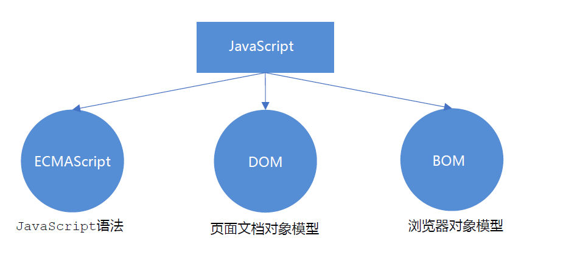

1. ECMAScript

- ECMAScript 是由ECMA 国际（ 原欧洲计算机制造商协会）进行标准化的一门编程语言，这种语言在万维网上应用广泛，它往往被称为 JavaScript 或 JScript，但实际上后两者是 ECMAScript 语言的实现和扩展。

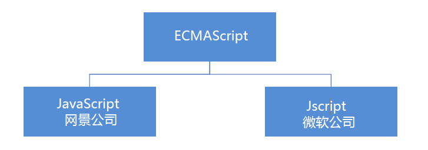

- ECMAScript：ECMAScript 规定了JS的编程语法和基础核心知识，是所有浏览器厂商共同遵守的一套JS语法工业标准。
- 更多参看MDN: https://developer.mozilla.org/zh-CN/docs/Web/JavaScript/JavaScript_technologies_overview

2. DOM ——文档对象模型

- 文档对象模型（Document Object Model，简称DOM），是W3C组织推荐的处理可扩展标记语言的标准编程接口。通过 DOM 提供的接口可以对页面上的各种元素进行操作（大小、位置、颜色等）。

3. BOM ——浏览器对象模型

- BOM (Browser Object Model，简称BOM) 是指浏览器对象模型，它提供了独立于内容的、可以与浏览器窗口进行互动的对象结构。通过BOM可以操作浏览器窗口，比如弹出框、控制浏览器跳转、获取分辨率等。

#### 1.6 JS 初体验

- JS 有3种书写位置，分别为行内、内嵌和外部。

1. 行内式 JS

```html
<input type="button" value="点我试试" onclick="alert('Hello World')" />
```

- 可以将单行或少量 JS 代码写在HTML标签的事件属性中（以 on 开头的属性），如：onclick
- 注意单双引号的使用：在HTML中我们推荐使用双引号, JS 中我们推荐使用单引号
- 可读性差， 在html中编写JS大量代码时，不方便阅读；
- 引号易错，引号多层嵌套匹配时，非常容易弄混；
- 特殊情况下使用

2. 内嵌 JS

```html
<script>
	alert('Hello World~!');
</script>
```

- 可以将多行JS代码写到 <script> 标签中
- 内嵌 JS 是学习时常用的方式

3. 外部 JS文件

```html
<script src="my.js"></script>
```

- 利于HTML页面代码结构化，把大段 JS代码独立到 HTML 页面之外，既美观，也方便文件级别的复用
- 引用外部 JS文件的 script 标签中间不可以写代码
- 适合于JS 代码量比较大的情况

### 2、 JavaScript注释

#### 2.1 单行注释

- 为了提高代码的可读性，JS与CSS一样，也提供了注释功能。JS中的注释主要有两种，分别是单行注释和多行注释。
- 单行注释的注释方式如下

```javascript
// 我是一行文字，不想被 JS引擎 执行，所以 注释起来
```

#### 2.2 多行注释

- 多行注释的注释方式如下：

```javascript
/*
获取用户年龄和姓名
并通过提示框显示出来
*/
```

### 3. JavaScript 输入输出语句

- 为了方便信息的输入输出，JS中提供了一些输入输出语句，其常用的语句如下：


- 注意：alert() 主要用来显示消息给用户，console.log() 用来给程序员自己看运行时的消息。

## 变量

### 1、 变量概述

#### 1.1 什么是变量

- 白话：变量就是一个装东西的盒子。
- 通俗：变量是用于存放数据的容器。 我们通过 变量名 获取数据，甚至数据可以修改。

#### 1.2 变量在内存中的存储

- 本质：变量是程序在内存中申请的一块用来存放数据的空间。
- 类似我们酒店的房间，一个房间就可以看做是一个变量。


### 2、 变量的使用

- 变量在使用时分为两步： 1. 声明变量 2. 赋值

1. 声明变量

```javascript
// 声明变量
var age; // 声明一个 名称为age 的变量
```

- var 是一个 JS关键字，用来声明变量( variable 变量的意思 )。使用该关键字声明变量后，计算机会自动为变量分配内存空间，不需要程序员管
- age 是程序员定义的变量名，我们要通过变量名来访问内存中分配的空间

2. 赋值

```javascript
age = 10; // 给 age 这个变量赋值为 10
```

-  = 用来把右边的值赋给左边的变量空间中 此处代表赋值的意思
-  变量值是程序员保存到变量空间里的值

3. 变量的初始化

```javascript
var age = 18; // 声明变量同时赋值为 18
```

- 声明一个变量并赋值， 我们称之为变量的初始化

### 3、变量语法扩展

#### 3.1 更新变量

- 一个变量被重新复赋值后，它原有的值就会被覆盖，变量值将以最后一次赋的值为准。

```javascript
var age = 18;
age = 81; // 最后的结果就是81因为18 被覆盖掉了
```

#### 3.2 同时声明多个变量

- 同时声明多个变量时，只需要写一个 var， 多个变量名之间使用英文逗号隔开。

```javascript
var age = 10, name = 'zs', sex = 2;
```

#### 3. 3声明变量特殊情况


### 4、变量命名规范

- 由字母(A-Za-z)、数字(0-9)、下划线(_)、美元符号( $ )组成，如：usrAge, num01, _name
- 严格区分大小写。var app; 和 var App; 是两个变量
- 不能 以数字开头。 18age 是错误的
- 不能 是关键字、保留字。例如：var、for、while
- 变量名必须有意义。 MMD BBD nl → age
- 遵守驼峰命名法。首字母小写，后面单词的首字母需要大写。 myFirstName
- 推荐翻译网站： 有道 爱词霸

## 数据类型

### 1、数据类型简介

#### 1.1 为什么需要数据类型

- 在计算机中，不同的数据所需占用的存储空间是不同的，为了便于把数据分成所需内存大小不同的数据，充分利
  用存储空间，于是定义了不同的数据类型。
- 简单来说，数据类型就是数据的类别型号。比如姓名“张三”，年龄18，这些数据的类型是不一样的。

#### 1.2 变量的数据类型

- 变量是用来存储值的所在处，它们有名字和数据类型。变量的数据类型决定了如何将代表这些值的位存储到计算机的内存中。
- JavaScript 是一种弱类型或者说动态语言。这意味着不用提前声明变量的类型，在程序运行过程中，类型会被自动确定。

```javascript
var age = 10; // 这是一个数字型
var areYouOk = '是的'; // 这是一个字符串
```

- 在代码运行时，变量的数据类型是由 JS引擎 根据 = 右边变量值的数据类型来判断 的，运行完毕之后， 变量就确定了数据类型。
- JavaScript 拥有动态类型，同时也意味着相同的变量可用作不同的类型：

```javascript
var x = 6; // x 为数字
var x = "Bill"; // x 为字符串
```

#### 1.3 数据类型的分类

- JS 把数据类型分为两类：
  - 简单数据类型 （Number,String,Boolean,Undefined,Null）
  - 复杂数据类型 （object)

### 2、 简单数据类型

#### 2.1 简单数据类型（基本数据类型）

- JavaScript 中的简单数据类型及其说明如下：


#### 2.2 数字型 Number

- JavaScript 数字类型既可以用来保存整数值，也可以保存小数(浮点数）。

```javascript
var age = 21; // 整数
var Age = 21.3747; // 小数
```

1. 数字型进制
   - 最常见的进制有二进制、八进制、十进制、十六进制。

```javascript
// 1.八进制数字序列范围：0~7
var num1 = 07; // 对应十进制的7
var num2 = 019; // 对应十进制的19
var num3 = 08; // 对应十进制的8
// 2.十六进制数字序列范围：0~9以及A~F
var num = 0xA;
```

2. 数字型范围

- JavaScript中数值的最大和最小值

```javascript
alert(Number.MAX_VALUE); // 1.7976931348623157e+308
alert(Number.MIN_VALUE); // 5e-324
```

-  最大值：Number.MAX_VALUE，这个值为： 1.7976931348623157e+308
-  最小值：Number.MIN_VALUE，这个值为：5e-32

3. 数字型三个特殊值

```javascript
alert(Infinity); // Infinity
alert(-Infinity); // -Infinity
alert(NaN); // NaN
```

- Infinity ，代表无穷大，大于任何数值
- -Infinity ，代表无穷小，小于任何数值
- NaN ，Not a number，代表一个非数值

4. isNaN()

- 用来判断一个变量是否为非数字的类型，返回 true 或者 false


```javascript
var usrAge = 21;
var isOk = isNaN(userAge);
console.log(isNum); // false ，21 不是一个非数字
var usrName = "andy";
console.log(isNaN(userName)); // true ，"andy"是一个非数字
```

#### 2.3 字符串型 String

- 字符串型可以是引号中的任意文本，其语法为 双引号 "" 和 单引号''

```javascript
var strMsg = "我爱北京天安门~"; // 使用双引号表示字符串
var strMsg2 = '我爱吃猪蹄~'; // 使用单引号表示字符串
// 常见错误
var strMsg3 = 我爱大肘子; // 报错，没使用引号，会被认为是js代码，但js没有这些语法
```

- 因为 HTML 标签里面的属性使用的是双引号，JS 这里我们更推荐使用单引号。

1. 字符串引号嵌套

- JS 可以用单引号嵌套双引号 ，或者用双引号嵌套单引号 (外双内单，外单内双)

```javascript
var strMsg = '我是"高帅富"程序猿'; // 可以用''包含""
var strMsg2 = "我是'高帅富'程序猿"; // 也可以用"" 包含''
// 常见错误
var badQuotes = 'What on earth?"; // 报错，不能 单双引号搭配
```

2. 字符串转义符

- 类似HTML里面的特殊字符，字符串中也有特殊字符，我们称之为转义符。
- 转义符都是 \ 开头的，常用的转义符及其说明如下：


3. 字符串长度

- 字符串是由若干字符组成的，这些字符的数量就是字符串的长度。通过字符串的 length 属性可以获取整个字符
  串的长度

```javascript
var strMsg = "我是帅气多金的程序猿！";
alert(strMsg.length); // 显示 11
```

4. 字符串拼接

- 多个字符串之间可以使用 + 进行拼接，其拼接方式为 字符串 + 任何类型 = 拼接之后的新字符串
- 拼接前会把与字符串相加的任何类型转成字符串，再拼接成一个新的字符串

```javascript
//1.1 字符串 "相加"
alert('hello' + ' ' + 'world'); // hello world
//1.2 数值字符串 "相加"
alert('100' + '100'); // 100100
//1.3 数值字符串 + 数值
alert('11' + 12); // 1112
```

- +号总结口诀：数值相加 ，字符相连

5. 字符串拼接加强

```javascript
console.log('zhangsan' + 18); // 只要有字符就会相连
var age = 18;
// console.log('zhangsanage岁啦'); // 这样不行
console.log('zhangsan' + age); // zhangsan18
console.log('zhangsan' + age + '岁啦'); // zhangsan18岁啦
```

- 我们经常会将字符串和变量来拼接，因为变量可以很方便地修改里面的值
- 变量是不能添加引号的，因为加引号的变量会变成字符串
- 如果变量两侧都有字符串拼接，口诀“引引加加 ”，删掉数字，变量写加中间

#### 2.4 布尔型 Boolean

- 布尔类型有两个值：true 和 false ，其中 true 表示真（对），而 false 表示假（错）。
- 布尔型和数字型相加的时候， true 的值为 1 ，false 的值为 0。

```javascript
console.log(true + 1); // 2
console.log(false + 1); // 1
```

#### 2.5 Undefined 和 Null

- 一个声明后没有被赋值的变量会有一个默认值 undefined ( 如果进行相连或者相加时，注意结果）

```javascript
var variable;
console.log(variable); // undefined
console.log('你好' + variable); // 你好undefined
console.log(11 + variable); // NaN
console.log(true + variable); // NaN
```

- 一个声明变量给 null 值，里面存的值为空（学习对象时，我们继续研究null)

```javascript
var vari = null;
console.log('你好' + vari); // 你好null
console.log(11 + vari); // 11
console.log(true + vari); // 1
```

### 3、获取变量数据类型

#### 3.1 获取检测变量的数据类型

- typeof 可用来获取检测变量的数据类型

```javascript
var num = 18;
console.log(typeof num) // 结果 number
```

- 不同类型的返回值


#### 3.2 字面量

- 字面量是在源代码中一个固定值的表示法，通俗来说，就是字面量表示如何表达这个值。
  - 数字字面量：8, 9, 10
  - 字符串字面量："大前端"
  - 布尔字面量：true，false

### 4、 数据类型转换

#### 4.1 什么是数据类型转换

- 使用表单、prompt 获取过来的数据默认是字符串类型的，此时就不能直接简单的进行加法运算，而需要转换变
  量的数据类型。通俗来说，就是把一种数据类型的变量转换成另外一种数据类型。

#### 4.2 转换为字符串


- toString() 和 String() 使用方式不一样。
- 三种转换方式，我们更喜欢用第三种加号拼接字符串转换方式， 这一种方式也称之为隐式转换。

#### 4.3 转换为数字型


- 注意 parseInt 和 parseFloat 单词的大小写，这2个是重点
- 隐式转换是我们在进行算数运算的时候，JS 自动转换了数据类型

#### 4.4 转换为布尔型


- 代表空、否定的值会被转换为 false ，如 ''、0、NaN、null、undefined
- 其余值都会被转换为 true

```javascript
console.log(Boolean('')); // false
console.log(Boolean(0)); // false
console.log(Boolean(NaN)); // false
console.log(Boolean(null)); // false
console.log(Boolean(undefined)); // false
console.log(Boolean('小白')); // true
console.log(Boolean(12)); // true
```

### 5、标识符、关键字、保留字

#### 5.1 标识符

- 标识(zhi)符：就是指开发人员为变量、属性、函数、参数取的名字。
- 标识符不能是关键字或保留字。

#### 5.2 关键字

- 关键字：是指 JS本身已经使用了的字，不能再用它们充当变量名、方法名。
- 包括：break、case、catch、continue、default、delete、do、else、finally、for、function、if、in、
  instanceof、new、return、switch、this、throw、try、typeof、var、void、while、with 等。

#### 5.3 保留字

- 保留字：实际上就是预留的“关键字”，意思是现在虽然还不是关键字，但是未来可能会成为关键字，同样不能
  使用它们当变量名或方法名。
- 包括：boolean、byte、char、class、const、debugger、double、enum、export、extends、
  fimal、float、goto、implements、import、int、interface、long、mative、package、
  private、protected、public、short、static、super、synchronized、throws、transient、
  volatile 等。
- 注意：如果将保留字用作变量名或函数名，那么除非将来的浏览器实现了该保留字，否则很可能收不到任何错
  误消息。当浏览器将其实现后，该单词将被看做关键字，如此将出现关键字错误。

## JavaScript 运算符

### 1、运算符

- 运算符（operator）也被称为操作符，是用于实现赋值、比较和执行算数运算等功能的符号。
- JavaScript中常用的运算符有：
  - 算数运算符
  - 递增和递减运算符
  - 比较运算符
  - 逻辑运算符
  - 赋值运算符

### 2、算数运算符

#### 2.1 算术运算符概述

- 概念：算术运算使用的符号，用于执行两个变量或值的算术运算。


#### 2.2 浮点数的精度问题

- 浮点数值的最高精度是 17 位小数，但在进行算术计算时其精确度远远不如整数。

```JavaScript
var result = 0.1 + 0.2; // 结果不是 0.3，而是：0.30000000000000004
console.log(0.07 * 100); // 结果不是 7， 而是：7.000000000000001
```

- 所以：不要直接判断两个浮点数是否相等 !

#### 2.3 表达式和返回值

- 表达式：是由数字、运算符、变量等以能求得数值的有意义排列方法所得的组合
- 简单理解：是由数字、运算符、变量等组成的式子

- 表达式最终都会有一个结果，返回给我们，我们成为返回值

### 3、递增和递减运算符

#### 3.1 递增和递减运算符概述

- 如果需要反复给数字变量添加或减去1，可以使用递增（++）和递减（ -- ）运算符来完成。
- 在 JavaScript 中，递增（++）和递减（ -- ）既可以放在变量前面，也可以放在变量后面。放在变量前面时，
  我们可以称为前置递增（递减）运算符，放在变量后面时，我们可以称为后置递增（递减）运算符。
- 注意：递增和递减运算符必须和变量配合使用。

#### 3.2 递增运算符

1. 前置递增运算符 

- ++num 前置递增，就是自加1，类似于 num = num + 1，但是 ++num 写起来更简单。
- 使用口诀：先自加，后返回值

```javascript
var num = 10;
alert(++num + 10); // 21
```

2. 后置递增运算符 

- num++ 后置递增，就是自加1，类似于 num = num + 1 ，但是 num++ 写起来更简单。
- 使用口诀：先返回原值，后自加

```javascript
var num = 10;
alert(10 + num++); // 20
```

#### 3.3 前置递增和后置递增小结

- 前置递增和后置递增运算符可以简化代码的编写，让变量的值 + 1 比以前写法更简单
- 单独使用时，运行结果相同
- 与其他代码联用时，执行结果会不同
- 后置：先原值运算，后自加（先人后己）
- 前置：先自加，后运算（先已后人）
- 开发时，大多使用后置递增/减，并且代码独占一行，例如：num++; 或者 num--;

### 4、 比较运算符

#### 4.1 比较运算符概述

- 概念：比较运算符（关系运算符）是两个数据进行比较时所使用的运算符，比较运算后，会返回一个布尔值
  （true / false）作为比较运算的结果。


#### 4.2 =小结


```javascript
console.log(18 == '18');//true
console.log(18 === '18');//false
```

### 5、逻辑运算符

#### 5.1 逻辑运算符概述

- 概念：逻辑运算符是用来进行布尔值运算的运算符，其返回值也是布尔值。后面开发中经常用于多个条件的判断


#### 5.2 逻辑与&&

- 两边都是 true才返回 true，否则返回 false


#### 5.3 逻辑或 ||

- 两边都为 false 才返回 false，否则都为true


#### 5.4 逻辑非 ！

- 逻辑非（!）也叫作取反符，用来取一个布尔值相反的值，如 true 的相反值是 false

```javascript
var isOk = !true;
console.log(isOk); // false
```

#### 5.5 短路运算（逻辑中断）

- 短路运算的原理：当有多个表达式（值）时,左边的表达式值可以确定结果时,就不再继续运算右边的表达式的值;

1. 逻辑与

  - 语法： 表达式1 && 表达式2
  - 如果第一个表达式的值为真，则返回表达式2
  - 如果第一个表达式的值为假，则返回表达式1

  ```javascript
console.log( 123 && 456 ); // 456
console.log( 0 && 456 ); // 0
console.log( 123 && 456&& 789 ); // 789
  ```

2. 逻辑或

   - 语法： 表达式1 || 表达式2
   - 如果第一个表达式的值为真，则返回表达式1
   - 如果第一个表达式的值为假，则返回表达式2

   ```javascript
   console.log( 123 || 456 ); // 123
   console.log( 0 || 456 ); // 456
   console.log( 123 || 456 || 789 ); // 123
   ```

### 6、赋值运算符

- 概念：用来把数据赋值给变量的运算符。


```javascript
var age = 10;
age += 5; // 相当于 age = age + 5;
age -= 5; // 相当于 age = age - 5;
age *= 10; // 相当于 age = age * 10;
```

### 7、 运算符优先级


-  一元运算符里面的逻辑非优先级很高
-  逻辑与比逻辑或优先级高

## JavaScript 流程控制-分支

### 1、流程控制

- 在一个程序执行的过程中，各条代码的执行顺序对程序的结果是有直接影响的。很多时候我们要通过控制代码
  的执行顺序来实现我们要完成的功能。
- 简单理解： 流程控制就是来控制我们的代码按照什么结构顺序来执行
- 流程控制主要有三种结构，分别是顺序结构、分支结构和循环结构，这三种结构代表三种代码执行的顺序。

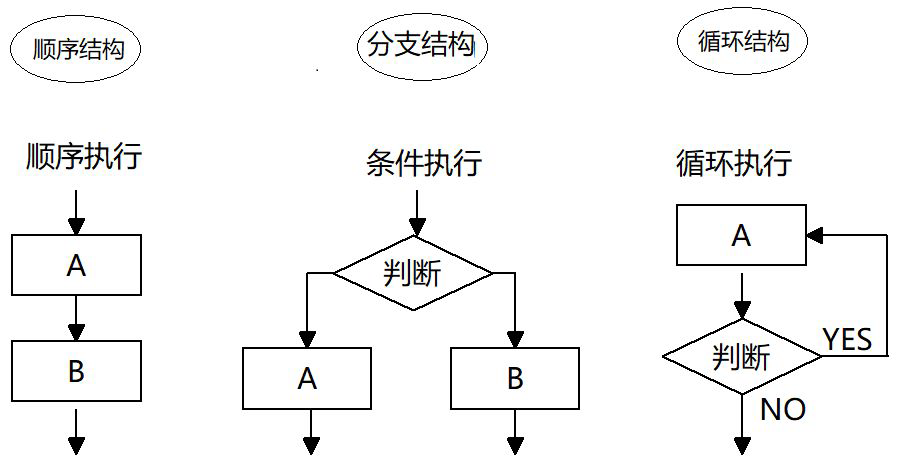

### 2、顺序流程控制

- 顺序结构是程序中最简单、最基本的流程控制，它没有特定的语法结构，程序会按照代码的先后顺序，依次执行，程序中大多数的代码都是这样执行的。


### 3、分支流程控制 if 语句

#### 3.1 分支结构

- 由上到下执行代码的过程中，根据不同的条件，执行不同的路径代码（执行代码多选一的过程），从而得到不同的结果


- JS 语言提供了两种分支结构语句
  - if 语句
  - switch 语句

#### 3.2 if 语句

1. 语法结构

```javascript
// 条件成立执行代码，否则什么也不做
if (条件表达式) {
// 条件成立执行的代码语句
}
```

- 语句可以理解为一个行为，循环语句和分支语句就是典型的语句。一个程序由很多个语句组成，一般情况下，会分割成一个一个的语句。

2. 执行流程


#### 3.3 if else语句（双分支语句）

1. 语法结构

```javascript
// 条件成立 执行 if 里面代码，否则执行else 里面的代码
if (条件表达式) {
// [如果] 条件成立执行的代码
} else {
// [否则] 执行的代码
}
```

2. 执行流程

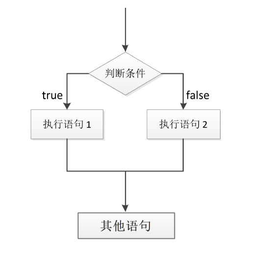

#### 3.4 if else if 语句(多分支语句)

1. 语法结构

```javascript
// 适合于检查多重条件。
if (条件表达式1) {
语句1；
} else if (条件表达式2) {
语句2；
} else if (条件表达式3) {
语句3；
....
} else {
// 上述条件都不成立执行此处代码
}
```

2. 执行流程


### 4、 三元表达式

- 三元表达式也能做一些简单的条件选择。 有三元运算符组成的式子称为三元表达式

1. 语法结构

```javascript
表达式1 ? 表达式2 : 表达式3;
```

2. 执行思路

- 如果表达式1为 true ，则返回表达式2的值，如果表达式1为 false，则返回表达式3的值
- 简单理解： 就类似于 if else （双分支） 的简写

### 5、 分支流程控制 switch 语句

#### 5.1 语法结构

- switch 语句也是多分支语句，它用于基于不同的条件来执行不同的代码。当要针对变量设置一系列的特定值
  的选项时，就可以使用 switch。

```JavaScript
switch( 表达式 ){
 case value1:
	// 表达式 等于 value1 时要执行的代码
	break;
 case value2:
	// 表达式 等于 value2 时要执行的代码
	break;
 default:
	// 表达式 不等于任何一个 value 时要执行的代码
}
```

- switch ：开关 转换 ， case ：小例子 选项
- 关键字 switch 后面括号内可以是表达式或值， 通常是一个变量
- 关键字 case , 后跟一个选项的表达式或值，后面跟一个冒号
- switch 表达式的值会与结构中的 case 的值做比较
- 如果存在匹配全等(===) ，则与该 case 关联的代码块会被执行，并在遇到 break 时停止，整个 switch 语句代码
  执行结束
- 如果所有的 case 的值都和表达式的值不匹配，则执行 default 里的代码

- 注意： 执行case 里面的语句时，如果没有break，则继续执行下一个case里面的语句。

#### 5.2 switch 语句和 if else if 语句的区别

- ① 一般情况下，它们两个语句可以相互替换
- ② switch...case 语句通常处理 case为比较确定值的情况， 而 if…else…语句更加灵活，常用于范围判断(大于、
  等于某个范围)
- ③ switch 语句进行条件判断后直接执行到程序的条件语句，效率更高。而if…else 语句有几种条件，就得判断多
  少次。
- ④ 当分支比较少时，if… else语句的执行效率比 switch语句高。
- ⑤ 当分支比较多时，switch语句的执行效率比较高，而且结构更清晰。

## JavaScript 流程控制-循环

### 1、 循环

- 循环目的

  - 在实际问题中，有许多具有规律性的重复操作，因此在程序中要完成这类操作就需要重复执行某些语句

- JS 中的循环

  在Js 中，主要有三种类型的循环语句：

  - for 循环
  - while 循环
  - do...while 循环

### 2、 for 循环

- 在程序中，一组被重复执行的语句被称之为循环体，能否继续重复执行，取决于循环的终止条件。由循环体
  及循环的终止条件组成的语句，被称之为循环语句

#### 2.1 语法结构

- for 循环主要用于把某些代码循环若干次，通常跟计数有关系。其语法结构如下：

```javascript
for(初始化变量; 条件表达式; 操作表达式 ){
	//循环体
}
```

- 初始化变量：通常被用于初始化一个计数器，该表达式可以使用 var 关键字声明新的变量，这个变量帮我们来记录次数。
- 条件表达式：用于确定每一次循环是否能被执行。如果结果是 true 就继续循环，否则退出循环。
- 操作表达式：每次循环的最后都要执行的表达式。通常被用于更新或者递增计数器变量。当然，递减变量也是可以的。

- 执行过程：

1. 初始化变量，初始化操作在整个 for 循环只会执行一次。
2. 执行条件表达式，如果为true，则执行循环体语句，否则退出循环，循环结束。
3. 执行操作表达式，此时第一轮结束。
4. 第二轮开始，直接去执行条件表达式（不再初始化变量），如果为 true ，则去执行循环体语句，否则退出循环。
5. 继续执行操作表达式，第二轮结束。
6. 后续跟第二轮一致，直至条件表达式为假，结束整个 for 循环。

#### 2.2 for 循环重复相同的代码

- for循环可以重复相同的代码 ，比如我们要输出10句“媳妇我错了”

```JavaScript
// 基本写法
for(var i = 1; i <= 10; i++){
	console.log('媳妇我错了~');
}
// 用户输入次数
var num = prompt('请输入次数:')；
for ( var i = 1 ; i <= num; i++) {
	console.log('媳妇我错了~');
}
```

#### 2.3 for 循环重复不相同的代码

- for 循环还可以重复不同的代码，这主要是因为使用了计数器 ，计数器在每次循环过程中都会有变化。

- 例如，求输出一个人1到100岁：

```JavaScript
// 基本写法
for (var i = 1; i <= 100; i++) {
	console.log('这个人今年' + i + '岁了');
}
// for 里面是可以添加其他语句的
for (var i = 1; i <= 100; i++) {
	if (i == 1) {
		console.log('这个人今年1岁了， 它出生了');
	} else if (i == 100) {
		console.log('这个人今年100岁了，它死了');
	} else {
		console.log('这个人今年' + i + '岁了');
	}
}
```

#### 2.4 for 循环重复某些相同操作

- for 循环因为有了计数器的存在，我们还可以重复的执行某些操作，比如做一些算术运算。

### 3、 双重 for 循环

#### 3.1 双重 for 循环概述

- 很多情况下，单层 for 循环并不能满足我们的需求，比如我们要打印一个 5 行 5 列的图形、打印一个倒
  直角三角形等，此时就可以通过循环嵌套来实现。


- 循环嵌套是指在一个循环语句中再定义一个循环语句的语法结构，例如在for循环语句中，可以再嵌套一个
  for 循环，这样的 for 循环语句我们称之为双重for循环。

#### 3.2 双重 for 循环语法

```JavaScript
for (外循环的初始; 外循环的条件; 外循环的操作表达式) {
	for (内循环的初始; 内循环的条件; 内循环的操作表达式) {
		需执行的代码;
	}
}
```

-  内层循环可以看做外层循环的语句
-  内层循环执行的顺序也要遵循 for 循环的执行顺序
-  外层循环执行一次，内层循环要执行全部次数

#### 3.3 打印五行五列星星

- 核心：

1. 内层循环负责一行打印五个星星
2. 外层循环负责打印五行

```JavaScript
var star = '';
for (var j = 1; j <= 3; j++) {
	for (var i = 1; i <= 3; i++) {
		star += '☆'
	}
	// 每次满 5个星星 就 加一次换行
	star += '\n'
}
console.log(star);
```

### 4、 while 循环

- while 语句可以在条件表达式为真的前提下，循环执行指定的一段代码，直到表达式不为真时结束循环。

- while语句的语法结构如下：

```JavaScript
while (条件表达式) {
	// 循环体代码
}
```

- 执行思路：
  - ① 先执行条件表达式，如果结果为 true，则执行循环体代码；如果为 false，则退出循环，执行后面代码
  - ② 执行循环体代码
  - ③ 循环体代码执行完毕后，程序会继续判断执行条件表达式，如条件仍为true，则会继续执行循环体，直到循环条件为 false 时，整个循环过程才会结束

- 注意：
  - ① 使用 while 循环时一定要注意，它必须要有退出条件，否则会成为死循环
  - ② while 循环和 for 循环的不同之处在于 while 循环可以做较为复杂的条件判断，比如判断用户名和密码

### 5、do while 循环

- do... while 语句其实是 while 语句的一个变体。该循环会先执行一次代码块，然后对条件表达式进行判断，如
  果条件为真，就会重复执行循环体，否则退出循环。
- do... while 语句的语法结构如下：

```JavaScript
do {
// 循环体代码 - 条件表达式为 true 时重复执行循环体代码
} while(条件表达式);
```

- 执行思路：
  - ① 先执行一次循环体代码
  - ② 再执行条件表达式，如果结果为 true，则继续执行循环体代码，如果为 false，则退出循环，继续执行后面代码
- 注意：先再执行循环体，再判断，我们会发现 do…while 循环语句至少会执行一次循环体代码

### 6、continue break

#### 6.1 continue 关键字

- continue 关键字用于立即跳出本次循环，继续下一次循环（本次循环体中 continue 之后的代码就会少执行
  一次）。
- 例如，吃5个包子，第3个有虫子，就扔掉第3个，继续吃第4个第5个包子，其代码实现如下：

```JavaScript
for (var i = 1; i <= 5; i++) {
	if (i == 3) {
		console.log('这个包子有虫子，扔掉');
		continue; // 跳出本次循环，跳出的是第3次循环
	}
	console.log('我正在吃第' + i + '个包子呢');
}
```

#### 6.2 break 关键字

- break 关键字用于立即跳出整个循环（循环结束）。
- 例如，吃5个包子，吃到第3个发现里面有半个虫子，其余的不吃了，其代码实现如下：

```JavaScript
for (var i = 1; i <= 5; i++) {
	if (i == 3) {
		break; // 直接退出整个for 循环，跳到整个for下面的语句
	}
	console.log('我正在吃第' + i + '个包子呢');
}
```

## JavaScript 数组（Array）

### 1、数组的概念

- 数组是指一组数据的集合，其中的每个数据被称作元素，在数组中可以存放任意类型的元素。数组是一种将一组数据存储在单个变量名下的优雅方式。

```JavaScript
//普通变量一次只能存储一个值
var num = 10;
//数组一次可以存储多个值
var arr = [1,2,3,4,5];
```

### 2、创建数组

#### 2.1数组的创建方式

- JS中创建数组有两种方式:
  - 利用new创建数组
  - 利用数组字面量创建数组

#### 2.2利用new创建数组

```JavaScript
var 数组名= new Array() ;
var arr = new Array0 ;l/创建—个新的空数组
```

#### 2.3利用数组字面量创建数组

```javascript
//1．使用数组字面量方式创建空的数组
var 数组名 =[];
//2．使用数组字面量方式创建带初始值的数组
var 数组名 =[ 小白',小黑,'大黄,'瑞奇'];

```

- 数组的字面量是方括号[]
- 声明数组并赋值称为数组的初始化

#### 2.4数组元素的类型

- 数组中可以存放任意类型的数据，例收字符串，数字，布尔值等。

```javascript
var arrStuS =['小白',12,true,28.9] ;
```

### 3、获取数组元素

#### 3.1数组的索引

- 索引(下标)∶用来访问数组元素的序号（数组下标从0开始)。


- 数组可以通过索引来访问、设置、修改对应的数组元素，我们可以通过“数组名[索引]”的形式来获取数组中的元素。
- 这里的访问就是获取得到的意思

```JavaScript
//定义数组
var arrStuS =[1,2,3];
//获取数组中的第2个元素
alert (arrStus[1]);

```

### 4、遍历数组

#### 4.1数组的长度

- 使用“数组名.length”可以访问数组元素的数量(数组长度)。

### 5、数组中新增元素

- 可以通过修改length长度以及索引号增加数组元素

#### 5.1通过修改length长度新增数组元素

- 可以通过修改length长度来实现数组扩容的目的
- length属性是可读写的

```JavaScript
var arr =[ 'red' , 'green' , 'blue','pink' ];
arr.length = 7;
console.log(arr);
console.log(arr[4]);
console.log(arr[5]);
console.log(arr[6]);
```

- 其中索引号是4，5，6的空间没有给值，就是声明变量未给值，默认值就是undefined.

#### 5.2通过修改数组索引新增数组元素

- 可以通过修改数组索引的方式追加数组元素

- 不能直接给数组名赋值,否则会覆盖掉以前的数据

  ```javascript
  var arr = [ 'red' , 'green' , 'blue', 'pink' ];
  arr[4] = 'hotpink' ;
  console.log (arr);
  ```

- 这种方式也是我们最常用的一种方式。

## JavaScript 函数

### 1、函数的概念

- 在 JS 里面，可能会定义非常多的相同代码或者功能相似的代码，这些代码可能需要大量重复使用。
- 虽然 for循环语句也能实现一些简单的重复操作，但是比较具有局限性，此时我们就可以使用 JS 中的函数。
- 函数：就是封装了一段可被重复调用执行的代码块。通过此代码块可以实现大量代码的重复使用。

### 2、 函数的使用

- 函数在使用时分为两步：声明函数和调用函数。

#### 2.1 声明函数

```JavaScript
// 声明函数
function 函数名() {
	//函数体代码
}
```

-  function 是声明函数的关键字,必须小写
-  由于函数一般是为了实现某个功能才定义的， 所以通常我们将函数名命名为动词，比如 getSum

#### 2.2 调用函数

```JavaScript
// 调用函数
函数名(); // 通过调用函数名来执行函数体代码
```

- 调用的时候千万不要忘记添加小括号
- 口诀：函数不调用，自己不执行。

- 注意：声明函数本身并不会执行代码，只有调用函数时才会执行函数体代码。

#### 2.3 函数的封装

-  函数的封装是把一个或者多个功能通过函数的方式封装起来，对外只提供一个简单的函数接口
-  简单理解：封装类似于将电脑配件整合组装到机箱中 ( 类似快递打包）

### 3、函数的参数

#### 3.1 形参和实参

- 在声明函数时，可以在函数名称后面的小括号中添加一些参数，这些参数被称为形参，而在调用该函数时，
  同样也需要传递相应的参数，这些参数被称为实参。


- 参数的作用 : 在函数内部某些值不能固定，我们可以通过参数在调用函数时传递不同的值进去。

```javascript
// 带参数的函数声明
function 函数名(形参1, 形参2 , 形参3...) { // 可以定义任意多的参数，用逗号分隔
// 函数体
}
// 带参数的函数调用
函数名(实参1, 实参2, 实参3...);
```

#### 3.2 函数参数的传递过程

```javascript
// 声明函数
function getSum(num1, num2) {
console.log(num1 + num2);
}
// 调用函数
getSum(1, 3); // 4
getSum(6, 5); // 11
```

1. 调用的时候实参值是传递给形参的
2. 形参简单理解为：不用声明的变量
3. 实参和形参的多个参数之间用逗号（,）分隔

#### 3.3 函数形参和实参个数不匹配问题


```JavaScript
function sum(num1, num2) {
	console.log(num1 + num2);
}
sum(100, 200); // 形参和实参个数相等，输出正确结果
sum(100, 400, 500, 700); // 实参个数多于形参，只取到形参的个数
sum(200); // 实参个数少于形参，多的形参定义为undefined，结果为NaN
```

- 注意：在JavaScript中，形参的默认值是undefined。

#### 3.4 小结

- 函数可以带参数也可以不带参数
- 声明函数的时候，函数名括号里面的是形参，形参的默认值为 undefined
- 调用函数的时候，函数名括号里面的是实参
- 多个参数中间用逗号分隔
- 形参的个数可以和实参个数不匹配，但是结果不可预计，我们尽量要匹配

### 4、 函数的返回值

#### 4.1 return 语句

- 有的时候，我们会希望函数将值返回给调用者，此时通过使用 return 语句就可以实现。
- return 语句的语法格式如下：

```JavaScript
// 声明函数
function 函数名（）{
...
return 需要返回的值；
}
// 调用函数
函数名(); // 此时调用函数就可以得到函数体内return 后面的值
```

- 在使用 return 语句时，函数会停止执行，并返回指定的值
- 如果函数没有 return ，返回的值是 undefined

- 例如，声明了一个sum()函数，该函数的返回值为666，其代码如下：

```JavaScript
// 声明函数
function sum（）{
...
return 666；
}
// 调用函数
sum(); // 此时 sum 的值就等于666，因为 return 语句会把自身后面的值返回给调用者
```

#### 4.2 return 终止函数

- return 语句之后的代码不被执行。

```JavaScript
function add(num1，num2){
	//函数体
	return num1 + num2; // 注意：return 后的代码不执行
	alert('我不会被执行，因为前面有 return');
}
var resNum = add(21,6); // 调用函数，传入两个实参，并通过 resNum 接收函数返回值
alert(resNum); // 27
```

#### 4.3 return 的返回值

- return 只能返回一个值。如果用逗号隔开多个值，以最后一个为准。

```JavaScript
function add(num1，num2){
//函数体
return num1，num2;
}
var resNum = add(21,6); // 调用函数，传入两个实参，并通过 resNum 接收函数返回值
alert(resNum); // 6
```

#### 4.4 函数没有 return 返回 undefined

- 函数都是有返回值的
  - 如果有return 则返回 return 后面的值
  - 如果没有return 则返回 undefined

#### 4.5 break ,continue ,return 的区别

- break ：结束当前的循环体（如 for、while）
- continue ：跳出本次循环，继续执行下次循环（如 for、while）
- return ：不仅可以退出循环，还能够返回 return 语句中的值，同时还可以结束当前的函数体内的代码

### 5、 arguments的使用

- 当我们不确定有多少个参数传递的时候，可以用 arguments 来获取。在 JavaScript 中，arguments 实际上
  它是当前函数的一个内置对象。所有函数都内置了一个 arguments 对象，arguments 对象中存储了传递的
  所有实参。

- arguments展示形式是一个伪数组，因此可以进行遍历。伪数组具有以下特点：
  - 具有 length 属性
  - 按索引方式储存数据
  - 不具有数组的 push , pop 等方法

```JavaScript
function maxValue() {
	var max = arguments[0];
	for (var i = 0; i < arguments.length; i++) {
		if (max < arguments[i]) {
			max = arguments[i];
		}
	}
	return max;
}
console.log(maxValue(2, 4, 5, 9));
console.log(maxValue(12, 4, 9));
```

### 6、函数的两种声明方式

1. 自定义函数方式(命名函数)

- 利用函数关键字 function 自定义函数方式。

```JavaScript
// 声明定义方式
function fn() {...}
// 调用
fn();
```

- 因为有名字，所以也被称为命名函数
- 调用函数的代码既可以放到声明函数的前面，也可以放在声明函数的后面

2. 函数表达式方式(匿名函数）

- 利用函数表达式方式的写法如下：

```JavaScript
// 这是函数表达式写法，匿名函数后面跟分号结束
var fn = function(){...}；
// 调用的方式，函数调用必须写到函数体下面
fn();
```

-  因为函数没有名字，所以也被称为匿名函数
-  这个fn 里面存储的是一个函数
-  函数表达式方式原理跟声明变量方式是一致的
-  函数调用的代码必须写到函数体后面

## JavaScript 作用域

### 1、作用域

#### 1.1作用域概述

- 通常来说，一段程序代码中所用到的名字并不总是有效和可用的，而限定这个名字的可用性的代码范围就是这个名字的作用域。作用域的使用提高宁程序逻辑的局部性，增强了程序的可靠性，减少了名字冲突。
- JS没有块级作用域

### 2、变量的作用域

#### 2.1变量作用域的分类

- 在JavaScript中，根据作用域的不同，变呈可以分为两种:全局变量、局部变量

#### 2.2全局变量

- 在全局作用域下声明的变量叫做全局变量（在函数外部定义的变量)。
- 全局变量在代码的任何位置都可以使用
- 在全局作用域下var声明的变量是全局变量
- 特殊情况下，在函数内不使用var声明的变量也是全局变量（不建议使用）

#### 2.3局部变量

- 在局部作用域下声明的变量叫做局部变量（在函数内部定义的变量)
- 局部变量只能在该函数内部使用
- 在函数内部var声明的变量是局部变量
- 函数的形参实际上就是局部变量

#### 2.4 全局变量和局部变量的区别

- 全局变量∶在任何一个地方都可以使用，只有在浏览器关闭时才会被销毁，因此比较占内存
- 局部变呈∶只在函数内部使用，当其所在的代码块被执行时，会被初始化;当代码块运行结束后，就会被销毁，因此更节省内存空间

### 3、作用域链

- 只要是代码，就至少有一个作用域
- 写在函数内部的局部作用域
- 如果函数中还有函数，那么在这个作用域中就又可以诞生一个作用域
- 根据在内部函数可以访问外部函数变量的这种机制，用链式查找决定哪些数据能被内部函数访问，就称作作用域链

## JavaScript 预解析

### 1、预解析

- JavaScript代码是由浏览器中的JavaScript解析器来执行的。
- JavaScript解析器在运行JavaScript代码的时候分为两步∶预解析和代码执行。

### 2、预解析分为变量预解析（变量提升）和函数预解析（函数提升)

- 变量提升就是把所有的变量声明提升到当前的作用域最前面﹐不提升赋值操作

- 函数提升就是把所有的函数声明提升到当前作用域的最前面不调用函数

## JavaScript 对象

### 1、 对象

#### 1.1 什么是对象？

- 现实生活中：万物皆对象，对象是一个具体的事物，看得见摸得着的实物。例如，一本书、一辆汽车、一个人
  可以是“对象”，一个数据库、一张网页、一个与远程服务器的连接也可以是“对象”。

- 在 JavaScript 中，对象是一组无序的相关属性和方法的集合，所有的事物都是对象，例如字符串、数值、数组、
  函数等。
- 对象是由属性和方法组成的。
  - 属性：事物的特征，在对象中用属性来表示（常用名词）
  - 方法：事物的行为，在对象中用方法来表示（常用动词）


#### 1.2 为什么需要对象

- 保存一个值时，可以使用变量，保存多个值（一组值）时，可以使用数组。如果要保存一个人的完整信息呢？
- 例如，将“张三疯”的个人的信息保存在数组中的方式为：

```javascript
var arr = ['张三疯', '男', 128,154];
```

- JS 中的对象表达结构更清晰，更强大。张三疯的个人信息在对象中的表达结构如下：

```javascript
张三疯.姓名 = '张三疯';
张三疯.性别 = '男';
张三疯.年龄 = 128;
张三疯.身高 = 154;

person.name = '张三疯';
person.sex = '男';
person.age = 128;
person.height = 154;
```

### 2、 创建对象的三种方式

- 在 JavaScript 中，现阶段我们可以采用三种方式创建对象（object）：
  - 利用字面量创建对象
  - 利用 new Object 创建对象
  - 利用构造函数创建对象

#### 2.1 利用字面量创建对象

- 对象字面量：就是花括号 { } 里面包含了表达这个具体事物（对象）的属性和方法。
- { } 里面采取键值对的形式表示
- 键：相当于属性名
- 值：相当于属性值，可以是任意类型的值（数字类型、字符串类型、布尔类型，函数类型等）

```javascript
var star = {
	name : 'pink',
	age : 18,
	sex : '男',
	sayHi : function(){
		alert('大家好啊~');
	}
};
```

- 对象的调用
  - 对象里面的属性调用 : 对象.属性名 ，这个小点 . 就理解为“ 的 ”
  - 对象里面属性的另一种调用方式 : 对象[‘属性名’]，注意方括号里面的属性必须加引号，我们后面会用
  - 对象里面的方法调用：对象.方法名() ，注意这个方法名字后面一定加括号

```JavaScript
console.log(star.name) // 调用名字属性
console.log(star['name']) // 调用名字属性
star.sayHi(); // 调用 sayHi 方法,注意，一定不要忘记带后面的括号
```

- 变量、属性、函数、方法总结
  - 变量：单独声明赋值，单独存在
  - 属性：对象里面的变量称为属性，不需要声明，用来描述该对象的特征
  - 函数：单独存在的，通过“函数名()”的方式就可以调用
  - 方法：对象里面的函数称为方法，方法不需要声明，使用“对象.方法名()”的方式就可以调用，方法用来描述该对象的行为和功能。

#### 2.2 利用new Object创建对象

```JavaScript
var andy = new Obect();
andy.name = 'pink';
andy.age = 18;
andy.sex = '男';
andy.sayHi = function(){
	alert('大家好啊~');
}
```

- Object() ：第一个字母大写
- new Object() ：需要 new 关键字
- 使用的格式：对象.属性 = 值;

#### 2.3 利用构造函数创建对象

- 构造函数 ：是一种特殊的函数，主要用来初始化对象，即为对象成员变量赋初始值，它总与 new 运算符一起
  使用。我们可以把对象中一些公共的属性和方法抽取出来，然后封装到这个函数里面。
- 在 js 中，使用构造函数要时要注意以下两点：
  - 构造函数用于创建某一类对象，其首字母要大写
  - 构造函数要和 new 一起使用才有意义

```JavaScript
function Person(name, age, sex) {
	this.name = name;
	this.age = age;
	this.sex = sex;
	this.sayHi = function() {
		alert('我的名字叫：' + this.name + '，年龄：' + this.age + '，性别：' + this.sex);
	}
}
var bigbai = new Person('大白', 100, '男');
var smallbai = new Person('小白', 21, '男');
console.log(bigbai.name);
console.log(smallbai.name);
```

- 注意：

1. 构造函数约定首字母大写。
2. 函数内的属性和方法前面需要添加 this ，表示当前对象的属性和方法。
3. 构造函数中不需要 return 返回结果。
4. 当我们创建对象的时候，必须用 new 来调用构造函数。

#### 2.4 构造函数和对象

- 构造函数，如 Stars()，抽象了对象的公共部分，封装到了函数里面，它泛指某一大类（class）
- 创建对象，如 new Stars()，特指某一个，通过 new 关键字创建对象的过程我们也称为对象实例化

### 3、 new关键字

- new 在执行时会做四件事情：

1. 在内存中创建一个新的空对象。
2. 让 this 指向这个新的对象。
3. 执行构造函数里面的代码，给这个新对象添加属性和方法。
4. 返回这个新对象（所以构造函数里面不需要return）。

### 4、遍历对象属性

- for...in 语句用于对数组或者对象的属性进行循环操作

```javascript
for (变量 in 对象名字) {
	// 在此执行代码
}
```

- 语法中的变量是自定义的，它需要符合命名规范，通常我们会将这个变量写为 k 或者 key。

```javascript
for (var k in obj) {
	console.log(k); // 这里的 k 是属性名
	console.log(obj[k]); // 这里的 obj[k] 是属性值
}
```

## JavaScript 内置对象

### 1、 内置对象

- JavaScript 中的对象分为3种：自定义对象 、内置对象、 浏览器对象
- 前面两种对象是JS 基础 内容，属于 ECMAScript； 第三个浏览器对象属于我们JS 独有的
- 内置对象就是指 JS 语言自带的一些对象，这些对象供开发者使用，并提供了一些常用的或是最基本而必要的功能（属性和方法）
- 内置对象最大的优点就是帮助我们快速开发
- JavaScript 提供了多个内置对象：Math、 Date 、Array、String等

### 2、查文档

#### 2.1 MDN

- 学习一个内置对象的使用，只要学会其常用成员的使用即可，我们可以通过查文档学习，可以通过MDN/W3C
  来查询。
- Mozilla 开发者网络（MDN）提供了有关开放网络技术（Open Web）的信息，包括 HTML、CSS 和万维网及
  HTML5 应用的 API。
- MDN: https://developer.mozilla.org/zh-CN/

### 3、 Math 对象

#### 3.1 Math 概述

- Math 对象不是构造函数，它具有数学常数和函数的属性和方法。跟数学相关的运算（求绝对值，取整、最大值
  等）可以使用 Math 中的成员。

```JavaScript
Math.PI // 圆周率
Math.floor() // 向下取整
Math.ceil() // 向上取整
Math.round() // 四舍五入版 就近取整 注意 -3.5 结果是 -3
Math.abs() // 绝对值
Math.max()/Math.min() // 求最大和最小值
```

- 注意：上面的方法必须带括号

#### 3.2 随机数方法 random()

- random() 方法可以随机返回一个小数，其取值范围是 [0，1)，左闭右开 0 <= x < 1

- 得到一个两数之间的随机整数，包括两个数在内

```JavaScript
function getRandom(min, max) {
	return Math.floor(Math.random() * (max - min + 1)) + min;
}
```

### 4、 日期对象

#### 4.1 Date 概述

- Date 对象和 Math 对象不一样，他是一个构造函数，所以我们需要实例化后才能使用
- Date 实例用来处理日期和时间

#### 4.2 Date()方法的使用

1. 获取当前时间必须实例化

```JavaScript
var now = new Date();
console.log(now);
```

2. Date() 构造函数的参数

- 如果括号里面有时间，就返回参数里面的时间。例如日期格式字符串为‘2019-5-1’，可以写成new Date('2019-5-1') 或者 new Date('2019/5/1')
- 如果Date()不写参数，就返回当前时间
- 如果Date()里面写参数，就返回括号里面输入的时间

#### 4.3 日期格式化

- 我们想要 2019-8-8 8:8:8 格式的日期，要怎么办？
- 需要获取日期指定的部分，所以我们要手动的得到这种格式。


#### 4.4 获取日期的总的毫秒形式

- Date 对象是基于1970年1月1日（世界标准时间）起的毫秒数

- 我们经常利用总的毫秒数来计算时间，因为它更精确

```JavaScript
// 实例化Date对象
var now = new Date();
// 1. 用于获取对象的原始值
console.log(date.valueOf())
console.log(date.getTime())
// 2. 简单写可以这么做
var now = + new Date();
// 3. HTML5中提供的方法，有兼容性问题
var now = Date.now();
```

- d = parseInt(总秒数/ 60/60 /24); // 计算天数
- h = parseInt(总秒数/ 60/60 %24) // 计算小时
- m = parseInt(总秒数 /60 %60 ); // 计算分数
- s = parseInt(总秒数%60); // 计算当前秒数

### 5、 数组对象

#### 5.1 数组对象的创建

- 创建数组对象的两种方式
  - 字面量方式
  - new Array()

#### 5.2 检测是否为数组

- instanceof 运算符，可以判断一个对象是否属于某种类型
- Array.isArray()用于判断一个对象是否为数组，isArray() 是 HTML5 中提供的方法

```JavaScript
var arr = [1, 23];
var obj = {};
console.log(arr instanceof Array); // true
console.log(obj instanceof Array); // false
console.log(Array.isArray(arr)); // true
console.log(Array.isArray(obj)); // false
```

#### 5.3 添加删除数组元素的方法


- 有一个包含工资的数组[1500, 1200, 2000, 2100, 1800]，要求把数组中工资超过2000的删除，剩余的放到新数组里面

```JavaScript
var arr = [1500, 1200, 2000, 2100, 1800];
var newArr = [];
for (var i = 0; i < arr.length; i++) {
	if (arr[i] < 2000) {
		newArr.push(arr[i]);
	}
}
console.log(newArr);
```

#### 5.4 数组排序


```JavaScript
var arr = [1, 64, 9, 6];
arr.sort(function(a, b) {
	return b - a; // 降序
	// return a - b; // 升序
});
console.log(arr);
```

#### 5.5 数组索引方法


#### 5.6 数组转换为字符串


#### 5.7其他


- splice 删除/插入/替换
  - 删除：第二个参数传入删除几个元素（不传的话则在开始后面的元素全部删除）
  - 替换：第二个参数传入删除几个元素，后面传入对应的元素用以替换
  - 插入：第二个参数为零，后面输入需要插入的元素（在开始元素后面插入）

### 6、 字符串对象

#### 6.1 基本包装类型

- 为了方便操作基本数据类型，JavaScript 还提供了三个特殊的引用类型：String、Number和 Boolean。

- 基本包装类型就是把简单数据类型包装成为复杂数据类型，这样基本数据类型就有了属性和方法。

```JavaScript
// 下面代码有什么问题？
var str = 'andy';
console.log(str.length);
```

- 按道理基本数据类型是没有属性和方法的，而对象才有属性和方法，但上面代码却可以执行，这是因为 js 会把
  基本数据类型包装为复杂数据类型，其执行过程如下 ：

```JavaScript
// 1. 生成临时变量，把简单类型包装为复杂数据类型
var temp = new String('andy');
// 2. 赋值给我们声明的字符变量
str = temp;
// 3. 销毁临时变量
temp = null;
```

#### 6.2 字符串的不可变

- 指的是里面的值不可变，虽然看上去可以改变内容，但其实是地址变了，内存中新开辟了一个内存空间。

```JavaScript
var str = 'abc';
str = 'hello';
// 当重新给 str 赋值的时候，常量'abc'不会被修改，依然在内存中
// 重新给字符串赋值，会重新在内存中开辟空间，这个特点就是字符串的不可变
// 由于字符串的不可变，在大量拼接字符串的时候会有效率问题
var str = '';
for (var i = 0; i < 100000; i++) {
	str += i;
}
console.log(str); // 这个结果需要花费大量时间来显示，因为需要不断的开辟新的空间
```

#### 6.3 根据字符返回位置

- 字符串所有的方法，都不会修改字符串本身(字符串是不可变的)，操作完成会返回一个新的字符串。


#### 6.4 根据位置返回字符


#### 6.5 字符串操作方法


#### 6.6 replace()方法

- replace() 方法用于在字符串中用一些字符替换另一些字符。

```javascript
replace(被替换的字符串， 要替换为的字符串);
```

#### 6.7 split()方法

- split()方法用于切分字符串，它可以将字符串切分为数组。在切分完毕之后，返回的是一个新数组。

```javascript
var str = 'a,b,c,d';
console.log(str.split(',')); // 返回的是一个数组 [a, b, c, d]
```

#### 6.8 大小写

-  toUpperCase() //转换大写
-  toLowerCase() //转换小写

## JavaScript 简单类型与复杂类型

### 1、 简单类型与复杂类型

- 简单类型又叫做基本数据类型或者值类型，复杂类型又叫做引用类型。

  - 值类型：简单数据类型/基本数据类型，在存储时变量中存储的是值本身，因此叫做值类型
    string ，number，boolean，undefined，null

  - 引用类型：复杂数据类型，在存储时变量中存储的仅仅是地址（引用），因此叫做引用数据类型

    通过 new 关键字创建的对象（系统对象、自定义对象），如 Object、Array、Date等

### 2、 堆和栈

- 堆栈空间分配区别：
  1、栈（操作系统）：由操作系统自动分配释放存放函数的参数值、局部变量的值等。其操作方式类似于数据结构中的栈；
    　　2、堆（操作系统）：存储复杂类型(对象)，一般由程序员分配释放，若程序员不释放，由垃圾回收机制回收。
- 简单数据类型存放到栈里面
- 复杂数据类型存放到堆里面


- 注意：JavaScript中没有堆栈的概念，通过堆栈的方式，可以让大家更容易理解代码的一些执行方式，便于将来学习其他语言。

### 3、简单类型的内存分配

- 值类型（简单数据类型）： string ，number，boolean，undefined，null
- 值类型变量的数据直接存放在变量（栈空间）中


### 4、 复杂类型的内存分配

- 引用类型（复杂数据类型）：通过 new 关键字创建的对象（系统对象、自定义对象），如 Object、Array、Date等
- 引用类型变量（栈空间）里存放的是地址，真正的对象实例存放在堆空间中


### 5、 简单类型传参

- 函数的形参也可以看做是一个变量，当我们把一个值类型变量作为参数传给函数的形参时，其实是把变量在栈
  空间里的值复制了一份给形参，那么在方法内部对形参做任何修改，都不会影响到的外部变量。

```JavaScript
function fn(a) {
	a++;
	console.log(a);
}
var x = 10;
fn(x);
console.log(x)；
```

### 6、 复杂类型传参

- 函数的形参也可以看做是一个变量，当我们把引用类型变量传给形参时，其实是把变量在栈空间里保存的堆地
  址复制给了形参，形参和实参其实保存的是同一个堆地址，所以操作的是同一个对象。

```JavaScript
function Person(name) {
	this.name = name;
}
function f1(x) { // x = p
	console.log(x.name); // 2. 这个输出刘德华 
	x.name = "张学友";
	console.log(x.name); // 3. 这个输出张学友 
}
var p = new Person("刘德华");
console.log(p.name); // 1. 这个输出刘德华 
f1(p);
console.log(p.name); // 4. 这个输出张学友
```


------


# JavaScript高级

## **JavaScript** 面向对象

### 1、 **面向对象编程介绍**

#### **1.1** 两大编程思想

- 面向过程

- 面向对象

#### **1.2** 面向过程编程 POP(Process-oriented programming)

- **面向过程**就是分析出解决问题所需要的步骤，然后用函数把这些步骤一步一步实现，使用的时候再一个一个的依次调用就可以了。
- 举个栗子：将大象装进冰箱，面向过程做法。


- 面向过程，就是按照我们分析好了的步骤，按照步骤解决问题。

#### **1.3** **面向对象编程** **OOP** (Object Oriented Programming)

- **面向对象**是把事务分解成为一个个对象，然后由对象之间分工与合作。

- 举个栗子：将大象装进冰箱，面向对象做法。

- 先找出对象，并写出这些对象的功能

1. 大象对象 

   进去

2. 冰箱对象

   打开

   关闭

3. 使用大象和冰箱的功能

- 面向对象是以对象功能来划分问题，而不是步骤。

- 在面向对象程序开发思想中，每一个对象都是功能中心，具有明确分工。

- 面向对象编程具有灵活、代码可复用、容易维护和开发的优点，更适合多人合作的大型软件项目。

- 面向对象的特性：

  封装性 

  继承性

  多态性

#### **1.4** 面向过程和面向对象的对比

- **面向过程**

  优点：性能比面向对象高，适合跟硬件联系很紧密的东西，例如单片机就采用的面向过程编程。

  缺点：没有面向对象易维护、易复用、易扩展

- **面向对象**

  优点：易维护、易复用、易扩展，由于面向对象有封装、继承、多态性的特性，可以设计出低耦合的系统，使系			统 更加灵活、更加易于维护 

  缺点：性能比面向过程低

- 用面向过程的方法写出来的程序是一份蛋炒饭，而用面向对象写出来的程序是一份盖浇饭。

### 2、ES6中的类和对象

- **面向对象**
  - 面向对象更贴近我们的实际生活, 可以使用面向对象描述现实世界事物. 但是事物分为具体的事物和抽象的事物

- 面向对象的思维特点: 

  - 抽取（抽象）对象共用的属性和行为组织(封装)成一个类(模板)

  - 对类进行实例化, 获取类的对象

- 面向对象编程我们考虑的是有哪些对象，按照面向对象的思维特点,不断的创建对象,使用对象,指挥对象做事情.

#### **2.1** 对象

- 现实生活中：万物皆对象，对象是一个具体的事物，看得见摸得着的实物。例如，一本书、一辆汽车、一个人可以是“对象”，一个数据库、一张网页、一个与远程服务器的连接也可以是“对象”。
- 在 JavaScript 中，对象是一组无序的相关属性和方法的集合，所有的事物都是对象，例如字符串、数值、数组、函数等。

- 对象是由属性和方法组成的：
  - 属性：事物的**特征，**在对象中用**属性**来表示（常用名词）
  - 方法：事物的**行为，**在对象中用**方法**来表示（常用动词）

#### 2.2类 class

- 在 ES6 中新增加了类的概念，可以使用 class 关键字声明一个类，之后以这个类来实例化对象。

- 类抽象了对象的公共部分，它泛指某一大类（class）
- 对象特指某一个，通过类实例化一个具体的对象  

#### **2.3** 创建类

```JavaScript
class name {
  // class body
}       
```

- 创建实例：

```JavaScript
var xx = new name();     
```

- 注意： 类必须使用 new 实例化对象

#### **2.4** **类** **constructor** 构造函数

- constructor() 方法是类的构造函数(默认方法)，用于传递参数,返回实例对象，通过 new 命令生成对象实例时，自动调用该方法。如果没有显示定义, 类内部会自动给我们创建一个constructor()

```JavaScript
class Person {
  constructor(name,age) {   // constructor 构造方法或者构造函数
      this.name = name;
      this.age = age;
    }
}   
```

- 创建实例：

```JavaScript
var ldh = new Person('刘德华', 18); 
console.log(ldh.name)    
```

#### **2.5** 类添加方法

```JavaScript
class Person {
  constructor(name,age) {   // constructor 构造器或者构造函数
      this.name = name;
      this.age = age;
    }
   say() {
      console.log(this.name + '你好');
   }
}     
```

- 创建实例：

```JavaScript
var ldh = new Person('刘德华', 18); 
ldh.say()   
```

- 注意： 方法之间不能加逗号分隔，同时方法不需要添加 function 关键字。

### 3、 **类的继承**

#### **3.1** **继承**

- 现实中的继承：子承父业，比如我们都继承了父亲的姓。

- 程序中的继承：子类可以继承父类的一些属性和方法。

```JavaScript
class Father{   // 父类
} 
class  Son extends Father {  // 子类继承父类
}       
```

- **实例：**

```JavaScript
class Father {
      constructor(surname) {
        this.surname= surname;
      }
      say() {
        console.log('你的姓是' + this.surname);

       }
}
class Son extends Father{  // 这样子类就继承了父类的属性和方法

}
var damao= new Son('刘');
damao.say();      
```

#### **3.2** **super** **关键字**

- super 关键字用于访问和调用对象父类上的函数。可以调用父类的构造函数，也可以调用父类的普通函数

```JavaScript
class Person {   // 父类
      constructor(surname){
         this.surname = surname;
     }
} 
class  Student extends Person {       // 子类继承父类
     constructor(surname,firstname){
          super(surname);             // 调用父类的constructor(surname)
	this.firstname = firstname; // 定义子类独有的属性
     }
}       
```

```JavaScript
class Father {
     say() {
         return '我是爸爸';

     }
}
class Son extends Father { // 这样子类就继承了父类的属性和方法
     say() {
          // super.say()  super 调用父类的方法
          return super.say() + '的儿子';
     }
}
var damao = new Son();
console.log(damao.say());  
```

-  注意: 子类在构造函数中使用super, 必须放到 this 前面 (必须先调用父类的构造方法,在使用子类构造方法)

```JavaScript
 class Father {
    constructor(surname) {
        this.surname = surname;
     }
    saySurname() {
      console.log('我的姓是' + this.surname);
    }
}
class Son extends Father { // 这样子类就继承了父类的属性和方法
    constructor(surname, fristname) {
         super(surname);   // 调用父类的constructor(surname)
         this.fristname = fristname;
     }
    sayFristname() {
         console.log("我的名字是：" + this.fristname);

    }
}
var damao = new Son('刘', "德华");
damao.saySurname();
damao.sayFristname();      
```

- 注意点:

  1.在 ES6 中类没有变量提升，所以必须先定义类，才能通过类实例化对象.

  2.类里面的共有属性和方法一定要加this使用.

  3.类里面的this指向问题. 

  4.constructor 里面的this指向实例对象, 方法里面的this 指向这个方法的调用者

## 构造函数和原型

### **1、**构造函数和原型**

#### **1.1** **概述**

- 在典型的 OOP 的语言中（如 Java），都存在类的概念，类就是对象的模板，对象就是类的实例，但在 ES6之前， JS 中并没用引入类的概念。

- ES6， 全称 ECMAScript 6.0 ，2015.06 发版。但是目前浏览器的 JavaScript 是 ES5 版本，大多数高版本的浏览器也支持 ES6，不过只实现了 ES6 的部分特性和功能。

- 在 ES6之前 ，对象不是基于类创建的，而是用一种称为构建函数的特殊函数来定义对象和它们的特征。

- 创建对象可以通过以下三种方式：

  1. 对象字面量

  2. new Object()

  3. 自定义构造函数

#### **1.2** 构造函数

- **构造函数**是一种特殊的函数，主要用来初始化对象，即为对象成员变量赋初始值，它总与 new 一起使用。我们可以把对象中一些公共的属性和方法抽取出来，然后封装到这个函数里面。

- 在 JS 中，使用构造函数时要注意以下两点：

  1.构造函数用于创建某一类对象，其首字母要大写

  2.构造函数要和 new 一起使用才有意义

- new在执行时会做四件事情：

  ①在内存中创建一个新的空对象。

  ②让 this 指向这个新的对象。

  ③执行构造函数里面的代码，给这个新对象添加属性和方法。

  ④返回这个新对象（所以构造函数里面不需要 return ）。

- JavaScript 的构造函数中可以添加一些成员，可以在构造函数本身上添加，也可以在构造函数内部的 this 上添加。通过这两种方式添加的成员，就分别称为静态成员和实例成员。

  -  静态成员：在构造函数本上添加的成员称为静态成员，只能由构造函数本身来访问

  -  实例成员：在构造函数内部创建的对象成员称为实例成员，只能由实例化的对象来访问

#### **1.3** 构造函数的问题

- 构造函数方法很好用，但是存在浪费内存的问题。

```JavaScript
function Star(uname, age) {
    this.uname = uname;
    this.age = age;
    this.sing = function() {
        console.log('我会唱歌');}
}
var ldh = new Star('刘德华', 18);
var zxy = new Star('张学友', 19);
```


- 我们希望所有的对象使用同一个函数，这样就比较节省内存，那么我们要怎样做呢？

#### **1.4** **构造函数原型** prototype

- 构造函数通过原型分配的函数是所有对象所**共享的**。

- JavaScript 规定，每一个构造函数都有一个 prototype 属性，指向另一个对象。注意这个 prototype 就是一个对象，这个对象的所有属性和方法，都会被构造函数所拥有。

- 我们可以把那些不变的方法，直接定义在 prototype 对象上，这样所有对象的实例就可以共享这些方法。

1. 原型是什么 ？ 

   一个对象，我们也称为 prototype 为原型对象。

2. 原型的作用是什么 ？ 

   共享方法。

#### **1.5** 对象原型\__proto__

- 对象都会有一个属性 \__proto__ 指向构造函数的 prototype 原型对象，之所以我们对象可以使用构造函数 prototype 原型对象的属性和方法，就是因为对象有 \__proto__ 原型的存在。

- \__proto__对象原型和原型对象 prototype 是等价的

- \__proto__对象原型的意义就在于为对象的查找机制提供一个方向，或者说一条路线，但是它是一个非标准属性，因此实际开发中，不可以使用这个属性，它只是内部指向原型对象 prototype

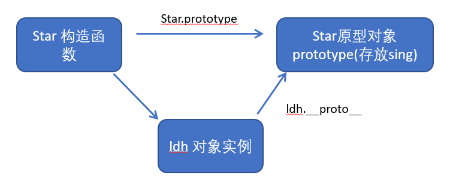

#### **1.6** **constructor** 构造函数

- 对象原型（\__proto__）和构造函数（prototype）原型对象里面都有一个属性 constructor 属性 ，constructor 我们称为构造函数，因为它指回构造函数本身。

- constructor 主要用于记录该对象引用于哪个构造函数，它可以让原型对象重新指向原来的构造函数。

- 一般情况下，对象的方法都在构造函数的原型对象中设置。如果有多个对象的方法，我们可以给原型对象采取对象形式赋值，但是这样就会覆盖构造函数原型对象原来的内容，这样修改后的原型对象 constructor 就不再指向当前构造函数了。此时，我们可以在修改后的原型对象中，添加一个 constructor 指向原来的构造函数。

#### **1.7** 构造函数、实例、原型对象三者之间的关系


#### **1.8** 原型链


#### **1.9** **JavaScript** 的成员查找机制(规则)

- ①当访问一个对象的属性（包括方法）时，首先查找这个对象自身有没有该属性。

- ②如果没有就查找它的原型（也就是 \__proto__指向的 prototype 原型对象）。

- ③如果还没有就查找原型对象的原型（Object的原型对象）。

- ④依此类推一直找到 Object 为止（null）。

- ⑤\__proto__对象原型的意义就在于为对象成员查找机制提供一个方向，或者说一条路线。

#### **1.10** 原型对象this指向

- 构造函数中的this 指向我们实例对象.

- 原型对象里面放的是方法, 这个方法里面的this 指向的是 这个方法的调用者, 也就是这个实例对象.

#### **1.11** 扩展内置对象

- 可以通过原型对象，对原来的内置对象进行扩展自定义的方法。比如给数组增加自定义求偶数和的功能。
- 注意：数组和字符串内置对象不能给原型对象覆盖操作 Array.prototype = {} ，只能是 Array.prototype.xxx = function(){} 的方式。

### **2、** 继承

- ES6之前并没有给我们提供 extends 继承。我们可以通过构造函数+原型对象模拟实现继承，被称为组合继承。

#### 2.1 call()

- 调用这个函数, 并且修改函数运行时的 this 指向  

```JavaScript
fun.call(thisArg, arg1, arg2, ...) 
```

- thisArg ：当前调用函数 this 的指向对象

- arg1，arg2：传递的其他参数

#### **2.2** 借用构造函数继承父类型属性

- 核心原理： 通过 call() 把父类型的 this 指向子类型的 this ，这样就可以实现子类型继承父类型的属性。  

```JavaScript
    // 父类
    function Person(name, age, sex) {
      this.name = name;
      this.age = age;
      this.sex = sex;
    }
    // 子类
    function Student(name, age, sex, score) {
      Person.call(this, name, age, sex);  // 此时父类的 this 指向子类的 this，同时调用这个函数
      this.score = score;
    }
    var s1 = new Student('zs', 18, '男', 100);
    console.dir(s1); 
```

#### **2.3** 借用原型对象继承父类型方法

- 一般情况下，对象的方法都在构造函数的原型对象中设置，通过构造函数无法继承父类方法。 

- 核心原理： 

  ①将子类所共享的方法提取出来，让子类的 prototype 原型对象 = new 父类() 

  ②本质：子类原型对象等于是实例化父类，因为父类实例化之后另外开辟空间，就不会影响原来父类原型对象

  ③将子类的 constructor 从新指向子类的构造函数

### **3、** **类的本质**

1. class本质还是function.

2. 类的所有方法都定义在类的prototype属性上

3. 类创建的实例,里面也有\__proto__ 指向类的prototype原型对象

4. 所以ES6的类它的绝大部分功能，ES5都可以做到，新的class写法只是让对象原型的写法更加清晰、更像面向对象编程的语法而已。

5. 所以ES6的类其实就是语法糖.

6. 语法糖:语法糖就是一种便捷写法.  简单理解, 有两种方法可以实现同样的功能, 但是一种写法更加清晰、方便,那么这个方法就是语法糖

### **4、ES5** **中的新增方法**

#### **4.1 ES5** **新增方法概述**

- ES5 中给我们新增了一些方法，可以很方便的操作数组或者字符串，这些方法主要包括：

  ​	数组方法

  ​	字符串方法

  ​	对象方法

#### **4.2** **数组方法**

- 迭代(遍历)方法：forEach()、map()、filter()、some()、every()；

```JavaScript
array.forEach(function(currentValue, index, arr))
```

- currentValue：数组当前项的值
- index：数组当前项的索引
- arr：数组对象本身

```JavaScript
array.filter(function(currentValue, index, arr))
```

-  filter() 方法创建一个新的数组，新数组中的元素是通过检查指定数组中符合条件的所有元素,主要用于筛选数组

-  注意它直接返回一个新数组

-  currentValue: 数组当前项的值

-  index：数组当前项的索引

-  arr：数组对象本身

```JavaScript
array.some(function(currentValue, index, arr))
```

- some() 方法用于检测数组中的元素是否满足指定条件.  通俗点 查找数组中是否有满足条件的元素 

- 注意它返回值是布尔值, 如果查找到这个元素, 就返回true ,  如果查找不到就返回false.

- 如果找到第一个满足条件的元素,则终止循环. 不在继续查找.

- currentValue: 数组当前项的值

- index：数组当前项的索引

- arr：数组对象本身

#### **4.3** **字符串方法**

- trim() 方法会从一个字符串的两端删除空白字符。

```JavaScript
str.trim()
```

- trim() 方法并不影响原字符串本身，它返回的是一个新的字符串。

#### **4.4** **对象****方法**

- 1.Object.keys() 用于获取对象自身所有的属性

```JavaScript
Object.keys(obj)
```

- 效果类似 for…in

- 返回一个由属性名组成的数组

- 2.Object.defineProperty() 定义新属性或修改原有的属性。

```
Object.defineProperty(obj, prop, descriptor)
```

- Object.defineProperty()  第三个参数 descriptor 说明： 以对象形式 { } 书写

- value: 设置属性的值 默认为undefined

- writable: 值是否可以重写。true | false 默认为false

- enumerable: 目标属性是否可以被枚举。true | false 默认为 false

- configurable: 目标属性是否可以被删除或是否可以再次修改特性 true | false 默认为false

## **函数进阶**

### **1、** **函数的定义和调用**

#### **1.1** **函数的定义方式**

1. 函数声明方式 function 关键字 (命名函数)

2. 函数表达式 (匿名函数)

3. new Function()  

```JavaScript
var fn = new Function('参数1','参数2'..., '函数体')
```

- Function 里面参数都必须是字符串格式

- 第三种方式执行效率低，也不方便书写，因此较少使用

- 所有函数都是 Function 的实例(对象) 

- 函数也属于对象


#### **1.2** 函数的调用方式

1. 普通函数

2. 对象的方法

3. 构造函数

4. 绑定事件函数

5. 定时器函数

6. 立即执行函数

### **2、 this**

#### **2.1** 函数内 **this** 的指向

- 这些 this 的指向，是当我们调用函数的时候确定的。 调用方式的不同决定了this 的指向不同

- 一般指向我们的调用者.


- JavaScript 为我们专门提供了一些函数方法来帮我们更优雅的处理函数内部 this 的指向问题，常用的有 bind()、call()、apply() 三种方法。

1. call **方法**

- call() 方法调用一个对象。简单理解为调用函数的方式，但是它可以改变函数的 this 指向。

```JavaScript
fun.call(thisArg, arg1, arg2, ...) 
```

- thisArg：在 fun 函数运行时指定的 this 值

- arg1，arg2：传递的其他参数

- 返回值就是函数的返回值，因为它就是调用函数

- 因此当我们想改变 this 指向，同时想调用这个函数的时候，可以使用 call，比如继承

2. apply方法

- apply() 方法调用一个函数。简单理解为调用函数的方式，但是它可以改变函数的 this 指向。

```JavaScript
fun.apply(thisArg, [argsArray])
```

- thisArg：在fun函数运行时指定的 this 值

- argsArray：传递的值，必须包含在数组里面

- 返回值就是函数的返回值，因为它就是调用函数

- 因此 apply 主要跟数组有关系，比如使用 Math.max() 求数组的最大值

3. bind方法

- bind() 方法不会调用函数。但是能改变函数内部this 指向 

```JavaScript
fun.bind(thisArg, arg1, arg2, ...) 
```

- thisArg：在 fun 函数运行时指定的 this 值

- arg1，arg2：传递的其他参数

- 返回由指定的 this 值和初始化参数改造的原函数拷贝

- 因此当我们只是想改变 this 指向，并且不想调用这个函数的时候，可以使用 bind

#### **2.2 call apply bind** **总结**

- 相同点:

  都可以改变函数内部的this指向.

- 区别点:

  1.call 和 apply 会调用函数, 并且改变函数内部this指向.

  2.call 和 apply 传递的参数不一样, call 传递参数 aru1, aru2..形式 apply 必须数组形式[arg]

  3.bind 不会调用函数, 可以改变函数内部this指向.

- 主要应用场景:

  1.call 经常做继承. 

  2.apply 经常跟数组有关系. 比如借助于数学对象实现数组最大值最小值

  3.bind 不调用函数,但是还想改变this指向. 比如改变定时器内部的this指向. 

### **3、** **严格模式**

#### **3.1** **什么是严格模式**

- JavaScript 除了提供正常模式外，还提供了严格模式（strict mode）。ES5 的严格模式是采用具有限制性 JavaScript 变体的一种方式，即在严格的条件下运行 JS 代码。

- 严格模式在 IE10 以上版本的浏览器中才会被支持，旧版本浏览器中会被忽略。

- 严格模式对正常的 JavaScript 语义做了一些更改： 

  ​	1.消除了 Javascript 语法的一些不合理、不严谨之处，减少了一些怪异行为。

  ​	2.消除代码运行的一些不安全之处，保证代码运行的安全。

  ​	3.提高编译器效率，增加运行速度。

  ​	4.禁用了在 ECMAScript 的未来版本中可能会定义的一些语法，为未来新版本的 Javascript 做好铺垫。比如一  些保留字如：class, enum, export, extends, import, super 不能做变量名

#### **3.2** **开启**严格模式

- 严格模式可以应用到整个脚本或个别函数中。因此在使用时，我们可以将严格模式分为为脚本开启严格模式和为函数开启严格模式两种情况。

1. 为脚本开启严格模式

- 为整个脚本文件开启严格模式，需要在所有语句之前放一个特定语句“use strict”;（或‘use strict’;）。

```JavaScript
<script>
　　"use strict";
　　console.log("这是严格模式。");
</script>
```

- 因为"use strict"加了引号，所以老版本的浏览器会把它当作一行普通字符串而忽略。

- 有的 script 脚本是严格模式，有的 script 脚本是正常模式，这样不利于文件合并，所以可以将整个脚本文件放在一个立即执行的匿名函数之中。这样独立创建一个作用域而不影响其他 script 脚本文件。

```JavaScript
<script>
  (function (){
　　　　"use strict";
       var num = 10;
　　　　function fn() {}
　  })();
</script>
```

2. 为函数开启严格模式

- 要给某个函数开启严格模式，需要把“use strict”; (或 'use strict'; ) 声明放在函数体所有语句之前。

```JavaScript
function fn(){
　　"use strict";
　　return "这是严格模式。";
}
```

- 将 "use strict" 放在函数体的第一行，则整个函数以 "严格模式" 运行。

#### **3.3** **严格模式中的变化**

- 严格模式对 Javascript 的语法和行为，都做了一些改变。

1. 变量规定

- ①在正常模式中，如果一个变量没有声明就赋值，默认是全局变量。严格模式禁止这种用法，变量都必须先用var 命令声明，然后再使用。

- ②严禁删除已经声明变量。例如，delete x; 语法是错误的。

2. 严格模式下 **this** 指向问题

- ①以前在全局作用域函数中的 this 指向 window 对象。

- ②严格模式下全局作用域中函数中的 this 是 undefined。

- ③以前构造函数时不加 new也可以 调用,当普通函数，this 指向全局对象

- ④严格模式下,如果 构造函数不加new调用, this 指向的是undefined 如果给他赋值则 会报错

- ⑤new 实例化的构造函数指向创建的对象实例。

- ⑥定时器 this 还是指向 window 。

- ⑦事件、对象还是指向调用者。

3. 函数变化

- ①函数不能有重名的参数。

- ②函数必须声明在顶层.新版本的 JavaScript 会引入“块级作用域”（ ES6 中已引入）。为了与新版本接轨，不允许在非函数的代码块内声明函数。 

- 更多严格模式要求参考：https://developer.mozilla.org/zh-CN/docs/Web/JavaScript/Reference/Strict_mode

### **4、** **高阶函数**

- **高阶函数**是对其他函数进行操作的函数，它接收函数作为参数或将函数作为返回值输出。

```JavaScript
<script>
function fn(callback){
  callback&&callback();
}
fn(function(){alert('hi')}
</script>
```

```JavaScript
<script>
function fn(){
    return function() {}
}
 fn();
</script>
```

- 此时fn 就是一个高阶函数

- 函数也是一种数据类型，同样可以作为参数，传递给另外一个参数使用。 最典型的就是作为回调函数。

- 同理函数也可以作为返回值传递回来

### **5、** **闭包**

#### **5.1** **变量作用域**

- 变量根据作用域的不同分为两种：全局变量和局部变量。

1. 函数内部可以使用全局变量。

2. 函数外部不可以使用局部变量。

3. 当函数执行完毕，本作用域内的局部变量会销毁。

#### **5.2** **什么是闭包**

- 闭包（closure）指有权访问另一个函数作用域中变量的函数。 ----- JavaScript 高级程序设计

- 简单理解就是 ，一个作用域可以访问另外一个函数内部的局部变量。 

```Javascript
<script>
 function fn1(){    // fn1 就是闭包函数
　　　　var num = 10;
　　　　function fn2(){
　　　　　　console.log(num); // 10
　　　　}
       fn2()
　}
  fn1();
</script>
```

#### **5.3** **闭包的作用**

- 提问：我们怎么能在 fn()函数外面访问 fn( )中的局部变量num呢？

```javascript
<script>
 function fn() {　　　　
    var num = 10;　　　　
    return function {　　　　　　
         console.log(num); // 10         　　　　
     }
  }
  var f = fn();
  f()
</script>
```

- 闭包作用：延伸变量的作用范围。

### **6、** **递归**

#### **6.1** **什么是递归？**

- 如果一个函数在内部可以调用其本身，那么这个函数就是递归函数。

- 简单理解:函数内部自己调用自己, 这个函数就是递归函数

- 递归函数的作用和循环效果一样

- 由于递归很容易发生“栈溢出”错误（stack overflow），所以必须要加退出条件 return。

## **正则表达式**

### **1、** **正则表达式概述**

#### **1.1** 什么是正则表达式

- **正则表达式（** Regular Expression **）**是用于匹配字符串中字符组合的模式。在 JavaScript中，正则表达式也是对象。

- 正则表通常被用来检索、替换那些符合某个模式（规则）的文本，例如验证表单：用户名表单只能输入英文字母、数字或者下划线， 昵称输入框中可以输入中文(匹配)。此外，正则表达式还常用于过滤掉页面内容中的一些敏感词(替换)，或从字符串中获取我们想要的特定部分(提取)等 。

- 其他语言也会使用正则表达式，本阶段我们主要是利用 JavaScript 正则表达式完成表单验证。

#### **1.2** 正则表达式的特点

1. 灵活性、逻辑性和功能性非常的强。

2. 可以迅速地用极简单的方式达到字符串的复杂控制。

3. 对于刚接触的人来说，比较晦涩难懂。比如： ^\w+([-+.]\w+)*@\w+([-.]\w+)*\.\w+([-.]\w+)*$

4. 实际开发,一般都是直接复制写好的正则表达式. 但是要求会使用正则表达式并且根据实际情况修改正则表达式.  比如用户名:  /^[a-z0-9_-]{3,16}$/

### **2、** 正则表达式在 **JavaScript** **中的使用**

#### **2.1** **创建正则表达式**

- 在 JavaScript 中，可以通过两种方式创建一个正则表达式。

1. 通过调用RegExp对象的构造函数创建

```Javascript
var 变量名 = new RegExp(/表达式/); 
```

2. 通过字面量创建

```JavaScript
var 变量名 = /表达式/; 
```

- // 注释中间放表达式就是正则字面量

#### **2.2** 测试正则表达式 **test**

- test() 正则对象方法，用于检测字符串是否符合该规则，该对象会返回 true 或 false，其参数是测试字符串。

```JavaScript
regexObj.test(str) 
```

1. regexObj 是写的正则表达式

2. str 我们要测试的文本

3. 就是检测str文本是否符合我们写的正则表达式规范.

### 3、正则表达式中的特殊字符

#### **3.1** 正则表达式的组成

- 一个正则表达式可以由简单的字符构成，比如 /abc/，也可以是简单和特殊字符的组合，比如 /ab*c/ 。其中特殊字符也被称为元字符，在正则表达式中是具有特殊意义的专用符号，如 ^ 、$ 、+ 等。

- 特殊字符非常多，可以参考： 
  - MDN：https://developer.mozilla.org/zh-CN/docs/Web/JavaScript/Guide/Regular_Expressions
  - jQuery 手册：正则表达式部分
  - 正则测试工具: http://tool.oschina.net/regex

#### 3.2 边界符

- 正则表达式中的边界符（位置符）用来提示字符所处的位置，主要有两个字符。

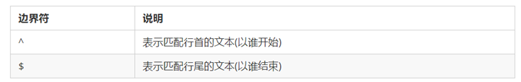

- 如果 ^ 和 $ 在一起，表示必须是精确匹配。

#### **3.3** **字符类**

- 字符类表示有一系列字符可供选择，只要匹配其中一个就可以了。所有可供选择的字符都放在方括号内。

1. [ ] 方括号  

```JavaScript
   /[abc]/.test('andy')     // true 
```

- 后面的字符串只要包含 abc 中任意一个字符，都返回 true 。

2. [-] 方括号内部 范围符-  

```JavaScript
   /^[a-z]$/.test('c')     // true
```

- 方括号内部加上 - 表示范围，这里表示 a 到 z 26个英文字母都可以。

3. [^] 方括号内部 取反符^  

```JavaScript
   /[^abc]/.test('andy')     // false
```

- 方括号内部加上 ^ 表示取反，只要包含方括号内的字符，都返回 false 。

- 注意和边界符 ^ 区别，边界符写到方括号外面。 

4.  字符组合

```javascript
   /[a-z1-9]/.test('andy')     // true
```

- 方括号内部可以使用字符组合，这里表示包含 a 到 z 的26个英文字母和 1 到 9 的数字都可以。

#### **3.4** **量词符**

- 量词符用来设定某个模式出现的次数。

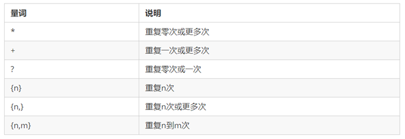

#### **3.5** **括号总结**

1. 大括号 量词符.  里面表示重复次数

2. 中括号 字符集合。匹配方括号中的任意字符. 

3. 小括号 表示优先级

- 可以在线测试: https://c.runoob.com/

#### **3.6** **预定义类**

- 预定义类指的是某些常见模式的简写方式。


### **4、** **正则表达式中的替换**

#### **4.1 replace** **替换**

- replace() 方法可以实现替换字符串操作，用来替换的参数可以是一个字符串或是一个正则表达式。

```JavaScript
   stringObject.replace(regexp/substr,replacement)
```

1. 第一个参数:  被替换的字符串 或者 正则表达式

2. 第二个参数:  替换为的字符串

3. 返回值是一个替换完毕的新字符串

#### **4.2** **正则表达式**参数

```JavaScript
   /表达式/[switch]
```

- switch(也称为修饰符) 按照什么样的模式来匹配. 有三种值：

  g：全局匹配 

  i：忽略大小写 

  gi：全局匹配 + 忽略大小写

## **ES6**

### 1、 **ES6** **简介**

#### 1.1**什么是** **ES6 ?**

- ES 的全称是 ECMAScript , 它是由 ECMA 国际标准化组织,制定的一项脚本语言的标准化规范。

| **年份**  | **版本** |
| --------- | -------- |
| 2015年6月 | ES2015   |
| 2016年6月 | ES2016   |
| 2017年6月 | ES2017   |
| 2018年6月 | ES2018   |
| …         | …        |

- ES6 实际上是一个泛指，泛指 ES2015 及后续的版本。 

#### 1.2 **为什么使用** **ES6 ?**

- 每一次标准的诞生都意味着语言的完善，功能的加强。JavaScript语言本身也有一些令人不满意的地方。

- 变量提升特性增加了程序运行时的不可预测性

- 语法过于松散，实现相同的功能，不同的人可能会写出不同的代码

### 2、 **ES6** **的新增语法**

#### 2.1 **let**

- ES6中新增的用于声明变量的关键字。

- let声明的变量只在所处于的块级有效

```JavaScript
 if (true) { 
     let a = 10;
 }
 console.log(a) // a is not defined
```

- 注意：使用let关键字声明的变量才具有块级作用域，使用var声明的变量不具备块级作用域特性。

- 不存在变量提升

```javascript
console.log(a); // a is not defined 
let a = 20;
```

- 暂时性死区

```javascript
var tmp = 123;
 if (true) { 
     tmp = 'abc';
     let tmp; 
 } 
```

- 经典面试题

```javascript
var arr = [];
 for (var i = 0; i < 2; i++) {
     arr[i] = function () {
         console.log(i); 
     }
 }
 arr[0]();
 arr[1]();
```


- 经典面试题图解：此题的关键点在于变量i是全局的，函数执行时输出的都是全局作用域下的i值。

```javascript
let arr = [];
 for (let i = 0; i < 2; i++) {
     arr[i] = function () {
         console.log(i); 
     }
 }
 arr[0]();
 arr[1]();
```


- 经典面试题图解：此题的关键点在于每次循环都会产生一个块级作用域，每个块级作用域中的变量都是不同的，函数执行时输出的是自己上一级（循环产生的块级作用域）作用域下的i值.

#### 2.2 **const**

- 作用：声明常量，常量就是值（内存地址）不能变化的量。

- 具有块级作用域

```javascript
 if (true) { 
     const a = 10;
 }
 console.log(a) // a is not defined
```

- 声明常量时必须赋值

```javascript
const PI; // Missing initializer in const declaration
```

- 常量赋值后，值不能修改。

```javascript
 const PI = 3.14;
 PI = 100; // Assignment to constant variable. 
```

```javascript
 const ary = [100, 200];
 ary[0] = 'a'; ary[1] = 'b';
 console.log(ary); // ['a', 'b']; 
 ary = ['a', 'b']; // Assignment to constant variable.
```

#### 2. 3 **let**、**const**、**var** **的区别**

1. 使用 var 声明的变量，其作用域为该语句所在的函数内，且存在变量提升现象。

2. 使用 let 声明的变量，其作用域为该语句所在的代码块内，不存在变量提升。

3. 使用 const 声明的是常量，在后面出现的代码中不能再修改该常量的值。

| **var**      | **let**        | **const**      |
| ------------ | -------------- | -------------- |
| 函数级作用域 | 块级作用域     | 块级作用域     |
| 变量提升     | 不存在变量提升 | 不存在变量提升 |
| 值可更改     | 值可更改       | 值不可更改     |

#### 2.4 解构赋值

- ES6中允许从数组中提取值，按照对应位置，对变量赋值。对象也可以实现解构。

- 数组解构

```javascript
let [a, b, c] = [1, 2, 3];
 console.log(a)
 console.log(b)
 console.log(c) 
```

- 如果解构不成功，变量的值为undefined。

```javascript
 let [foo] = [];
 let [bar, foo] = [1];
```

- 对象解构

```javascript
 let person = { name: 'zhangsan', age: 20 }; 
 let { name, age } = person;
 console.log(name); // 'zhangsan' 
 console.log(age); // 20
```

```javascript
 let {name: myName, age: myAge} = person; // myName myAge 属于别名
 console.log(myName); // 'zhangsan' 
 console.log(myAge); // 20
```

#### 2.5 **箭头函数**

- ES6中新增的定义函数的方式。

```javascript
() => {} 
const fn = () => {}
```

- 函数体中只有一句代码，且代码的执行结果就是返回值，可以省略大括号

```javascript
 function sum(num1, num2) { 
     return num1 + num2; 
 }
 const sum = (num1, num2) => num1 + num2; 
```

- 如果形参只有一个，可以省略小括号

```javascript
 function fn (v) {
     return v;
 } 
 const fn = v => v;
```

- 箭头函数不绑定this关键字，箭头函数中的this，指向的是函数定义位置的上下文this。

```javascript
 const obj = { name: '张三'} 
 function fn () { 
     console.log(this);
     return () => { 
         console.log(this)
     } 
 } 
 const resFn = fn.call(obj); 
 resFn();
```

#### 2.6 **剩余参数**

- 剩余参数语法允许我们将一个不定数量的参数表示为一个数组。

```javascript
function sum (first, ...args) {
     console.log(first); // 10
     console.log(args); // [20, 30] 
 }
 sum(10, 20, 30)
```

- 剩余参数和解构配合使用

```JavaScript
 let students = ['wangwu', 'zhangsan', 'lisi'];
 let [s1, ...s2] = students; 
 console.log(s1);  // 'wangwu' 
 console.log(s2);  // ['zhangsan', 'lisi']
```

### 3、**ES6** **的内置对象扩展**

#### 3.1 **Array** **的扩展方法**

- **扩展运算符（展开语法）**
- 扩展运算符可以将数组或者对象转为用逗号分隔的参数序列。

```JavaScript
 let ary = [1, 2, 3];
 ...ary  // 1, 2, 3
 console.log(...ary);    // 1 2 3
 console.log(1, 2, 3)
```

- 扩展运算符可以应用于合并数组。

```JavaScript
// 方法一 
 let ary1 = [1, 2, 3]; let ary2 = [3, 4, 5];
 let ary3 = [...ary1, ...ary2];
 // 方法二 
 ary1.push(...ary2);
```

- 将类数组或可遍历对象转换为真正的数组

```JavaScript
let oDivs = document.getElementsByTagName('div'); 
oDivs = [...oDivs];
```

- **构造函数方法：**Array.from**()**

- 将类数组或可遍历对象转换为真正的数组

```JavaScript
let arrayLike = {
    '0': 'a',
    '1': 'b',
    '2': 'c',
    length: 3
}; 
let arr2 = Array.from(arrayLike); // ['a', 'b', 'c']
```

- 方法还可以接受第二个参数，作用类似于数组的map方法，用来对每个元素进行处理，将处理后的值放入返回的数组。

```JavaScript
 let arrayLike = { 
     "0": 1,
     "1": 2,
     "length": 2
 }
 let newAry = Array.from(aryLike, item => item *2)
```

- **实例方法：**find()
- 用于找出第一个符合条件的数组成员，如果没有找到返回undefined

```JavaScript
 let ary = [{
     id: 1,
     name: '张三‘
 }, { 
     id: 2,
     name: '李四‘
 }]; 
 let target = ary.find((item, index) => item.id == 2);
```

- **实例方法：**findIndex()
- 用于找出第一个符合条件的数组成员的位置，如果没有找到返回-1

```javascript
let ary = [1, 5, 10, 15];
let index = ary.findIndex((value, index) => value > 9); 
console.log(index); // 2
```

- **实例方法：**includes()

- 表示某个数组是否包含给定的值，返回布尔值。

```javascript
[1, 2, 3].includes(2) // true 
[1, 2, 3].includes(4) // false
```

#### 3.2 **String** **的扩展方法**

- **模板字符串**
- ES6新增的创建字符串的方式，使用反引号定义。

```javascript
 let name = `zhangsan`;
```

- 模板字符串中可以解析变量。

```javascript
 let name = '张三'; 
 let sayHello = `hello,my name is ${name}`; // hello, my name is zhangsan
```

- 模板字符串中可以换行

```javascript
let result = { 
     name: 'zhangsan', 
     age: 20,      sex: '男' 
 } 
 let html = ` <div>
     <span>${result.name}</span>
     <span>${result.age}</span>
     <span>${result.sex}</span>
 </div> `;
```

- 在模板字符串中可以调用函数。

```javascript
 const sayHello = function () { 
    return '哈哈哈哈 追不到我吧 我就是这么强大';
 }; 
 let greet = `${sayHello()} 哈哈哈哈`;  console.log(greet); // 哈哈哈哈 追不到我吧 我就是这么强大 哈哈哈哈
```

- **实例方法：startsWith**() **和** **endsWith**()

- startsWith()：表示参数字符串是否在原字符串的头部，返回布尔值

- endsWith()：表示参数字符串是否在原字符串的尾部，返回布尔值

```javascript
 let str = 'Hello world!';
 str.startsWith('Hello') // true 
 str.endsWith('!')       // true
```

- **实例方法：**repeat()

- repeat方法表示将原字符串重复n次，返回一个新字符串。

```javascript
'x'.repeat(3)      // "xxx" 
'hello'.repeat(2)  // "hellohello"
```

#### 3.3 **Set** **数据结构**

- ES6 提供了新的数据结构 Set。它类似于数组，但是成员的值都是唯一的，没有重复的值。
- Set本身是一个构造函数，用来生成 Set 数据结构。

```javascript
const s = new Set();
```

- Set函数可以接受一个数组作为参数，用来初始化。

```javascript
const set = new Set([1, 2, 3, 4, 4]);
```

- **实例方法**

  add(value)：添加某个值，返回 Set 结构本身

  delete(value)：删除某个值，返回一个布尔值，表示删除是否成功

  has(value)：返回一个布尔值，表示该值是否为 Set 的成员

  clear()：清除所有成员，没有返回值

```javascript
 const s = new Set();
 s.add(1).add(2).add(3); // 向 set 结构中添加值 
 s.delete(2)             // 删除 set 结构中的2值 
 s.has(1)                // 表示 set 结构中是否有1这个值 返回布尔值 
 s.clear()               // 清除 set 结构中的所有值
```

- **遍历**
- Set 结构的实例与数组一样，也拥有forEach方法，用于对每个成员执行某种操作，没有返回值。

```javascript
s.forEach(value => console.log(value))
```


------


# ES6

### 1.块级作用域-let和var

 - var的设计可以看成JavaScript语言设计上的错误，但这样的错误多半不能修复和移除，因为需要向后兼容
 - 可以将let看成更完美的var
 - 块级作用域
   - JS中使用var来声明一个变量时，变量的作用域主要与函数的定义有关
   - 针对其他块定义来说是没有作用域的，比如if/for等，这在开发中会引起一些问题

```html
<!DOCTYPE html>
<html lang="en">
<head>
  <meta charset="UTF-8">
  <title>块级作用域</title>
</head>
<body>
<button>按钮0</button>
<button>按钮1</button>
<button>按钮2</button>
<script>

  //ES5语法，没有块级作用域，只有函数的作用域，无论点击哪个按钮都是按钮2，因为i改变了，类似于全局变量
  // var btns = document.getElementsByTagName("button");
  // for(var i = 0;i<btns.length;i++){
  //   btns[i].addEventListener("click", function () {
  //     console.log("第" + i + "个按钮被点击了")
  //   })
  // }

  //闭包，利用了ES5的函数作用域来解决没有块级作用域的问题
  // var btns = document.getElementsByTagName("button");
  // for(var i = 0;i<btns.length;i++){
  //   (function(i){
  //     btns[i].addEventListener("click", function () {
  //       console.log("第" + i + "个按钮被点击了")
  //     })
  //   })(i)
  // }
  //ES6语法，使用let代替var，let有块级作用域
  let btns = document.getElementsByTagName("button");
  for(let i = 0;i<btns.length;i++){
    btns[i].addEventListener("click", function () {
      console.log("第" + i + "个按钮被点击了")
    })
  }
</script>
</body>
</html>
```

 - 程序分析
   ES5语法：var定义变量
   
   
   ES5语法：var定义变量，采用闭包来解决
   
   
   ES6语法，采用let来定义变量
   
   

### 2.const

 - const关键字
   - 在很多语言中已存在，主要的作用是将某个变量修饰为常量
   - 在JavaScript中使用const修饰的标识符为常量，不可以再次赋值
 - 当修饰的标识符不会被再次赋值时，就可以使用const来保证数据的安全性
 - 建议：在ES6开发中，优先使用const，只有需要改变某一标识符的时候才使用let
 - const的注意：
   - 注意一：被const修饰的变量可以看作一个常量，一旦定义了就不能修改，类似于final
   - 注意二：const修饰变量时一定要赋初始值
   - 注意三：const修饰的对象不能改变，但是对象内部的属性可以修改

```html
<!DOCTYPE html>
<html lang="en">
<head>
  <meta charset="UTF-8">
  <title>const</title>
</head>
<body>

</body>
<script>
  //1.被const修饰的变量可以看作一个常量，一旦定义了就不能修改，类似于final
  // const name = 'hahha';
  // name = 'kkk'

  //2.const修饰变量时一定要赋初始值
  //const name ;

  //3.const修饰的对象不能改变，但是对象内部的属性可以修改
  const object = {
    name : 'hh',
    age: 12,
    height: 188
  }
  object.name = 'jj'
  object.age = 10
  object.height = 185
</script>
</html>
```

### 3.变量解构赋值

- ES6允许按照一定模式从数组和对象中提取值，对变量进行赋值，这称为解构赋值
- 数组的解构

```javascript
<script>
  const name = ['张三','李四','王五','秦六']
  let [zhang,li,wang,qin] = name
  console.log(zhang);
  console.log(li);
  console.log(wang);
  console.log(qin);
</script>
```


- 对象的解构

```javascript
<script>
  //对象的解构
  const zhang = {
    name:'张三',
    age:18,
    call:function () {
      console.log("我叫张三");
    }
  }

  let {name,age,call} = zhang

  console.log(name);
  console.log(age);
  call()
</script>
```


### 4.模板字符串

- ES6引入了新的声明字符串的方式，ES5是采用双引号（" "），单引号（''），来声明字符串的，但这样有一个弊端，就是不能换行，如果我声明的是一串HTML代码，那么不换行的话，很难阅读，而采取换行需要使用字符串拼接，ES6引入了反引号（``）这个完美解决了换行的问题

```javascript
<script>
  //声明
  let string = `字符串`
  console.log(string,typeof string);

  //内容可以直接换行
  let str = `<ul>
              <li>zhangsan</li>
              <li>lisi</li>
              <li>wangwu</li>
             </ul>`

  //变量拼接
  let name = '张三'
  let out = `${name}是法外狂徒`

  console.log(out);
</script>
```


### 5.对象字面变量的增强写法

```html
<!DOCTYPE html>
<html lang="en">
<head>
  <meta charset="UTF-8">
  <title>增强写法</title>
</head>
<body>

</body>
<script>
  const name = 'jj'
  const age = 15
  const height = 188

//  ES5写法
//   const obj = {
//     name: name,
//     age: age,
//     height: height
//   }

//  ES6写法
  const obj = {
    name,
    age,
    height
  }
  console.log(obj)

  //函数的增强写法
  //ES5
  const object = {
    run:function () {

    }
  }
  //ES6增强写法
  const object = {
    run() {

    }
  }
</script>
</html>
```

### 6.箭头函数的使用和this指向

#### （1）基本使用

```html
<!DOCTYPE html>
<html lang="en">
<head>
  <meta charset="UTF-8">
  <title>箭头函数的基本使用</title>
</head>
<body>
<script>
  //箭头函数：也是一直定义函数的方式
  //1.定义函数的方式：function
  const aaa = function () {

  }
  //2.对象字面量中定义函数
  const obj = {
    aaa(){

    }
  }
  //3.ES6中的箭头函数
  // const aaa = (参数列表) => {
  //
  // }
  //无参数时
  const ccc = () => {

  }
</script>
</body>
</html>
```

#### （2）参数和返回值

```html
<!DOCTYPE html>
<html lang="en">
<head>
  <meta charset="UTF-8">
  <title>箭头函数参数和返回值</title>
</head>
<body>
<script>
  //1.参数问题
  //两个参数
  const sum = (num1,num2) => {
    return num1 + num2
  }
  //一个参数(可以把括号省略)
  const power = num => {
    return num * num
  }
   //2.返回值
  //函数代码块中有多行代码
  const test = () => {
    console.log('hello world');
    console.log('hello vue');
  }
  //函数代码块中只有一行代码
  const mul = (num1,num2) => num1 * num2//自动返回结果
  //没有返回值，打印demo的结果时为undefined，调用demo时打印hello world
  const demo = () => console.log('hello world');
</script>
</body>
</html>
```

#### （3）this的使用

```html
<!DOCTYPE html>
<html lang="en">
<head>
  <meta charset="UTF-8">
  <title>箭头函数中this的使用</title>
</head>
<body>
<script>
  //什么时候使用箭头函数，一般是作为其他函数的参数时使用
  setTimeout(function () {
    console.log(this) //这时打印的是window
  },1000)
  setTimeout(() => {
    console.log(this) //这时打印的是window
  },1000)

  //问题：箭头函数的this是如何查找的？
  //答案：向外层作用域中，一层一层查早this，直到有this的定义
  const obj = {
    aaa(){
      setTimeout(function () {
        console.log(this) //这时打印的是window
        setTimeout(function () {
          console.log(this) //这时打印的是window
        },1000)
        setTimeout(() => {
          console.log(this) //这时打印的是window，查找到最外层的setTimeout时发现有this的定义，指向的是window
        },1000)
      },1000)
      setTimeout(() => {
        console.log(this) //这时打印的是Obj对象，查找到aaa时发现有this的定义
      },1000)
    }
  }
</script>
</body>
</html>
```

### 7.函数参数的默认值设置

- ES6允许给函数的参数赋初始值

```javascript
<script>
  //形参(一般具有默认值的参数要放在后面)
  function add(a,b,c = 10) {
    return a + b + c
  }

  console.log(add(1, 2));
  console.log(add(1, 2, 3));

  //与解构赋值结合
  function connect({host = '127.0.0.1',user,password,port}) {
    console.log(host);
    console.log(user);
    console.log(password);
    console.log(port);
  }

  connect ({
    host : 'localhost',
    user:'root',
    password:'root',
    port:'3306'
  })
</script>
```


### 8.rest参数

- ES6引入rest参数，用于获取函数的实参，用来代替argument

```javascript
<script>
  //ES5获取实参的方式
  function name() {
    console.log(arguments);
  }
  name('张三','李四','王五')

  //ES6rest参数
  function name1(...args) {
    console.log(args);
  }
  name1('张三','李四','王五')
  
  //rest参数必须放到最后
  function fn(a,b,...args) {
    console.log(a);
    console.log(b);
    console.log(args);
  }
  fn(1,2,3,4,5)
</script>
```


### 9.扩展运算符

- ... 扩展运算符能将数组转换为逗号分隔的参数序列

```javascript
<script>
  const name = ['张三','李四','王五']

  function kuangtu() {
    console.log(arguments);
  }

  kuangtu(name)
  kuangtu(...name)//这样相当于kuangtu('张三','李四','王五')
</script>
```


- 扩展运算符的应用

```javascript
<script>
  //数组的合并
  const name = ['张三','李四']
  const name1 = ['王五','秦六']
  const kuangtu = name.concat(name1)
  const kuangtu1 = [...name,...name1]

  console.log(kuangtu);
  console.log(kuangtu1);

  //数组的克隆
  const letter = ['a','b','c']
  const colonletter = [...letter]
  console.log(colonletter);

  //将伪数组转换为真正的数组
  const divs = document.querySelectorAll('div')
  console.log(divs);

  const divArrs = [...divs]
  console.log(divArrs);
</script>
```


### 10.symbol

#### （1）Symbol介绍与创建

- ES6引入了一种新的原始数据类型Symbol，表示独一无二的值。它是JavaScript语言的第七种数据类型，是一种类似于字符串的数据类型。
- Symbol特点
  - Symbol 的值是唯一的，用来解决命名冲突的问题
  - Symbol值不能与其他数据进行运算
  - Symbol定义的对象属性不能使用for...in循环遍历，但是可以使用Reflect.ownKeys来获取对象的所有键名

```javascript
<script>
  //创建一个symbol
  let s = Symbol()
  console.log(s);

  let s1 = Symbol("张三")
  let s2 = Symbol("张三")
  //s1与s2并不一样
  console.log(s1 === s2);
  //Symbol.for创建
  let s3 = Symbol.for("张三")
  let s4 = Symbol.for("张三")
  //s3与s4一样
  console.log(s3 === s4);

  //不能与其他数据运算
  // let result = s + 10
  // let result = s > 10
  // let result = s + "10"
</script>
```

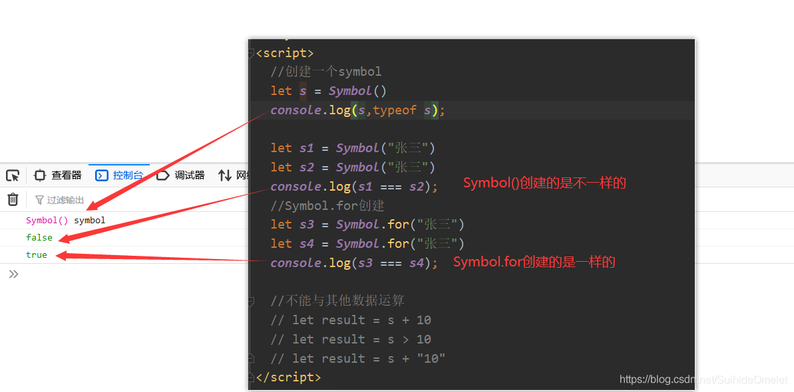

#### （2）对象添加Symbol类型属性和方法

- 在不知道对象中是否存在同名的方法，而又不想去改变原对象的同名方法，可以使用Symbol安全地给对象添加相应的方法

```javascript
<script>
  let game = {
    name:'游戏',
    up(){
      console.log('上升');
    },
    down(){
      console.log('下降');
    }
  }

  let methods = {
    up:Symbol(),
    down:Symbol()
  }
  game[methods.up] = function() {
    console.log('我可以上升');
  }
  game[methods.down] = function () {
    console.log('我可以下降');
  }

  console.log(game)
  
  let game1 = {
    name:'游戏',
    [Symbol("up")] : function() {
      console.log('上升');
    },
    [Symbol("down")] : function () {
      console.log('下降');
    }
  }

  console.log(game1);
</script>
```


#### （3）Symbol的内置属性

- 除了定义自己使用的Symbol值以外，ES6还提供了11个内置的Symbol值，指向语言内部使用的方法。

| Symbol.hasInstance        | 当其他对象使用instanceof运算符，判断是否为该对象的实例时，会调用这个方法 |
| ------------------------- | ------------------------------------------------------------ |
| Symbol.isConcatSpreadable | 对象的 Symbol.isConcatSpreadable 属性等于的是一个布尔值，表示该对象用于Array.prototype.concat()时，是否可以展开。 |
| Symbol.unscopables        | 该对象指定了使用with关键字时，哪些属性会被with环境排除。     |
| Symbol.match              | 当执行str.match(myObject)时，如果该属性存在，会调用它，返回该方法的返回值。 |
| Symbol.replace            | 当该对象被str.replace(myObject)方法调用时，会返回该方法的返回值。 |
| Symbol.search             | 当该对象被str. search (myObject)方法调用时，会返回该方法的返回值。 |
| Symbol.split              | 当该对象被str. split (myObject)方法调用时，会返回该方法的返回值。 |
| Symbol.iterator           | 对象进行 for...of循环时，会调用Symbol.iterator 方法,返回该对象的默认遍历器 |
| Symbol.toPrimitive        | 该对象被转为原始类型的值时，会调用这个方法，返回该对象对应的原始类型值。 |
| Symbol. toStringTag       | 在该对象上面调用toString方法时，返回该方法的返回值           |
| Symbol.species            | 创建衍生对象时，会使用该属性                                 |

### 11.迭代器

#### （1）迭代器介绍

- 迭代器(terator)是一种接口，为各种不同的数据结构提供统一的访问机制。任何数据结构只要部署lterator接口，就可以完成遍历操作。
- ES6 创造了一种新的遍历命令 for...of循环，lterator接口主要供 for..of 消费
- 原生具备iterator接口的数据(可用for..of遍历)
  - Array
    Arguments
    Set
    Map
    string
    TypedArray
    NodeList
- 原理
  - 创建一个指针对象，指向当前数据结构的起始位置
  - 第一次调用对象的next方法，指针自动指向数据结构的第一个成员
  - 接下来不断调用next方法，指针一直往后移动，直到指向最后一个成员
  - 每调用next方法返回一个包含value 和l done 属性的对象
  - 注:需要自定义遍历数据的时候，要想到迭代器。

```javascript
<script>
  const name = ['张三','李四','王五','秦六']

  for(let i of name){
    console.log(i)
  }

  for ( let i in name){
    console.log(i);
  }

  let iterator = name[Symbol.iterator]()
  console.log(iterator);
  console.log(iterator.next());
  console.log(iterator.next());
  console.log(iterator.next());
  console.log(iterator.next());
  console.log(iterator.next());
</script>
```


#### （2）迭代器自定义数据遍历

```javascript
<script>
  //遍历自定义数据
  const Class = {
    name : '法外狂徒',
    members : [
        "zhangsan",
        "lisi",
        "wangwu",
        "qinliu"
    ],
    [Symbol.iterator](){
      let index = 0
      let _this = this
      return{
        next:function () {
          if(index < _this.members.length) {
            const result = {value:_this.members[index],done:false}
            index++
            return result
          }
          else {
            return {value: undefined,done: true}
          }
        }
      }
    }
  }
  for(let i of Class){
    console.log(i);
  }
</script>
```


### 12.生成器

#### （1）生成器函数声明与调用

- 生成器函数是ES6提供的一种异步编程解决方案,语法行为与传统函数完全不同

```javascript
<script>
  //生成器函数声明
  function * a() {
    console.log('111');
  }
   let iterator = a()
  iterator.next()

  //嵌套yield,yield可以看作函数代码的分隔符
  function * b() {
    console.log("第一")
    yield '111';
    console.log("第二")
    yield '222';
    console.log("第三")
    yield '333';
  }

  let iterator1 = b()
  iterator1.next()
  iterator1.next()
  iterator1.next()
  
  for(let i of b()){
    console.log(i);
  }

</script>
```


####  （2）生成器函数的参数传递

```javascript
<script>
function * a(arg) {
    console.log(arg);
    let one = yield '111'
    console.log(one);
    let two = yield '222'
    console.log(two);
    let three = yield '333'
    console.log(three);
  }

  let iterator = a("AAA")
  console.log(iterator.next());
  console.log(iterator.next("BBB"));
  console.log(iterator.next("CCC"));
  console.log(iterator.next("DDD"));
</script>
```


#### （3）生成器函数实例（解决异步编程，回调地狱的问题）

```javascript
<script>
//实例
  //1s后输出111，2s后输出222，3s后输出333
  function one() {
    setTimeout(()=>{
      console.log('111');
      iterator.next()
    },1000)
  }

  function two() {
    setTimeout(()=>{
      console.log('222');
      iterator.next()
    },2000)
  }

  function three() {
    setTimeout(()=>{
      console.log('333');
      iterator.next()
    },3000)
  }

  function * gen() {
    yield one()
    yield two()
    yield three()
  }

  let iterator = gen()
  iterator.next()
  </script>
```


### 13.Promise

#### （1）Promise的介绍和基本使用

######  1）什么是Promise

- ES6中一个非常重要和好用的特性就是Promise
- Promise到底是做什么的呢?
  - Promise是异步编程的一种解决方案。
- 那什么时候会来处理异步事件呢?
  - 一种很常见的场景应该就是网络请求了。
  - 封装一个网络请求的函数，因为不能立即拿到结果，所以不能像简单的3+4=7一样将结果返回。
  - 所以往往会传入另外一个函数，在数据请求成功时，将数据通过传入的函数回调出去。
  - 如果只是一个简单的网络请求，那么这种方案不会给我们带来很大的麻烦。
- 但是，当网络请求非常复杂时，就会出现回调地狱。

###### 2）网络请求的回调地狱

- 考虑下面的场景(有夸张的成分):
  - 通过一个url1从服务器加载一个数据data1 , data1中包含了下一个请求的url2
  - 通过data1取出url2，从服务器加载数据data2,data2中包含了下一个请求的url3
  - 通过data2取出url3，从服务器加载数据data3 ,data3中包含了下一个请求的url4
  - 发送网络请求url4，获取最终的数据data4

```javascript
$.ajax( 'url1', function (data1) {
	$.ajax(data1 ['url2 '], function (data2){
		$.ajax(data2 ['url3']，function (data3){
			$.ajax(data3 ['url4'],function (data4){
				console.log(data4);
			})
		})
	})
})

```

- 上面的代码有什么问题吗?
  - 正常情况下，不会有什么问题，可以正常运行并且获取想要的结果。
  - 但是，这样的代码难看而且不容易维护。
  - 我们更加期望的是一种更加优雅的方式来进行这种异步操作。
- 如何做呢?就是使用Promise。
  - Promise可以以一种非常优雅的方式来解决这个问题。

###### 3）定时器的异步事件

- 用一个定时器来模拟异步事件:
  - 假设下面的data是从网络上1秒后请求的数据
  - console.log就是我们的处理方式。

```javascript
  setTimeout(()=>{
    let data1 = 'Hello World'
    console.log(data1);
    setTimeout(() =>{
    	let data2 = 'Hello Vuejs'
    	console.log(data2);
    },1000)
  },1000
```

- 这是过去的处理方式，将它换成Promise代码

```javascript
  //resolve,reject作为Promise的参数
  //resolve,reject本身也是函数
  new Promise((resolve ,reject)=>{
  //第一次网络请求
    setTimeout(()=>{
      resolve('Hello World')
      reject('error')
    },1000)
  }).then( data =>{
  //第一次处理
    console.log(data);
    //第二次网络请求
    return new Promise((resolve ,reject)=>{
		setTimeout(()=>{
			 resolve('Hello Vuejs')
    	},1000)
	}).then( data =>{
  		//第二次处理
    	console.log(data);
    })
  }).catch( error =>{
  //错误处理
    console.log(error);
  })
```

#### （2）Promise的三种状态

- 首先,当开发中有异步操作时,就可以给异步操作包装一个Promise
- 异步操作之后会有三种状态:
  - pending :等待状态，比如正在进行网络请求，或者定时器没有到时间。
  - fulfill :满足状态，当主动回调了resolve时，就处于该状态，并且会回调.then()
  - reject:拒绝状态，当主动回调了reject时，就处于该状态，并且会回调.catch()
- Promise的另外一种写法：
- catch中的内容可以写在then中

```javascript
 new Promise((resolve ,reject)=>{
    //第一次网络请求
    setTimeout(()=>{
      resolve('Hello World')
      reject('error')
    },1000)
  }).then( data =>{
    //第一次处理
    console.log(data);
    //第二次网络请求
    return new Promise((resolve ,reject)=>{
      setTimeout(()=>{
        resolve('Hello Vuejs')
      },1000)
    }).then( data => {
      //第二次处理
      console.log(data);
    })
  },error =>{
    //错误处理
    console.log(error);
  })
```

#### （3）Promise的链式调用

- 无论是then还是catch都可以返回一个Promise对象。
- 所以，代码其实是可以进行链式调用的:
- 这里直接通过Promise包装了一下新的数据，将Promise对象返回了
  - Promise.resovle():将数据包装成Promise对象，并且在内部回调resolve()函数
  - Promise.reject():将数据包装成Promise对象，并且在内部回调reject()函数

```javascript
  // 链式调用的代码
  new Promise( (resolve,reject) =>{
    setTimeout( function() {
      resolve( 'Hello World ' )
    },1000)
  }).then(data => {
    console.log(data);//=>Hello World
    return new Promise(resolve => {
      resolve(data + '111')
    })
  }).then( data => {
    console.log(data);// => Hello World111
    return new Promise(resolve => {
      resolve(data + '222')
    })
  }).then(data => {
    console.log(data);//=>Hello World111222
    return new Promise((resolve,reject) => {
      reject(data + 'error')
    })
  }).then(data => {
    console.log(data);// 这里没有输出,这部分代码不会执行
    return new Promise(resolve => {
      resolve(data + '333')
    })
  }).catch(data => {
    console.log(data);// =→>Hello world111222error
    return new Promise(resolve => {
      resolve(data + '444')
    })
  }).then(data => {
    console.log(data);//=> Hello World111222error444
  })
```

- 简写一

```javascript
//简写一
  new Promise( (resolve,reject) =>{
    setTimeout( function() {
      resolve( 'Hello World ' )
    },1000)
  }).then(data => {
    console.log(data);//=>Hello World
    return Promise.resolve(data + '111')
  }).then(data => {
    console.log(data);// => Hello World111
    return Promise.resolve(data + '222 ')
  }).then(data => {
    console.log(data);//=>Hello World111222
    return Promise.reject(data + 'error ')
  }).then(data => {
    console.log(data);// 这里没有输出,这部分代码不会执行
    return Promise.resolve(data + '333 ')
  }).catch(data => {
    console.log(data);// =→>Hello world111222error
    return Promise.resolve(data + '444')
  }).then(data => {
    console.log(data);//=> Hello World111222error444
  })
```

- 简写二

```javascript
//简写二
  new Promise( (resolve,reject) =>{
    setTimeout( function() {
      resolve( 'Hello World ' )
    },1000)
  }).then(data => {
    console.log(data);//=>Hello World
    return data + '111'
  }).then(data => {
    console.log(data);// => Hello World111
    return data + '222 '
  }).then(data => {
    console.log(data);//=>Hello World111222
    throw data + 'error'
  }).then(data => {
    console.log(data);// 这里没有输出,这部分代码不会执行
    return data + '333'
  }).catch(data => {
    console.log(data);// =→>Hello world111222error
    return data + '444'
  }).then(data => {
    console.log(data);//=> Hello World111222error444
  })
```

#### （4）Promise的all方法的使用

- all方法可以等待在其内部的所有请求都返回结果后全部获取出来

```javascript
  Promise.all([
    new Promise((resolve,reject)=>{
      setTimeout(()=>{
        resolve({name:'zhangsan',age:18})
      },2000)
    }),
    new Promise((resolve,reject)=>{
        resolve({name:'lisi',age:19})
    },1000)
  ]).then( result =>{
    console.log(result);
  })
```

- 运行截图
  

### 14.集合Set

#### （1）集合介绍

- ES6提供了新的数据结构Set(集合)。它类似于数组，但成员的值都是唯一的，集合实现了iterator接口，所以可以使用扩展运算和for..of进行遍历，集合的属性和方法:
  - size返回集合的元素个数
  - add增加一个新元素，返回当前集合
  - delete删除元素，返回boolean值
  - has检测集合中是否包含某个元素，返回boolean值
  - clear清空集合，返回undefined

```javascript
<script>
  //声明一个集合
  let s = new Set
  let s1  = new Set(['111','222','333'])

  console.log(s1.size);
  s1.add('444')
  console.log(s1);
  s1.delete('444')
  console.log(s1);
  console.log(s1.has('111'));

  for (let i of s1){
    console.log(i);
  }
  s1.clear()
  console.log(s1);
</script>
```


#### （2）集合实践

```javascript
<script>
  const arr = [1,1,2,3,3,4,5,5,6]
  //去重
  let one = [...new Set(arr)]
  console.log(one);
  //交集
  const arr2 = [4,5,6,7,8]
  let two = [...new Set(arr)].filter(item =>{
    let s2 = new Set(arr2)
    if(s2.has(item)){
      return true
    }else
      return false
  })
  console.log(two);
  //并集
  let three = [...new Set([...arr,...arr2])]
  console.log(three);
  //差集
  let four = [...new Set(arr)].filter(item =>{
    let s2 = new Set(arr2)
    if(!s2.has(item)){
      return true
    }else
      return false
  })
  console.log(four);
</script>
```


### 15.Map

- ES6提供了Map数据结构。它类似于对象，也是键值对的集合。但是“键”的范围不限于字符串，各种类型的值（包括对象）都可以当作键。Map也实现了iterator接口，所以可以使用扩展运算符和for..of进行遍历。Map的属性和方法:
  -  size返回Map的元素个数
  -  set增加一个新元素，返回当前Map
  -  get返回键名对象的键值
  -  has检测 Map中是否包含某个元素，返回 boolean值
  -  clear清空Map，返回undefined

```javascript
<script>
  let m = new Map

  m.set('name','zhangsan')
  m.set('eat',function () {
    console.log('吃饭')
  })
  let key = {
    province : '省份'
  }
  m.set(key,["北京","天津","河北"])

  comsole.log(m);
  console.log(m.size);
  console.log(m.get('name'));
  console.log(m.get(key));

  m.delete('name')
  console.log(m);

  // m.clear()
  // console.log(m);
</script>
```


### 16.Class

#### （1）Class介绍

- ES6提供了更接近传统语言的写法，引入了Class（类）这个概念，作为对象的模板。通过class关键字，可以定义类。基本上，ES6 的 class可以看作只是一个语法糖，它的绝大部分功能，ES5 都可以做到，新的 class 写法只是让对象原型的写法更加清晰、更像面向对象编程的语法而已。
- 知识点:
  -  class声明类
  -  constructor定义构造函数初始化
  -  extends 继承父类
  -  super调用父级构造方法
  -  static定义静态方法和属性
  -  父类方法可以重写

```javascript
<script>
  //ES5
  function Phone(brand,price) {
    this.brand = brand
    this.price = price
  }
  //添加方法
  Phone.prototype.call = function () {
    console.log('打电话');
  }
  //实例化对象
  let Huawei = new Phone("华为",4999)
  Huawei.call()
  console.log(Huawei);
  //ES6
  class TelPhone{
    //构造方法
    constructor(brand,price) {
      this.brand = brand
      this.price = price
    }
    call(){
      console.log('打电话');
    }
  }
  let onePlus = new TelPhone("一加",3999)
  onePlus.call()
  console.log(onePlus);
</script>
```

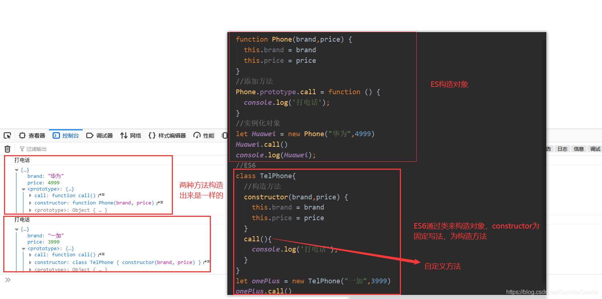

#### （2）静态成员

- 静态成员的意思是，变量或者函数是属于这个类的，而不属于实例对象，所以实例对象并不能使用它们

```javascript
<script>
  //ES5
  function Phone() {
  }
  Phone.name = '手机'
  Phone.call = function () {
    console.log('打电话');
  }
  Phone.prototype.size = 5.5
  let huawei = new Phone()
  console.log(huawei.name);
  console.log(huawei.size);

  //ES6
  class TelPhone{
    static name = '手机'
    static call(){
      console.log('打电话');
    }
  }
  let nokia = new TelPhone()
  console.log(nokia.name);
</script>
```


#### （3）类继承

```javascript
<script>
  class phone{
    constructor(brand,price) {
      this.brand = brand
      this.price = price
    }
  }
  class smartPhone extends phone{
    constructor(brand,price,color,size) {
      super(brand,price);
      this.color = color;
      this.size = size;
    }
    playGame(){
      console.log('玩游戏');
    }
  }
  let xiaomi = new smartPhone('小米',2000,'黑色',5.5)
  console.log(xiaomi);
  xiaomi.playGame()
</script>
```


#### （4）子类对父类方法的重写

```javascript
<script>
class phone{
    constructor(brand,price) {
      this.brand = brand
      this.price = price
    }
    call(){
      console.log('打电话');
    }
  }
  class smartPhone extends phone{
    constructor(brand,price,color,size) {
      super(brand,price);
      this.color = color;
      this.size = size;
    }
    playGame(){
      console.log('玩游戏');
    }
    call(){
      console.log('视频通话');
    }
  }
  let xiaomi = new smartPhone('小米',2000,'黑色',5.5)
  console.log(xiaomi);
  xiaomi.playGame()
  xiaomi.call()
  </script>
```


#### （5）get和set

```javascript
<script>
  class phone{
    get Price(){
      console.log('属性被读取了');
      return '1000元'
    }
    set Price(newValue){
      console.log('属性被修改了');
    }
  }
  let s = new phone()
  console.log(s.Price);
  s.Price = 'free'
</script>
```


### 17.数值扩展

```javascript
<script>
  //Number.EPSILON是JavaScript表示的最小精度
  console.log(0.1 + 0.2 === 0.3);//这样实际是不相等的
  function equal(a,b) {
    if(Math.abs(a-b) < Number.EPSILON){
      return true
    }else {
      return false
    }
  }
 //如果两者相减，精度小于Number.EPSILON，可以认为两者相等
  console.log(equal(0.1 + 0.2, 0.3));

  //进制
  //二进制
  let b = 0b1010
  //八进制
  let o = 0o777
  //十六进制
  let h = 0x100

  console.log(b);
  console.log(o);
  console.log(h);

  //Number.isFinite()检测一个数值是否为有限数,是返回true，不是返回false
  console.log(Number.isFinite(100));
  console.log(Number.isFinite(100 / 0));

  //Number.isNaN()检测一个数值是否为NaN,是返回true，不是返回false
  console.log(Number.isNaN(100));

  //Number.parseInt() Number.parseFloat(),字符串转整数,浮点数
  console.log(Number.parseInt('123aaa'));
  console.log(Number.parseFloat("1.23aaa"));

  //Number.isInteger() 判断一个数是否为整数，是返回true，不是返回false
  console.log(Number.isInteger(100.1));

  //Math.trunc(),将小数部分抹掉
  console.log(Math.trunc(1.1));

  //Math.sign(),判断一个数是否为正数，负数，或零，正数返回1，负数返回-1，零返回0
  console.log(Math.sign(-100));
  console.log(Math.sign(0));
  console.log(Math.sign(100));

</script>
```

### 18.对象方法扩展

```javascript
<script>
  // Object.is() 判断两个值是否完全相等,类似于===
  console.log(Object.is(120, 120));
  console.log(Object.is(NaN, NaN));//这样是相等的
  console.log(NaN === NaN);//这样是不等的

  //Object.assign(),对象的合并
  const info  = {
    name : 'zhangsan',
    age: 18
  }
  const info1 = {
    age:20,
    height:180
  }
  //若对象存在同名属性，后面的对象属性会将前面的对象属性覆盖
  console.log(Object.assign(info, info1));

  //Object.setPrototypeOf() 设置原型对象 Object.getPrototypeOf() 获取原型对象
  const province = {
    province: "省份"
  }
  const cites = {
    cites : ['北京','上海','南京']
  }
  Object.setPrototypeOf(province,cites)
  console.log(Object.getPrototypeOf(province));
  console.log(province);
</script>
```

### 19.ES6模块化的导入和导出

 export基本使用

  1. export指令用于导出变量，例如：

```javascript
// info.js
export let name = '张三'
export let age = 18
export let height = 1.88
```

 - 另一种写法

```javascript
// info.js
let name = '张三'
let age = 18
let height = 1.88
export (name，age，height)
```

  2.  export导出函数或类

```javascript
export function test(content) {
	console.log(content);
}
export class Person {
	constructor(name，age) {
		this.name = name ;
		this.age = age;
	}
	run(){
		console.log(this.name + "在奔跑");
	}
}
```

 - 另一种写法

```javascript
function test(content){
	console.log(content);
}
class Person {
	constructor(name, age){
		this.name = name ;
		this.age = age ;
	}
	run() {
		console.1og(this.name +"在奔跑");
	}
}
export {test，Person}
```

  3. export default

 - 某些情况下，一个模块中包含某个的功能，我们并不希望给这个功能命名，而且让导入者可以自己来命名，这个时候就可以使用export default

```javascript
// info.js
export default function o {
	console.1og ( 'default function ' );
}
```

 - 我们来到main.js中，这样使用就可以了
   这里的myFunc是自己命名的，你可以根据需要命名它对应的名字

```javascript
//mian.js
import myFunc from './info.js '
myFunc()
```

 - 另外，需要注意: export default在同一个模块中，不允许同时存在多个。

import的基本使用

 - 使用export指令导出了模块对外提供的接口，可以通过import命令来加载对应的这个模块了
 - 首先，我们需要在HTML代码中引入两个js文件，并且类型需要设置为module

```javascript
<script src="info.js" type="module"></script>
<script src="main.js" type="module"></script>
```

 - import指令用于导入模块中的内容，比如main.js的代码

```javascript
import {name，age,height} from "./info.js"
console.log(name, age，height);
```

 - 如果希望某个模块中所有的信息都导入，一个个导入显然有些麻烦;
   - 通过*可以导入模块中所有的export变量
   - 但是通常情况下我们需要给*起一个别名，方便后续的使用

```javascript
import * as info from './info.js'
console.log(info.name,info.age, info.height,info.friends);
```


------

# 模块化

## 模块化的理解

### 1.什么是模块和模块化

- 将一个复杂的程序依据一定的规则(规范)封装成几个块(文件)，并进行组合在一起块的内部数据/实现是私有的，只是向外部暴露一些接口(方法)与外部其它模块通信

 模块化进化史

- 全局Function模式（存在的问题：全局被污染，很容易存在命名冲突）

```javascript
/*全局函数 将不同功能封装成不同的全局函数*/
let msg = 'test'

function foo() {
  console.log("foo",msg);
}

function bar() {
  console.log("bar",msg);
}
```

- 简单封装：Namespace模式（减少全局上的变量数目，本质是对象，不安全，对象的属性可以随意被拿到并且更改）

```javascript
/*Namespace模式，简单对象封装*/

let obj = {
  msg:"test",
  foo(){
    console.log("foo",this.msg);
  }
}
```

- 匿名闭包：IIFE模式（函数是JavaScript唯一的Local Scope）

```javascript
/*IIFE模式，匿名函数自调用（闭包）*/

(function () {
  let msg ="test";
  function foo(){
    console.log("foo",this.msg);
  }
  //向window添加一个module属性，将foo函数暴露出去
  window.module = {foo};
})()
```

- 引入依赖：（模块模式，现代模块实现的基石）

```javascript
/*引入依赖*/

(function (window,JQurey) {
  let msg ="test";
  function foo(){
    console.log("foo",this.msg);
  }
  //向window添加一个module属性，将foo函数暴露出去
  window.module = {foo};
  $('body').css('background','red');
})(window,JQurey)
```

### 2.为什么要模块化

 - 降低复杂度
 - 提高解耦性
 - 部署方便

### 3.模块化的好处

- 避免命名冲突(减少命名空间污染)
- 更好的分离,按需加载
- 更高复用性
- 高可维护性

### 4.页面引入加载script带来的问题

- 请求过多
- 依赖模糊
- 难以维护

## 模块化规范

### 1.CommonJS

- 每个文件都可当作一个模块
- 在服务器端:模块的加载是运行时同步加载的
- 在浏览器端:模块需要提前编译打包处理

基本语法

- 暴露模块
  - module.exports = value(value代表任何的数据类型)
  - exports.xxx = value(value代表任何的数据类型)
  - 暴露的模块其实是一个exports对象
- 引入模块
  - require(xxx)
    - 第三方模块：xxx为文件名
    - 自定义模块：xxx为模块文件路径

实现

- 服务器端实现
  - Node,js
  - [http://nodejs.cn/](http://nodejs.cn/)
- 先创建三个模块
  
- 初始化package.json文件，在终端中进入到相应的目录，输入npm init ，初始化，第一个命名时不要出现大写字母和中文，其他的一直按确认就行。如果初始文件夹不是大写的和没有中文的，可以输入npm init -yes，之间初始化完成，自动生成package.json，当然也可以选择手动创建（注意：需要提前安装node.js，教程自行搜索）


- 浏览器端实现
  - Browserify
  - [http://browserify.org/](http://browserify.org/)
  - CommonJS的浏览器端打包工具
- 创建下面的目录结构（src下的文件是上述例子的，这个文件夹存放的是源代码文件 ，package.json生成方法同上，package-lock.json是自动生成的）
  
- 先在index.html中引入app.js，在浏览器运行，浏览器并不认识require
  
- 这里需要安装一个包（全局和局部都要安装，注意前提是先安装了node.js）
  - 全局安装：npm i browserify -g
  - 局部安装：npm i browserify --save-dev
  - 安装完成会生成上图的文件，同时package.json中会多了一个配置
    
- 打包处理js
  - browserify js/src/app.js -o js/dist/bundle.js
  - 以 -o 为界，前面是要打包的文件的路径，后面是打包完成后的文件路径
  - 要在对应项目的根路径下，否则会找不到相应的路径
  - 一旦改动了相应的js文件，就要重新打包
    
- 此时dist中会自动生成已打包好的文件
  
- 在index.html中引入该文件，在浏览器成功运行
  

### 2.AMD

- Asynchronous Module Definition(异步模块定义)
- AMD专门用于浏览器端，模块的加载是异步的

基本语法

- 定义暴露模块

```javascript
//定义没有依赖的模块
define(function(){
	return模块
})
//定义有依赖的模块,//m1与module1对应
define(['module1', 'module2'],function(m1, m2){
	return模块
})
```

- 引入使用模块

```javascript
require(['module1', 'module2'], function(m1, m2){
	使用m1/m2
})

```

实现

- 需要依赖一个库：Require.js
- [https://requirejs.org/](https://requirejs.org/)
- 下载完成后需要在项目中引入
  
  
- 不使用AMD进行模块化（采用引入依赖）
- dataService.js

```javascript
//定义没有依赖的模块
(function (window){
  let name = 'dataService.js ';
  function getName( ) {
    return name;
  }
  window.dataService = {getName}
})(window);

```

- alerter.js

```javascript
//定义有依赖的模块
(function (window,dataService) {
  let msg = 'alerter.js ' ;
  function showMsg() {
    console.log(msg,dataService.getName());
  }
  window.alerter = {showMsg}
})(window,dataService);

```

- main.js

```javascript
(function (alerter) {
  alerter.showMsg();
})(alerter);
```

- index.html

```html
<!DOCTYPE html>
<html lang="en">
<head>
  <meta charset="UTF-8">
  <title>Title</title>
</head>
<body>
<script  src="js/modules/dataService.js"></script>
<script  src="js/modules/alerter.js"></script>
<script  src="js/main.js"></script>
</body>
</html>
```


- 运行截图
  
- 使用AMD进行模块化（自定义模块）
  
- dataService.js

```javascript
//定义没有依赖的模块
define( function (){
  let name = 'dataService.js ';
  function getName( ) {
    return name;
  }

//暴露模块
return {getName};
});

```

- alerter.js

```javascript
//定义有依赖的模块
define( ['dataService'],function(dataService){
  let msg = 'alerter.js ' ;
  function showMsg() {
    console.log(msg,dataService.getName());}
  //暴露模块
  return {showMsg};
});

```

- main.js

```javascript
(function () {
  requirejs.config({
  baseUrl: 'js/',//基本的路径
  paths: {//配置路径
    dataService: './modules/dataService',
    alerter: './modules/alerter',
  }
  });
  requirejs( [ 'alerter' ], function (alerter) {
    alerter.showMsg();
  })
})();

```


- index.html

```html
<!DOCTYPE html>
<html lang="en">
<head>
  <meta charset="UTF-8">
  <title>Title</title>
</head>
<body>
<script data-main="js/main.js" src="js/libs/require.js"></script>
</body>
</html>
```


- 运行截图
  

### 3.CMD（了解）

- Common Module Definition(通用模块定义）
- 专门用于浏览器端,模块的加载是异步的模块使用时才会加载执行
- 官网已经打不开了，所以所需要的依赖库已经下载不了，就当作了解

基本语法

- 定义暴露模块

```javascript
/定义没有依赖的模块
define(function(require, exports, module){
	exports.XXX = value;
	module.exports = value;
}
//定义有依赖的模块
define(function(require, exports,module)//引入依赖模块(同步)
	var module2=require( ./module2')//引入依赖模块(异步)
	require.async(./ module3' , function (m3){
	})
	//暴露模块
	exports.XXX = value;
})

```

- 引入使用模块

```javascript
define(function (require){
	var m1 =require( './module1')
	var m4 = require('./ module4')
	m1.show()
	m4.show()
})

```

### 4.ES6

- 依赖模块需要编译打包处理
- 基本语法
  - 导出模块:export
  - 引入模块:import zzz from xxx
    - zzz,在分别暴露和统一暴露中，暴露的是什么，zzz就是什么，默认暴露中可以自己命名
    - 第三方模块：xxx为文件名
    - 自定义模块：xxx为模块文件路径
- 实现
  - 使用Babel将ES6编译为ES5代码
  - [https://www.babeljs.cn/](https://www.babeljs.cn/)
  - 使用Browserify编译打包js
- 创建以下目录结构
  
- 初始化package.json
  
- 安装babel-cli, babel-preset-es2015和browserify
  - npm install babel-cli browserify -g
  - npm install babel-preset-es2015 --save-dev
    preset预设(将es6转换成es5的所有插件打包)
- 定义.babelrc文件，创建一个文件，命名为.babelrc
  
  
- module1.js

```javascript
//分别暴露
export function foo() {
  console.log( 'foo() module1' );
}
export function bar() {
  console.log("bar() module1");
}

export let arr = [1,2,3,4]
```

-  module2.js

```javascript
//统一暴露
function fun(){
  console.log( 'fun( ) module2 ' );
}
function fun2(){
  console.log( " fun2() module2");
}
export {fun,fun2};

```

- module3.js

```javascript
//默认暴露可以暴露任意数据类型，暴露什么数据接收到的就是什么数据.
// export default vaLue;
//默认暴露只能写一次
export default () => {
  console.log("我是默认暴露的箭头函数");
}

```

- main.js

```javascript
import {foo, bar} from './module1';
import {fun, fun2} from './module2';
import module3 from './module3 ';

foo();
bar();
fun();
fun2();
module3();

```

- index.html

```html
<!DOCTYPE html>
<html lang="en">
<head>
  <meta charset="UTF-8">
  <title>Title</title>
</head>
<body>
<script src="js/dist/bundle.js"></script>
</body>
</html>
```

- 直接引入main.js，浏览器不能识别import
  
- 对其进行编译，将es6语法转成es5
- 使用Babel将ES6编译为ES5代码(但包含CommonJS语法) : babel js/src -d js/build
- 以-d分界，左边是需要转换的路径，它会找到该路径下所有的js文件，右边是转换后文件的存放路径，具体放哪可以自己定义，这个命令可以创建文件夹
  
  
- 此时若引入build中的main.js，浏览器不能识别require
  
- 使用Browserify编译js : browserify js/build/main.js -o js/dist/bundle.js
- 这个命令不能创建文件夹，要自己手动创建
  
  
- 此时引入dist下的bundle.js，成功执行
  

------


# Promise

## 知识准备

- Promise属于ES6的范畴，学习Promise需要先学习ES6相关语法，例如：箭头函数，this的指向等等。

## 1、 区别实例对象和函数对象

- 实例对象: new函数产生的对象，称为实例对象，简称为对象

- 函数对象:将函数作为对象使用时，简称为函数对象
  


## 2、两种类型的回调函数

### 同步回调

- 立即执行，完全执行完才结束，不会放入回调对列

- 例如：数组遍历相关的回调函数、Promise的excutor函数


### 异步回调

- 不会立即执行，放入回调对列
- 例如：定时器的回调、ajax的回调、Promise的成功和失败的回调等等


## 3、JS错误处理

### 错误的类型

- Error:所有错误的父类型

- ReferenceError: 引用的变量不存在


- TypeError:数据类型不正确的错误
  

- RangeError:数据值不在其所允许的范围内


- SyntaxError:语法错误

 


### 错误的处理

- 处理错误：通过try....catch 语句对错误进行捕获和处理

- 抛出错误：通过throw将错误抛出，交由调用的对象处理


### 错误对象

- message属性：错误相关信息
- stack属性：函数调用栈记录信息

## Promise的理解和使用

## 1、Promise是什么

### 理解

- Promise是JS中进行异步编程的新的解决方案
- 从语法上来说：Promise是一个构造函数
- 从功能上来说：Promise对象用来封装一个异步操作并且可以获取其结果

### Promise的三种状态

- 首先,当开发中有异步操作时,就可以给异步操作包装一个Promise
- 异步操作之后会有三种状态:
  - pending :等待状态，比如正在进行网络请求，或者定时器没有到时间。
  - fulfilled :满足状态，当主动回调了resolve时，就处于该状态，并且会回调.then()
  - rejected:拒绝状态，当主动回调了reject时，就处于该状态，并且会回调.catch()
- Promise的状态改变：pending变为fulfill状态（成功）或者pending变为reject状态（失败）
- 一个Promise对象只能改变一次，无论成功还是失败，都会有一个结果数据，成功的数据一般称为value（或者data），失败的数据一般为reason（或者error）

### Promise的基本流程


### Promise的基本使用

- 第一种写法

```javascript
//resolve,reject作为Promise的参数
 //resolve,reject本身也是函数
 new Promise((resolve ,reject)=>{
  //第一次网络请求
    setTimeout(()=>{
      resolve('Hello World')
      reject('error')
    },1000)
  }).then( data =>{
  //第一次处理
    console.log(data);
    //第二次网络请求
    return new Promise((resolve ,reject)=>{
		setTimeout(()=>{
			 resolve('Hello Promise')
    	},1000)
	}).then( data =>{
  		//第二次处理
    	console.log(data);
    })
  }).catch( error =>{
  //错误处理
    console.log(error);
  })
```


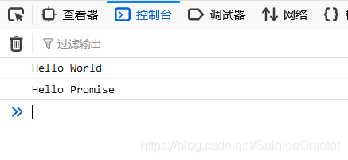

- 第二种写法

```javascript
 new Promise((resolve ,reject)=>{
    //第一次网络请求
    setTimeout(()=>{
      resolve('Hello World')
      reject('error')
    },1000)
  }).then( data =>{
    //第一次处理
    console.log(data);
    //第二次网络请求
    return new Promise((resolve ,reject)=>{
      setTimeout(()=>{
        resolve('Hello Vuejs')
      },1000)
    }).then( data => {
      //第二次处理
      console.log(data);
    })
  },error =>{
    //错误处理
    console.log(error);
  })
```


## 2、为什么要使用Promise

- 旧的异步回调的解决方案：必须在启动异步任务前指定回调函数
- 同时这种回调方案容易产生回调地狱的问题

### 网络请求的回调地狱

- 考虑下面的场景(有夸张的成分):

  - 通过一个url1从服务器加载一个数据data1 , data1中包含了下一个请求的url2

  - 通过data1取出url2，从服务器加载数据data2,data2中包含了下一个请求的url3

  - 通过data2取出url3，从服务器加载数据data3 ,data3中包含了下一个请求的url4

  - 发送网络请求url4，获取最终的数据data4

    ```javascript
    $.ajax( 'url1', function (data1) {
    	$.ajax(data1 ['url2 '], function (data2){
    		$.ajax(data2 ['url3']，function (data3){
    			$.ajax(data3 ['url4'],function (data4){
    				console.log(data4);
    			})
    		})
    	})
    })
    ```

- 正常情况下，上述代码不会有什么问题，可以正常运行并且获取想要的结果。

- 但是，这样的代码难看而且不容易维护。

- 而使用Promise就可以很好地解决回调地狱的问题

### 通过Promise的链式调用解决回调地狱

- 由Promise的基本使用可以知道：无论是then还是catch都可以返回一个Promise对象。

- 所以，代码其实是可以进行链式调用的:

- 这里直接通过Promise包装了一下新的数据，将Promise对象返回了

  - Promise.resovle():将数据包装成Promise对象，并且在内部回调resolve()函数
  - Promise.reject():将数据包装成Promise对象，并且在内部回调reject()函数

  ```javascript
    // 链式调用的代码
          new Promise((resolve, reject) => {
              setTimeout(function () {
                  resolve('Hello World ')
              }, 1000)
          }).then(data => {
              console.log(data);//=>Hello World
              return new Promise(resolve => {
                  resolve(data + '111')
              })
          }).then(data => {
              console.log(data);// => Hello World111
              return new Promise(resolve => {
                  resolve(data + '222')
              })
          }).then(data => {
              console.log(data);//=>Hello World111222
              return new Promise((resolve, reject) => {
                  reject(data + 'error')
              })
          }).then(data => {
              console.log(data);// 这里没有输出,这部分代码不会执行
              return new Promise(resolve => {
                  resolve(data + '333')
              })
          }).catch(data => {
              console.log(data);// =→>Hello world111222error
              return new Promise(resolve => {
                  resolve(data + '444')
              })
          }).then(data => {
              console.log(data);//=> Hello World111222error444
          })
          //简写一
          new Promise((resolve, reject) => {
              setTimeout(function () {
                  resolve('Hello World ')
              }, 1000)
          }).then(data => {
              console.log(data);//=>Hello World
              return Promise.resolve(data + '111')
          }).then(data => {
              console.log(data);// => Hello World111
              return Promise.resolve(data + '222')
          }).then(data => {
              console.log(data);//=>Hello World111222
              return Promise.reject(data + 'error')
          }).then(data => {
              console.log(data);// 这里没有输出,这部分代码不会执行
              return Promise.resolve(data + '333')
          }).catch(data => {
              console.log(data);// =→>Hello world111222error
              return Promise.resolve(data + '444')
          }).then(data => {
              console.log(data);//=> Hello World111222error444
          })
          //简写二
          new Promise((resolve, reject) => {
              setTimeout(function () {
                  resolve('Hello World ')
              }, 1000)
          }).then(data => {
              console.log(data);//=>Hello World
              return data + '111'
          }).then(data => {
              console.log(data);// => Hello World111
              return data + '222 '
          }).then(data => {
              console.log(data);//=>Hello World111222
              throw data + 'error'
          }).then(data => {
              console.log(data);// 这里没有输出,这部分代码不会执行
              return data + '333'
          }).catch(data => {
              console.log(data);// =>Hello world111222error
              return data + '444'
          }).then(data => {
              console.log(data);//=> Hello World111222error444
          })
  ```


### 通过async和await解决回调地狱

- async函数是使用async关键字声明的函数。 async函数是AsyncFunction构造函数的实例， 并且其中允许使用await关键字。async和await关键字让我们可以用一种更简洁的方式写出基于Promise的异步行为，而无需刻意地链式调用promise。
- async函数可能包含0个或者多个await表达式。await表达式会暂停整个async函数的执行进程并出让其控制权，只有当其等待的基于promise的异步操作被兑现或被拒绝之后才会恢复进程。promise的解决值会被当作该await表达式的返回值。使用async / await关键字就可以在异步代码中使用普通的try / catch代码块。
- await关键字只在async函数内有效。如果在async函数体之外使用它，就会抛出语法错误 SyntaxError。
- await操作符用于等待一个Promise对象。它只能在异步函数 async function 中使用
- await 表达式会暂停当前 async function的执行，等待 Promise 处理完成。若 Promise 正常处理(fulfilled)，其回调的resolve函数参数作为 await 表达式的值，继续执行 async function。若 Promise 处理异常(rejected)，await 表达式会把 Promise 的异常原因抛出。另外，如果 await 操作符后的表达式的值不是一个 Promise，则返回该值本身。
- async/await的目的为了简化使用基于promise的API时所需的语法。async/await的行为就好像搭配使用了生成器和promise。

```javascript
function resolveAfter2Seconds() {
            return new Promise(resolve => {
                setTimeout(() => {
                    resolve('resolved');
                }, 2000);
            });
        }

        async function asyncCall() {
            const result = await resolveAfter2Seconds();
            console.log(result);
            console.log('calling');
        }

        asyncCall()
```


- async函数一定会返回一个promise对象。如果一个async函数的返回值看起来不是promise，那么它将会被隐式地包装在一个promise中。

```javascript
async function foo() {
   return 1
}
//等价于
function foo() {
   return Promise.resolve(1)
}
```

-  async函数的函数体可以被看作是由0个或者多个await表达式分割开来的。从第一行代码直到（并包括）第一个await表达式（如果有的话）都是同步运行的。这样的话，一个不含await表达式的async函数是会同步运行的。然而，如果函数体内有一个await表达式，async函数就一定会异步执行。
-  利用这个特性，使用async和await就可以在获得前面请求的结果后再继续往下执行，完美解决了回调地狱的问题

## 3、Promise的API

- Promise构造函数: Promise (excutor){}
  - excutor函数:执行器(resolve,reject)=>{}
  - resolve 函数:内部定义成功时调用的函数data=> {}
  - reject函数:内部定义失败时我们调用的函数 error=>{}
- Promise.prototype.then方法:(onResolved，onRejected) =>{}
  - onResolved函数:成功的回调函数 (data) =>{}
  - onRejected函数:失败的回调函数 (error)=>{}
  - 说明:指定用于得到成功data的成功回调和用于得到失败error的失败回调
    返回一个新的promise对象
- Promise.prototype.catch方法:(onRejected) =>{}
  - onRejected函数:失败的回调函数（error)=>{}
  - 说明:then()的语法糖,相当于: then(undefined，onRejected)
- Promise.resolve方法:(data)=>{}
  - data:成功的数据或promise对象
  - 说明:返回一个成功/失败的promise对象
- Promise.reject方法:(error)=>{}
  - error:失败的原因
  - 说明:返回一个失败的promise对象
- Promise.all方法:(promises) =>{}
  - promises:包含n个promise的数组
  - 说明:返回一个新的promise，只有所有的promise都成功才成功，只要有一个失败了就直接失败
- Promise.race方法:(promises)=>{}
  - promises:包含n个promise的数组
  - 说明:返回一个新的promise，第一个完成的promise的结果状态就是最终的结果状态

前五点在前面的例子中已经有体现了，在这里演示Promise.all和Promise.race方法

- Promise.all
- all方法可以等待在其内部的所有请求都返回结果后全部获取出来

```javascript
  Promise.all([
    new Promise((resolve,reject)=>{
      setTimeout(()=>{
        resolve({name:'zhangsan',age:18})
      },2000)
    }),
    new Promise((resolve,reject)=>{
        resolve({name:'lisi',age:19})
    },1000)
  ]).then( result =>{
    console.log(result);
  })
```


- Promise.race

- race 函数返回一个 Promise，它将与第一个传递的 promise 相同的完成方式被完成。它可以是完成（ resolves），也可以是失败（rejects），这要取决于第一个完成的方式是两个中的哪个。

- 如果传的迭代是空的，则返回的 promise 将永远等待。

- 如果迭代包含一个或多个非承诺值和/或已解决/拒绝的承诺，则`Promise.race 将解析为迭代中找到的第一个值。

  ```javascript
  const promise1 = new Promise((resolve, reject) => {
    setTimeout(resolve, 500, 'one');
  });
  
  const promise2 = new Promise((resolve, reject) => {
    setTimeout(resolve, 100, 'two');
  });
  
  Promise.race([promise1, promise2]).then((value) => {
    console.log(value);
  });
  ```

  

## Promise的几个关键问题

## 1、如何改变Promise的状态

- resolve(value):如果当前是pending就会变为fulfilled

- reject(reason):如果当前是 pending就会变为rejected

- 抛出异常:如果当前是 pending 就会变为rejected

  ```javascript
  const p = new Promise((resolve, reject) => {
        resolve("成功了"); //当调用resolve时，pending改为fulfilled
        reject('失败了') //当调用reject时，pending改为rejected
        throw new Error('出错了') //throw可以抛出任何错误，谁调用谁处理，pending改为rejected
    })
  
    p.then(
       data => {
         console.log(data);
       },
       error => {
         console.log(error);
       }
    )
  ```


 


## 2、一个promise指定多个成功/失败回调函数，当promise改变为对应状态时都会调用

```javascript
const p = new Promise((resolve, reject) => {
            // resolve("成功了"); //当调用resolve时，pending改为fulfilled
            reject('失败了') //当调用reject时，pending改为rejected
            throw new Error('出错了') //throw可以抛出任何错误，谁调用谁处理，pending改为rejected
        })

        p.then(
            data => {
                console.log(data);
            },
            error => {
                console.log(error);
            }
        )
        p.catch(
            error =>{
                console.log(error);
            }
        )
```


## 3、改变promise状态和指定回调函数谁先谁后?

- 都有可能，正常情况下是先指定回调再改变状态，但也可以先改状态再指定回调
  
- 如何先改状态再指定回调?

  - 在执行器中直接调用resolve()/reject()
  - 延迟更长时间才调用then() 
    
- 什么时候才能得到数据?

  - 如果先指定的回调，那当状态发生改变时，回调函数就会调用，得到数据
  - 如果先改变的状态，那当指定回调时，回调函数就会调用，得到数据

## 4、Promise.then()返回的新promise的结果状态由什么决定?

- 简单表达:由then()指定的回调函数执行的结果决定
- 详细表达:
  - 如果抛出异常，新promise变为rejected，error为抛出的异常
  - 如果返回的是非promise的任意值，新promise变为resolved，data为返回的值
  - 如果返回的是另一个新promise，此promise的结果就会成为新promise的结果
- 具体的例子体现可以参照Promise解决回调地狱的例子。

## 5、Promise串连多个操作任务

- promise的then()返回一个新的promise，可以开成then()的链式调用

- 通过then的链式调用串连多个同步/异步任务

  

```javascript
new Promise((resolve, reject) => {
            setTimeout(() => {
                resolve(1) //异步任务
            }, 1000)
        }).then(
            data => {
                console.log(data);
                return 2 //同步任务
            }
        ).then(
            data => {
                console.log(data);
                // setTimeout(() => {
                //     return 3
                // }, 1000)
                return new Promise((resolve, reject) => {
                    setTimeout(() => {
                        resolve(3)
                    }, 1000)
                })

            }
        ).then(
            data => {
                console.log(data);
            }
        )
```


##  6、Promise异常传透

- 当使用promise的then链式调用时，可以在最后指定失败的回调

- 前面任何操作出了异常，都会传到最后失败的回调中处理


## 7、中断Promise链

- 当使用promise的then链式调用时，在中间中断，不再调用后面的回调函数
- 办法:在回调函数中返回一个pending状态的promise对象
  

## 自定义Promise

## 1、定义整体结构

```javascript
(function (window) {
    // Promise的构造函数
    function Promise(excutor) { }

    // Promise原型对象then
    // 指定成功的回调函数,返回一个Promise对象
    Promise.prototype.then = function (onResolved, onRejected) { }

    // Promise原型对象catch
    // 指定失败的回调函数,返回一个Promise对象
    Promise.prototype.catch = function (onResolved, onRejected) { }

    // Promise对象的resolve方法
    Promise.resolve = function(data){}

    // Promise对象的reject方法
    Promise.reject = function(error){}

    //Promise对象的all方法
    Promise.all = function(promises){}

    //Promise对象的race方法
    Promise.race = function(peomises){}

    //将Promise函数暴露出去
    window.Promise = Promise
})(window)
```

## 2、构造函数实现

```javascript
// 自定义Promise
(function (window) {
    // Promise的构造函数
    function Promise(excutor) { 

        const _this = this;
        _this.status = 'pending' //指定status属性,初始为pending
        _this.data = undefined //指定一个用于存储结果数据的属性
        _this.callbacks = [] //每个元素的结构{onResolved(){},onRejected(){}}

        function resolve(data){
            // 如果状态不等于pending,直接结束
            // 注意:这里不能写this.status,此时的this是指向window的
            if(_this.status !== 'pending'){
                return
            }
            //改变状态为fulfilled
            _this.status = 'fulfilled'
            //存储数据
            _this.data = data
            //如果异步回调队列里有待执行函数,立即异步执行函数
            if(_this.callbacks.length > 0){
                //注意:一定是异步执行
                setTimeout(()=>{
                    _this.callbacks.forEach(callbacksObj => {
                        callbacksObj.onResolved(data);
                    });
                })
            }
        }
        function reject(error){
            // 如果状态不等于pending,直接结束
            if (_this.status !== 'pending') {
                return
            }
            //改变状态为rejected
            _this.status = 'rejected'
            //存储数据
            _this.data = error
            //如果异步回调队列里有待执行函数,立即异步执行函数
            if (_this.callbacks.length > 0) {
                //注意:一定是异步执行
                setTimeout(() => {
                    _this.callbacks.forEach(callbacksObj => {
                        callbacksObj.onRejected(error);
                    });
                })
            }
        }
        try{
            excutor(resolve, reject)
        }catch(error){
            // 如果执行器直接抛出异常,Promise为rejected状态
            reject(error)
        }
       
    }

    // Promise原型对象then
    // 指定成功的回调函数,返回一个Promise对象
    Promise.prototype.then = function (onResolved, onRejected) {
        //模拟测试,先调用回调,再改变状态
        const _this = this;
        _this.callbacks.push({
            onResolved, 
            onRejected
        })
        
     }

    // Promise原型对象catch
    // 指定失败的回调函数,返回一个Promise对象
    Promise.prototype.catch = function (onResolved, onRejected) { }

    // Promise对象的resolve方法
    Promise.resolve = function(data){}

    // Promise对象的reject方法
    Promise.reject = function(error){}

    //Promise对象的all方法
    Promise.all = function(promises){}

    //Promise对象的race方法
    Promise.race = function(peomises){}

    //将Promise函数暴露出去
    window.Promise = Promise
})(window)
```

```html
<!DOCTYPE html>
<html lang="en">

<head>
    <meta charset="UTF-8">
    <meta http-equiv="X-UA-Compatible" content="IE=edge">
    <meta name="viewport" content="width=device-width, initial-scale=1.0">
    <title>自定义Promise</title>
</head>

<body>
    <script src="js/Promise.js"></script>
    <script>
        const p = new Promise((resolve, reject) => {
            setTimeout(() => {
                resolve(1)
                console.log("Promise执行了");
            })
        })
        p.then(
            data => {
                console.log('1', data);
            },
            error => {
                console.log('1', error);
            }
        )
        p.then(
            data => {
                console.log('2', data);
            },
            error => {
                console.log('2', error);
            }
        )
    </script>
</body>

</html>
```


## 3、then和catch的实现

```javascript
// 自定义Promise
(function (window) {
    const PENDING = 'pending'
    const FULFILLED = 'fulfilled'
    const REJECTED = 'rejected'
    // Promise的构造函数
    function Promise(excutor) {

        const _this = this;
        _this.status = PENDING //指定status属性,初始为pending
        _this.data = undefined //指定一个用于存储结果数据的属性
        _this.callbacks = [] //每个元素的结构{onResolved(){},onRejected(){}}

        function resolve(data) {
            // 如果状态不等于pending,直接结束
            // 注意:这里不能写this.status,此时的this是指向window的
            if (_this.status !== PENDING) {
                return
            }
            //改变状态为fulfilled
            _this.status = FULFILLED
            //存储数据
            _this.data = data
            //如果异步回调队列里有待执行函数,立即异步执行函数
            if (_this.callbacks.length > 0) {
                //注意:一定是异步执行
                setTimeout(() => {
                    _this.callbacks.forEach(callbacksObj => {
                        callbacksObj.onResolved(data);
                    });
                })
            }
        }
        function reject(error) {
            // 如果状态不等于pending,直接结束
            if (_this.status !== PENDING) {
                return
            }
            //改变状态为rejected
            _this.status = REJECTED
            //存储数据
            _this.data = error
            //如果异步回调队列里有待执行函数,立即异步执行函数
            if (_this.callbacks.length > 0) {
                //注意:一定是异步执行
                setTimeout(() => {
                    _this.callbacks.forEach(callbacksObj => {
                        callbacksObj.onRejected(error);
                    });
                })
            }
        }

        try {
            excutor(resolve, reject)
        } catch (error) {
            // 如果执行器直接抛出异常,Promise为rejected状态
            reject(error)
        }

    }

    // Promise原型对象then
    // 指定成功的回调函数,返回一个Promise对象
    //返回的Promise结果由onResolved/onRejected的结果决定
    // onResolved/onRejected的结果由有三种情况
    /*
        1.如果返回的不是Promise对象,返回的Promise状态为成功,返回的结果就是data
        2.如果返回的是Promise对象,返回的Promise状态为成功,并且返回的Promise的结果就是这个Promise的结果
        3.如果抛出异常,返回的Promise就会失败,直接将状态改为失败即可
    */
    Promise.prototype.then = function (onResolved, onRejected) {
        // 指定默认成功的回调
        onResolved = typeof onResolved === 'function' ? onResolved : data => data
        //指定默认失败的回调
        onRejected = typeof onRejected === 'function' ? onRejected : error => {throw error}
        const _this = this;
        return new Promise((resolve, reject) => {
            //对返回Promise结果处理的封装,根据执行的结果改变return的Promise的状态
            function handle(callback) {
                try {
                    const result = callback(_this.data)
                    if (result instanceof Promise) {
                        /*
                            如果返回的是Promise对象,返回的Promise会成功,并且返回的Promise的
                            结果就是这个Promise的结果,因此再次调用其自身方法,成功则将状态改为
                            成功,失败则将状态改为失败
                         */
                        // result.then(
                        //     data => {
                        //         resolve(data)
                        //     },
                        //     error => {
                        //         reject(error)
                        //     }
                        // )
                        // 两种写法等价,下面的写法更加简简洁
                        result.then(resolve, reject)
                    } else {
                        //如果返回的不是Promise对象,返回的Promise状态为成功,返回的结果就是data
                        resolve(result)
                    }
                } catch (error) {
                    //如果抛出异常,返回的Promise就会失败,直接将状态改为失败即可
                    reject(error)
                }
            }
            //当前的Promise的状态是pending
            if (_this.status === PENDING) {
                _this.callbacks.push({
                    //返回的Promise结果由onResolved/onRejected的结果决定
                    onResolved() {
                        handle(onResolved)
                    },
                    onRejected() {
                        handle(onRejected)
                    }
                })
                //当前的Promise的状态是fulfilled
            } else if (_this.status === FULFILLED) {
                setTimeout(() => {
                    handle(onResolved)
                })
                //当前的Promise的状态是rejected
            } else {
                setTimeout(() => {
                    handle(onRejected)
                })
            }
        })
    }

    // Promise原型对象catch
    // 指定失败的回调函数,返回一个Promise对象
    Promise.prototype.catch = function (onRejected) { 
        return this.then(undefined,onRejected)
    }

    // Promise对象的resolve方法
    Promise.resolve = function (data) { }

    // Promise对象的reject方法
    Promise.reject = function (error) { }

    //Promise对象的all方法
    Promise.all = function (promises) { }

    //Promise对象的race方法
    Promise.race = function (peomises) { }

    //将Promise函数暴露出去
    window.Promise = Promise
})(window)
```

```html
<!DOCTYPE html>
<html lang="en">

<head>
    <meta charset="UTF-8">
    <meta http-equiv="X-UA-Compatible" content="IE=edge">
    <meta name="viewport" content="width=device-width, initial-scale=1.0">
    <title>自定义Promise</title>
</head>

<body>
    <script src="js/Promise.js"></script>
    <script>
        const p = new Promise((resolve ,reject)=>{
            setTimeout(() => {
                reject('失败了')
            })
        }).then(
             data => {
                console.log('onResolved()1', data);
            },
            error => {
                console.log('onRejected()2', error);
                return '成功了'
            }
        ).then(
            data => {
                console.log('onResolved()2', data);
                throw 3
            },
            error => {
                console.log('onRejected()2', error);
            }
        ).catch(
             error => {
                console.log('onRejected()3', error);
            }
        )
    </script>
</body>

</html>
```


## 4、resolve和reject的实现

```javascript
// 自定义Promise
(function (window) {
    const PENDING = 'pending'
    const FULFILLED = 'fulfilled'
    const REJECTED = 'rejected'
    // Promise的构造函数
    function Promise(excutor) {

        const _this = this;
        _this.status = PENDING //指定status属性,初始为pending
        _this.data = undefined //指定一个用于存储结果数据的属性
        _this.callbacks = [] //每个元素的结构{onResolved(){},onRejected(){}}

        function resolve(data) {
            // 如果状态不等于pending,直接结束
            // 注意:这里不能写this.status,此时的this是指向window的
            if (_this.status !== PENDING) {
                return
            }
            //改变状态为fulfilled
            _this.status = FULFILLED
            //存储数据
            _this.data = data
            //如果异步回调队列里有待执行函数,立即异步执行函数
            if (_this.callbacks.length > 0) {
                //注意:一定是异步执行
                setTimeout(() => {
                    _this.callbacks.forEach(callbacksObj => {
                        callbacksObj.onResolved(data);
                    });
                })
            }
        }
        function reject(error) {
            // 如果状态不等于pending,直接结束
            if (_this.status !== PENDING) {
                return
            }
            //改变状态为rejected
            _this.status = REJECTED
            //存储数据
            _this.data = error
            //如果异步回调队列里有待执行函数,立即异步执行函数
            if (_this.callbacks.length > 0) {
                //注意:一定是异步执行
                setTimeout(() => {
                    _this.callbacks.forEach(callbacksObj => {
                        callbacksObj.onRejected(error);
                    });
                })
            }
        }

        try {
            excutor(resolve, reject)
        } catch (error) {
            // 如果执行器直接抛出异常,Promise为rejected状态
            reject(error)
        }

    }

    // Promise原型对象then
    // 指定成功的回调函数,返回一个Promise对象
    //返回的Promise结果由onResolved/onRejected的结果决定
    // onResolved/onRejected的结果由有三种情况
    /*
        1.如果返回的不是Promise对象,返回的Promise状态为成功,返回的结果就是data
        2.如果返回的是Promise对象,返回的Promise状态为成功,并且返回的Promise的结果就是这个Promise的结果
        3.如果抛出异常,返回的Promise就会失败,直接将状态改为失败即可
    */
    Promise.prototype.then = function (onResolved, onRejected) {
        // 指定默认成功的回调
        onResolved = typeof onResolved === 'function' ? onResolved : data => data
        //指定默认失败的回调
        onRejected = typeof onRejected === 'function' ? onRejected : error => { throw error }
        const _this = this;
        return new Promise((resolve, reject) => {
            //对返回Promise结果处理的封装,根据执行的结果改变return的Promise的状态
            function handle(callback) {
                try {
                    const result = callback(_this.data)
                    if (result instanceof Promise) {
                        /*
                            如果返回的是Promise对象,返回的Promise会成功,并且返回的Promise的
                            结果就是这个Promise的结果,因此再次调用其自身方法,成功则将状态改为
                            成功,失败则将状态改为失败
                         */
                        // result.then(
                        //     data => {
                        //         resolve(data)
                        //     },
                        //     error => {
                        //         reject(error)
                        //     }
                        // )
                        // 两种写法等价,下面的写法更加简简洁
                        result.then(resolve, reject)
                    } else {
                        //如果返回的不是Promise对象,返回的Promise状态为成功,返回的结果就是data
                        resolve(result)
                    }
                } catch (error) {
                    //如果抛出异常,返回的Promise就会失败,直接将状态改为失败即可
                    reject(error)
                }
            }
            //当前的Promise的状态是pending
            if (_this.status === PENDING) {
                _this.callbacks.push({
                    //返回的Promise结果由onResolved/onRejected的结果决定
                    onResolved() {
                        handle(onResolved)
                    },
                    onRejected() {
                        handle(onRejected)
                    }
                })
                //当前的Promise的状态是fulfilled
            } else if (_this.status === FULFILLED) {
                setTimeout(() => {
                    handle(onResolved)
                })
                //当前的Promise的状态是rejected
            } else {
                setTimeout(() => {
                    handle(onRejected)
                })
            }
        })
    }

    // Promise原型对象catch
    // 指定失败的回调函数,返回一个Promise对象
    Promise.prototype.catch = function (onRejected) {
        return this.then(undefined, onRejected)
    }

    // Promise对象的resolve方法
    Promise.resolve = function (data) {
        return new Promise((resolve, reject) =>{
            if(data instanceof Promise){
                data.then(resolve,reject)
            }else{
                resolve(data)
            }
        })
    }

    // Promise对象的reject方法
    Promise.reject = function (error) {
        return new Promise((resolve,reject)=>{
            reject(error)
        })
    }

    //Promise对象的all方法
    Promise.all = function (promises) { }

    //Promise对象的race方法
    Promise.race = function (peomises) { }

    //将Promise函数暴露出去
    window.Promise = Promise
})(window)
```

```html
<!DOCTYPE html>
<html lang="en">

<head>
    <meta charset="UTF-8">
    <meta http-equiv="X-UA-Compatible" content="IE=edge">
    <meta name="viewport" content="width=device-width, initial-scale=1.0">
    <title>自定义Promise</title>
</head>

<body>
    <script src="js/Promise.js"></script>
    <script>
        // 传入的不是Promise,状态为成功
        const p1 = Promise.resolve(2)
        // 传入的是Promise.状态为成功
        const p2 = Promise.resolve(Promise.resolve(3))
        // 传入的是Promise.状态为失败
        const p3 = Promise.resolve(Promise.reject(4))
        p1.then(
            data =>{
                console.log('p1',data);
            }
        )
        p2.then(
            data =>{
                console.log('p2',data);
            }
        )
        p3.catch(
            error =>{
                console.log('p3',error);
            }
        )
    </script>
</body>

</html>
```

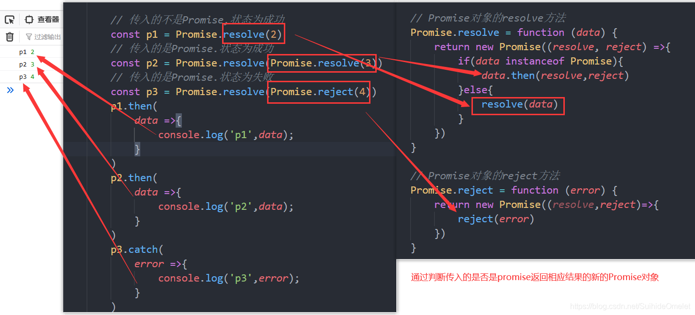

## 5、all和race的实现

- all的实现

  ```javascript
  // 自定义Promise
  (function (window) {
      const PENDING = 'pending'
      const FULFILLED = 'fulfilled'
      const REJECTED = 'rejected'
      // Promise的构造函数
      function Promise(excutor) {
  
          const _this = this;
          _this.status = PENDING //指定status属性,初始为pending
          _this.data = undefined //指定一个用于存储结果数据的属性
          _this.callbacks = [] //每个元素的结构{onResolved(){},onRejected(){}}
  
          function resolve(data) {
              // 如果状态不等于pending,直接结束
              // 注意:这里不能写this.status,此时的this是指向window的
              if (_this.status !== PENDING) {
                  return
              }
              //改变状态为fulfilled
              _this.status = FULFILLED
              //存储数据
              _this.data = data
              //如果异步回调队列里有待执行函数,立即异步执行函数
              if (_this.callbacks.length > 0) {
                  //注意:一定是异步执行
                  setTimeout(() => {
                      _this.callbacks.forEach(callbacksObj => {
                          callbacksObj.onResolved(data);
                      });
                  })
              }
          }
          function reject(error) {
              // 如果状态不等于pending,直接结束
              if (_this.status !== PENDING) {
                  return
              }
              //改变状态为rejected
              _this.status = REJECTED
              //存储数据
              _this.data = error
              //如果异步回调队列里有待执行函数,立即异步执行函数
              if (_this.callbacks.length > 0) {
                  //注意:一定是异步执行
                  setTimeout(() => {
                      _this.callbacks.forEach(callbacksObj => {
                          callbacksObj.onRejected(error);
                      });
                  })
              }
          }
  
          try {
              excutor(resolve, reject)
          } catch (error) {
              // 如果执行器直接抛出异常,Promise为rejected状态
              reject(error)
          }
  
      }
  
      // Promise原型对象then
      // 指定成功的回调函数,返回一个Promise对象
      //返回的Promise结果由onResolved/onRejected的结果决定
      // onResolved/onRejected的结果由有三种情况
      /*
          1.如果返回的不是Promise对象,返回的Promise状态为成功,返回的结果就是data
          2.如果返回的是Promise对象,返回的Promise状态为成功,并且返回的Promise的结果就是这个Promise的结果
          3.如果抛出异常,返回的Promise就会失败,直接将状态改为失败即可
      */
      Promise.prototype.then = function (onResolved, onRejected) {
          // 指定默认成功的回调
          onResolved = typeof onResolved === 'function' ? onResolved : data => data
          //指定默认失败的回调
          onRejected = typeof onRejected === 'function' ? onRejected : error => { throw error }
          const _this = this;
          return new Promise((resolve, reject) => {
              //对返回Promise结果处理的封装,根据执行的结果改变return的Promise的状态
              function handle(callback) {
                  try {
                      const result = callback(_this.data)
                      if (result instanceof Promise) {
                          /*
                              如果返回的是Promise对象,返回的Promise会成功,并且返回的Promise的
                              结果就是这个Promise的结果,因此再次调用其自身方法,成功则将状态改为
                              成功,失败则将状态改为失败
                           */
                          // result.then(
                          //     data => {
                          //         resolve(data)
                          //     },
                          //     error => {
                          //         reject(error)
                          //     }
                          // )
                          // 两种写法等价,下面的写法更加简简洁
                          result.then(resolve, reject)
                      } else {
                       //如果返回的不是Promise对象,返回的Promise状态为成功,返回的结果就是data
                          resolve(result)
                      }
                  } catch (error) {
                      //如果抛出异常,返回的Promise就会失败,直接将状态改为失败即可
                      reject(error)
                  }
              }
              //当前的Promise的状态是pending
              if (_this.status === PENDING) {
                  _this.callbacks.push({
                      //返回的Promise结果由onResolved/onRejected的结果决定
                      onResolved() {
                          handle(onResolved)
                      },
                      onRejected() {
                          handle(onRejected)
                      }
                  })
                  //当前的Promise的状态是fulfilled
              } else if (_this.status === FULFILLED) {
                  setTimeout(() => {
                      handle(onResolved)
                  })
                  //当前的Promise的状态是rejected
              } else {
                  setTimeout(() => {
                      handle(onRejected)
                  })
              }
          })
      }
  
      // Promise原型对象catch
      // 指定失败的回调函数,返回一个Promise对象
      Promise.prototype.catch = function (onRejected) {
          return this.then(undefined, onRejected)
      }
  
      // Promise对象的resolve方法
      Promise.resolve = function (data) {
          return new Promise((resolve, reject) => {
              if (data instanceof Promise) {
                  data.then(resolve, reject)
              } else {
                  resolve(data)
              }
          })
      }
  
      // Promise对象的reject方法
      Promise.reject = function (error) {
          return new Promise((resolve, reject) => {
              reject(error)
          })
      }
  
      //Promise对象的all方法
      Promise.all = function (promises) {
          //记录成功的次数
          let resolveCount = 0
          //创建长度与promises数组长度一致,用于存放成功结果的数组
          const datas = new Array(promises.length)
  
          return new Promise((resolve, reject) => {
              promises.forEach((p, index) => {
                  // 多加一层用以处理传入的不是Promise对象的值
                  Promise.resolve(p).then(
                      data => {
                          //每次成功次数加一
                          resolveCount++
                          //保证结果的顺序在数组中与promises数组的一致
                          datas[index] = data
                          //成功次数与promises的长度一致时表示全部成功
                          if (resolveCount === promises.length) {
                              resolve(datas)
                          }
                      },
                      error => {
                          //一次失败返回失败
                          reject(error)
                      }
                  )
              });
          })
      }
  
      //Promise对象的race方法
      Promise.race = function (peomises) { }
  
      //将Promise函数暴露出去
      window.Promise = Promise
  })(window)
  ```

  ```html
  <!DOCTYPE html>
  <html lang="en">
  
  <head>
      <meta charset="UTF-8">
      <meta http-equiv="X-UA-Compatible" content="IE=edge">
      <meta name="viewport" content="width=device-width, initial-scale=1.0">
      <title>自定义Promise</title>
  </head>
  
  <body>
      <script src="js/Promise.js"></script>
      <script>
          // 传入的不是Promise,状态为成功
          const p1 = Promise.resolve(2)
          // 传入的是Promise.状态为成功
          const p2 = Promise.resolve(Promise.resolve(3))
          // 传入的是Promise.状态为失败
          const p3 = Promise.resolve(Promise.reject(4))
          const pAll = Promise.all([p1,7, p2])
          const pAll1 = Promise.all([p1, p2, p3])
          pAll.then(
              data => {
                  console.log('成功',data);
              },
              error => {
                  console.log('失败',error);
              }
          )
          pAll1.then(
                  data => {
                      console.log('成功', data);
                  },
                  error => {
                      console.log('失败', error);
                  }
              )
      </script>
  </body>
  
  </html>
  ```


  - race的实现

  ```javascript
// 自定义Promise
(function (window) {
    const PENDING = 'pending'
    const FULFILLED = 'fulfilled'
    const REJECTED = 'rejected'
    // Promise的构造函数
    function Promise(excutor) {

        const _this = this;
        _this.status = PENDING //指定status属性,初始为pending
        _this.data = undefined //指定一个用于存储结果数据的属性
        _this.callbacks = [] //每个元素的结构{onResolved(){},onRejected(){}}

        function resolve(data) {
            // 如果状态不等于pending,直接结束
            // 注意:这里不能写this.status,此时的this是指向window的
            if (_this.status !== PENDING) {
                return
            }
            //改变状态为fulfilled
            _this.status = FULFILLED
            //存储数据
            _this.data = data
            //如果异步回调队列里有待执行函数,立即异步执行函数
            if (_this.callbacks.length > 0) {
                //注意:一定是异步执行
                setTimeout(() => {
                    _this.callbacks.forEach(callbacksObj => {
                        callbacksObj.onResolved(data);
                    });
                })
            }
        }
        function reject(error) {
            // 如果状态不等于pending,直接结束
            if (_this.status !== PENDING) {
                return
            }
            //改变状态为rejected
            _this.status = REJECTED
            //存储数据
            _this.data = error
            //如果异步回调队列里有待执行函数,立即异步执行函数
            if (_this.callbacks.length > 0) {
                //注意:一定是异步执行
                setTimeout(() => {
                    _this.callbacks.forEach(callbacksObj => {
                        callbacksObj.onRejected(error);
                    });
                })
            }
        }

        try {
            excutor(resolve, reject)
        } catch (error) {
            // 如果执行器直接抛出异常,Promise为rejected状态
            reject(error)
        }

    }

    // Promise原型对象then
    // 指定成功的回调函数,返回一个Promise对象
    //返回的Promise结果由onResolved/onRejected的结果决定
    // onResolved/onRejected的结果由有三种情况
    /*
        1.如果返回的不是Promise对象,返回的Promise状态为成功,返回的结果就是data
        2.如果返回的是Promise对象,返回的Promise状态为成功,并且返回的Promise的结果就是这个Promise的结果
        3.如果抛出异常,返回的Promise就会失败,直接将状态改为失败即可
    */
    Promise.prototype.then = function (onResolved, onRejected) {
        // 指定默认成功的回调
        onResolved = typeof onResolved === 'function' ? onResolved : data => data
        //指定默认失败的回调
        onRejected = typeof onRejected === 'function' ? onRejected : error => { throw error }
        const _this = this;
        return new Promise((resolve, reject) => {
            //对返回Promise结果处理的封装,根据执行的结果改变return的Promise的状态
            function handle(callback) {
                try {
                    const result = callback(_this.data)
                    if (result instanceof Promise) {
                        /*
                            如果返回的是Promise对象,返回的Promise会成功,并且返回的Promise的
                            结果就是这个Promise的结果,因此再次调用其自身方法,成功则将状态改为
                            成功,失败则将状态改为失败
                         */
                        // result.then(
                        //     data => {
                        //         resolve(data)
                        //     },
                        //     error => {
                        //         reject(error)
                        //     }
                        // )
                        // 两种写法等价,下面的写法更加简简洁
                        result.then(resolve, reject)
                    } else {
                        //如果返回的不是Promise对象,返回的Promise状态为成功,返回的结果就是data
                        resolve(result)
                    }
                } catch (error) {
                    //如果抛出异常,返回的Promise就会失败,直接将状态改为失败即可
                    reject(error)
                }
            }
            //当前的Promise的状态是pending
            if (_this.status === PENDING) {
                _this.callbacks.push({
                    //返回的Promise结果由onResolved/onRejected的结果决定
                    onResolved() {
                        handle(onResolved)
                    },
                    onRejected() {
                        handle(onRejected)
                    }
                })
                //当前的Promise的状态是fulfilled
            } else if (_this.status === FULFILLED) {
                setTimeout(() => {
                    handle(onResolved)
                })
                //当前的Promise的状态是rejected
            } else {
                setTimeout(() => {
                    handle(onRejected)
                })
            }
        })
    }

    // Promise原型对象catch
    // 指定失败的回调函数,返回一个Promise对象
    Promise.prototype.catch = function (onRejected) {
        return this.then(undefined, onRejected)
    }

    // Promise对象的resolve方法
    Promise.resolve = function (data) {
        return new Promise((resolve, reject) => {
            if (data instanceof Promise) {
                data.then(resolve, reject)
            } else {
                resolve(data)
            }
        })
    }

    // Promise对象的reject方法
    Promise.reject = function (error) {
        return new Promise((resolve, reject) => {
            reject(error)
        })
    }

    //Promise对象的all方法
    Promise.all = function (promises) {
        //记录成功的次数
        let resolveCount = 0
        //创建长度与promises数组长度一致,用于存放成功结果的数组
        const datas = new Array(promises.length)

        return new Promise((resolve, reject) => {
            promises.forEach((p, index) => {
                // 多加一层用以处理传入的不是Promise对象的值
                Promise.resolve(p).then(
                    data => {
                        //每次成功次数加一
                        resolveCount++
                        //保证结果的顺序在数组中与promises数组的一致
                        datas[index] = data
                        //成功次数与promises的长度一致时表示全部成功
                        if (resolveCount === promises.length) {
                            resolve(datas)
                        }
                    },
                    error => {
                        //一次失败返回失败
                        reject(error)
                    }
                )
            });
        })
    }

    //Promise对象的race方法
    Promise.race = function (promises) {
        return new Promise((resolve, reject) => {
            promises.forEach((p, index) => {
                // 多加一层用以处理传入的不是Promise对象的值
                Promise.resolve(p).then(
                    data => {
                        resolve(data)
                    },
                    error => {
                        reject(error)
                    }
                )
            })
        })
    }

    //将Promise函数暴露出去
    window.Promise = Promise
})(window)
  ```

  ```html
<!DOCTYPE html>
<html lang="en">

<head>
    <meta charset="UTF-8">
    <meta http-equiv="X-UA-Compatible" content="IE=edge">
    <meta name="viewport" content="width=device-width, initial-scale=1.0">
    <title>自定义Promise</title>
</head>

<body>
    <script src="js/Promise.js"></script>
    <script>
         // 传入的是Promise.状态为失败
        const p3 = Promise.resolve(Promise.reject(4))
        // 传入的不是Promise,状态为成功
        const p1 = Promise.resolve(2)
        // 传入的是Promise.状态为成功
        const p2 = Promise.resolve(Promise.resolve(3))
        const pRace = Promise.race([p1,7, p2])
        const pRace1 = Promise.race([p3, p1, p2])

        pRace.then(
            data => {
                console.log('成功', data);
            },
            error => {
                console.log('失败', error);
            }
        )

        pRace1.then(
            data => {
                console.log('成功', data);
            },
            error => {
                console.log('失败', error);
            }
        )

    </script>
</body>

</html>
  ```


  ## 6、resolveDelay和rejectDelay


  ## 7、class版本的自定义Promise

  - 将构造函数的内容写在constructor中

  - 将原型对象的方法改为实例对象的方法
  - 将函数对象的方法改为静态方法

  ```javascript
// 自定义Promise
(function (window) {
    const PENDING = 'pending'
    const FULFILLED = 'fulfilled'
    const REJECTED = 'rejected'

    class Promise {
        // Promise的构造函数
        constructor(excutor) {
            const _this = this;
            _this.status = PENDING //指定status属性,初始为pending
            _this.data = undefined //指定一个用于存储结果数据的属性
            _this.callbacks = [] //每个元素的结构{onResolved(){},onRejected(){}}

            function resolve(data) {
                // 如果状态不等于pending,直接结束
                // 注意:这里不能写this.status,此时的this是指向window的
                if (_this.status !== PENDING) {
                    return
                }
                //改变状态为fulfilled
                _this.status = FULFILLED
                //存储数据
                _this.data = data
                //如果异步回调队列里有待执行函数,立即异步执行函数
                if (_this.callbacks.length > 0) {
                    //注意:一定是异步执行
                    setTimeout(() => {
                        _this.callbacks.forEach(callbacksObj => {
                            callbacksObj.onResolved(data);
                        });
                    })
                }
            }
            function reject(error) {
                // 如果状态不等于pending,直接结束
                if (_this.status !== PENDING) {
                    return
                }
                //改变状态为rejected
                _this.status = REJECTED
                //存储数据
                _this.data = error
                //如果异步回调队列里有待执行函数,立即异步执行函数
                if (_this.callbacks.length > 0) {
                    //注意:一定是异步执行
                    setTimeout(() => {
                        _this.callbacks.forEach(callbacksObj => {
                            callbacksObj.onRejected(error);
                        });
                    })
                }
            }
            try {
                excutor(resolve, reject)
            } catch (error) {
                // 如果执行器直接抛出异常,Promise为rejected状态
                reject(error)
            }
        }
        // Promise原型对象then
        // 指定成功的回调函数,返回一个Promise对象
        //返回的Promise结果由onResolved/onRejected的结果决定
        // onResolved/onRejected的结果由有三种情况
        /*
            1.如果返回的不是Promise对象,返回的Promise状态为成功,返回的结果就是data
            2.如果返回的是Promise对象,返回的Promise状态为成功,并且返回的Promise的结果就是这个Promise的结果
            3.如果抛出异常,返回的Promise就会失败,直接将状态改为失败即可
        */
        then = function (onResolved, onRejected) {
            // 指定默认成功的回调
            onResolved = typeof onResolved === 'function' ? onResolved : data => data
            //指定默认失败的回调
            onRejected = typeof onRejected === 'function' ? onRejected : error => { throw error }
            const _this = this;
            return new Promise((resolve, reject) => {
                //对返回Promise结果处理的封装,根据执行的结果改变return的Promise的状态
                function handle(callback) {
                    try {
                        const result = callback(_this.data)
                        if (result instanceof Promise) {
                            /*
                                如果返回的是Promise对象,返回的Promise会成功,并且返回的Promise的
                                结果就是这个Promise的结果,因此再次调用其自身方法,成功则将状态改为
                                成功,失败则将状态改为失败
                             */
                            // result.then(
                            //     data => {
                            //         resolve(data)
                            //     },
                            //     error => {
                            //         reject(error)
                            //     }
                            // )
                            // 两种写法等价,下面的写法更加简简洁
                            result.then(resolve, reject)
                        } else {
                            //如果返回的不是Promise对象,返回的Promise状态为成功,返回的结果就是data
                            resolve(result)
                        }
                    } catch (error) {
                        //如果抛出异常,返回的Promise就会失败,直接将状态改为失败即可
                        reject(error)
                    }
                }
                //当前的Promise的状态是pending
                if (_this.status === PENDING) {
                    _this.callbacks.push({
                        //返回的Promise结果由onResolved/onRejected的结果决定
                        onResolved() {
                            handle(onResolved)
                        },
                        onRejected() {
                            handle(onRejected)
                        }
                    })
                    //当前的Promise的状态是fulfilled
                } else if (_this.status === FULFILLED) {
                    setTimeout(() => {
                        handle(onResolved)
                    })
                    //当前的Promise的状态是rejected
                } else {
                    setTimeout(() => {
                        handle(onRejected)
                    })
                }
            })
        }

        // Promise原型对象catch
        // 指定失败的回调函数,返回一个Promise对象
        catch = function (onRejected) {
            return this.then(undefined, onRejected)
        }

        // Promise对象的resolve方法
        static resolve = function (data) {
            return new Promise((resolve, reject) => {
                if (data instanceof Promise) {
                    data.then(resolve, reject)
                } else {
                    resolve(data)
                }
            })
        }

        // Promise对象的reject方法
        static reject = function (error) {
            return new Promise((resolve, reject) => {
                reject(error)
            })
        }

        //Promise对象的all方法
        static all = function (promises) {
            //记录成功的次数
            let resolveCount = 0
            //创建长度与promises数组长度一致,用于存放成功结果的数组
            const datas = new Array(promises.length)

            return new Promise((resolve, reject) => {
                promises.forEach((p, index) => {
                    // 多加一层用以处理传入的不是Promise对象的值
                    Promise.resolve(p).then(
                        data => {
                            //每次成功次数加一
                            resolveCount++
                            //保证结果的顺序在数组中与promises数组的一致
                            datas[index] = data
                            //成功次数与promises的长度一致时表示全部成功
                            if (resolveCount === promises.length) {
                                resolve(datas)
                            }
                        },
                        error => {
                            //一次失败返回失败
                            reject(error)
                        }
                    )
                });
            })
        }

        //Promise对象的race方法
        static race = function (promises) {
            return new Promise((resolve, reject) => {
                promises.forEach((p, index) => {
                    // 多加一层用以处理传入的不是Promise对象的值
                    Promise.resolve(p).then(
                        data => {
                            resolve(data)
                        },
                        error => {
                            reject(error)
                        }
                    )
                })
            })
        }

        // Promise对象的resolve延时方法
        static resolveDelay = function (data, time) {
            return new Promise((resolve, reject) => {
                setTimeout(() => {
                    if (data instanceof Promise) {
                        data.then(resolve, reject)
                    } else {
                        resolve(data)
                    }
                }, time)
            })
        }

        // Promise对象的reject延时方法
        static rejectDelay = function (error, time) {
            return new Promise((resolve, reject) => {
                setTimeout(() => {
                    reject(error)
                }, time)
            })
        }
    }
    //将Promise函数暴露出去
    window.Promise = Promise
})(window)
  ```

## JS异步：微队列和宏队列

## 1、原理图

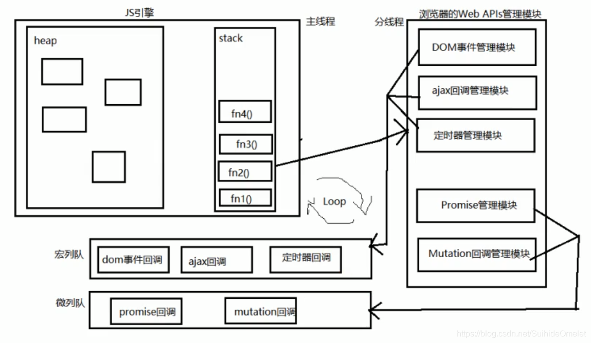

- JS中用来存储待执行回调函数的队列包含2个不同特定的列队
- 宏列队:用来保存待执行的宏任务(回调)，比如:定时器回调/DOM事件回调/ajax回调
- 微列队:用来保存待执行的微任务(回调)，比如: promise的回调/MutationObserver的回调
- JS执行时会区别这2个队列
  - JS引擎首先必须先执行所有的初始化同步任务代码
  - 每次准备取出第一个宏任务执行前，都要将所有的微任务一个一个取出
    来执行

## Promise面试题

## 1

```html
<!DOCTYPE html>
<html lang="en">

<head>
    <meta charset="UTF-8">
    <meta http-equiv="X-UA-Compatible" content="IE=edge">
    <meta name="viewport" content="width=device-width, initial-scale=1.0">
    <title>Promise面试题</title>
</head>

<body>
    <script>
        setTimeout(() => { console.log(1) }, 0)
        Promise.resolve().then(() => {
            console.log(2)
        })
        Promise.resolve().then(() => {
            console.log(4)
        })
        console.log(3)
    </script>

</body>

</html>
```


## 2

```html
<!DOCTYPE html>
<html lang="en">

<head>
    <meta charset="UTF-8">
    <meta http-equiv="X-UA-Compatible" content="IE=edge">
    <meta name="viewport" content="width=device-width, initial-scale=1.0">
    <title>Promise面试题</title>
</head>

<body>
    <script>
        setTimeout(() => {
            console.log(1)
        }, 0)
        new Promise((resolve) => {
            console.log(2)
            resolve()
        }).then(() => { 
            console.log(3) 
        }).then(() => { 
            console.log(4) 
        })
        console.log(5)
    </script>

</body>

</html>
```


## 3

```html
<!DOCTYPE html>
<html lang="en">

<head>
    <meta charset="UTF-8">
    <meta http-equiv="X-UA-Compatible" content="IE=edge">
    <meta name="viewport" content="width=device-width, initial-scale=1.0">
    <title>Promise面试题</title>
</head>

<body>
    <script>
        const first = () => (new Promise((resolve, reject) => {
            console.log(3)
            let p = new Promise((resolve, reject) => {
                console.log(7)
                setTimeout(() => {
                    console.log(5);
                    resolve(6)
                }, 0)
                resolve(1)
            })
            resolve(2)
            p.then((arg) => {
                console.log(arg)
            })
        }))

        first().then((arg) => {
            console.log(arg)
        })

        console.log(4)

    </script>

</body>

</html>
```


##  4

```html
<!DOCTYPE html>
<html lang="en">

<head>
    <meta charset="UTF-8">
    <meta http-equiv="X-UA-Compatible" content="IE=edge">
    <meta name="viewport" content="width=device-width, initial-scale=1.0">
    <title>Promise面试题</title>
</head>

<body>
    <script>
        setTimeout(() => {
            console.log("0")
        }, 0)
        new Promise((resolve, reject) => {
            console.log('1')
            resolve()
        }).then(() => {
            console.log("2")
            new Promise((resolve, reject) => {
                console.log("3")
                resolve()
            }).then(() => {
                console.log("4")
            }).then(() => {
                console.log("5")
            }).then(() => {
                console.log("6")
            })
        })
        new Promise((resolve, reject) => {
            console .log('7')
            resolve()
        }).then(() => { 
            console.log("8") 
        })

    </script>

</body>

</html>
```

