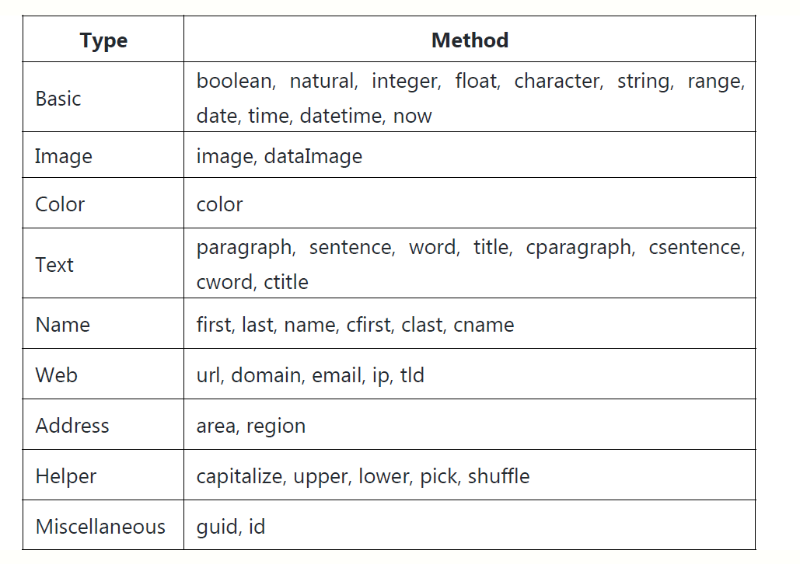

# Mock.js

## 一、技术说明

1.Mock.js是一款模拟JSON 数据的前端技术，为什么要产生这种技术?

2．对于前后端分离的项目，后端工程师的API数据迟迟没有上线;
3．而前端工程师却没有JSON数据进行数据填充，自己写后端模拟又太繁重;

4．这个时候，Mock.js就能解决这个问题，让前端工程师更加独立做自己;

5．官方网站为: mockjs.com;学前基础: Vue2.x基础完结后方可学习;

## 二、安装测试

1.安装方式，我们这里提供两种，一种在node下运行，另一种在浏览器下运行;

2.如果在node下运行，需要先安装node.js，官网: nodejs.org/zh-cn/;

3.安装好后，我们先在 webstorm或vscode终端测试node是否已安装，命令:

```bash
node -v
```

4.创建Mock目录，先安装node下的mock.js;

```bash
npm install mockjs
```

5.在node中使用

```js
//引入mock.js，相当于src=mock.js
const Mock = require('mockjs');
//创建模拟数据
const data = Mock.mock({
  //属性list的值是一个数组，其中含有1 到10个元素
  'list|1-10': [{
    //属性id是一个自增数，起始值为1，每次增1
    'id|+1': 1
}]
});
//输出结果
console.log(data); //转换JSON格式
console.log(JSON.stringify(data, null,4));

```

6.在浏览器中使用

```html
<!DOCTYPE html>
<html lang="en">
<head>
  <meta charset="UTF-8">
  <meta http-equiv="X-UA-Compatible" content="IE=edge">
  <meta name="viewport" content="width=device-width, initial-scale=1.0">
  <title>在浏览器种使用MockJS</title>
</head>
<body>
  <script type="text/javascript" src="http://mockjs.com/dist/mock.js"></script>
  <script>
    //创建模拟数据
      const data = Mock.mock({
        //属性list的值是一个数组，其中含有1 到10个元素
        'list|1-10': [{
          //属性id是一个自增数，起始值为1，每次增1
          'id|+1': 1
        }]
      });
      //输出结果
      console.log(data); //转换JSON格式
      console.log(JSON.stringify(data, null, 4));

  </script>
</body>
</html>
```

## 三、mockjs的语法规范

1. Mock.js 的语法规范包括两个部分：数据模板定义规范和数据占位定义规范；
2. 数据模板定义的规范包含3 个部分：属性名、生成规则和属性值；
'属性名|生成规则' : 属性值//'name|rule' : value
3. 字符串、数值有7 种生成规则，具体如表说明：


4. 除了以上几种规则格式，还有布尔值、对象和数组等规则；


5. 也支持函数和正则表达式


6. 数据定义的占位符@，比较好理解，占领属性值的位置；

```json
'list|5' : [{
	cname : '@cname',
	city : '@city',
	full : '@cname - @city'
}]
```

## 四、Mock.js 随机占位符

1. 通过'@占位符' 这种方式来随机产生各种不同的数据；

2. 有两种方式可以输出这种随机占位符，具体如下：

   ```js
   //第一种输入占位符的方式
   console.log(Mock.Random.cname());
   //第二种输入占位符的方式
   console.log(Mock.mock('@cname'));
   ```

   PS：如果在输出列表里，直接写'@cname' 更加的方便快捷；

3. 下表中，将所有的占位符的名称，罗列出来，我们挑最常用的演示；



```js
//随机中文人名，不带c 就是英文
console.log(Mock.mock('@cname'));
//随机ID
console.log(Mock.mock('@id'));
//随机中文标题，不带c 就是英文
console.log(Mock.mock('@ctitle'));
//随机颜色，十六进制
console.log(Mock.mock('@color'));
//随机图片，给你一个图片地址
console.log(Mock.mock('@image'));
//随机ip 地址
console.log(Mock.mock('@ip'));
//随机url 地址
console.log(Mock.mock('@url'));
//随机字符串
console.log(Mock.mock('@string'));
//随机数值
console.log(Mock.mock('@integer'));
//随机日期
console.log(Mock.mock('@datetime'));
```

4.  如果没有我们想要的数据格式进行填充，可以使用扩展功能自己扩展；

```js
//自行扩展，各种商店名称
Mock.Random.extend({
	cstore() {
        return this.pick([
            '宠物店',
            '美容店',
            '小吃店',
            '数码店',
            '快餐店'
        ]);
	}
});
//扩展调用
console.log(Mock.mock('@cstore'));
```

## 五、Mock 拦截axios 请求

1. 这个也是最终的需求功能，我们假设axios 异步请求的数据尚未上线或不全；
2. 然后再通过mock 请求拦截，随机生成填充的数据进行前端设计；

```js
axios.request({
    method : 'get',
    	url : 'https://cdn.liyanhui.com/data.json'
    }).then(res => {
    	console.log(res.data);
});
//mock 拦截，并随机生成填充数据
Mock.mock('https://cdn.liyanhui.com/data.json', {
    'list|5-10': [{
        'id|+1': 1,
        'username' : '@cname',
        'email' : '@email',
        'price' : '@integer',
        'gender' : '@boolean'
    }]
})
```

