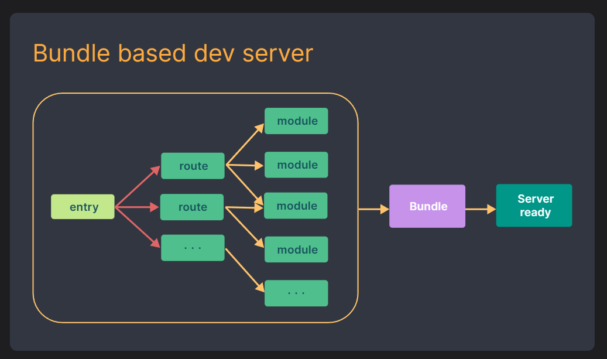
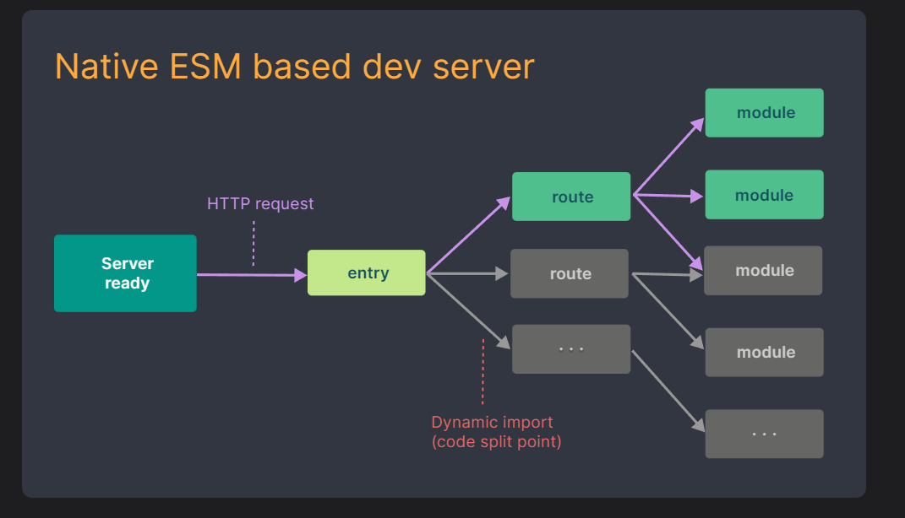

# Vite

## 什么是构建工具

### 一个构建工具他到底承担了哪些脏活累活:
- 模块化开发支持:支持直接从node modules里引入代码 + 多种模块化支持
- 处理代码兼容性: 比如babel语法降级，less,ts 语法转换(**不是构建工具做的，构建工具将这些语法对应的处理工具集成进来自动化处理**
- 提高项目性能: 压缩文件，**代码分割**
- 优化开发体验:
  - 构建工具会帮你自动监听文件的变化，当文件变化以后自动帮你调用对应的集成工具进行重新打包，然后再浏览器重新运行(整个过程叫做热更新，hot replacement)
  - 解决跨域的问题，开发服务器

------


## vite 相较于 webpack的优势

### 官网地址：[为什么选 Vite | Vite 官方中文文档 (vitejs.dev)](https://cn.vitejs.dev/guide/why.html)

### 起因

- 项目越大，webpack要处理的js代码就越多（跟webpack的构建过程（工作流程）有关系）

### 造成的结果

- 构建工具需要很长的时间才能启动开发服务器

### webpack能不能改？

- 如果一旦要改，将改动到webpack的大动脉

- ```js
  const loadash = require("loadash")
  import Vue from 'vue'
  
  // 经过webpack编译后
  
  const loadash = webpack_require('loadash')
  const vue = webpack_require('vue')
  ```

- 原因：webpack支持多种模块化，工程 不只是跑在浏览器端，也有可能跑在服务端，一开始就要统一模块代码，意味着webpack需要将所有的依赖全部读一遍

- vite是基于 es modules的，侧重点不一样，webpack关注兼容性，而vite更加关注浏览器端的开发体验

### 两者的区别

- webpack

- 

- vite
- 

------


## vite脚手架和vite的区别

### 理解 `yarn create vite  `命令

- 全局安装一个东西：create-vite（vite的脚手架）
- 直接运行这个 create-vite bin 目录下的一个执行配置

### 误区

- 误区：认为vite官网中使用对应的`yarn create`构建项目的过程也是vite在做的事
- vite与create-vite的关系：create-vite内置了vite，正如 vue-cli 内置了webpack 
- create-vite对标vue-cli，属于脚手架
- vite对标webpack，属于构建工具

------


## vite启动项目

### 不使用vite的情况下

- vite 开箱即用，在默认情况下，例如使用 es modules引入 `import _ from 'lodash'`,此时浏览器会报错
- 在默认情况下，我们的esmodule去导入资源的时候，要么是绝对路径，要么是相对路径
- 既然我们现在的最佳实践就是ode modules，那为什么es官方在我们导入非绝对路径和非相对路径的资源的时候不默认帮我们 搜寻node_modules呢?
- 与commonJs的差别是：在浏览器端，如果支持的话会导致大量的网络请求，而commonJs在服务端属于文件读取

### 使用vite的情况

- `yarn add vite -D`安装 vite
- 配置 vite 启动命令 `yarn run vite`
- 此时 vite 会启动一个服务器，此时的lodash能被浏览器正确识别

------


## vite的预加载

- 查看源代码发现，经过vite打包后，lodash的引入变成了这样

- ```js
  import __vite__cjsImport0_lodash from "/node_modules/.vite/deps/lodash.js?v=e80eda40";
  ```

- 找寻依赖的过程是自当前目录依次向上查找的过程，直到搜寻到根目录或者搜寻到对应依赖为止` /user/node_modules/lodash`，`../`

- 开发环境

  - `yarn dev`   每次依赖与构建所重构建的相对路径都是正确的

- 生产环境

  - vite 会全权交给rollup去完成生产环境的打包

  - vite在考虑另外一个问题的时候就顺便把路径问题给解决了

    - 问题：其他的包不一定都是 es module导出的，也可能是commonJS导出的

    - 解决：vite会进行依赖预构建，首先vite会找到对应的依赖，然后调用esbuild(对js语法进行处理的一个库)，将其他规范的代码转换成es module 规范然后放在当前目录下的`node_modules/.vite/deps`

    - 解决了以下问题

    - ```js
      //a
      export default function a() {}
      
      //引入导出
      export { default as a } from './a.js'
      
      // 经vite预构建后可能就变成这样了
      function a() {}
      
      // 排除预构建
      // 在vite.config.js中配置
      export default {
          optimizeDeps:{
              exclude: ["lodash-es"] // 当遇到lodash-es的时候，不进行依赖预构建
          }
      }
      ```

    - 不同的第三方包会有不同的导出格式(这个是vite没法约束人家的事情)

    - 对路径的处理上可以直接使用.vite/deps，方便路径重写

    - 网络多包传输的性能问题(也是原生esmodule规范不敢支持node_modules的原因之一)，有了依赖预构建以后无论他有多少的额外export 和import，vite都会尽可能的将他们进行集成最后只生成一个或几个模块

------


## vite配置文件

### 1、vite配置文件的语法提示

- 如果使用的是webStrom，将会得到较好的语法提示
- 如果使用的是VS code, 则需要做一些其他的处理

```js
import { defineConfig } from 'vite'

export default defineConfig({
  optimizeDeps: {
    exclude: []
  }
})

/**
 * 也可以这样写
 */
/**@type import('vite').UserConfig*/
export default {
  optimizeDeps: {
    exclude:[]
  }
}
```

### 2、开发环境和生产环境的区分

- webpack中我们会命名这几个文件

  - webpack.dev.config.js
  - webpack.prod.config.js
  - webpack.base.config.js

- vite

  - ```js
    // vite.config.js
    import { defineConfig } from 'vite'
    import viteBaseConfig from './vite.base.config'
    import viteDevConfig from './vite.dev.config'
    import viteProdConfig from './vite.prod.config'
    
    const envResolver = {
      "build": () => {
        console.log('生产环境')
        return {
          ...viteBaseConfig,
          ...viteProdConfig
        }
      },
      "serve": () => {
        console.log('开发环境')
        return {
          ...viteBaseConfig,
          ...viteDevConfig
        }
      }
    }
    
    export default defineConfig(({ command }) => {
      console.log(command)
      return envResolver[command]()
    })
    ```

------


## vite 环境变量

### 环境变量

- 会根据当前代码环境产生值的变化的变量就是环境变量
- 代码环境
  - 开发环境
  - 测试环境
  - 预发布环境
  - 灰度环境
  - 生产环境等等

- 例子：百度地图SDK，小程序SDK

  - APP_KEY: 测试环境和生产还有开发环境是不一样的key
    开发环境: 110

    生产环境: 111

    测试环境: 112

  - 我们去请求第三方sdk接口的时候需要带上的一个身份信息

```JS
const getUsePosition = () => {
  return axios.post({
    params: {
      APP_KEY: 110
    }
  })
}

axios.baseUrl = 'http://test.api/' // 测试环境
// http://api/ 生产环境
const getCurrentLoginUser = () => {
  axios.post({
    url: 'user/info'
  })
}
```

### 在vite中环境变量的配置（服务端）

- vite内置了dotenv这个库

- dotenv会自动读取.env文件，并解析这个文件中的对应的环境变量，并将其注入到`process`对象下

  - 补充一个小知识:为什么vite,config.js可以书写成esmodule的形式，这是因为vite他在读取这个vite.config.js的时候会率先node去解析文件语法，如果发现你是esmodule规范会直接将你的esmodule规范进行替换变成commonjs规范

- 但是vite考虑到和其他配置的一些冲突问题，他不会直接注入到process对象下

- 涉及到vite.config.js中的一些配置：

  - root
  - envDir：用来配置当前环境变量的地址

- vite给我们提供了一些补偿措施:我们可以调用vite的loadEnv来手动确认env文件

- 当我们调用Loadenv的时候，他会做如下几件事:

  - 直接找到.env文件不解释 并解析其中的环境变量 并放进一个对象里

  - 会将传进来的mode这个变量的值进行拼接: .env.development并根据我们提供的目录去取对应的配置文件并进行解析，并放进一个对象

  - 可以理解为：

    ```js
    const baseEnvConfig = 读取.env的配置
    const modeEnvConfig = 读取env相关配置
    const lastEnvConfig = { ...baseEnvConfig,...modeEnvConfig }
    ```

  ```js
  import { defineConfig, loadEnv } from 'vite'
  import viteBaseConfig from './vite.base.config'
  import viteDevConfig from './vite.dev.config'
  import viteProdConfig from './vite.prod.config'
  
  const envResolver = {
    "build": () => {
      console.log('生产环境')
      return {
        ...viteBaseConfig,
        ...viteProdConfig
      }
    },
    "serve": () => {
      console.log('开发环境')
      return {
        ...viteBaseConfig,
        ...viteDevConfig
      }
    }
  }
  
  export default defineConfig(({ command, mode }) => {
    console.log(command)
    // mode 当前所处环境，取决于启动命令后的mode yarn dev --mode development
    // process.cwd() 返回当前node进程的工作目录
    const env = loadEnv(mode, process.cwd(), "")
    console.log(env)
    return envResolver[command]()
  })
  ```

### 在客户端中的环境变量配置

- 如果是客户端，vite会将对应的环境变量注入到import.meta.env里去
- vite做了一个拦截，他为了防止我们将隐私性的变量直接送进importmeta,erv中，所以他做了一层拦截，如果你的环境变量不是以VITE开头的，他就不会帮你注入到客户端中去，如果我们想要更改这个前缀，可以去使用envPrefix配置

```js
import { defineConfig } from 'vite'
export default defineConfig({
  optimizeDeps: {
    exclude: []
  },
  envPrefix: 'ENV_'
}) 
```

------


## vite处理CSS

### vite天生就对CSS文件的直接处理

- vite在读取到mainjs中引用到了Index.css
- 直接去使用fs模块去读取index.css中文件内容
- 直接创建一个style标签，将index.css中文件内容直接copy进style标签里
- 将style标签插入到index.html的head中
- 将该CSS文件中的内容直接替换为js脚本(方便热更新或者css模块化)，同时设置Content-Type为js 从而让测览器以JS脚本的形式来执行该CSS后缀的文件

### vite CSS module 原理

- module.css (module是一种约定，表示需要开启css模块化)
- 他会将你的所有类名进行一定规则的替换(将footer 替换成 _foter_i22st_1)_
- 同时创建一个映射对象{ footer:“_footer_i22st_1” }
- 将替换过后的内容塞进style标签里然后放入到head标签中(能够读到index,html的文件内容)
- 将componentA.module.css内容进行全部抹除，替换成JS脚本
- 将创建的映射对象在脚本中进行默认导出

------


## vite.config.js中的css配置

### modules篇

在vite.config.js中我们通过css属性去控制整个vite对于css的处理行为

- `localConvention`:修改生成的配置对象的key的展示形式(驼峰还是中划线形式)
- `scopeBehaviour`:配置当前的模块化行为是模块化还是全局化有hash就是开启了模块化的一个标志，因为他可以保证产生不同的hash值来控制我们的样式类名不被覆盖)

- `generateScopedName`: 生成的类名的规则(可以配置为函数，也可以配置成字符串规则: https://github,com/webpack/loader-utils#interpolatename)
- `hashPrefix`:成hash会根提你的类名 + 一些其他的字电(文件名他内部机生成一字)去进行生成，如果你想要你生成hash更加8独特一点，你可以配置hashPrefix，你配置的这个字符电会参与到最终的hash生成，(hash: 只要你的字符有一个字不-样，那么生成的hash前完全不一样，但是只要你的字符串完全一样，生成的hash就会一样)
- `globalModulePaths`：  不想参与到css模块化的路径

```js
css: { // 对CSS的行为进行配置
    // modules 最终会丢给 postcss modules处理 
    modules: { // 对css模块化默认行为进行覆盖
      localsConvention: 'camelCase', // 修改生成的配置对象的key的展示形式（驼峰还是中划线）
      scopeBehaviour: 'global', // 配置当前模块化行为是模块化还是全局化
      generateScopedName : '[name]_[local]_[hash:5]', 
      // generateScopedName: (name, filename, css) => {
      //   // name --> 此刻css文件中的类名
      //   // filename --> 当前css的绝对路径
      //   // css --> 当前的样式
      //   console.log(name, filename, css)
      //   // 配置成函数后，返回值就决定最终的显示类型
      //   return '123'
      // },
      hashPrefix: 'hello', // 生成的hash会加上这个前缀去生成
      globalModulePaths: ['./'] // 不想参与到css模块化的路径
    }
  }
```


### preprocessorOption篇

主要是用来配置css预处理的一些全局参数

```js
css: {
    preprocessorOptions: { // key + config key代表预处理的名
      less: { // 整个配置对象都会最终给到less的执行参数(全局参数)中去
        Math: 'always', // 是否识别数学运算
        globalVars: { // 全局变量
          mainColor: 'red'
        },
        devSourcemap: true // 开启css的sourceMap(文件索引)
      }
    }
}
```


### postcss篇

#### vite天生对postcss有非常良好的支持

postcss的作用

- postcss 他的工作基本和全屋净水系统一致: 保证css在执行起来是万无一失的
- 我们写的css代码(怎么爽怎么来) --> postcss ---> less --> 再次对未来的高级css语法进行降级 --> 前缀补全 --> 浏览器客户端

postcss解决的问题

- 浏览器的兼容性你能考虑到吗, 预处理器并不能够解决这些问题:

  - 对未来css属性的一些使用降级问题

  - 前缀补全: Google非常卷 --webkit

**对postcss有一个误区: 他们认为postcss和less sass是差不多级别**，但其实postcss是可以包含less等预处理器的

目前来说 less和sass等一系列预处理器的postcss插件已经停止维护了 less插件 你自己去用less和sass编译完了, 然后你把编译结果给我

**所以业内就产生了一个新的说法: postcss是后处理器** less的postcss的插件就ok了

使用postcss

- 安装依赖

```
yarn add postcss-cli postcss -D
```

- 书写描述文件
  - postcss配置文件的格式
    - postcss.config.js

#### 直接在css.postcss中进行配置, 该属性直接配置的就是postcss的配置

- postcss-preset-env: 支持css变量和一些未来css语法 自动补全(autoprefixer)

- ```js
  css: {
      // 优先级高于 post.config.js
  	postcss: {
        plugins: [postcssPreseyEnv()]
      }
  }
  
  // 也可以在post.config.js中进行配置
  ```

#### postcss 编译全局css变量

```js
const path = require('path')
css: {
    // 优先级高于 post.config.js
	postcss: {
      plugins: [postcssPreseyEnv({
        // 后续会被移除
      	importForm: path.resolve(__dirName, './variable.css') // 让postcss 知道有一些全局变量需要去记住
      })]
    }
}
```


## vite加载静态资源

