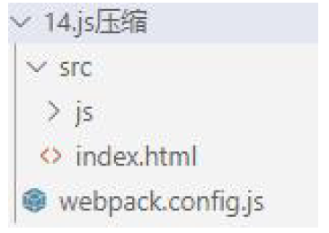

# 第1 章：webpack 简介

#### 1.1 webpack 是什么

- webpack 是一种前端资源构建工具，一个静态模块打包器(module bundler)。
- 在webpack 看来, 前端的所有资源文件(js/json/css/img/less/...)都会作为模块处理。
- 它将根据模块的依赖关系进行静态分析，打包生成对应的静态资源(bundle)。

#### 1.2 webpack 五个核心概念

##### 1.2.1 Entry

- 入口(Entry)指示webpack 以哪个文件为入口起点开始打包，分析构建内部依赖图。

##### 1.2.2 Output

- 输出(Output)指示webpack 打包后的资源bundles 输出到哪里去，以及如何命名。

##### 1.2.3 Loader

- Loader 让webpack 能够去处理那些非JavaScript 文件(webpack 自身只处理JavaScript)

##### 1.2.4 Plugins

- 插件(Plugins)可以用于执行范围更广的任务。插件的范围包括，从打包优化和压缩，一直到重新定义环境中的变量等。

##### 1.2.5 Mode

- 模式(Mode)指示webpack 使用相应模式的配置。

|    选项     |                             描述                             |              特点               |
| :---------: | :----------------------------------------------------------: | :-----------------------------: |
| development | 会将DefinePlugin 中process.env.NODE_ENV 的值设置<br/>为development。启用NamedChunksPlugin 和<br/>NamedModulesPlugin。 | 能让代码本地调试<br/>运行的环境 |
| production  | 会将DefinePlugin 中process.env.NODE_ENV 的值设置<br/>为production。启用FlagDependencyUsagePlugin,<br/>FlagIncludedChunksPlugin, ModuleConcatenationPlugin,<br/>NoEmitOnErrorsPlugin, OccurrenceOrderPlugin,<br/>SideEffectsFlagPlugin 和TerserPlugin。 | 能让代码优化上线<br/>运行的环境 |

# 第2 章：webpack 的初体验

### 2.1 初始化配置

1. 初始化package.json
输入指令:

```bash
 npm init
```

2. 下载并安装webpack
    输入指令:

```bash
npm install webpack webpack-cli -g
npm install webpack webpack-cli -D
```

### 2.2 编译打包应用

1. 创建文件

2. 运行指令

   开发环境指令：

```bash
webpack src/js/index.js -o build/js/built.js --mode=development
```

- 功能：webpack 能够编译打包js 和json 文件，并且能将es6 的模块化语法转换成
  浏览器能识别的语法。

  生产环境指令：

```bash
webpack src/js/index.js -o build/js/built.js --mode=production
```

- 功能：在开发配置功能上多一个功能，压缩代码。

3. 结论
- webpack 能够编译打包js 和json 文件。
- 能将es6 的模块化语法转换成浏览器能识别的语法。
- 能压缩代码。

4. 问题
- 不能编译打包css、img 等文件。
- 不能将js 的es6 基本语法转化为es5 以下语法。

# 第3 章：webpack 开发环境的基本配置

### 3.1 创建配置文件

1. 创建文件webpack.config.js
2. 配置内容如下

```javascript
const { resolve } = require('path'); // node 内置核心模块，用来处理路径问题。
module.exports = {
	entry: './src/js/index.js', // 入口文件
	output: { // 输出配置
		filename: './built.js', // 输出文件名
		path: resolve(__dirname, 'build/js') // 输出文件路径配置
	},
	mode: 'development' //开发环境
};
```

3. 运行指令: 

```bash
webpack
```

4. 结论: 此时功能与上节一致

### 3.2 打包样式资源

1. 创建文件


2. 下载安装loader 包

```bash
npm i css-loader style-loader less-loader less -D
```

3. 修改配置文件

```javascript
// resolve 用来拼接绝对路径的方法
const { resolve } = require('path');
module.exports = {
	// webpack 配置
	// 入口起点
	entry: './src/index.js',
	// 输出
	output: {
		// 输出文件名
		filename: 'built.js',
		// 输出路径
		// __dirname nodejs 的变量，代表当前文件的目录绝对路径
		path: resolve(__dirname, 'build')
    },
	// loader 的配置
	module: {
		rules: [
			// 详细loader 配置
			// 不同文件必须配置不同loader 处理
			{
				// 匹配哪些文件
				test: /\.css$/,
				// 使用哪些loader 进行处理
				use: [
					// use 数组中loader 执行顺序：从右到左，从下到上依次执行
					// 创建style 标签，将js 中的样式资源插入进行，添加到head 中生效
					'style-loader',
					// 将css 文件变成commonjs 模块加载js 中，里面内容是样式字符串
					'css-loader'
				]
			},
			{
				test:/\.less$/,
				use: [
					'style-loader',
					'css-loader',
					// 将less 文件编译成css 文件
					// 需要下载less-loader 和less
					'less-loader'
				]
			}
		]
	},
	// plugins 的配置
	plugins: [
		// 详细plugins 的配置
	],
	// 模式
	mode: 'development', // 开发模式
	// mode: 'production'
}
```

4. 运行指令: 

```bash
 webpack
```

### 3.3 打包HTML 资源

1. 创建文件


2. 下载安装plugin 包

```bash
npm install --save-dev html-webpack-plugin
```

3. 修改配置文件

```javascript
const { resolve } = require('path');
const HtmlWebpackPlugin = require('html-webpack-plugin');

module.exports = {
	entry: './src/index.js',
	output: {
		filename: 'built.js',
		path: resolve(__dirname, 'build')
	},
	module: {
		rules: [
		// loader 的配置
		]
	},
    plugins: [
	// plugins 的配置
	// html-webpack-plugin
	// 功能：默认会创建一个空的HTML，自动引入打包输出的所有资源（JS/CSS）
	// 需求：需要有结构的HTML 文件
	new HtmlWebpackPlugin({
		// 复制'./src/index.html' 文件，并自动引入打包输出的所有资源（JS/CSS）
		template: './src/index.html'
	})
	],
	mode: 'development'
};
```

4. 运行指令: 

```bash
webpack
```

### 3.4 打包图片资源

1. 创建文件


2. 下载安装loader 包

```bash
npm install --save-dev html-loader url-loader file-loader
```

3. 修改配置文件

```javascript
const { resolve } = require('path');
const HtmlWebpackPlugin = require('html-webpack-plugin');
module.exports = {
	entry: './src/index.js',
	output: {
		filename: 'built.js',
		path: resolve(__dirname, 'build')
	},
	module: {
		rules: [
			{
				test: /\.less$/,
				// 要使用多个loader 处理用use
				use: ['style-loader', 'css-loader', 'less-loader']
			},
            {
				// 问题：默认处理不了html 中img 图片
				// 处理图片资源
				test: /\.(jpg|png|gif)$/,
				// 使用一个loader
				// 下载url-loader file-loader
				loader: 'url-loader',
				options: {
                    // 图片大小小于8kb，就会被base64 处理
					// 优点: 减少请求数量（减轻服务器压力）
					// 缺点：图片体积会更大（文件请求速度更慢）
					limit: 8 * 1024,
					// 问题：因为url-loader 默认使用es6 模块化解析，
                    //而html-loader 引入图片是commonjs
					// 解析时会出问题：[object Module]
					// 解决：关闭url-loader 的es6 模块化，使用commonjs 解析
					esModule: false,
					// 给图片进行重命名
					// [hash:10]取图片的hash 的前10 位
					// [ext]取文件原来扩展名
					name: '[hash:10].[ext]'
				}
        	},
            {
				test: /\.html$/,
				// 处理html 文件的img 图片（负责引入img，从而能被url-loader 进行处理）
				loader: 'html-loader'
			}
		]
	},
    plugins: [
		new HtmlWebpackPlugin({
			template: './src/index.html'
		})
	],
	mode: 'development'
};
```

4. 运行指令: 

```bash
webpack
```

### 3.5 打包其他资源

1. 创建文件


2. 修改配置文件

```javascript
const { resolve } = require('path');
const HtmlWebpackPlugin = require('html-webpack-plugin');
module.exports = {
	entry: './src/index.js',
	output: {
		filename: 'built.js',
		path: resolve(__dirname, 'build')
	},
	module: {
		rules: [
			{
				test: /\.css$/,
				use: ['style-loader', 'css-loader']
			},
            // 打包其他资源(除了html/js/css 资源以外的资源)
			{
				// 排除css/js/html 资源
				exclude: /\.(css|js|html|less)$/,
				loader: 'file-loader',
				options: {
					name: '[hash:10].[ext]'
				}
			}
		]
	},
    plugins: [
		new HtmlWebpackPlugin({
			template: './src/index.html'
		})
    ],
	mode: 'development'
};
```

4. 运行指令: 

```bash
webpack
```

### 3.6 devserver

1. 创建文件


2. 修改配置文件
   

```javascript
const { resolve } = require('path');
const HtmlWebpackPlugin = require('html-webpack-plugin');
module.exports = {
	entry: './src/index.js',
	output: {
		filename: 'built.js',
		path: resolve(__dirname, 'build')
	},
    module: {
		rules: [
			{
				test: /\.css$/,
				use: ['style-loader', 'css-loader']
			},
			// 打包其他资源(除了html/js/css 资源以外的资源)
			{
				// 排除css/js/html 资源
				exclude: /\.(css|js|html|less)$/,
                loader: 'file-loader',
				options: {
					name: '[hash:10].[ext]'
				}
			}
		]
	},
    plugins: [
		new HtmlWebpackPlugin({
			template: './src/index.html'
		})
	],
    mode: 'development',
	devServer: {
		// 项目构建后路径
		contentBase: resolve(__dirname, 'build'),
		// 启动gzip 压缩
		compress: true,
		// 端口号
		port: 3000,
		// 自动打开浏览器
		open: true
	}
};
```

4. 运行指令:

```bash
 npx webpack-dev-server
```

### 3.7 开发环境配置

1. 创建文件


2. 修改配置文件

```javascript
const { resolve } = require('path');
const HtmlWebpackPlugin = require('html-webpack-plugin');
module.exports = {
	entry: './src/js/index.js',
	output: {
		filename: 'js/built.js',
		path: resolve(__dirname, 'build')
	},
    module: {
		rules: [
			// loader 的配置
			{
				// 处理less 资源
				test: /\.less$/,
				use: ['style-loader', 'css-loader', 'less-loader']
			},
			{
				// 处理css 资源
				test: /\.css$/,
				use: ['style-loader', 'css-loader']
			},
            {
				// 处理图片资源
				test: /\.(jpg|png|gif)$/,
				loader: 'url-loader',
				options: {
					limit: 8 * 1024,
					name: '[hash:10].[ext]',
					// 关闭es6 模块化
					esModule: false,
					outputPath: 'imgs'
				}
			},
            {
				// 处理html 中img 资源
				test: /\.html$/,
				loader: 'html-loader'
			},
			{
				// 处理其他资源
				exclude: /\.(html|js|css|less|jpg|png|gif)/,
				loader: 'file-loader',
				options: {
                    name: '[hash:10].[ext]',
					outputPath: 'media'
				}
			}
		]
	},
    plugins: [
		// plugins 的配置
		new HtmlWebpackPlugin({
			template: './src/index.html'
		})
	],
    mode: 'development',
	devServer: {
		contentBase: resolve(__dirname, 'build'),
		compress: true,
		port: 3000,
		open: true
	}	
};
```

3. 运行指令: 

```bash
npx webpack-dev-server
```

# 第4 章：webpack 生产环境的基本配置

### 4.1 提取css 成单独文件

1. 下载安装包


2. 下载插件

```javascript
npm install --save-dev mini-css-extract-plugin
```

3. 修改配置文件

```javascript
const { resolve } = require('path');
const HtmlWebpackPlugin = require('html-webpack-plugin');
const MiniCssExtractPlugin = require('mini-css-extract-plugin');
module.exports = {
	entry: './src/js/index.js',
	output: {
		filename: 'js/built.js',
		path: resolve(__dirname, 'build')
	},
    module: {
		rules: [
			{
				test: /\.css$/,
				use: [
					// 创建style 标签，将样式放入
					// 'style-loader',
					// 这个loader 取代style-loader。作用：提取js 中的css 成单独文件
					MiniCssExtractPlugin.loader,
					// 将css 文件整合到js 文件中
					'css-loader'
				]
			}
        ]
	},
	plugins: [
		new HtmlWebpackPlugin({
			template: './src/index.html'
		}),
		new MiniCssExtractPlugin({
			// 对输出的css 文件进行重命名
			filename: 'css/built.css'
		})
	],
	mode: 'development'
};
```

​		4 . 运行指令:

```bash
 webpack
```

### 4.2 css 兼容性处理

1. 创建文件


2. 下载loader

```bash
npm install --save-dev postcss-loader postcss-preset-env
```

3. 修改配置文件

```javascript
const { resolve } = require('path');
const HtmlWebpackPlugin = require('html-webpack-plugin');
const MiniCssExtractPlugin = require('mini-css-extract-plugin');
// 设置nodejs 环境变量
// process.env.NODE_ENV = 'development';
module.exports = {
	entry: './src/js/index.js',
	output: {
		filename: 'js/built.js',
		path: resolve(__dirname, 'build')
	},
	module: {
		rules: [
			{
				test: /\.css$/,
				use: [
					MiniCssExtractPlugin.loader,
					'css-loader',
					{
						loader: 'postcss-loader',
						options: {
							ident: 'postcss',
							plugins: () => [
							// postcss 的插件
								require('postcss-preset-env')()
							]
						}
					}
				]
            }
		]
	},
    plugins: [
		new HtmlWebpackPlugin({
			template: './src/index.html'
		}),
		new MiniCssExtractPlugin({
			filename: 'css/built.css'
		})
	],
	mode: 'development'
};
```

4. 修改package.json

```json
"browserslist": {
	"development": [
		"last 1 chrome version",
		"last 1 firefox version",
		"last 1 safari version"
	],
	"production": [
		">0.2%",
		"not dead",
		"not op_mini all"
	]
}
```

5. 运行指令: 

```bash
webpack
```

### 4.3 压缩css

1. 创建文件


2. 下载安装包	

```bash
npm install --save-dev optimize-css-assets-webpack-plugin
```

3. 修改配置文件

```javascript
const { resolve } = require('path');
const HtmlWebpackPlugin = require('html-webpack-plugin');
const MiniCssExtractPlugin = require('mini-css-extract-plugin');
const OptimizeCssAssetsWebpackPlugin = require('optimize-css-assets-webpack-plugin')
// 设置nodejs 环境变量
// process.env.NODE_ENV = 'development';
module.exports = {
	entry: './src/js/index.js',
	output: {
		filename: 'js/built.js',
		path: resolve(__dirname, 'build')
	},
    module: {
		rules: [
			{
				test: /\.css$/,
				use: [
					MiniCssExtractPlugin.loader,
					'css-loader',
					{
						loader: 'postcss-loader',
						options: {
							ident: 'postcss',
							plugins: () => [
							// postcss 的插件
								require('postcss-preset-env')()
							]
						}
                     }
				]
			}
		]
	},
    plugins: [
		new HtmlWebpackPlugin({
			template: './src/index.html'
		}),
		new MiniCssExtractPlugin({
			filename: 'css/built.css'
		}),
		// 压缩css
		new OptimizeCssAssetsWebpackPlugin()
	],
	mode: 'development'
};
```

2. 运行指令:

```bash
 webpack
```

### 4.4 js 语法检查

1. 创建文件


2. 下载安装包

```bash
npm install --save-dev eslint-loader eslint eslint-config-airbnb-base eslint-plugin-import
```

3. 修改配置文件

```javascript
const { resolve } = require('path');
const HtmlWebpackPlugin = require('html-webpack-plugin');
const MiniCssExtractPlugin = require('mini-css-extract-plugin');
const OptimizeCssAssetsWebpackPlugin = require('optimize-css-assets-webpack-plugin')
// 设置nodejs 环境变量
// process.env.NODE_ENV = 'development';
module.exports = {
	entry: './src/js/index.js',
	output: {
		filename: 'js/built.js',
		path: resolve(__dirname, 'build')
	},
    module: {
		rules: [
            /*
			语法检查： eslint-loader eslint
			注意：只检查自己写的源代码，第三方的库是不用检查的
			设置检查规则：
			package.json 中eslintConfig 中设置~
				"eslintConfig": {
					"extends": "airbnb-base"
				}
				airbnb --> eslint-config-airbnb-base eslint-plugin-import eslint
			*/
			{
				test: /\.js$/,
				exclude: /node_modules/,
				loader: 'eslint-loader',
				options: {
					// 自动修复eslint 的错误
					fix: true
				}
			}
		]
	},
    plugins: [
		new HtmlWebpackPlugin({
			template: './src/index.html'
		}),
		new MiniCssExtractPlugin({
			filename: 'css/built.css'
		}),
		// 压缩css
		new OptimizeCssAssetsWebpackPlugin()
	],
	mode: 'development'
};
```

4. 配置package.json

```json
"eslintConfig": {
	"extends": "airbnb-base",
	"env": {
		"browser": true
	}
}
```

5. 运行指令: 

```bash
webpack
```

### 4.5 js 兼容性处理

1. 创建文件


2. 下载安装包

```bash
npm install --save-dev babel-loader @babel/core @babel/preset-env @babel/polyfill core-js
```

3. 修改配置文件

```javascript
const { resolve } = require('path');
const HtmlWebpackPlugin = require('html-webpack-plugin');
module.exports = {
	entry: './src/js/index.js',
	output: {
		filename: 'js/built.js',
        path: resolve(__dirname, 'build')
	},
    module: {
		rules: [
			{
				test: /\.js$/,
				exclude: /node_modules/,
				loader: 'babel-loader',
                options: {
				// 预设：指示babel 做怎么样的兼容性处理
					presets: [
						[
							'@babel/preset-env',
							{
								// 按需加载
								useBuiltIns: 'usage',
								// 指定core-js 版本
								corejs: {
									version: 3
								},
                                // 指定兼容性做到哪个版本浏览器
								targets: {
									chrome: '60',
									firefox: '60',
									ie: '9',
									safari: '10',
									edge: '17'
								}
							}
						]
					]
				}
			}
		]
	},
    plugins: [
		new HtmlWebpackPlugin({
			template: './src/index.html'
		})
	],
	mode: 'development'
 };
```

4. 运行指令

```bash
webpack
```

### 4.6 js 压缩

1. 创建文件


2. 修改配置文件

```JavaScript
const { resolve } = require('path');
const HtmlWebpackPlugin = require('html-webpack-plugin');
module.exports = {
	entry: './src/js/index.js',
	output: {
		filename: 'js/built.js',
		path: resolve(__dirname, 'build')
	},
	plugins: [
		new HtmlWebpackPlugin({
			template: './src/index.html'
		})
	],
	// 生产环境下会自动压缩js 代码
	mode: 'production'
};
```

3. 运行指令: 

```bash
webpack
```

### 4.7 HTML 压缩

1. 创建文件



2. 修改配置文件

```JavaScript
const { resolve } = require('path');
const HtmlWebpackPlugin = require('html-webpack-plugin');
module.exports = {
	entry: './src/js/index.js',
	output: {
		filename: 'js/built.js',
		path: resolve(__dirname, 'build')
	},
    plugins: [
		new HtmlWebpackPlugin({
			template: './src/index.html',
			// 压缩html 代码
			minify: {
				// 移除空格
				collapseWhitespace: true,
				// 移除注释
				removeComments: true
			}
		})
	],
	mode: 'production'
};
```

2. 运行指令:

```bash
webpack
```

### 4.8 生产环境配置

1. 创建文件


2. 修改配置文件

```JavaScript
const { resolve } = require('path');
const MiniCssExtractPlugin = require('mini-css-extract-plugin');
const OptimizeCssAssetsWebpackPlugin = require('optimize-css-assets-webpack-plugin');
const HtmlWebpackPlugin = require('html-webpack-plugin');
// 定义nodejs 环境变量：决定使用browserslist 的哪个环境
process.env.NODE_ENV = 'production';
// 复用loader
const commonCssLoader = [
	MiniCssExtractPlugin.loader,
	'css-loader',
	{
		// 还需要在package.json 中定义browserslist
		loader: 'postcss-loader',
		options: {
			ident: 'postcss',
			plugins: () => [require('postcss-preset-env')()]
		}
	}
];
module.exports = {
	entry: './src/js/index.js',
	output: {
		filename: 'js/built.js',
		path: resolve(__dirname, 'build')
	},
    module: {
		rules: [
			{
				test: /\.css$/,
				use: [...commonCssLoader]
			},
			{
				test: /\.less$/,
				use: [...commonCssLoader, 'less-loader']
			},	
            /*
			正常来讲，一个文件只能被一个loader 处理。
			当一个文件要被多个loader 处理，那么一定要指定loader 执行的先后顺序：
			先执行eslint 在执行babel
			*/
            {
				// 在package.json 中eslintConfig --> airbnb
				test: /\.js$/,
				exclude: /node_modules/,
				// 优先执行
				enforce: 'pre',
				loader: 'eslint-loader',
				options: {
					fix: true
				}
			},
            {
				test: /\.js$/,
				exclude: /node_modules/,
				loader: 'babel-loader',
				options: {
					presets: [
						[
							'@babel/preset-env',
							{
								useBuiltIns: 'usage',
								corejs: {version: 3},
								targets: {
									chrome: '60',
									firefox: '50'
								}
							}
						]
					]
                }
			},
			{
				test: /\.(jpg|png|gif)/,
				loader: 'url-loader',
				options: {
					limit: 8 * 1024,
					name: '[hash:10].[ext]',
					outputPath: 'imgs',
					esModule: false
				}
            },
            {
				test: /\.html$/,
				loader: 'html-loader'
			},
			{
				exclude: /\.(js|css|less|html|jpg|png|gif)/,
				loader: 'file-loader',
				options: {
					outputPath: 'media'
				}
			}
		]
	},
    plugins: [
		new MiniCssExtractPlugin({
			filename: 'css/built.css'
		}),
		new OptimizeCssAssetsWebpackPlugin(),
		new HtmlWebpackPlugin({
			template: './src/index.html',
			minify: {
				collapseWhitespace: true,
				removeComments: true
			}
		})
	],
	mode: 'production'
};
```

3. 运行指令: 

```bash
webpack
```


# Webpack 5

