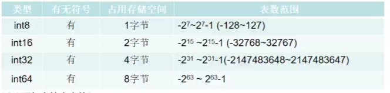
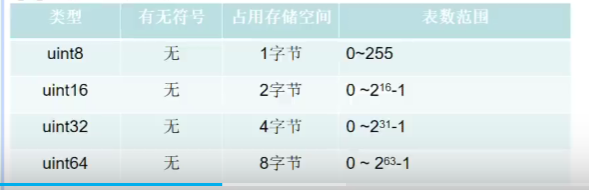
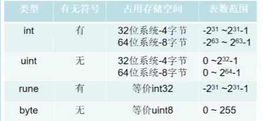
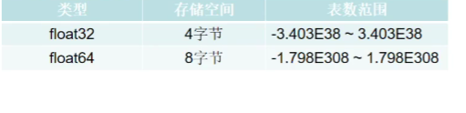
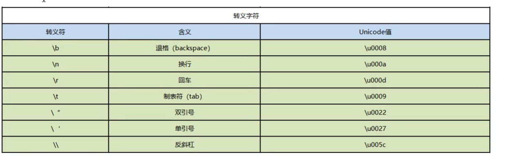
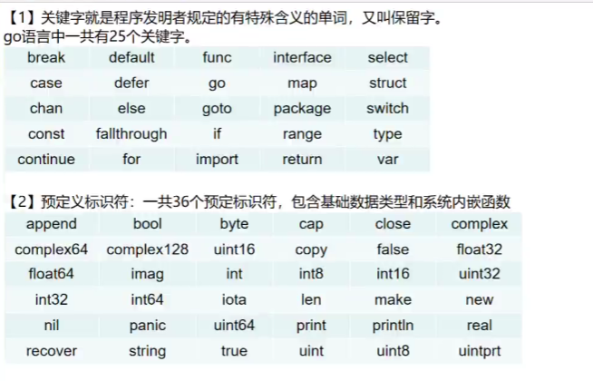

### GoLang的优势

#### 1、极简单的部署方式

- 可直接编译成机器码
- 不依赖其他库
- 直接运行部署即可

#### 2、静态类型语言

- 编译的时候检查出来隐藏的大多数问题

#### 3、语言层面的并发

- 天生的基因支持
- 充分利用多核

#### 4、强大的标准库

- runtime系统调度机制
- 高效的GC垃圾回收
- 丰富的标准库


### 第一个GO程序

#### 1、VSCode 使用问题

- [(6条消息) 关于go语言VScode see ‘go help modules‘ (exit status 1)问题的解决_一线摸鱼人员的博客-CSDN博客](https://blog.csdn.net/weixin_53328988/article/details/122518303)

#### 2、程序

- ```go
  package main // 程序的包名
  
  /*
  	多个导包加括号
  */
  import (
  	"fmt"
  	"time"
  )
  
  // main函数
  func main() { // 函数的 { 一定是和函数名在同一行的，否则编译错误
  	// golang 中的表达式，加不加分号都可以，建议是不加
  	fmt.Println("hello Go!")
  
  	time.Sleep(1 * time.Second)
  
  }
  
  ```

#### 3、执行过程

- 源文件 （.go 文件）->go build 编译后 ->  可执行文件（.exe）-> 运行 -> 执行结果

  - ```shell
    go build -o hello.exe test.go
    ```

- 源文件 （.go 文件）-> 编译运行 go run -> 执行结果

- 在编译时，编译器会将程序运行依赖的库文件包含在可执行文件中

- 可以执行文件可以在没有go环境的机器上运行

### 语法

- 以.go为扩展名
- 执行入口为main()函数
- 严格区分大小写
- 不需要加；
- 定义的变量和import的包未使用编译不通过


### 数据类型

#### 1、基本数据类型

- 数值型
  - 整数 `int` `int8` `in16` `int32` `int64` `uint`  `uint8`  `uint16`  `uint32`  `uint64` `byte`(默认值 0)
  - 有符号整数类型
  - 
  - 无符号整数类型
  - 
  - 其他整数类型
  - 
  - 浮点 `float32` `float64`(默认值 0)
  - 
- 字符型 （没有单独的字符型，使用byte来保存单个字母字符）
  - 与ASCII码对应
  - 汉字字符对应的时Unicode
  - 转义字符
  - 
- 布尔型 `bool`(默认值 false)
- 字符串 `string`(默认值 "")
- 数据类型转换
  - 基本数据类型:表达式T(v)将值v转换为类型T
    - T:就是数据类型
    - v:就是需要转换的变量
  - 基本数据类型转换成string
    - `fmt.Springf`
    - 使用`strconv`包的函数
  - string转换成基本数据类型
    - 使用`strconv`包的函数

#### 2、派生数据类型/复杂数据类型

- 指针
  - & + 变量名 可以获取变量在内存中的地址
  -  `*int` 指向int类型的指针
  - & 取内存地址
  - \* 根据地址取值
  - 可以通过指针改变指向值
  - 指针变量接收的是地址值
  - 指针变量的地址不可以不匹配
  - 基本数据类型都有对应的指针类型
- 数组
- 结构体
- 管道
- 函数
- 切片
- 接口
- map

#### 3、关键字和预定义运算符



### 变量

#### 1、声明

```go
package main

import "fmt"

// 声明全局变量，方法一、方法二、方法三是可以的
var gA int = 100
var gB = 200

// 用方法四来声明全局变量
// := 只能够使用在函数体中
// gC := 200 报错

func main() {
	// 四种变量声明方式
	// 方法一： 声明一个变量 默认值是0
	var a int
	fmt.Println("a = ", a)
	// 打印数据类型
	fmt.Printf("type of a = %T\n", a)

	// 方法二：声明一个变量，初始化一个值
	var b int = 100
	fmt.Println("b = ", b)
	fmt.Printf("type of b = %T\n", b)

	var bb string = "abcd"
	fmt.Printf("bb = %s, type of bb = %T\n", bb, bb)

	// 方法三：在初始化的时候，可以省去数据类型，通过值自动匹配当前的变量的数据类型
	var c = 100
	fmt.Println("c = ", c)
	fmt.Printf("type of c = %T\n", c)

	var cc string = "abcd"
	fmt.Printf("cc = %s, type of cc = %T\n", cc, cc)

	// 方法四：（常用的方法）省去var 关键字，直接自动匹配
	e := 100
	fmt.Println("e = ", e)
	fmt.Printf("type of e = %T\n", e)

	f := "abcd"
	fmt.Println("f = ", f)
	fmt.Printf("type of f = %T\n", f)

	g := 3.14
	fmt.Println("g = ", g)
	fmt.Printf("type of g = %T\n", g)

	fmt.Println("gA = ", gA, ", gB = ", gB)

	// 声明多个变量
	var xx, yy = 100, 200
	fmt.Println("xx = ", xx, ", yy = ", yy)

	var kk, ll = 100, "abc"
	fmt.Println("kk = ", kk, ", ll = ", ll)

	var (
		vv int = 100
		jj bool = true
	)
	fmt.Println("vv = ", vv, ", jj = ", jj)
}

```

### 常量

```go
package main

import "fmt"

// const 来定义枚举
// iota 只能配合const()使用
const (
	// 可以在const() 添加关键字iota，每行的iota都会累加1，第一行的iota的默认值为0
	BEIJING = iota // iota = 0
	SHANGHAI	   // iota = 1
	SHENZHEN       // iota = 2
)

const (
	a, b = iota + 1, iota + 2 // iota = 0, a = 1, b = 2
	c, d					  // iota = 1, c = 2, d = 3
	e, f					  // iota = 2, e = 3, f = 4

	g, h = iota * 2, iota * 3 // iota = 3, g = 6, h = 9
	i, j					  // iota = 4, i = 8, j = 12
)

func main()  {
	// 常量（只读属性）
	const length int = 100

	fmt.Println("length = ", length)

	fmt.Println("BEIJING = ", BEIJING)
	fmt.Println("SHANGHAI = ", SHANGHAI)
	fmt.Println("SHENZHEN = ", SHENZHEN)
}

```

### 运算符


### 流程控制

#### 1、if

- 单分支

  ```go
  /* if 条件表达式 {
   	逻辑代码
     }
  */
  // 在go中,if后面可以加入变量的定义
  if count := 20; count < 30 {
      // ....
  }
  ```

- 双分支

  ```go
  /* if 条件表达式 {
   	逻辑代码
     } else {
      逻辑代码
     }
  */
  // else 不能换行
  ```

- 多分支

  ```go
  /* if 条件表达式 {
   	逻辑代码
     } else if {
      逻辑代码
     } else {
      逻辑代码
     }
  */
  // else if 不能换行
  // else 不能换行
  ```

#### 2、switch

```go
/*
	switch 表达式 {
		case 值1 :
			语句
			break
		case 值2 :
			语句
			break
		default:
			语句
	}
*/
```

#### 3、for循环

```go
/*
 for 初始表达式;布尔表达式;迭代因子 {
 	循环体
 }
*/

// 结构灵活,可以写成以下形式
i := 1
for i< 5 {
    fmt.Println("hello")
    i ++
}

// 死循环
for {
   fmt.Println("hello")
}
for ;; {
   fmt.Println("hello")
}

// for range键值循环
str := "hello"
for key, value := range str {
    fmt.Println(key, value)
}
```

### 函数

```go
package main

import "fmt"

// 指定返回值，单个
func foo1(a string, b int) int {
	fmt.Println("a = ", a)
	fmt.Println("b = ", b)

	c := 200

	return c
}

// 返回多个返回值，匿名
func foo2(a string, b int) (int, int) {
	fmt.Println("a = ", a)
	fmt.Println("b = ", b)

	return 666, 777
}

// 返回多个返回值，有形参名
func foo3(a string, b int) (r1 int, r2 int)  {
	fmt.Println("a = ", a)
	fmt.Println("b = ", b)

	// r1 r2 是foo3的形参，默认为0
	// 作用域为 foo3

	// 给有名称的返回值变量赋值
	r1 = 100
	r2 = 200

	return
}

// 返回形参类型相同
func foo4(a string, b int) (r1, r2 int) {
	fmt.Println("a = ", a)
	fmt.Println("b = ", b)

	// 给有名称的返回值变量赋值
	r1 = 100
	r2 = 200

	return
}

func main()  {
	c := foo1("abc", 55)

	fmt.Println("c = ", c)

	ret1, ret2 := foo2("abc", 999)
	fmt.Println("ret1 = ", ret1, "ret2 = ", ret2)

	ret1, ret2 = foo3("ab", 99)
	fmt.Println("ret1 = ", ret1, "ret2 = ", ret2)

	ret1, ret2 = foo4("abcd", 997)
	fmt.Println("ret1 = ", ret1, "ret2 = ", ret2)
}

```

### init

```go
package lib1

import "fmt"

// 函数名首字母大写表示对外暴露
func Lib1Test()  {
	fmt.Println("lib1Test() ....")
}

func init()  {
	fmt.Println("lib1 init() ....")
}


```

```go
package lib2

import "fmt"

// 函数 、变量名大写表示可以在其他包调用
func Lib2Test()  {
	fmt.Println("lib2Test()....")
}


func init()  {
	fmt.Println("lib2 init() ....")
}

```

```go
package main

import (
	_ "Learn/5-init/lib1"  // 匿名，导入但不使用
	myLib2 "Learn/5-init/lib2" // 别名
	//. "Learn/5-init/lib2"  // 将包中的方法全部导入到本包中，在本包中可以直接使用，不建议使用
)

func main()  {
	//lib1.Lib1Test()
	//lib2.Lib2Test()

	myLib2.Lib2Test()
}

```

### 指针

```go
package main

import "fmt"

// 值传递
//func swap(a int, b int) {
//	var tmp int
//	tmp = a
//	a = b
//	b = tmp
//}

// 指针传递
func swap(pa *int, pb *int)  {
	var tmp int
	tmp = *pa // tmp = main :: a
	*pa = *pb
	*pb = tmp
}

func main() {
	var a int = 10
	var b int = 20

	// swap
	swap(&a, &b)
	fmt.Println("a = ", a, "b = ", b)

	var p *int
	p = &a

	fmt.Println(&a)
	fmt.Println(p)

	var pp **int // 二级指针

	pp = &p

	fmt.Println(&p)
	fmt.Println(pp)
}

```

### 匿名函数

```go
package main

import (
	"fmt"
)

func main() {
    result := func (num1 int, num2 int) {
        return num1 + num2
    }(10, 20)
    
    fmt.Println(result)
}
```

### 闭包

```go
func getSum() func(int) int {
	sum := 0
	return func (num int) int {
		sum += num
		return sum
	}
}
```

### defer

```go
package main

import "fmt"

func func1()  {
	fmt.Println("A")
}

func func2()  {
	fmt.Println("B")
}

func func3()  {
	fmt.Println("C")
}

func deferFunc() int {
	fmt.Println("defer func called")
	return 0
}

func returnFunc() int {
	fmt.Println("return func called")
	return 0
}

func returnAndDefer() int  {
	defer deferFunc()
	return returnFunc()
}

func main() {
	// 写入defer关键字
	// 在函数结束之前触发
	// defer 采用的是栈数据结构，先进后出，越后面的越早执行
	defer fmt.Println("main end1")
	defer fmt.Println("main end2")
	fmt.Println("main hello")

	// 输出结果 main hello  main end2  main end1


	// 知识点一：defer的执行顺序
	defer func1()
	defer func2()
	defer func3()

	// 输出结果 C B A

	// 知识点二：defer 和 return 先后
	// return 先于defer执行
	returnAndDefer()
    
    // 输出结果 return func called defer func called
}

```

### 字符串函数

```go
package main
import (
	"strconv" // 引入strconv包操作字符串
   	"strings" // 引入strings操作字符串
)

// 统计字符串长度
str := "hello"
len(str)

// 字符串的遍历
// 转换成切片，在使用for循环遍历
r := [] rune(str)
for i:= 0; i < len(str); i ++ {
    
}

// 字符串转整数
n, err := strconv.Atoi("66")

// 整数转字符串
str = strconv.Itoa(777)

// 查找字符串是否在指定的字符串中
strings.Contains("hello","o")

// 统计一个字符串有几个指定的子串
strings.Count("hello","o")

// 不区分大小写的字符串比较
strings.EqualFold("go","GO")

// 返回子串在字符串第一次出现的索引值，如果没有返回 -1
strings.Index("hello", "a")
```

### 日期和时间函数

```go
package main
import (
	"time" // 引入time包使用日期和时间函数
)

func main {
    now := time.Now()
}
```

### 内置函数

```go
// len 获取字符串或者数组的长度
str := 'hello'
len(str)

// new 分配内存 返回值是对应类型的指针
num := new(int)

//make 分配内存，用来分配引用类型（指针，slice切片，map, 管道chan，interface）
slice := make([] int, 3)
 
```

### 错误处理

#### 1、defer + recover

```go
package main
import "fmt"

func main {
    test()
}

func test() {
    // 利用defer + recover 来捕获错误
    defer func () {
        err := recover()
        if err != nil {
            
        }
    }()
    num1 := 10
    num2 := 0
    result := num1 / num2
}
```

#### 2、自定义错误

```go
package main
import (
	"fmt"
    "errors"
)

func main {
    test()
}

func test() {
    // 利用defer + recover 来捕获错误
    defer func () {
        err := recover()
        if err != nil {
            
        }
    }()
    num1 := 10
    num2 := 0
    if num == 0 {
        return errors.New("除数不能为零")
    }
    result := num1 / num2
}
```

### 切片slice

#### 1、数组

```go
package main

import "fmt"

// 值传递，且只能传递类型是 [4] int 的数组
func printArray(myArray [4] int)  {
	for index,value := range myArray {
		fmt.Println("index = ", index, "value = ", value)
	}
}

func main() {
	// 固定长度的数组
	var myArray1 [10] int // 默认值为0

	myArray2 := [10] int {1,2,3,4} // 前四位有值，后面为0

	//遍历数组
	//for i:= 0; i < 10; i ++ {
	for i:= 0; i < len(myArray1); i++ {
		fmt.Println(myArray1[i])
	}

	// range关键字
	for index,value := range myArray2 {
		fmt.Println("index = ", index, "value = ", value)
	}

	// 查看数组的数据类型
	fmt.Printf("myArray1 types = %T\n", myArray1) // [10] int
	fmt.Printf("myArray2 types = %T\n", myArray2) // [10] int
}

```

#### 2、动态数组，切片slice

```go
package main

import "fmt"

func printArray1(myArray [] int)  {
	// 引用传递
	// _ 表示匿名的变量
	for _,value := range myArray {
		fmt.Println("value = ", value)
	}

	myArray[0] = 100
}

func main() {
	myArray := [] int { 1, 2, 3, 4 } // 动态数组，切片slice

	fmt.Printf("myArray type is %T\n", myArray)

	printArray1(myArray)
}

```

#### 3、给切片分配空间

```go
package main

import "fmt"

func main() {
	// 声明slice是一个切片，并且初始化，默认值是1，2，3，长度len为3
	slice := [] int { 1, 2, 3 }

	// 声明slice1是一个切片，但是没有分配空间
	var slice1 [] int
	// 开辟一个空间
	slice1 = make([] int, 3)
	slice[0] = 100
	// 声明slice2是一个切片，同时给slice分配空间，3个空间，初始值为0
	//var slice2 [] int = make([] int, 3)
	slice2 := make([] int, 3)

	fmt.Printf("len = %d, slice = %v\n", len(slice), slice)
	fmt.Printf("len = %d, slice = %v\n", len(slice1), slice1)
	fmt.Printf("len = %d, slice = %v\n", len(slice2), slice2)

	var slice3 [] int
	if slice3 == nil {
		fmt.Println("空切片")
	} else {
		fmt.Println("有空间")
	}
}

```

#### 4、切片长度和容量

```go
package main

import "fmt"

func main() {
	// 长度为3，容量为5
	var numbers = make([] int, 3, 5)

	// len 长度， cap 容量
	fmt.Printf("len = %d, cap = %d, slice = %v\n", len(numbers), cap(numbers), numbers)

	// 向numbers切片追加一个元素1，numbers len = 4 [0,0,0,1] cap = 5
	numbers = append(numbers, 1)
	fmt.Printf("len = %d, cap = %d, slice = %v\n", len(numbers), cap(numbers), numbers)

	// 向numbers切片追加一个元素2，numbers len = 5 [0,0,0,1,2] cap = 5
	numbers = append(numbers, 2)
	fmt.Printf("len = %d, cap = %d, slice = %v\n", len(numbers), cap(numbers), numbers)

	// 向一个容量cap已经满的slice追加元素, 长度增加1，cap会翻倍
	numbers = append(numbers, 3)
	fmt.Printf("len = %d, cap = %d, slice = %v\n", len(numbers), cap(numbers), numbers)

	// 长度为3，不指定容量，cap = 3
	var numbers2 = make([] int, 3)
	fmt.Printf("len = %d, cap = %d, slice = %v\n", len(numbers2), cap(numbers2), numbers2)

	// 追加，相当于向满容量为3的切片追加
	numbers2 = append(numbers2, 3)
	fmt.Printf("len = %d, cap = %d, slice = %v\n", len(numbers2), cap(numbers2), numbers2)

}

```

#### 5、切片切割，拷贝

```go
package main

import "fmt"

func main() {
	s := [] int { 1, 2, 3 } // len = 3, cap = 3

	// [0, 2)
	s1 := s[0:2] // [1,2]
	fmt.Print("s1", s1)

	// s1 和 s 指向同一个地址，改变s1，s也会改变

	s1[0] = 100

	fmt.Print("s1", s1)
	fmt.Print("s", s)

	// copy 可以将底层数组的slice一起进行拷贝
	s2 := make([] int, 3)

	// 将s的值依次拷贝到s2中
	copy(s2, s)
	fmt.Print("s2", s2)

}

```

### map

#### 1、初始化map

```go
package main

import "fmt"

func main() {
	// 声明myMap1是一种map类型，key是string，value是string
	var myMap1 map [string] string
	if(myMap1 == nil) {
		fmt.Println("myMap1 是一个空map")
	}

	// 在使用map前，需要先使用make分配数据空间
	myMap1 = make(map[string] string, 10)

	myMap1["one"] = "java"
	myMap1["two"] = "c++"
	myMap1["three"] = "python"

	fmt.Println(myMap1)

	// 第二种声明方式，不指定空间大小，默认会分配
	myMap2 := make(map[int] string)

	myMap2[1] = "java"
	myMap2[2] = "c++"
	myMap2[3] = "python"

	fmt.Println(myMap2)

	// 第三种声明方式
	myMap3 := map[string] string {
		"one": "java",
		"two": "c++",
		"three": "python",
	}

	fmt.Println(myMap3)
}

```

#### 2、map的操作

```go
package main

import "fmt"

func printMap(cityMap map[string] string)  {
	// cityMap 是引用传递
	// 遍历
	for key, value := range cityMap {
		fmt.Println("key =", key, "value = ", value)
	}
}

func changeValueMap(cityMap map[string] string) {
	cityMap["England"] = "London"
}

func main() {
	cityMap := make(map[string] string)

	// 添加
	cityMap["China"] = "Beijing"
	cityMap["Japan"] = "Tokyo"
	cityMap["USA"] = "NewYork"

	// 遍历
	for key, value := range cityMap {
		fmt.Println("key =", key, "value = ", value)
	}

	// 删除
	delete(cityMap, "China")

	// 修改
	cityMap["USA"] = ""
	changeValueMap(cityMap)

	printMap(cityMap)
}
```

### oop

#### 1、struct

```go
package main

import "fmt"

// 声明一种新的数据类型 myInt, 是int的别名
type myInt int

// 定义一个结构体
type Book struct {
	title string
	author string
}

func changeBook(book Book)  {
	book.author = "666"
}

func changeBook2(book *Book)  {
	// 指针传递
	book.author = "666"
}

func main() {
	var a myInt = 10
	fmt.Println("a = ", a)
	fmt.Printf("type of a = %T\n", a)

	var book1 Book
	book1.title = "Golang"
	book1.author = "zhangSan"

	fmt.Printf("%v\n", book1)

	changeBook(book1)

	fmt.Printf("%v\n", book1)

	changeBook2(&book1)

	fmt.Printf("%v\n", book1)

}

```

#### 2、class

```go
package main

import "fmt"
// 如果类名首字母大写，表示其他包也能够访问
type Hero struct {
	// 如果类的属性首字母大写，表示该属性对外能够访问
	Name string
	Ad int
	Level int
}

//func (this Hero) Show()  {
//	fmt.Printf("%v\n", this)
//}
//
//func (this Hero) GetName () string  {
//	fmt.Println("Name =", this.Name)
//	return this.Name
//}
//
//func (this Hero) SetName (newName string)  {
//	this.Name = newName
//}

func (this *Hero) Show()  {
	fmt.Printf("%v\n", this)
}

func (this *Hero) GetName () string  {
	fmt.Println("Name =", this.Name)
	return this.Name
}

func (this *Hero) SetName (newName string)  {
	this.Name = newName
}

func main() {
	// 创建一个对象
	hero := Hero{
		Name: "zhangSan",
		Ad: 100,
		Level: 1,
	}

	hero.GetName()

	hero.SetName("liSi")

	hero.Show()
}

```

#### 3、继承

```go
package main

import "fmt"

type Human struct {
	name string
	sex string
}

func (h *Human) Eat()  {
	fmt.Println("Human Eat() ...")
}

func (h *Human) Walk()  {
	fmt.Println("Human Walk() ...")
}

type SuperMan struct {
	Human // 继承了Human类的属性和方法
	level int
}

// 重定义父类的方法
func (s *SuperMan) Eat()  {
	fmt.Println("SuperMan Eat() ...")
}

// 子类的新方法
func (s *SuperMan) Fly()  {
	fmt.Println("SuperMan Fly() ...")
}
func main() {
	human := Human{
		"zhangSan",
		"female",
	}

	human.Eat()
	human.Walk()


	// 定义子类对象
	superMan := SuperMan{
		Human{
			"liSi",
			"male",
		},
		88,
	}

	superMan.Walk()
	superMan.Eat()
	superMan.Fly()

}

```

#### 4、多态

- 接口

```go
package main

import "fmt"

// 本质是一个指针
type AnimalIF interface {
	Sleep()
	GetColor() string
	GetType() string
}

// 具体的类
type Cat struct {
	color string
}

// 直接实现接口中的方法，实现当前接口，必须全部实现
func (c *Cat) Sleep() {
	fmt.Println("Cat is Sleep....")
}

func (c *Cat) GetColor() string {
	return c.color
}

func (c *Cat) GetType() string{
	return "Cat"
}

type Dog struct {
	color string
}

// 直接实现接口中的方法，实现当前接口，必须全部实现
func (d *Dog) Sleep() {
	fmt.Println("Dog is Sleep....")
}

func (d *Dog) GetColor() string {
	return d.color
}

func (d *Dog) GetType() string{
	return "Dog"
}

func showAnimal(animal AnimalIF)  {
	animal.Sleep()
	fmt.Println("color", animal.GetColor())
	fmt.Println("type", animal.GetType())
}

func main() {
	var animal AnimalIF

	animal = &Cat{
		"Green",
	}

	animal.Sleep()

	animal = &Dog{
		"Yellow",
	}

	animal.Sleep()

	cat := Cat{
		"red",
	}

	dog := Dog{
		"black",
	}

	showAnimal(&cat)
	showAnimal(&dog)
}

```

- 万能数据类型interface{}

```go
package main

import "fmt"

// interface{}是万能数据类型
func myFunc(arg interface{}) {
	fmt.Println("myFunc is called")
	fmt.Println(arg)

	// interface {} 该如何区分 此时引用的底层数据类型到底是什么？

	// 给 interface{} 提供 "断言" 机制
	value, ok := arg.(string)
	if !ok {
		fmt.Println("arg is not string type")
	} else {
		fmt.Println(value)
	}
}

type Book1 struct {
	auth string
}

func main() {
	book := Book1{
		"zhangSan",
	}
	myFunc(book)
}

```

### 断言

- 直接判断是否是该类型的变量：`value, ok = element.(T)`

- ```go
  package main
  
  import (
  	"fmt"
  )
  
  type Person interface{
      sayHello()
  }
  
  type Chinese struct {
      Name string
  }
  
  func (c Chinese) sayHello () {
      fmt.Println("你好")
  }
  
  func (c Chinese) niuYangGe () {
      fmt.Println("扭秧歌")
  }
  
  type American struct {
       Name string
  }
  
  func (a American) sayHello () {
      fmt.Println("hello")
  }
  
  func greet (s Person) {
      s.sayHello()
      // 判断s是否是Chinese
      var ch Chinese = s.(Chinese)
      ch.niuYangGe()
      
    	// if的用法
      if ch, ok := s.(Chinese) {
          
      } else {
          
      }
      
      // type switch的用法
      switch s.(type) {
          case Chinese :
  
          case American
      }
  }
  
  func main () {
      c := Chinese { "张三" }
      a := American { "jack" }
      
      greet(a)
      
      greet(c)
  }
  ```

### reflect

#### 1、pair

```go
package main

import "fmt"

func main() {
	var a string

	// pair<type:string, value:"abcd">
	a = "abcd"

	// pair<type:string, value:"abcd">
	var allType interface{}
	allType = a

	// 断言
	value, ok := allType.(string)
	if !ok {
		fmt.Println("allType is not string type")
	} else {
		fmt.Println(value)
	}
}

```

```go
package main

import (
	"fmt"
	"io"
	"os"
)

func main() {
	// tty: pair<type: *os.File, value: "/dev/tty"文件描述符>
	tty, err := os.OpenFile("/dev/tty", os.O_RDWR, 0)
	if err != nil {
		fmt.Println("open file error", err)
		return
	}

	// r: pair<type: , value:>
	var r io.Reader

	// r: pair<type: *os.File, value: "/dev/tty"文件描述符>
	r = tty

	// w: pair<type: , value:>
	var w io.Writer

	// w: pair<type: *os.File, value: "/dev/tty"文件描述符>
	w = r.(io.Writer)

	w.Write([]byte("Hello This is a test\n"))
}

```

```go
package main

import "fmt"

type Reader interface {
	ReadBook()
}

type Writer interface {
	WriteBook()
}

type Book struct {

}

func (b *Book) ReadBook()  {
	fmt.Println("Read a Book")
}

func (b *Book) WriteBook() {
	fmt.Println("Write a Book")
}

func main() {
	// b : pair<type:Book, value:book{}地址>
	b := &Book{}

	// r : pair<type:, value:>
	var r Reader

	// r : pair<type:Book, value:book{}地址>
	r = b

	r.ReadBook()

	// w : pair<type:, value:>
	var w Writer

	// w : pair<type:Book, value:book{}地址>
	w = r.(Writer) // 此处的断言为什么会成功？ 因为w r 具体的type是一致的

	w.WriteBook()
}
```

#### 2、reflect

```go
package main

import (
	"fmt"
	"reflect"
)

func reflectNum(arg interface{}) {
	fmt.Println("type: ", reflect.TypeOf(arg))
	fmt.Println("type: ", reflect.ValueOf(arg))
}

func main() {
	var num float64 = 1.2345

	reflectNum(num)
}

```

```go
package main

import (
	"fmt"
	"reflect"
)

type User struct {
	Id int
	Name string
	Age int
}

func (u User) Call() {
	fmt.Println("User is called")
	fmt.Printf("%v\n", u)
}

func main() {
	user := User{
		1,
		"zhangSan",
		18,
	}

	DoFileAndMethod(user)

}

func DoFileAndMethod(input interface{}) {
	// 获取input的type
	inputType := reflect.TypeOf(input)
	fmt.Println("type:", inputType)
	// 获取input的value
	inputValue := reflect.ValueOf(input)
	fmt.Println("value:", inputValue)

	// 通过type 获取里面的字段
	// 1. 获取interface的reflect.Type, 通过Type得到NumFiled，进行遍历
	// 2. 得到每个Filed，数据类型
	// 3. 通过Filed有一个Interface()方法得到对应的value
	for i := 0; i < inputType.NumField(); i++ {
		filed := inputType.Field(i)
		value := inputValue.Field(i).Interface()

		fmt.Printf("%s: %v = %v\n", filed.Name, filed.Type, value)
	}

	// 通过type 获取里面的方法，调用
	for i := 0; i < inputType.NumMethod(); i++ {
		m := inputType.Method(i)

		fmt.Printf("%s: %v\n", m.Name, m.Type)

	}
}

```

#### 3、struct_tag

```go
package main

import (
	"fmt"
	"reflect"
)

type resume struct {
	Name string `info:"name" doc:"我的名字"`
	Sex string `info:"sex"`
}

func findTag(str interface{}) {
	t := reflect.TypeOf(str).Elem()

	for i := 0; i < t.NumField(); i ++ {
		tagString := t.Field(i).Tag.Get("info")
		fmt.Println("info:", tagString)
	}
}

func main() {
	var re resume

	findTag(&re)
}

```

### 文件操作

- `os`包下的`File`结构体封装了对文件的操作
- `io/util`封装了可以对文件进行读写操作的方法

### gorountine

#### 1、goexit

```go
package main

import (
	"fmt"
	"runtime"
	"time"
)

func main() {
	// 用 go 创建承载一个形参为空，返回值为空的函数
	go func() {
		defer fmt.Println("A.defer")

		func () {
			defer fmt.Println("B.defer")
			// 退出当前goroutine
			runtime.Goexit()
			fmt.Println("B")
		}()

		fmt.Println("A")
	}()

	for {
		time.Sleep(1 * time.Second)
	}
}

```

#### 2、gorountine

```go
package main

import (
	"fmt"
	"time"
)

// 从 goroutine
func newTask() {
	i := 0
	for {
		i ++
		fmt.Printf("new Goroutine : i = %d\n", i)
		time.Sleep(1 * time.Second)
	}
}


// 主 goroutine
func main() {

	// 创建一个go程 去执行newTask()
	go newTask()

	i := 0

	for {
		i ++
		fmt.Printf("main Goroutine : i = %d\n", i)
		time.Sleep(1 * time.Second)
	}
}

```

#### 3、WaitGroup 控制协程退出

```go
package main

import (
	"fmt"
    "sync"
)

var wg sync.WaitGroup

func main() {
    for i := 1; i < 5; i ++ {
        wg.Add(1)
        go func (n int) {
            defer wg.Done()
            fmt.Println(n)
        }(i)
    }
    
    wg.Wait()
}
```

#### 4、使用互斥锁同步协程

```go
package main

import (
	"fmt"
    "sync"
)

var totalNum int
var wg sync.WaitGroup
// 加入互斥锁
var lock sync.Mutex

func add () {
    defer wg.Done()
    for i := 0; i < 100000; i ++ {
        lock.Lock()
        totalNum = totalNum + 1
        lock.Unlock()
    }
}

func sub () {
    defer wg.Done()
    for i := 0; i < 100000; i ++ {
        lock.Lock()
        totalNum = totalNum - 1
        lock.Unlock()
    }
}

func main() {
    wg.Add(2)
    go add ()
    go sub ()
    
    wg.Wait()
}
```

#### 5、读写锁

```go
package main

import (
	"fmt"
    "sync"
)

var totalNum int
var wg sync.WaitGroup
// 加入读写锁
var lock sync.RWMutex

func read () {
    defer wg.Done()
    lock.RLock() // 读数据，锁不产生影响，读写同时发生时产生影响
    fmt.Println("开始读数据")
    time.Sleep(time.Second)
    fmt.Println("读取成功")
    lock.RUnlock()
}

func write () {
    defer wg.Done()
    lock.Lock() // 读数据，锁不产生影响，读写同时发生时产生影响
    fmt.Println("开始修改数据")
    time.Sleep(time.Second * 10)
    fmt.Println("修改成功")
    lock.Unlock()
}

func main() {
    wg.Add(5)
    for i := 0; i < 5; i ++ {
        go read ()
    }
    go write()
    wg.Wait()
}
```


### channel

```go
package main

import "fmt"

func main() {
	// 定义一个channel
	c := make(chan int)

	go func() {
		defer fmt.Println("goroutine end")

		fmt.Println("goroutine running")

		// 将 666 发送给 c
		c <- 666
	}()

	// 从c中接收数据，并赋值给num
	num := <- c

	fmt.Println("num = ", num)
	fmt.Println("main goroutine end")
}

```

```go
/**
无缓冲的channel

在第1步，两个 goroutine 都到达通道，但哪个都没有开始执行发送或者接收
在第2步，左侧的 goroutine 将它的手伸进了通道，这模拟了向通道发送数据的行为。这时，这个 goroutine 会在通道中被锁住，直到交换完成。
在第3步，右侧的 goroutine 将它的手放入通道，这模拟了从通道里接收数据。这个 goroutine 一样也会在通道中被锁住，直到交换完成。
在第4步和第5步，进行交换，并最终，在第 6 步，两个 goroutine 都将它们的手从通道里拿出来，这模拟了被锁住的 goroutine 得到释放。两个goroutine 现在都可以去做其他事情了。


有缓冲的channel

在第1步，右侧的 goroutine 正在从通道接收一个值。
在第 2步，右侧的这个 goroutine独立完成了接收值的动作，而左侧的goroutine 正在发送一个新值到通道里
在第3步，左侧的goroutine 还在向通道发送新值，而右侧的 goroutine 正在从通道接收另外一个值。这个步骤里的两个操作既不是同步的，也不会互相阻塞。
最后，在第 4 步，所有的发送和接收都完成，而通道里还有几个值，也有一些空间可以存更多的值。

特点：当channel 已经满了，再向里面写数据，就会阻塞，当channel为空，从里面取数据也会阻塞

 */

package main

import (
	"fmt"
	"time"
)

func main() {
	c := make(chan int, 3) // 带缓冲的channel

	fmt.Println("len(c) = ", len(c), "cap(c) = ", cap(c))

	go func() {
		defer fmt.Println("goroutine end")
		for i := 0; i < 4; i ++ {
			c <- i
			fmt.Println("goroutine running", "发送的元素 = ", i, "len(c) = ", len(c), "cap(c) = ", cap(c))
		}
	}()

	time.Sleep(5 * time.Second)

	for i := 0; i < 4; i ++ {
		num := <- c
		fmt.Println("num = ", num)
	}

	fmt.Println("main goroutine end")
}

```

```go
/**
关闭channel

channel不像文件一样需要经常去关闭，只有当你确实没有任何发送数据了，或者你想显式的结束range循环之类的，才去关闭channel;
关闭channel后，无法向channel 再发送数据(引发 panic 错误后导致接收立即返回零值);
关闭channel后，可以继续从channel接收数据;
对于nil channel，无论收发都会被阻塞。


 */


package main

import "fmt"

func main() {
	c := make(chan int)

	go func() {
		for i := 0; i < 5; i++ {
			c <- i
		}

		// 关闭一个channel
		close(c)
	}()

	for  {
		// ok 为true表示channel没有关闭，false表示已经关闭
		if data, ok := <- c; ok {
			fmt.Println(data)
		} else {
			break
		}
	}

	fmt.Println("Main finished")
}

```

```go
package main

import "fmt"

func main() {
	c := make(chan int)

	go func() {
		for i := 0; i < 5; i++ {
			c <- i
		}

		// 关闭一个channel
		close(c)
	}()

	//for  {
	//	// ok 为true表示channel没有关闭，false表示已经关闭
	//	if data, ok := <- c; ok {
	//		fmt.Println(data)
	//	} else {
	//		break
	//	}
	//}

	// 使用range来迭代不断操作channel
	for data := range c {
		fmt.Println(data)
	}

	fmt.Println("Main finished")
}

```

```go
/**

单流程下go只能监控一个channel的状态，select可以完成监控多个channel的状态

 */

package main

import "fmt"

func fibonacii(c, quit chan int)  {
	x, y := 1,1

	for {
		select {
		case c <- x:
			x , y  = y , x + y
		case <- quit:
			fmt.Println("quit")
			return
		}
	}
}

func main() {
	c := make(chan int)

	quit := make(chan int)

	go func() {
		for i := 0; i < 10; i ++ {
			fmt.Println(<-c)
		}

		quit <- 0
	}()

	fibonacii(c, quit)

}

```

### 网络编程

```go
 // 客户端
package main

import (
	"fmt"
    "net"
)

func main () {
    conn, err := net.Dail("tcp", "127.0.0.1:8888")
    if err != nil {
        fmt.Println("连接失败", err)
        return
    }
    fmt.Println("连接成功", conn)
}
```

```go
// 服务端
package main

import (
	"fmt"
    "net"
)

func main () {
    listen, err := net.Listen("tcp", "127.0.0.1:8888")
    if err != nil {
        fmt.Println("监听失败", err)
        return
    }
    
    // 循环等待
    for {
         conn, err1 := listen.Accept()
        if err1 != nil {
            fmt.Println("等待失败", err)
            return
        }
    }
   
    
    fmt.Println("连接成功", conn)
   
}
```

