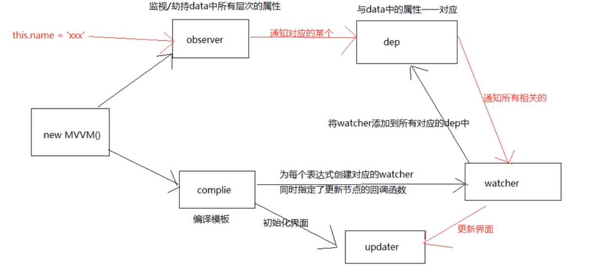
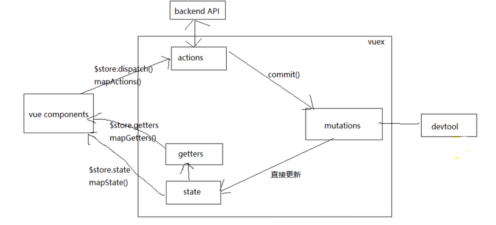
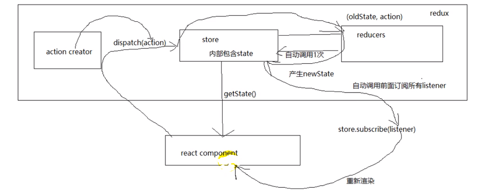

# HTML

## 一、语义化HTML

理解：对内容使用最恰当的HTML元素进行标记

相关标签：

```html
<header>、<nav>、<article>、<aside>、<section>、<footer>、<strong>、<em>....
```

strong与b的区别：strong与b都会将字体加粗，但是这两者有本质的区别，strong代表的是强调，具有很强的语义化、而b是没有语义化的，只是仅仅将字体加粗，strong最后的表现形式是将字体加粗刚好与b相同而已

em与i也是，em是有语义化的，i是没有语义化的

优点：

- 代码结构清晰，易于阅读，利于开发和维护
- 提高用户体验，在样式加载失败时，页面结构清晰
- 方便其他设备解析（如屏幕阅读器）根据语义渲染网页
- 有利于搜索引擎优化（SEO），搜索引擎爬虫会根据不同的标签来赋予不同的权重

## 二、HTML5新特性

（1）表单元素

audio标签：音频标签

video标签：视频标签

（2）表单属性

placeholder：预显示的文字、required：必须填写、max-size：最长字符、autofocus：自动聚焦

（3）表单事件

oninput：表单输入时触发、oninvalid：表单验证时触发

（4）表单类型

Email、date、number、tel、search、range....

（5）语义化标签

```html
<header>、<nav>、<article>、<aside>、<section>、<footer>、<strong>、<em>....
```

（6）进度条、度量器

progress、meter

（7）DOM查询

querySeclector()、querSeclectorAll()

（8）拖放API

drag、dragstart、dragenter、dragover、dragleave、drop、dragend

（9）存储

sessionStorage、localStorage

（10）history API

go、back、forward、push、replace

（11）其他

canvas（画布）、Geolocation（地理定位）、websocket（通信协议）、SVG（可伸缩矢量图形）

## 三、canvas和svg的区别

（1） SVG可缩放矢量图形（Scalable Vector Graphics）是基于可扩展标记语言XML描述的2D图形的语言

​           Canvas是画布，通过Javascript来绘制2D图形

（2）SVG不依赖分辨率、canvas依赖分辨率

（3）SVG支持事件处理器、canvas不支持事件处理器

（4）SVG适合大型渲染区域、canvas文本渲染能力较弱、但是可以以.jpg或.png格式保存图片

（5）SVG不适合游戏应用、canvas适合图像密集型的游戏

## 四、渐进增强和优雅降级之间的区别

渐进增强：针对低版本的浏览器进行页面重构，保证基本的功能情况下，再针对高级浏览器进行效果、交互等方面的改进和追加功能，以达到更好的用户体验

优雅降级：一开始就构建完整的功能，然后再针对低版本的浏览器进行兼容

## 五、说一下 HTML5 drag API

dragstart：事件主体是被拖放元素，在开始拖放被拖放元素时触发。

darg：事件主体是被拖放元素，在正在拖放被拖放元素时触发。

dragend：事件主体是被拖放元素，在整个拖放操作结束时触发

dragenter：事件主体是目标元素，在被拖放元素进入某元素时触发。

dragover：事件主体是目标元素，在被拖放在某元素内移动时触发。

dragleave：事件主体是目标元素，在被拖放元素移出目标元素是触发。

drop：事件主体是目标元素，在目标元素完全接受被拖放元素时触发。

## 六、 script标签中defer和async的区别

（1）defer 和 async属性都是去异步加载外部的JS脚本文件，它们都不会阻塞页面的解析

（2）defer会在文档加载完成之后再执行，多个defer存在时，会按顺序执行

（3）async会在js加载完成后立即执行、会阻塞页面的加载、多个async存在时，不能保证执行顺序

（4）async与defer同时存在，以async为准

## 七、src和link的区别

（1）src和link都是对外部资源的引用

（2）src表示对资源的引用，下载会阻塞页面的加载，并且嵌入到标签所在位置

（3）link表示对超文本的引用，下载不会阻塞页面的加载

### 八、meta标签

（1）charset：字符集

（2）keyword：关键词

（3）description：描述

（4）viewport：视窗

（5）refresh：刷新

## 九、web worker

（1）为JS的下载和运行创造多线程环境，允许在后台运行JS，不阻塞页面的加载

# CSS

## 一、CSS模块化

（1）BEM命名规范：B（block）、E（element）、m（modifier）：外观和行为

（2）CSS module：像import js 一样引入css代码，每一个类名就是引入对象的属性、:global() 代表全局属性

​		  Vue中的CSS模块化：在`<style>`中添加scoped，本质就是使用hash值生成唯一标识

​		  React中的CSS模块化：css文件命名为index.module.css，然后在js文件中import引入

（3）CSS in JS ：使用webpack打包工具，将css写在js里面，弊端是不能使用预处理器

（4）OOCSS（面向对象CSS）：CSS样式可以复用、但是会增加很多类

（5）AMCSS（属性CSS）：利用属性选择器，以属性值作为不同的区分

## 二、CSS3新特性

（1）选择器：属性选择器、伪类选择器、伪元素选择器

（2）盒子模型：content-box、padding-box、border-box

（3）圆角、图片阴影、文字阴影、渐变

（4）背景：背景尺寸、透明色

（5）旋转，缩放，动画、过渡、2D、3D转换

（6）flex、媒体查询

## 三、flex布局都有哪些属性，flex属性值有哪些

父属性

- flex-direction：设置主轴的方向：row、row-reverse、column、column-reverse
- justify-content：设置主轴上的子元素排列方式：flex-start、flex-end、center、space-around、space-between
- flex-wrap：设置子元素是否换行：nowrap、warp
- align-content：设置侧轴上的子元素的排列方式（多行）：flex-start、flex-end、center、space-around、space-between、stretch
- align-items：设置侧轴上的子元素排列方式（单行）：flex-start、flex-end、center、stretch
- flex-flow：复合属性，相当于同时设置了 flex-direction 和 flex-wrap

子属性

-  flex 子项目占的份数 
   -  flex-grow，flex-grow 定义项目的放大比例，默认为0,
   -  flex-shrink,flex-shrink 定义了项目的缩小比例，默认为1,
   -  flex-basis,项目本身的大小，默认为auto
-  align-self 控制子项自己在侧轴的排列方式
-  order属性定义子项的排列顺序（前后顺序）

## 四、flex：1

flex：1；!== flex：1，1，auto

-  flex-grow，flex-grow 定义项目的放大比例，默认为0,
-  flex-shrink,flex-shrink 定义了项目的缩小比例，默认为1,
-  flex-basis,项目本身的大小，默认为auto

实际上

- **flex: 1; === flex: 1 1 0%;**

auto 为表示项目本身的大小, **如果设置为 auto, 那么这三个盒子就会按照自己内容的多少来等比例的放大和缩小**, 所以出现了上图中三个盒子不一样大的情况

那我们如果**随便设置一个其他带有长度单位的数字**呢, 那么他就不会按项目本身来计算, 所以它不关心内容, 只是把空间等比收缩和放大

flex:auto === flex:1 1 auto

flex:none === flex:0 0 auto

## 五、优先级顺序

优先级顺序为：内联样式 > 内部样式 > 外部样式 > 浏览器用户自定义样式 > 浏览器默认样式

id选择器  #id  100

类选择器  #classname  10

属性选择器  a[ref=“eee”]  10

伪类选择器  li:last-child  10

标签选择器  div  1

伪元素选择器 li:after  1

相邻兄弟选择器  h1+p 0 

子选择器  ul>li   0  

后代选择器  li  a  0  

通配符选择器  *  0

## 六、隐藏元素的方法有哪些

**display: none**：渲染树不会包含该渲染对象，因此该元素不会在页面中占据位置，也不会响应绑定的监听事件。

**visibility: hidden**：元素在页面中仍占据空间，但是不会响应绑定的监听事件。

**opacity: 0**：将元素的透明度设置为 0，以此来实现元素的隐藏。元素在页面中仍然占据空间，并且能够响应元素绑定的监听事件。

**position: absolute**：通过使用绝对定位将元素移除可视区域内，以此来实现元素的隐藏。

**z-index: 负值**：来使其他元素遮盖住该元素，以此来实现隐藏。

**transform: scale(0,0)**：将元素缩放为 0，来实现元素的隐藏。这种方法下，元素仍在页面中占据位置，但是不会响应绑定的监听事件。

## 七、link和@import的区别

- link是XHTML标签，除了加载CSS外，还可以定义RSS等其他事务；@import属于CSS范畴，只能加载CSS。

- link引用CSS时，在页面载入时同时加载；@import需要页面网页完全载入以后加载。

- link是XHTML标签，无兼容问题；@import是在CSS2.1提出的，低版本的浏览器不支持。

- link支持使用Javascript控制DOM去改变样式；而@import不支持。

## 八、**伪元素和伪类的区别和作用**

伪元素：在内容元素的前后插入额外的元素或样式，但是这些元素实际上并不在文档中生成。它们只在外部显示可见，但不会在文档的源代码中找到它们

伪类：将特殊的效果添加到特定选择器上。它是已有元素上添加类别的，不会产生新的元素

**总结：** 伪类是通过在元素选择器上加⼊伪类改变元素状态，⽽伪元素通过对元素的操作进⾏对元素的改变

## 九、对盒模型的理解

CSS3中的盒模型有以下两种：标准盒子模型、IE盒子模型

- `box-sizing: content-box`表示标准盒模型（默认值）
- `box-sizing: border-box`表示IE盒模型（怪异盒模型）

## 十、视口

 布局视口 layout viewport、视觉视口 visual viewport、理想视口 ideal viewport

```html
<meta name="viewport" content="width=device-width, user-scalable=no,
initial-scale=1.0, maximum-scale=1.0, minimum-scale=1.0">
```

## 十一、物理像素、逻辑像素

物理像素点指的是屏幕显示的最小颗粒，是物理真实存在的

“设备独立像素”（Device Independent Pixel,DPI）可以理解为反映在**CSS里的像素点**

像素比（dpr）：物理像素与逻辑像素的比

## 十二、rem计算

页面元素的rem值 = 页面元素值（px） / （屏幕宽度 / 划分的份数）

## 十三、BFC

- BFC的理解
  块级格式化上下文，它是指一个独立的块级渲染区域，只有Block-level BOX参与，该区域拥有一套渲染规则来约束块级盒子的布局，且与区域外部无关。
- 如何创建BFC
  - 方法①: float的值不是none
  - 方法②:position的值不是static或者relative
  - 方法③: display的值是inline-block、flex或者inline-flex
  - 方法④:overflow:hidden;

- BFC的其他作用
  - BFC可以取消盒子margin塌陷
  - BFC可以可以阻止元素被浮动元素覆盖

## 十四、两栏布局、三栏布局

（1）两栏布局：左边宽度固定、右边随着设备的宽度变化而变化

- 利用浮动，左边设置宽度，并且向左浮动，右边宽度为auto，且设置margin-left为左边的宽度
- 利用浮动，左边设置宽度，并且向左浮动，右边设置overhidden，形成BFC
- 利用flex布局，将左边元素设置为固定宽度200px，将右边的元素设置为flex:1
- 利用绝对定位，左边使用绝对定位，右边设置margin-left为左边的宽度
- 利用绝对定位，右边使用绝对定位，设置left为左边的宽度

（2）三栏布局：左右宽度变化、中间随着设备的宽度变化而变化

- 利用绝对定位，左右两栏设置为绝对定位，中间设置对应方向大小的margin的值。
- 利用flex布局，左右两栏设置固定大小，中间一栏设置为flex:1
- 利用浮动，左右两栏设置固定大小，并设置对应方向的浮动。中间一栏设置左右两个方向的margin值，注意这种方式，中间一栏必须放到最后
- 圣杯布局，利用浮动和负边距来实现。父级元素设置左右的 padding，三列均设置向左浮动，中间一列放在最前面，宽度设置为父级元素的宽度，因此后面两列都被挤到了下一行，通过设置 margin 负值将其移动到上一行，再利用相对定位，定位到两边。
- 双飞翼布局，双飞翼布局相对于圣杯布局来说，左右位置的保留是通过中间列的 margin 值来实现的，而不是通过父元素的 padding 来实现的。本质上来说，也是通过浮动和外边距负值来实现的。

## 十五、盒子水平居中

（1）定位1：需要知道父的宽高

```css
.box {
	position: absolute;
    top: 50%;
	left: 50%;
    margin-left:-100px;
    margin-top:-100px;
}
```

（2）定位2：需要父亲有宽高限定

```css
.box {
	position: absolute;
    top: 0;
	left: 0;
	right:0;
	bottom:0;
    margin:auto
}
```

（3）定位3：不需要父有具体宽高限制（兼容性不如上边Ie9+）

```css
.box {
	position: absolute;
    top: 50%;
	left: 50%;
    transform:translate(-50%,-50%)
}
```

（4）display:flex（ie10+）

```css
body {
    display:flex;
    justify-content:center;
    align-items:center;
}

 /*第四种： 老版本flex */
    display: -webkit-box;
    -webkit-box-pack: center;
    -webkit-box-align: center
```

（5）js实现就是模拟css写样式

```css
let HTML = document.documentElement,
	winw = HTML.clientWidth,
	winH = HTML.clientHeight,
    boxw = box.offsetWidth,
    boxH = box.offsetHeight;
	box.style.position = "absolute";
	box.style.left = (winw - boxw) / 2 + 'px';
	box.style.top = (winH - boxH) / 2 + 'px' ;
```

（6）固定宽高的父级 display：table-cell 子级inline-block

```css
body {
    display:table-cell;
    vertical-align:middle;
    text-align:center;
    /*固定宽高*/
    width:500px;
    height:500px;
}
.box {
    display:inline-block
}
```

## 十六、纯css实现一个三角形

```html
<!DOCTYPE html>
<html lang="en">
<head>
  <meta charset="UTF-8">
  <meta http-equiv="X-UA-Compatible" content="IE=edge">
  <meta name="viewport" content="width=device-width, initial-scale=1.0">
  <title>纯css实现三角形</title>
  <style>
    .box {
      width: 0;
      height: 0;
      border: 100px solid transparent;
      /* border-top-color: green;
      border-left-color: red;
      border-right-color: yellow; */
      border-bottom-color:skyblue;
    }
  </style>
</head>
<body>
  <div class="box"></div>
</body>
</html>
```

## 十七、回流和重绘

回流：将可见DOM节点以及它对应的样式结合起来，可是我们还需要计算它们在设备视口(viewport)内的确切位置和大小，这个计算的阶段就是回流。

重绘：将渲染树的每个节点都转换为屏幕上的实际像素，这个阶段就叫做重绘节点。

何时发生回流重绘：

- 添加或删除可见的DOM元素
- 元素的位置发生变化
- 元素的尺寸发生变化（包括外边距、内边框、边框大小、高度和宽度等）
- 内容发生变化，比如文本变化或图片被另一个不同尺寸的图片所替代。
- 页面一开始渲染的时候（这肯定避免不了）
- 浏览器的窗口尺寸变化（因为回流是根据视口的大小来计算元素的位置和大小的）
- **注意：回流一定会触发重绘，而重绘不一定会回流**

减少回流和重绘

- 最小化重绘和重排
- 批量修改DOM
- 避免触发同步布局事件
- 对于复杂动画效果,使用绝对定位让其脱离文档流
- css3硬件加速（GPU加速）**可以让transform、opacity、filters这些动画不会引起回流重绘**

## 十八、清除浮动

（1）额外标签：\<div style="clear:both">\</div>

（2）父级添加 overflow

（3）:after 伪元素法

```css
.clearfix:after {
	content: "";
	display: block;
	height: 0;
	clear: both;
	visibility: hidden;
}
.clearfix { /* IE6、7 专有 */
	*zoom: 1;
}
```

（4）双伪元素

```CSS
.clearfix:before,.clearfix:after {
	content:"";
	display:table;
}
.clearfix:after {
	clear:both;
}
.clearfix {
	*zoom:1;
} 
```

## 十九、单行、多行文本溢出

```css
.box {
    // 单行
    overflow:hidden;
    text-overflow: ellipsis;
    white-space:no-wrap;
    
    // 多行
    overflow:hidden;
    text-overflow: ellipsis;
    display:-webkit-box;
    -webkit-box-orient: vertical;
    -webkit-line-clamp: 3;
}
```


# Javascript

## 一、webAPIs

DOM

- 获取元素：
  - getElementById()、getElementByTagName()
  - H5新增 getElementByClassName()、querySelcetor()、querySelectorAll() 
  - 获取body documen.body、获取html document.documentElement
- 事件
  - 鼠标事件：onclick、onfocus、onblur、onmouseover、onmouseout、onmousemove、onmouseup、onmousedown、onmouseenter（与onmouseover一样，但不支持事件冒泡）
  - 键盘事件：onkeypress（不支持特殊键）、onkeyup、onkeydown

- 操作元素
  - innerText、innerHTML、style、className
  - 自定义属性：getAttribute()、setAttribute()、removeAttribute()
- 节点
  - parentNode、childNodes（children）
  - firstChild、lastChild（firstElementChild、lastElementChild）
  - nextSibling、previousSibling（nextElementSibling、previousElementSibling）
  - createElement()、appendChild()、insertBefore()、removeChild()、cloneNode()

- offset：距离带有定位父元素的位置
  - offsetLeft、offsetTop、offsetHeight、offsetWidth（包含边框）
- client：页面元素大小
  - clientTop（边框大小）、clientLeft（边框大小）、clientWidth、clientHeight（不包含边框）

- scroll：页面滚动属性
  - scrollTop：被滚动内容高度、scrollHeight：内容总高度、scrollWidth：内容本身宽度、scrollLeft：被滚动内容宽度
- clientX、clientY：相对于浏览器窗口可视区域的X，Y坐标（窗口坐标）、可视区域不包括工具栏和滚动条、IE事件和标准事件都定义了这2个属性。
- pageX、pageY：类似于event.clientX、event.clientY，但它们使用的是文档坐标而非窗口坐标。这2个属性不是标准属性，但得到了广泛支持。IE事件中没有这2个属性。
- offsetX、offsetY：相对于事件源元素（target或srcElement）的X,Y坐标，只有IE事件有这2个属性，标准事件没有对应的属性。
- screenX、screenY：相对于用户显示器屏幕左上角的X,Y坐标。标准事件和IE事件都定义了这2个属性

BOM

- window
  - onload（所有元素），onready（文档结构）
  - setTimeout、setInterval
  - location（href、host、port、pathname、search、hash）（assign()、replace()、reload()）

## 二、原型和原型链以及相关的继承问题

原型：理解为对象的默认属性和方法

原型链：每个对象都有一个指向它的原型（prototype）对象的内部链接。这个原型对象又有自己的原型，直到某个对象的原型为 null 为止（也就是不再有原型指向），组成这条链的最后一环。这种一级一级的链结构就称为**原型链（prototype chain）**

### JS继承--原型链继承

```js
//原型链继承
function Parent() {
   this.isShow = true
   this.info = {
       name: "yhd",
       age: 18,
   };
}
Parent.prototype.getInfo = function() {
   console.log(this.info);
   console.log(this.isShow); // true
}

function Child() {};
Child.prototype = new Parent();

let Child1 = new Child();
Child1.info.gender = "男";
Child1.getInfo();  // {name: "yhd", age: 18, gender: "男"}

let child2 = new Child();
child2.getInfo();  // {name: "yhd", age: 18, gender: "男"}
child2.isShow = false

console.log(child2.isShow); // false

/*
优点：

1、父类方法可以复用

缺点：

父类的所有引用属性（info）会被所有子类共享，更改一个子类的引用属性，其他子类也会受影响
子类型实例不能给父类型构造函数传参
*/

```

### JS继承--盗用构造函数继承(构造函数继承)

```js
function Parent() {
  this.info = {
    name: "yhd",
    age: 19,
  }
}

function Child() {
    Parent.call(this)
}

let child1 = new Child();
child1.info.gender = "男";
console.log(child1.info); // {name: "yhd", age: 19, gender: "男"};

let child2 = new Child();
console.log(child2.info); // {name: "yhd", age: 19}
/*
通过使用call()或apply()方法，Parent构造函数在为Child的实例创建的新对象的上下文执行了，就相当于新的Child实例对象上运行了Parent()函数中的所有初始化代码，结果就是每个实例都有自己的info属性。

优点:

可以在子类构造函数中向父类传参数
父类的引用属性不会被共享

缺点：

子类不能访问父类原型上定义的方法（即不能访问Parent.prototype上定义的方法），
因此所有方法属性都写在构造函数中，每次创建实例都会初始化

*/
```

### JS继承--组合继承

```js
function Parent(name) {
   this.name = name
   this.colors = ["red", "blue", "yellow"]
}
Parent.prototype.sayName = function () {
   console.log(this.name);
}

function Child(name, age) {
   // 继承父类属性
   Parent.call(this, name)
   this.age = age;
}
// 继承父类方法
Child.prototype = new Parent();

Child.prototype.sayAge = function () {
   console.log(this.age);
}

let child1 = new Child("yhd", 19);
child1.colors.push("pink");
console.log(child1.colors); // ["red", "blue", "yellow", "pink"]
child1.sayAge(); // 19
child1.sayName(); // "yhd"

let child2 = new Child("wxb", 30);
console.log(child2.colors);  // ["red", "blue", "yellow"]
child2.sayAge(); // 30
child2.sayName(); // "wxb"

/*
优点：

父类的方法可以复用
可以在Child构造函数中向Parent构造函数中传参
父类构造函数中的引用属性不会被共享
*/
```

### JS继承--原型式继承

```js
function objectCopy(obj) {
  function Fun() { };
  Fun.prototype = obj;
  return new Fun()
}

let person = {
  name: "yhd",
  age: 18,
  friends: ["jack", "tom", "rose"],
  sayName:function() {
    console.log(this.name);
  }
}

let person1 = objectCopy(person);
person1.name = "wxb";
person1.friends.push("lily");
person1.sayName(); // wxb

let person2 = objectCopy(person);
person2.name = "gsr";
person2.friends.push("kobe");
person2.sayName(); // "gsr"

console.log(person.friends); // ["jack", "tom", "rose", "lily", "kobe"]、
/*
优点：

父类方法可复用

缺点：

父类的引用会被所有子类所共享
子类实例不能向父类传参
ES5的Object.create()方法在只有第一个参数时，与这里的objectCopy()方法效果相同
*/
```

### JS继承--寄生式继承

```js
function objectCopy(obj) {
  function Fun() { };
  Fun.prototype = obj;
  return new Fun();
}

function createAnother(original) {
  let clone = objectCopy(original);
  clone.getName = function () {
    console.log(this.name);
  };
  return clone;
}

let person = {
     name: "yhd",
     friends: ["rose", "tom", "jack"]
}

let person1 = createAnother(person);
person1.friends.push("lily");
console.log(person1.friends);
person1.getName(); // yhd

let person2 = createAnother(person);
console.log(person2.friends); // ["rose", "tom", "jack", "lily"]

```

### JS继承 -- 寄生式组合继承

```js
function objectCopy(obj) {
  function Fun() { };
  Fun.prototype = obj;
  return new Fun();
}

function inheritPrototype(child, parent) {
  let prototype = objectCopy(parent.prototype); // 创建对象
  prototype.constructor = child; // 增强对象
  child.prototype = prototype; // 赋值对象
}

function Parent(name) {
  this.name = name;
  this.friends = ["rose", "lily", "tom"]
}

Parent.prototype.sayName = function () {
  console.log(this.name);
}

function Child(name, age) {
  Parent.call(this, name);
  this.age = age;
}

inheritPrototype(Child, Parent);
Child.prototype.sayAge = function () {
  console.log(this.age);
}

let child1 = new Child("yhd", 23);
child1.sayAge(); // 23
child1.sayName(); // yhd
child1.friends.push("jack");
console.log(child1.friends); // ["rose", "lily", "tom", "jack"]

let child2 = new Child("yl", 22)
child2.sayAge(); // 22
child2.sayName(); // yl
console.log(child2.friends); // ["rose", "lily", "tom"]
/*
优点：

只调用一次父类构造函数
Child可以向Parent传参
父类方法可以复用
父类的引用属性不会被共享
寄生式组合继承可以算是引用类型继承的最佳模式
*/
```

## 三、作用域和作用域链以及闭包和闭包的应用

作用域：在运行时代码中的某些特定部分中变量，函数和对象的可访问性，分为函数作用域、块级作用域和全局作用域

作用域链：当前作用域没有定义的变量，这成为 自由变量，向父级作用域寻找，一层一层向上寻找，直到找到全局作用域还是没找到，就宣布放弃。这种一层一层的关系，就是 作用域链 

拓展：执行上下文

作用域和执行上下文之间最大的区别是：
**执行上下文在运行时确定，随时可能改变；作用域在定义时就确定，并且不会改变**。

闭包：可以在一个内层函数中访问到其外层函数的作用域

闭包的应用：

### 防抖

```javascript
function debounce(func, ms = 1000) {
  let timer;
  return function (...args) {
    if (timer) {
      clearTimeout(timer)
    }
    timer = setTimeout(() => {
      func.apply(this, args)
    }, ms)
  }
}

// 测试
const task = () => { console.log('run task') }
const debounceTask = debounce(task, 1000)
window.addEventListener('scroll', debounceTask)
```

### 节流

```javascript
// 定时器版
function throttle(func, ms = 1000) {
  let canRun = true
  return function (...args) {
    if (!canRun) return
    canRun = false
    setTimeout(() => {
      func.apply(this, args)
      canRun = true
    }, ms)
  }
}

// 非定时器版
function throttle(func,ms = 1000) {
    let curTime = Date.now()
    return function () {
        let nowTime = Date.now()
        if(nowTime - curTime >= ms) {
            curTime = Date.now()
            return func.apply(this, arguments)
        }
    }
}

// 测试
const task = () => { console.log('run task') }
const throttleTask = throttle(task, 1000)
window.addEventListener('scroll', throttleTask)
```

## 四、ES6相关

（1）ECMAScript是JavaScript的规格，Javascript是ECMAScript的实现

（2）let、const有块级作用域、存在暂时性死区、不存在变量提升、不允许重复声明，let、const定义的变量不在是window的对象，而是属于globalThis对象

（3）解构赋值：数组按照下标，对象按照名称，允许改名和指定默认值

（4）Symbol：表示独一无二的值

（5）Set：类似数组，成员值是唯一的，weakSet的成员值只能是对象

（6）Map：类似对象，键值对不限于字符串，方法：get、set、size等

（7）Proxy：new Proxy(target，handler)

（8）Reflect：将Object对象中明显属于语法内部的方法放到Reflect上，Reflect无法定义属性时返回false，不会阻塞进程

（9）Iterator：为不同的数据结构提供统一的访问机制，for...of值/for...in下标

（10）Generator：异步编程解决方案，async/await可以看作时其的语法糖

## 五、手写代码

### promise

```js
class Promise {
	constructor(excutor) {
		this.state = 'pending'
        this.value = undefined
        this.reaseon = undefined
        this.resolveCallback = []
        this.rejectCallback = []
        let resolve = value => {
            if(this.state === 'pending') {
                this.state = 'fulfilled'
                this.value = value
                this.resolveCallback.forEach(fn => fn())
            }
        }
        let reject = reason => {
            if(this.state === 'pending') {
                this.state = 'rejected'
                this.reason = reason
                this.rejectCallback.forEch(fn => fn())
            }
        }
        try {
            excutor(resolve, reject)
        } catch (err) {
            reject(err)
        }
	}
    
    then(OnResolved, OnRejected) {
        return new Promise((resolve, reject) => {
            this.resolveCallback.push(() => {
                const res = OnResolved(this.value)
                if(res instanceof Promise) {
                    res.then(resolve, reject)
                }else {
                    resolve(res)
                }
            })
            this.rejectCallback.push(() => {
                const res = OnResolved(this.value)
                if(res instanceof Promise) {
                    res.then(resolve, reject)
                }else {
                    reject(res)
                }
            })
        })
    }
    
    catch(OnRejected) {
         return new Promise((resolve, reject) => {
            this.rejectCallback.push(() => {
                const res = OnResolved(this.value)
                if(res instanceof Promise) {
                    res.then(resolve, reject)
                }else {
                    reject(res)
                }
            })
        })
    }
    
    static all(promises) {
        const result = []
        let index = 0
        return new Promise((resolve, reject) => {
            for(let i = 0; i < promises.length; i++) {
                Promise.resolve(promises[i])
                .then(res => {
                    result[i] = res
                    index++
                    if(index === promises.length) {
                        resolve(reslut)
                    }
                })
                .catch(err => {
                    reject(err)
                })
            }
        })
    }
    
    static race(promises) {
         return new Promise((resolve, reject) => {
            for(let i = 0; i < promises.length; i++) {
                Promise.resolve(promises[i])
                .then(res => {
                    resolve(res)
                })
                .catch(err => {
                    reject(err)
                })
            }
        })
    }
    
}
```


```js
// 自定义Promise
(function (window) {
    const PENDING = 'pending'
    const FULFILLED = 'fulfilled'
    const REJECTED = 'rejected'
    // Promise的构造函数
    function Promise(excutor) {
	const _this = this;
    _this.status = PENDING //指定status属性,初始为pending
    _this.data = undefined //指定一个用于存储结果数据的属性
    _this.callbacks = [] //每个元素的结构{onResolved(){},onRejected(){}}

    function resolve(data) {
        // 如果状态不等于pending,直接结束
        // 注意:这里不能写this.status,此时的this是指向window的
        if (_this.status !== PENDING) {
            return
        }
        //改变状态为fulfilled
        _this.status = FULFILLED
        //存储数据
        _this.data = data
        //如果异步回调队列里有待执行函数,立即异步执行函数
        if (_this.callbacks.length > 0) {
            //注意:一定是异步执行
            setTimeout(() => {
                _this.callbacks.forEach(callbacksObj => {
                    callbacksObj.onResolved(data);
                });
            })
        }
    }
    function reject(error) {
        // 如果状态不等于pending,直接结束
        if (_this.status !== PENDING) {
            return
        }
        //改变状态为rejected
        _this.status = REJECTED
        //存储数据
        _this.data = error
        //如果异步回调队列里有待执行函数,立即异步执行函数
        if (_this.callbacks.length > 0) {
            //注意:一定是异步执行
            setTimeout(() => {
                _this.callbacks.forEach(callbacksObj => {
                    callbacksObj.onRejected(error);
                });
            })
        }
    }

    try {
        excutor(resolve, reject)
    } catch (error) {
        // 如果执行器直接抛出异常,Promise为rejected状态
        reject(error)
    }

}

// Promise原型对象then
// 指定成功的回调函数,返回一个Promise对象
//返回的Promise结果由onResolved/onRejected的结果决定
// onResolved/onRejected的结果由有三种情况
/*
    1.如果返回的不是Promise对象,返回的Promise状态为成功,返回的结果就是data
    2.如果返回的是Promise对象,返回的Promise状态为成功,并且返回的Promise的结果就是这个Promise的结果
    3.如果抛出异常,返回的Promise就会失败,直接将状态改为失败即可
*/
Promise.prototype.then = function (onResolved, onRejected) {
    // 指定默认成功的回调
    onResolved = typeof onResolved === 'function' ? onResolved : data => data
    //指定默认失败的回调
    onRejected = typeof onRejected === 'function' ? onRejected : error => { throw error }
    const _this = this;
    return new Promise((resolve, reject) => {
        //对返回Promise结果处理的封装,根据执行的结果改变return的Promise的状态
        function handle(callback) {
            try {
                const result = callback(_this.data)
                if (result instanceof Promise) {
                    /*
                        如果返回的是Promise对象,返回的Promise会成功,并且返回的Promise的
                        结果就是这个Promise的结果,因此再次调用其自身方法,成功则将状态改为
                        成功,失败则将状态改为失败
                     */
                    // result.then(
                    //     data => {
                    //         resolve(data)
                    //     },
                    //     error => {
                    //         reject(error)
                    //     }
                    // )
                    // 两种写法等价,下面的写法更加简简洁
                    result.then(resolve, reject)
                } else {
                    //如果返回的不是Promise对象,返回的Promise状态为成功,返回的结果就是data
                    resolve(result)
                }
            } catch (error) {
                //如果抛出异常,返回的Promise就会失败,直接将状态改为失败即可
                reject(error)
            }
        }
        //当前的Promise的状态是pending
        if (_this.status === PENDING) {
            _this.callbacks.push({
                //返回的Promise结果由onResolved/onRejected的结果决定
                onResolved() {
                    handle(onResolved)
                },
                onRejected() {
                    handle(onRejected)
                }
            })
            //当前的Promise的状态是fulfilled
        } else if (_this.status === FULFILLED) {
            setTimeout(() => {
                handle(onResolved)
            })
            //当前的Promise的状态是rejected
        } else {
            setTimeout(() => {
                handle(onRejected)
            })
        }
    })
}

// Promise原型对象catch
// 指定失败的回调函数,返回一个Promise对象
Promise.prototype.catch = function (onRejected) {
    return this.then(undefined, onRejected)
}

// Promise对象的resolve方法
Promise.resolve = function (data) {
    return new Promise((resolve, reject) => {
        if (data instanceof Promise) {
            data.then(resolve, reject)
        } else {
            resolve(data)
        }
    })
}

// Promise对象的reject方法
Promise.reject = function (error) {
    return new Promise((resolve, reject) => {
        reject(error)
    })
}

//Promise对象的all方法
Promise.all = function (promises) {
    //记录成功的次数
    let resolveCount = 0
    //创建长度与promises数组长度一致,用于存放成功结果的数组
    const datas = new Array(promises.length)

    return new Promise((resolve, reject) => {
        promises.forEach((p, index) => {
            // 多加一层用以处理传入的不是Promise对象的值
            Promise.resolve(p).then(
                data => {
                    //每次成功次数加一
                    resolveCount++
                    //保证结果的顺序在数组中与promises数组的一致
                    datas[index] = data
                    //成功次数与promises的长度一致时表示全部成功
                    if (resolveCount === promises.length) {
                        resolve(datas)
                    }
                },
                error => {
                    //一次失败返回失败
                    reject(error)
                }
            )
        });
    })
}

//Promise对象的race方法
Promise.race = function (promises) {
    return new Promise((resolve, reject) => {
        promises.forEach((p, index) => {
            // 多加一层用以处理传入的不是Promise对象的值
            Promise.resolve(p).then(
                data => {
                    resolve(data)
                },
                error => {
                    reject(error)
                }
            )
        })
    })
}

//将Promise函数暴露出去
window.Promise = Promise
})(window)
```

### new

```js
function myNew(fn) {
    let instance = object,create(fn.prototype)
    const res = fn.apply(instance, arguments)
    return typeof res === 'object' || typeof res === 'function' ? res : instance
}
```

### typeof

```js
function getType(value) {
  // 判断数据是 null 的情况
  if (value === null) {
    return value + "";
  }
  // 判断数据是引用类型的情况
  if (typeof value === "object") {
    let valueClass = Object.prototype.toString.call(value),
      type = valueClass.split(" ")[1].split("");
    type.pop();
    return type.join("").toLowerCase();
  } else {
    // 判断数据是基本数据类型的情况和函数的情况
    return typeof value;
  }
}
```

### instanceof

```js
function myInstanceof(obj, fn) {
 	let proto = object.getOwnPrototype(obj)
    if(proto) {
        if(proto === fn.prototype) {
            return true
        }else {
            return myInstanceof(proto, fn)
        }
    }else {
        return false
    }
}
```

### Object.create

```js
function create(obj) {
  function F() {}
  F.prototype = obj
  return new F()
}
```

### 数组去重

```js
 // 思路：遍历数组,通过一个新的数组，通过这个新数组去判断里面的存不存在与原数组一样的值，不存在就把原数组的
    // 值放到新的数组里，存在就跳过，达到去重的效果
    var arr = [1, 3, 4, 5, 3, 2, 4, 1,NaN,NaN]
    function repeat(arr) {
      var arrTemp = []
      var flag = true //用来判断数组中是否存在NaN，当一个NaN存放进去后，就不允许存放了
      for (var i = 0; i < arr.length; i++) {
        if (arrTemp.indexOf(arr[i]) === -1) {
          if (arr[i] !== arr[i]) {
            // 注意 NaN 是不等于NaN的，因此这个判断对于NaN是成立的
            if (flag) { //这个的作用就是，当存了一个NaN后，后面的NaN都不存入了
              arrTemp.push(arr[i])
              flag = false
            }
          }else {
            arrTemp.push(arr[i])
          }
        }
      }
      return arrTemp
    }
    console.log(repeat(arr));


// 一种思路，先将数组排序，根据正则将重复的值去除
let ary = [12, 23, 12, 15, 25, 23, 25, 14, 16];
ary.sort((a, b) => a - b);
let str = ary.join('@') + '@';
let reg = /(\d+@)\1*/g;
ary = [];
str.replace(reg, (n, m) => {
  m = Number(m.slice(0, m.length - 1));
  ary.push(m);
})
console.log(ary);


// 一种思路，使用ES6的Set
ary = [12, 23, 12, 15, 25, 23, 25, 14, 16];
ary = [...new Set(ary)];
console.log(ary);

//reduce
var resNew = arr3.reduce((pre,cur)=>{
    if (!pre.includes(cur)){
        return pre.concat(cur)
    }else {
       return pre
    }
},[])
```

### 深浅拷贝

（1）浅拷贝

```js
//Object.assign()
let target = {a: 1};
let object2 = {b: 2};
let object3 = {c: 3};
Object.assign(target,object2,object3); 
//扩展运算符
let obj1 = {a:1,b:{c:1}}
let obj2 = {...obj1};
//Array.prototype.slice
let arr = [1,2,3,4];
console.log(arr.slice()); // [1,2,3,4]
console.log(arr.slice() === arr); //false
//Array.prototype.concat
let arr = [1,2,3,4];
console.log(arr.concat()); // [1,2,3,4]
//手写
function shallowCopy(object) {
  // 只拷贝对象
  if (!object || typeof object !== "object") return;

  // 根据 object 的类型判断是新建一个数组还是对象
  let newObject = Array.isArray(object) ? [] : {};

  // 遍历 object，并且判断是 object 的属性才拷贝
  for (let key in object) {
    if (object.hasOwnProperty(key)) {
      newObject[key] = object[key];
    }
  }

  return newObject;
}
```

（2）深拷贝

```js
//JSON.stringify()
let obj1 = {  a: 0,
              b: {
                 c: 0
                 }
            };
let obj2 = JSON.parse(JSON.stringify(obj1));
//函数库lodash的_.cloneDeep方法
var _ = require('lodash');
var obj1 = {
    a: 1,
    b: { f: { g: 1 } },
    c: [1, 2, 3]
};
var obj2 = _.cloneDeep(obj1);
//手写
// 深拷贝的实现
function deepCopy(object) {
  if (!object || typeof object !== "object") return;

  let newObject = Array.isArray(object) ? [] : {};

  for (let key in object) {
    if (object.hasOwnProperty(key)) {
      newObject[key] =
        typeof object[key] === "object" ? deepCopy(object[key]) : object[key];
    }
  }

  return newObject;
}
```

### 数组扁平化

```js
let arr = [
  [1, 2, 2],
  [3, 4, 5, 5],
  [6, 7, 8, 9, [11, 12, [12, 13, [14]]]], 10
];

//第一种方法:使用ES6中提供的 Array.prototype.flat处理

// arr = arr.flat(Infinity);

//第二种方法把数组直接变为字符串即可（数组ToSTRING之后，不管你有多少级，
// 最后都会变为以逗号分隔的字符串，没有中括号和所谓的层级了），相当于直接的扁平化了

// arr = arr.toString().split(',').map(item => {
//   return Number(item);
// });

//JSON .stringify也可以扁平化数组

// arr = JSON.stringify(arr).replace(/(\[|\])/g, '').split(',').map(item => Number(item));


//=>基于数组的some方法进行判断检测:验证数组中的某一项有没有符合函数中提供的规则的

// while (arr.some(item => Array.isArray(item))) {
//   arr = [].concat(...arr);
// }

//const newArr = (arr) =>{
//	return arr. reduce((pre,cur)=> {
//		return pre.concat(Array. isArray(cur) ? newArr(cur) :cur)
//    	},[])
//	}

// 自己封装方法
(function () {
  function myFlat() {
    let result = [],
      _this = this;
    //=> 循环ARR中的每一项，把不是数组的存储到新数组中
    let fn = (arr) => {
      for (let i = 0; i < arr.length; i++) {
        let item = arr[i];
        if (Array.isArray(item)) {
          fn(item);
          continue;
        }
        result.push(item);
      }
    };
    fn(_this);
    return result;
  }
  Array.prototype.myFlat = myFlat;
})();

arr = arr.myFlat()
console.log(arr);
```

### 对象扁平化

```js
function objectFlat(obj = {}) {
  const res = {}
  function flat(item, preKey = '') {
    Object.entries(item).forEach(([key, val]) => {
      const newKey = preKey ? `${preKey}.${key}` : key
      if (val && typeof val === 'object') {
        flat(val, newKey)
      } else {
        res[newKey] = val
      }
    })
  }
  flat(obj)
  return res
}

// 测试
const source = { a: { b: { c: 1, d: 2 }, e: 3 }, f: { g: 2 } }
console.log(objectFlat(source));
```

### 函数柯里化

```js
function curry(func) {
  return function curried(...args) {
    // 关键知识点：function.length 用来获取函数的形参个数
    // 补充：arguments.length 获取的是实参个数
    if (args.length >= func.length) {
      return func.apply(this, args)
    }
    return function (...args2) {
      return curried.apply(this, args.concat(args2))
    }
  }
}

// 测试
function sum (a, b, c) {
  return a + b + c
}
const curriedSum = curry(sum)
console.log(curriedSum(1, 2, 3))
console.log(curriedSum(1)(2,3))
console.log(curriedSum(1)(2)(3))
```

### 异步串行 | 异步并行

```js
// 字节面试题，实现一个异步加法
function asyncAdd(a, b, callback) {
  setTimeout(function () {
    callback(null, a + b);
  }, 500);
}

// 解决方案
// 1. promisify
const promiseAdd = (a, b) => new Promise((resolve, reject) => {
  asyncAdd(a, b, (err, res) => {
    if (err) {
      reject(err)
    } else {
      resolve(res)
    }
  })
})

// 2. 串行处理
async function serialSum(...args) {
  return args.reduce((task, now) => task.then(res => promiseAdd(res, now)), Promise.resolve(0))
}

// 3. 并行处理
async function parallelSum(...args) {
  if (args.length === 1) return args[0]
  const tasks = []
  for (let i = 0; i < args.length; i += 2) {
    tasks.push(promiseAdd(args[i], args[i + 1] || 0))
  }
  const results = await Promise.all(tasks)
  return parallelSum(...results)
}

// 测试
(async () => {
  console.log('Running...');
  const res1 = await serialSum(1, 2, 3, 4, 5, 8, 9, 10, 11, 12)
  console.log(res1)
  const res2 = await parallelSum(1, 2, 3, 4, 5, 8, 9, 10, 11, 12)
  console.log(res2)
  console.log('Done');
})()
```

### call、apply、bind

```js
// call函数实现
Function.prototype.myCall = function(context) {
  // 判断调用对象
  if (typeof this !== "function") {
    console.error("type error");
  }
  // 获取参数
  let args = [...arguments].slice(1),
      result = null;
  // 判断 context 是否传入，如果未传入则设置为 window
  context = context || window;
  // 将调用函数设为对象的方法
  context.fn = this;
  // 调用函数
  result = context.fn(...args);
  // 将属性删除
  delete context.fn;
  return result;
};

// apply 函数实现
Function.prototype.myApply = function(context) {
  // 判断调用对象是否为函数
  if (typeof this !== "function") {
    throw new TypeError("Error");
  }
  let result = null;
  // 判断 context 是否存在，如果未传入则为 window
  context = context || window;
  // 将函数设为对象的方法
  context.fn = this;
  // 调用方法
  if (arguments[1]) {
    result = context.fn(...arguments[1]);
  } else {
    result = context.fn();
  }
  // 将属性删除
  delete context.fn;
  return result;
};

// bind 函数实现
Function.prototype.myBind = function(context) {
  // 判断调用对象是否为函数
  if (typeof this !== "function") {
    throw new TypeError("Error");
  }
  // 获取参数
  var args = [...arguments].slice(1),
      fn = this;
  return function Fn() {
    // 根据调用方式，传入不同绑定值
    return fn.apply(
      this instanceof Fn ? this : context,
      args.concat(...arguments)
    );
  };
};
```

### ajax

```js
const SERVER_URL = "/server";
let xhr = new XMLHttpRequest();
// 创建 Http 请求
xhr.open("GET", SERVER_URL, true);
// 设置状态监听函数
xhr.onreadystatechange = function() {
  if (this.readyState !== 4) return;
  // 当请求成功时
  if (this.status === 200) {
    handle(this.response);
  } else {
    console.error(this.statusText);
  }
};
// 设置请求失败时的监听函数
xhr.onerror = function() {
  console.error(this.statusText);
};
// 设置请求头信息
xhr.responseType = "json";
xhr.setRequestHeader("Accept", "application/json");
// 发送 Http 请求
xhr.send(null);
```

### 实现类数组转化为数组

类数组转换为数组的方法有这样几种：

- 通过 call 调用数组的 slice 方法来实现转换

```javascript
Array.prototype.slice.call(arrayLike);
```

- 通过 call 调用数组的 splice 方法来实现转换

```javascript
Array.prototype.splice.call(arrayLike, 0);
```

- 通过 apply 调用数组的 concat 方法来实现转换

```javascript
Array.prototype.concat.apply([], arrayLike);
```

- 通过 Array.from 方法来实现转换

```javascript
Array.from(arrayLike);
```

# Vue

## 一、双向数据绑定原理

采取数据劫持，结合发布订阅模式，通过Object.defineProperty()劫持各个属性，给各个属性添加getter和setter，数据变动时触发相应的回调

Observer：给数据加上getter和setter，改变数据时触发setter

Complie：模板解析，将模板中的变量替换成数据，绑定更新函数

Watcher：订阅者，是Observer和Complie之间通信的桥梁，往订阅器中添加自己，有一个update方法，当属性变动通知时，调用update方法，触发complie中绑定的更新函数



```js
function MyVue(options){// 创建构造函数MyVue,并接收对象结构体options
    this.$el=document.querySelector(options.el);// 指定挂载元素
    this.$data=options.data;// 存放你的数据内容
    this.$methods=options.methods;// 存放设你的方法
    this.binding={};// 所有数据相关的订阅者对象都存放于此。最终结构为{数据属性:[订阅者对象，订阅者对象……]}
    this.observer();// 调用观察者，对数据进行劫持
    this.compile(this.$el);// 对元素指令进行解析，订阅者也是在此处创建的
}
MyVue.prototype.observer=function(){// 观察者
    let value="";// 定义用于存放数据属性值的变量value
    for(let key in this.$data){ // 遍历数据对象
        value=this.$data[key];// 对象属性值
        this.binding[key]=[];// 数据订阅者初始化,是一个数组，
        let binding=this.binding[key];// 用于存放本数据相关的所有订阅者，初始为[]
        Object.defineProperty(this.$data,key,{// 开始设置劫持
            get(){
                return value;// 读取值为value
            },
            set(v){// v为设置的值
                if(v!==value){// 当设置的值与当前值不相等时
                    value=v;// 将读取值更新为v
                    binding.forEach(watcher=>{
                        watcher.update();// 通知与本数据相关的订阅者们进行视图更新
                    })
                }
            }
        })
    }
}
MyVue.prototype.compile=function(el){// 解析器
    let nodes=el.children;// 获得所有子节点
    for(let i=0;i<nodes.length;i++){// 对子节点进行遍历
        let node=nodes[i];// 具体节点
        if(node.children.length>0)// 判断是否具有子节点
            this.compile(node);// 如果有子点进行递归操作
        if(node.hasAttribute("v-on:click")){// 该节点是否拥有v-on指令
            let attrVal=node.getAttribute("v-on:click");// 得到指令对应的方法名
            // 为元素绑定click事件，事件方法为$methods下的方法，并将其this指向this.$data
            node.addEventListener("click",this.$methods[attrVal].bind(this.$data))
        }
        if(node.hasAttribute("v-model")){// 该节点是否拥有v-model指令
            let attrVal=node.getAttribute("v-model");// 获得指令对应的数据属性
            node.addEventListener("input",((i)=>{// 为指令添加input事件
                this.binding[attrVal].push(new Watcher(node,"value",this,attrVal));// 为该数据添加订阅者
                return ()=>{
                    this.$data[attrVal]=nodes[i].value;// 更新$data的属性值，会在观察者中进行劫持
                }
            })(i))
        }
        if(node.hasAttribute("v-html")){// 该节点是否拥有v-html指令
            let attrVal=node.getAttribute("v-html");// 获得指令对应的数据属性
            this.binding[attrVal].push(new Watcher(node,"innerHTML",this,attrVal));
        }
        if(node.hasAttribute("v-text")){// 该节点是否拥有v-text指令
            let attrVal=node.getAttribute("v-text");// 获得指令对应的数据属性
            this.binding[attrVal].push(new Watcher(node,"innerText",this,attrVal));
        }
    }
}
function Watcher(el,attr,vm,val){// 观察者
    this.el=el;     // 指令所在的元素
    this.attr=attr;// 绑定的属性名
    this.vm=vm;    // 指令所在实例
    this.val=val;  // 指令的值
    this.update(); // 更新视图view
}
Watcher.prototype.update=function(){
    this.el[this.attr]=this.vm.$data[this.val];
}
```

## 二、keep-alive原理

缓存策略时LRU，组件切换时，保存一些组件的状态，防止多次渲染

三大属性：include、exclude、max

- 根据include/exclude配置的组件名，与对应组件的name进行条件匹配
- 根据组件ID和tag生成缓存的key，在缓存对象中查找是否已经缓存，存在取出并更新
- 检查是都超过了max设置的值，超过的话，根据LRU缓存策略，删除最近最久没有使用的组件
- 将KeepAlive属性更改为true，actived和deactivated两个钩子函数会用到

## 三、$nextTick原理

本质是对JavaScript执行原理EventLoop的一种应用

核心是模拟对应的微/宏任务的实现，利用JavaScript的异步回调任务队列来实现Vue框架自己的异步回调队列

## 四、VueX的原理

核心是：store对象

利用vue的mixin混入机制，将store注入到Vue的组件实例中，注册引用属性$store，state是响应式的，借助Vue中的data是响应式，将state存入Vue实例组件的data，getter借助的是计算属性computed



## 五、Vue组件间的通信方式


- 通信的种类

  + 父组件向子组件通信
  + 子组件向父组件通信
  + 隔代组件间通信
  + 兄弟组件间通信

- 实现通信的方式

  + props
  + vue自定义事件
  + 消息订阅与发布
  + vuex
  + slot
  + 依赖注入

- 方式一：props

  - 通过一般属性实现父向子通信
  - 通过函数属性实现子向父通信
  - 缺点:隔代组件和兄弟组件间通信比较麻烦

- 方式二：vue自定义组件

  - vue内置实现，可以代替函数类型的props
    a.绑定监听:<MyComp @eventName="callback">

    b.触发(分发)事件: this.$emit("eventName" , data)

  - 适用于子组件与父组件通信居多，可以利用事件总线，进行兄弟组件间的通信，类似于vuex

- 方式三：消息订阅发布

  - 需要引入消息订阅与发布的实现库，如: pubsub-js
    a.订阅消息:PubSub.subscribe('msg', (msg,data)=>{})

    b.发布消息: PubSub.publish('msg', data)

  - 优点:此方式可实现任意关系组件间通信

- 方式四：vuex

  - 是什么:vuex是vue官方提供的集中式管理vue多组件共享状态数据的vue插件
  - 优点:对组件间关系没有限制，且相比于pubsub库管理更集中，更方便

- 方式五：slot

  - 是什么:专门用来实现父向子传递带数据的标签

    a.子组件

    b.父组件

  - 注意:通信的标签模板是在父组件中解析好后再传递给子组件的

- 方式六：依赖注入

  - provide、inject

  ```
  provide() { 
      return {     
          num: this.num  
      };
  }
  inject: ['num']
  ```

  **注意：** 依赖注入所提供的属性是**非响应式**的。

# React

## 一、HOC、Render props、hooks的区别、

三者都是React解决代码复用的主要方式

（1）HOC：参数是组件，返回值是新的组件（应用：Redux中的connect）

（2）Render props：在组件之间使用一个值为函数的prop（在功能上看：有点类似于插槽）

（3）HOOK：不编写class情况下使用state以及其他的React特性、不要再循环、条件、嵌套、函数里调用Hook，只在React函数的顶层使用Hook，Hook组件有生命周期，函数组件是没有生命周期的

- state Hook：useState：返回的是一个数组，不是对象，降低使用的复杂度】、
- Effect Hook：useEffect：相当于componentDidMount和componentDidUpdate，可以访问state和prop
- 其他Hook
  - useContext：不使用组件嵌套可以订阅React的Context
  - useReducer：通过reducer管理组件本地的state
  - useCallback：useCallback(fn,deps)  <=> useMemo(()=>fn,deps)
  - useMemo:用于缓存数据，优化性能
  - useRef：返回一个可变的ref对象

## 二、Redux原理和工作流程

核心：store

通过dispatch，将state传入store，通过subscribe从store获取state的改变

单纯的Redux只是一个状态机，没有UI呈现，react-redux将Redux的状态机和React的UI呈现绑定到一起



Redux使用扩展

+ 使用react-redux简化redux的编码
+ 使用redux-thunk实现redux的异步编程
+ 使用Redux DevTools实现chrome 中redux的调试

## 三、比较React和Vue

- 相同点
  + 都有组件化开发和 Virtual DOM
  + 都支持props进行父子组件间数据通信
  + 都支持数据驱动视图，不直接操作真实DOM，更新状态数据界面就自动更新
  + 都支持服务器端渲染
  + 都有支持native 的方案,React 的 React Native,Vue 的 Weex
- 不同点
  + 数据绑定: vue实现了数据的双向绑定,react 数据流动是单向的（服务端流向页面端）
  + 组件写法不一样,React推荐的做法是JSX，也就是把HTML和CSS全都写进JavaScript
    了,即'all in js'; Vue推荐的做法是webpack+vue-loader的单文件组件格式,即 html,css,js 写在同一个文件
  + state对象在react应用中不可变的,需要使用setState方法更新状态;在vue 中,state对象不是必须的,数据由data属性在vue对象中管理
  + virtualDOM不一样,vue会跟踪每一个组件的依赖关系,不需要重新渲染整个组件树.而对于React而言,每当应用的状态被改变时,全部组件都会重新渲染,所以react 中会需要shouldComponentUpdate 这个生命周期函数方法来进行控制
  + React严格上只针对MVC的view层,Vue 则是MVVM模式

## 四、React组件间通信

（1）**父组件向子组件通信**：父组件通过 props 向子组件传递需要的信息

（2）**子组件向父组件通信**：: props+回调的方式。

（3）跨级组件的通信方式

父组件向子组件的子组件通信，向更深层子组件通信：

- 使用props，利用中间组件层层传递,但是如果父组件结构较深，那么中间每一层组件都要去传递props，增加了复杂度，并且这些props并不是中间组件自己需要的。
- 使用context，context相当于一个大容器，可以把要通信的内容放在这个容器中，这样不管嵌套多深，都可以随意取用，对于跨越多层的全局数据可以使用context实现。

# 网络、浏览器原理、安全

## 一、输入地址到渲染发生了什么

（1）解析URL

（2）缓存判断

（3）DNS解析

（4）获取MAC地址

（5）TCP三次握手

（6）HTTPS四次握手

（7）返回数据

（8）页面渲染

（9）TCP四次挥手

详解：

（1）解析URL：检测主机名、协议是否合法，是否出现非法字符

- URL组成部分：协议部分、域名部分、端口部分、虚拟目录、文件、锚点、参数

（2）缓存判断

- 强缓存：不用请求服务器，直接使用本地的缓存。

  - 强缓存是利用 http 响应头中的**`Expires`**或**`Cache-Control`**实现的
  - **注意**：这两个response header属性可以只启用一个，也可以同时启用。当response header中，Expires和Cache-Control同时存在时，**Cache-Control的优先级高于Expires**。
  - **`Expires`**：服务器返回的**绝对时间**
  - **`Cache-Control`**：服务器返回的**相对时间**

- 协商缓存：浏览器发现本地有资源的副本，但是不太确定要不要使用，于是去问问服务器。

  - 协商缓存是利用的是两对Header：

    - 第一对：`Last-Modified`、`If-Modified-Since`

    - 第二对：`ETag`、`If-None-Match`

    - Last-Modified、If-Modified-Since

      （1）浏览器第一次请求一个资源，服务器在返回这个资源的同时，会加上`Last-Modified`这个 response header，这个header表示这该资源在服务器上的最后修改时间

      （2）浏览器再次请求这个资源时，会加上`If-Modified-Since`这个 request header，这个header的值就是上一次返回的`Last-Modified`的值

      （3）服务器收到第二次请求时，会比对浏览器传过来的`If-Modified-Since`和资源在服务器上的最后修改时间`Last-Modified`，判断资源是否有变化。如果没有变化则返回304 Not Modified，但不返回资源内容（此时，服务器不会返回 Last-Modified 这个 response header）；如果有变化，就正常返回资源内容（继续重复整个流程）

      （4）浏览器如果收到304的响应，就会从缓存中加载资源。

    - ETag、If-None-Match

      （1）浏览器第一次请求一个资源，服务器在返回这个资源的同时，会加上`ETag`这个 response header，这个header是服务器根据当前请求的资源生成的**唯一标识**。这个唯一标识是一个字符串，只要资源有变化这个串就不同，跟最后修改时间无关，所以也就很好地补充了`Last-Modified`的不足

      （2）浏览器再次请求这个资源时，会加上`If-None-Match`这个 request header，这个header的值就是上一次返回的`ETag`的值

      （3）服务器第二次请求时，会对比浏览器传过来的`If-None-Match`和服务器重新生成的一个新的`ETag`，判断资源是否有变化。如果没有变化则返回304 Not Modified，但不返回资源内容（此时，由于ETag重新生成过，response header中还会把这个ETag返回，即使这个ETag并无变化）。如果有变化，就正常返回资源内容（继续重复整个流程）

      （4）浏览器如果收到304的响应，就会从缓存中加载资源。

（3）DNS解析

- 在浏览器的缓存中找对应的IP地址，若有缓存，返回IP地址，没有则向本地的DNS服务器发起请求（递归查询）
- 本地服务器没有则向根服务器查询
- 根服务器没有，本地服务器向权威服务器查询（迭代查询）

（4）获取MAC地址：根据IP地址，通过ARP协议获取对应的MAC地址

（5）TCP三次握手

- 第一次：客户端发送请求连接报文、SYN = 1
- 第二次：服务器收到请求连接报文，给服务器发送连接报文和确认报文，SYN=1、ACK=1
- 第三次：客户端收到服务器发送的连接报文，向服务器发送确认报文，ACK = 1

为什么需要三次握手？需要确认双方接收和发送都没有问题

如果只进行两次握手会发生什么？可能会造成资源浪费、可能会造成死锁

（6）HTTPS握手：SSL/TLS四次握手

- 直接加密（对称加密）：以数据的前几个字节作为密钥，加密和解密都使用同一个密钥，在其使用者多起来之后，就相当于没有加密
- 非对称加密：服务端和客户端都有一个公钥和一个私钥，并且公钥加密的内容只有私钥能解开
  - 单向解密：通信前，服务器先将公钥发送给客户端，客户端使用服务器发送的公钥加密数据，再将数据发送给服务器，由服务器的私钥进行解密
  - 双向解密：通信前，服务器和客户端相互交换公钥，相互发送数据的时，使用对方的公钥进行加密，弊端：解密和加密耗费时间过长，对用户而言是很不好的体验，并且占用很多的资源都在加密和解密上了
- 非对称加密和对称加密结合
  - 服务器向客户端发送服务器的公钥，客户端使用服务器的公钥进行加密，加密的内容是后面加密和解密都要使用到的密钥
- 秘钥计算
  - 客户端像服务器发送一个随机数字1，服务器收到后，将数字保存下来，并且给客户端发送公钥和随机数字2
  - 客户端收到后，将随机数字2保存下来，并利用收到的服务器公钥加密随机数字3，将加密的数据给服务器发送过去
  - 服务器收到加密的数据后，利用私钥进行解密，获得随机数字3，然后服务器和客户端都使用这三个随机数字组成的密钥进行加密解密
  - 存在的问题：可能会存在中间人，拦截掉所有的通信。
- 数字证书（认证机制）
  - 服务器先去公证人那里登记，将公钥和信息交给公证人，公证人将这些信息生成一个hash值，在利用公证人的私钥加密hash值，这就是数字签名
  - 公证人将信息和数字签名进行封装打包发回给服务器，这个就是数字证书
  - 服务器跟客户端通信的时候，将数据证书发给客户端，客户端拿到数字证书后，将里面的信息计算一遍hash值，再利用提前记录好的公证人公钥将数字前面中的内容解密，对比两个hash值，如果两个hash值一致，则认为是同一个服务器
- 信任链
  - 大家约定，让所有的一代目公证人自己给自己签发一个证书，叫做**根证书**，并安装在我们的操作系统中。

（7）返回数据：返回一个HTML文件

（8）渲染数据

- 构造DOM树，构造CSSOM树，有script标签，判断是否有defer或async，没有script加载执行，DOM树和CSSOM树生成渲染树，进行布局，布局完成后进行绘制

（9）TCP四次握手

- 第一次：客户端发送断开连接报文，FIN = 1
- 第二次：服务器收到报文后，发送确认确认报文，ACK = 1，但此时并没有断开连接，服务器可能还有数据没有发送完
- 第三次：服务器发送完数据后，发送断开连接报文，FIN = 1，此时服务器等待确认报文
- 第四次：客户端收到报文后，发送确认报文，ACK = 1，服务器收到后断开连接，客户端等待2msl后断开连接

为什么要等待2msl呢？保证服务器收到了客户端发送的确认报文

## 二、HTTP1.0和HTTP1.1

（1）HTTP1.0默认非持久连接（短连接）、HTTP1.1默认持久连接（长连接）

（2）HTTP1.0不支持部分请求，HTTP1.1添加了range请求头，支持部分请求，返回状态码206

（3）HTTP1.0协商缓存请求头Expires、If-Modified-Since、HTTP1.1新增Etag、if-None-Match

（4）HTTP1.0无host字段，HTTP1.1新增host字段

（5）HTTP1.1新增put、delete、options等方法

## 三、HTTP2.0

（1）二进制协议：HTTP2.0是一个二进制协议，HTTP1.1中，报文头信息是文本，数据体可以是文本也可以是二进制

（2）多路复用：HTTP2.0实现了多路复用，复用TCP连接，一个连接里可以同时发送多个请求和回应

（3）数据流：HTTP2.0使用数据流的概念、但是需要对数据包进行标记

（4）头部信息压缩：HTTP2.0实现了头部信息压缩，使用gzip或compress压缩，客户端和服务器同时维护一张表

（5）服务器推送：HTTP2.0允许服务器允许未经请求，主动向客户端发送资源

## 四、HTTP3.0

（1）基于UDP实现了类似TCP的多路复用

## 五、HTTP和HTTPS的区别

（1）HTTPS需要CA证书，费用较高，HTTP不需要

（2）HTTP是超文本传输协议，使用明文传输，HTTPS是具有安全协议的SSL/TSL加密的传输协议

（3）HTTP的端口号是80，HTTPS的端口号是443

（4）HTTP是无状态的，HTTPS可以进行身份认证，比HTTP安全

## 六、请求方法

GET：获取数据

POST：提交数据

PUT：上传文件，更新数据

DELETE：删除数据

HEAD：获取报文首部，不返回主体部分

OPTIONS：支持的方法，实现跨域请求

CONNECT：建立隧道，进行TCP连接

TRACE：回显服务器收到的请求

（1）GET和POST方法的区别

- GET是一个幂等的请求，POST不是一个幂等请求
- GET是用于获取服务器资源的，一般不改变服务器的资源，POST是用于提交数据的，一般会改变服务器资源
- 浏览器一般会对GET请求进行缓存，但是不对POST请求缓存
- GET请求报文中实体部分为空，POST请求报文中实体部分就是向服务器发送的数据
- POST比GET相对安全
- 浏览器会限制GET的请求参数长度，但是POST的请求体参数不会限制

## 七、状态码

（1）1xx：请求正在处理

（2）2xx：成功状态码

- 200  正确处理请求
- 204  没有请求内容
- 205  没有请求内容、并且要求请求检查
- 206  范围请求

（3）3xx：重定向状态码

- 301  永久重定向
- 302 临时重定向
- 303 资源存在另一个URL，要改为GET请求
- 304 命中协商缓存
- 307 临时重定向，但是不会改为GET请求，使用POST请求

（4）4xx：客户端错误状态码

- 400  请求报文错误（前后端数据格式不一致）、
- 401  需要有通过HTTP认证的信息
- 403  服务器拒绝请求
- 404  服务器上没有请求的资源
- 405 请求方法错误

（5）5xx：服务端错误状态码

- 500 服务器执行请求发生错误
- 501 不支持当前请求
- 502 当前代理服务器从上游服务器接收的请求无效
- 503 处于负载或停机，无法处理

## 八、DNS同时使用TCP和UDP协议

**DNS占用53号端口，同时使用TCP和UDP协议**

（1）在区域传输的时候使用TCP协议

（2）在域名解析的时候使用UDP协议

## 九、OSI七层结构

- 应用层：为应用程序提供服务 （HTTP、HTTPS、FTP、SMTP）
- 表示层：数据格式转化、数据加密
- 会话层：建立、管理和维护会话
- 传输层：建立、管理和维护端到端连接（TCP、UDP）
- 网络层：IP选址和路由选择（ICMP、RIP）
- 数据链路层：提供介质访问和链路管理（ARP、IEEE802.3）
- 物理层

## 十、TCP/IP五层结构

- 应用层：HTTP、HTTPS、FTP、SMTP
- 传输层：TCP、UDP
- 网络层：ICMP、RIP
- 数据链路层：ARP、IEEE802.3
- 物理层

## 十一、TCP和UDP的区别

（1）TCP是传输控制协议，面向连接，UDP是用户数据包协议，面向无连接

（2）TCP只支持单播，UDP支持单播、多播、广播

（3）TCP是面向字节流传输，UDP是面向报文传输

（4）TCP是可靠的连接，UDP是不可靠的连接

（5）TCP是全双工协议，支持重传机制和拥塞控制

## 十二、常用的请求头

Accept：处理的内容类型

Accept-charset：显示的字符集

Accept-Encoding：压缩编码

Accept-language：语言

connection：连接

cookie

host：主机

Referer：页面URL

user-Agent：代理字符串

If-Modified-Since：资源最后修改时间

If-None-Match：资源是否修改


## 十三、常用的响应头

Date：日期

server：服务器名称

connection：连接类型

cache-Control：资源过期相对时间

Expires：资源过期绝对时间

content-Type：MIME（媒体类型）

Etag：资源是否修改

Last-Modified：资源最后修改时间

## 十四、cache-Control的值

- max-age：相对过期时间
- public：允许被中间服务器缓存
- private：不允许被中间服务器缓存
- no-cache：不做缓存检查
- no-store：不能缓存
- must-revalidate：缓存使用前要确认
- proxy-revalidate：代理服务器向源服务器确认
- s-maxage：服务器最大缓存时间

## 十五、浏览器数据存储

（1）cookie：Cookie的大小只有4kb，它是一种纯文本文件，每次发起HTTP请求都会携带Cookie

- Cookie一旦创建成功，名称就无法修改
- Cookie是无法跨域名的
- 每个域名下Cookie的数量不能超过20个
- 有安全问题，如果Cookie被拦截了，那就可获得session的所有信息
- Cookie在请求一个新的页面的时候都会被发送过去
- 需要域名之间跨域共享Cookie，有两种方法：使用Nginx反向代理、在一个站点登陆之后，往其他网站写Cookie。服务端的Session存储到一个节点，Cookie存储sessionId

（2）localStorage：LocalStorage的大小一般为5MB

- LocalStorage是持久储存，并不会随着页面的关闭而消失，除非主动清理，不然会永久存在
- 仅储存在本地，不像Cookie那样每次HTTP请求都会被携带
- 存在浏览器兼容问题，IE8以下版本的浏览器不支持
- LocalStorage受到同源策略的限制
- 如果浏览器设置为隐私模式，那我们将无法读取到LocalStorage

（3）sessionStorage

- SessionStorage**只有在同一浏览器的同一窗口下才能够共享**；
- LocalStorage和SessionStorage**都不能被爬虫爬取**

（4）web SQL

- Web SQL：2010年被W3C废弃的本地数据库数据存储⽅案，但是主流浏览器（⽕狐除外）都已经有了相关的实现，web sql类似于SQLite，是真正意义上的关系型数据库，⽤sql进⾏操作，当我们⽤JavaScript时要进⾏转换，较为繁琐

（5）indexedDB

- 是NoSQL数据库，⽤键值对进⾏储存，可以进⾏快速读取操作，⾮常适合web场景，同时⽤JavaScript进⾏操作会⾮常便。

## 十六、cookie的字段

name：cookie的名称

value：cookie的值

size：cookie的大小

path：访问此cookie的页面路径

Secure：是否使用HTTPS安全协议发送Cookie

Domain：可以访问该cookie的域名

HTTPOnly：设置cookie能否通过脚本来访问

Expire/Maxage：失效的时间

## 十七、浏览器的同源策略

同源指的是：**协议**、**端口号**、**域名**必须一致。

## 十八、实现跨域

（1）CORS

跨域资源共享，使用额外的 HTTP 头来告诉浏览器  让运行在一个 origin (domain)上的Web应用被准许访问来自不同源服务器上的指定的资源。当一个资源从与该资源本身所在的服务器不同的域、协议或端口请求一个资源时，资源会发起一个跨域HTTP 请求

CORS需要浏览器和服务器同时支持，整个CORS过程都是浏览器完成的，无需用户参与。因此实现**CORS的关键就是服务器，只要服务器实现了CORS请求**，就可以跨源通信了。

```
'Access-Control-Allow-Origin'  
'Access-Control-Allow-Methods'
'Access-Control-Allow-Headers'
```

（2）JSONP

**jsonp**的原理就是利用`<script>`标签没有跨域限制，通过`<script>`标签src属性，发送带有callback参数的GET请求，服务端将接口返回数据拼凑到callback函数中，返回给浏览器，浏览器解析执行，从而前端拿到callback函数返回的数据。

```js
var script = document.createElement('script');
script.type = 'text/javascript';
// 传参一个回调函数名给后端，方便后端返回时执行这个在前端定义的回调函数
script.src = 'http://www.domain2.com:8080/login?user=admin&callback=handleCallback';
document.head.appendChild(script);
// 回调执行函数
function handleCallback(res) {
  alert(JSON.stringify(res));
}

handleCallback({"success": true, "user": "admin"})
```

**JSONP的缺点：**

- 具有局限性， 仅支持get方法
- 不安全，可能会遭受XSS攻击

（3）postMessage 跨域

postMessage是HTML5 XMLHttpRequest Level 2中的API

用法：postMessage(data,origin)方法接受两个参数

- **data**： html5规范支持任意基本类型或可复制的对象，但部分浏览器只支持字符串，所以传参时最好用JSON.stringify()序列化。

- **origin**： 协议+主机+端口号，也可以设置为"*"，表示可以传递给任意窗口，如果要指定和当前窗口同源的话设置为"/"。

（4）nginx代理跨域

nginx代理跨域，实质和CORS跨域原理一样，通过配置文件设置请求响应头Access-Control-Allow-Origin…等字段。

```xml
#proxy服务器
server {
    listen       81;
    server_name  www.domain1.com;
    location / {
        proxy_pass   http://www.domain2.com:8080;  #反向代理
        proxy_cookie_domain www.domain2.com www.domain1.com; #修改cookie里域名
        index  index.html index.htm;
        # 当用webpack-dev-server等中间件代理接口访问nignx时，此时无浏览器参与，故没有同源限制，下面的跨域配置可不启用
        add_header Access-Control-Allow-Origin http://www.domain1.com;  #当前端只跨域不带cookie时，可为*
        add_header Access-Control-Allow-Credentials true;
    }
}
```

（5）nodejs 中间件代理跨域

- **非vue框架的跨域** 使用node + express + http-proxy-middleware搭建一个proxy服务器。

- **vue框架的跨域**：node + vue + webpack + webpack-dev-server搭建的项目，跨域请求接口，直接修改webpack.config.js配置。

（6）iframe跨域

- document.domain + iframe跨域：此方案仅限主域相同，子域不同的跨域应用场景实现原理：两个页面都通过js强制设置document.domain为基础主域，就实现了同域。
- location.hash + iframe跨域：a欲与b跨域相互通信，通过中间页c来实现。 三个页面，不同域之间利用iframe的location.hash传值，相同域之间直接js访问来通信。

- window.name + iframe跨域：name值在不同的页面（甚至不同域名）加载后依旧存在，并且可以支持非常长的 name 值（2MB）。

（7）WebSocket协议跨域

## 十九、正向代理和反向代理

（1）正向代理：起到了对真实服务器隐藏真实客户端的目的

（2）反向代理：本质上起到了对客户端隐藏真实服务器的作用

## 二十、XSS攻击、CSRF攻击、中间人攻击

（1）XSS攻击：跨站脚本攻击，是一种代码注入攻击。攻击者通过在网站注入恶意脚本，使之在用户的浏览器上运行，从而盗取用户的信息如 cookie 等。XSS 可以分为存储型、反射型和 DOM 型

防御XSS攻击：对一些敏感信息进行保护，比如 cookie 使用 http-only，使得脚本无法获取、建立一个白名单，告诉浏览器哪些外部资源可以加载和执行、使用纯前端的方式，不用服务器端拼接后返回（不使用服务端渲染）。另一种是对需要插入到 HTML 中的代码做好充分的转义

（2）CSRF 攻击：跨站请求伪造攻击，本质是利用 cookie 会在同源请求中携带发送给服务器的特点，以此来实现用户的冒充

常见的 CSRF 攻击有三种：

- GET 类型的 CSRF 攻击，比如在网站中的一个 img 标签里构建一个请求，当用户打开这个网站的时候就会自动发起提交。
- POST 类型的 CSRF 攻击，比如构建一个表单，然后隐藏它，当用户进入页面时，自动提交这个表单。
- 链接类型的 CSRF 攻击，比如在 a 标签的 href 属性里构建一个请求，然后诱导用户去点击。


防御CSRF攻击

- 进行同源检测
- 使用 CSRF Token 进行验证
- 对 Cookie 进行双重验证
- 在设置 cookie 属性的时候设置 Samesite ，限制 cookie 不能作为被第三方使用

（3）中间人攻击：攻击者与通讯的两端分别创建独⽴的联系, 并交换其所收到的数据

## 二十一、进程和线程

（1）进程是资源分配的最小单位，线程是CPU调度的最小单位

（2）进程和线程的区别

- 进程可以看做独立应用，线程不能
- 线程间可以通过直接共享同一进程中的资源
- 进程切换比线程切换的开销要大

## 二十二、僵尸进程和孤儿进程

**孤儿进程**：父进程退出了，而它的一个或多个进程还在运行，那这些子进程都会成为孤儿进程。

**僵尸进程**：子进程比父进程先结束，而父进程又没有释放子进程占用的资源

## 二十三、垃圾回收机制

**（1）新生代算法**

新生代中的对象一般存活时间较短，使用 Scavenge GC 算法。

**（2）老生代算法**

老生代中的对象一般存活时间较长且数量也多，使用了两个算法，分别是标记清除算法和标记压缩算法。

## 二十四、造成内存泄漏

- 第一种情况是由于使用未声明的变量，而意外的创建了一个全局变量，而使这个变量一直留在内存中无法被回收。

- 第二种情况是设置了 setInterval 定时器，而忘记取消它，如果循环函数有对外部变量的引用的话，那么这个变量会被一直留在内存中，而无法被回收。

- 第三种情况是获取一个 DOM 元素的引用，而后面这个元素被删除，由于我们一直保留了对这个元素的引用，所以它也无法被回收。

- 第四种情况是不合理的使用闭包，从而导致某些变量一直被留在内存当中。

## 二十五、前后端鉴权

前提：HTTP无状态、HTTP 请求方和响应方间无法维护状态

（1）客户端cookie：**cookie 是维持 HTTP 请求状态的基石**

（2）服务端session：服务端把用户状态存为session，生成一个sessionID，通过登录接口返回，把sessionID设置到cookie中，每次请求业务接口，将sessionID带上

**Session 的分布式问题**：

- 一是从「存储」角度，把 session 集中存储。如果我们用独立的 Redis 或普通数据库，就可以把 session 都存到一个库里。
- 二是从「分布」角度，让相同 IP 的请求在负载均衡时都打到同一台机器上。以 nginx 为例，可以配置 ip_hash 来实现。

（3）token：把用户信息、token 配置编码成 token，通过 cookie set 到浏览器、此后用户请求业务接口，通过 cookie 携带 token

- 业务接口用来鉴权的 token，我们称之为 access token
- 一个专门生成 access token 的 token，我们称为 refresh token

（4）单点登录：一次登录，全线通用」的能力，叫做「单点登录」

- “虚假”的单点登录：主域名相同、直接把 cookie domain 设置为主域名
- “真实”的单点登录：主域名不同、独立的认证服务，通常被称为 SSO、记录登录状态、下发 ticket，各业务系统配合存储和认证 ticket

# 性能优化

## 一、CDN

CDN（Content Delivery Network，**内容分发网络**）是指一种通过互联网互相连接的电脑网络系统，利用最靠近每位用户的服务器，更快、更可靠地将音乐、图片、视频、应用程序及其他文件发送给用户，来提供高性能、可扩展性及低成本的网络内容传递给用户。

CDN一般会用来托管Web资源（包括文本、图片和脚本等），可供下载的资源（媒体文件、软件、文档等），应用程序（门户网站等）。使用CDN来加速这些资源的访问。

## 二、懒加载

- 图片懒加载


## 三、节流和防抖

函数防抖是指在事件被触发 n 秒后再执行回调，如果在这 n 秒内事件又被触发，则重新计时。这可以使用在一些点击请求的事件上，避免因为用户的多次点击向后端发送多次请求。

函数节流是指规定一个单位时间，在这个单位时间内，只能有一次触发事件的回调函数执行，如果在同一个单位时间内某事件被触发多次，只有一次能生效。节流可以使用在 scroll 函数的事件监听上，通过事件节流来降低事件调用的频率。

**防抖函数的应用场景：**

- 按钮提交场景：防⽌多次提交按钮，只执⾏最后提交的⼀次
- 服务端验证场景：表单验证需要服务端配合，只执⾏⼀段连续的输⼊事件的最后⼀次，还有搜索联想词功能类似⽣存环境请⽤lodash.debounce

**节流函数的适⽤场景：**

- 拖拽场景：固定时间内只执⾏⼀次，防⽌超⾼频次触发位置变动
- 缩放场景：监控浏览器resize
- 动画场景：避免短时间内多次触发动画引起性能问题

## 四、图片优化

- 小图使用 base64 格式
- 将多个图标文件整合到一张图片中（雪碧图）

- 选择正确的图片格式：
  - 对于能够显示 WebP 格式的浏览器尽量使用 WebP 格式。因为 WebP 格式具有更好的图像数据压缩算法，能带来更小的图片体积，而且拥有肉眼识别无差异的图像质量，缺点就是兼容性并不好
  - 小图使用 PNG，其实对于大部分图标这类图片，完全可以使用 SVG 代替
  - 照片使用 JPEG

  

## 五、webpack优化

#### （1）优化 Loader

- **优化 Loader 的文件搜索范围**
- 将 Babel 编译过的文件**缓存**起来

#### （2）HappyPack

- **将 Loader 的同步执行转换为并行的**

#### （3）DllPlugin

- **将特定的类库提前打包然后引入**

#### （4）代码压缩

- 在 Webpack3 中，一般使用 `UglifyJS` 来压缩代码

- 在 Webpack4 中，不需要以上这些操作了，只需要将 `mode` 设置为 `production` 就可以默认开启以上功能

# 设计模式

### 发布订阅者模式

```js
class PubSub {
    constructor() {
        // 维护事件及订阅行为
        this.events = {}
    }
    /**
     * 注册事件订阅行为
     * @param {String} type 事件类型
     * @param {Function} cb 回调函数
     */
    subscribe(type, cb) {
        if (!this.events[type]) {
            this.events[type] = []
        }
        this.events[type].push(cb)
    }
    /**
     * 发布事件
     * @param {String} type 事件类型
     * @param  {...any} args 参数列表
     */
    publish(type, ...args) {
        if (this.events[type]) {
            this.events[type].forEach(cb => {
                cb(...args)
            })
        }
    }
    /**
     * 移除某个事件的一个订阅行为
     * @param {String} type 事件类型
     * @param {Function} cb 回调函数
     */
    unsubscribe(type, cb) {
        if (this.events[type]) {
            const targetIndex = this.events[type].findIndex(item => item === cb)
            if (targetIndex !== -1) {
                this.events[type].splice(targetIndex, 1)
            }
            if (this.events[type].length === 0) {
                delete this.events[type]
            }
        }
    }
    /**
     * 移除某个事件的所有订阅行为
     * @param {String} type 事件类型
     */
    unsubscribeAll(type) {
        if (this.events[type]) {
            delete this.events[type]
        }
    }
}

```

### 观察者模式

```js
// 观察者
class Observer {
    /**
     * 构造器
     * @param {Function} cb 回调函数，收到目标对象通知时执行
     */
    constructor(cb){
        if (typeof cb === 'function') {
            this.cb = cb
        } else {
            throw new Error('Observer构造器必须传入函数类型！')
        }
    }
    /**
     * 被目标对象通知时执行
     */
    update() {
        this.cb()
    }
}

// 目标对象
class Subject {
    constructor() {
        // 维护观察者列表
        this.observerList = []
    }
    /**
     * 添加一个观察者
     * @param {Observer} observer Observer实例
     */
    addObserver(observer) {
        this.observerList.push(observer)
    }
    /**
     * 通知所有的观察者
     */
    notify() {
        this.observerList.forEach(observer => {
            observer.update()
        })
    }
}

const observerCallback = function() {
    console.log('我被通知了')
}
const observer = new Observer(observerCallback)

const subject = new Subject();
subject.addObserver(observer);
subject.notify();
```
